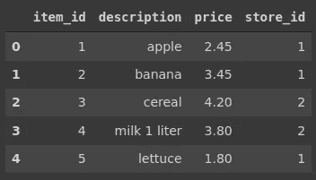

# 使用 Python、R 和 SQL 进行数据分析

> 原文：<https://towardsdatascience.com/data-analysis-with-python-r-and-sql-cc17659aaf05?source=collection_archive---------34----------------------->

## 比较基本操作的实用指南


托尔加·乌尔坎在 [Unsplash](https://unsplash.com/s/photos/different-perspective?utm_source=unsplash&utm_medium=referral&utm_content=creditCopyText) 上拍摄的照片

数据科学生态系统由众多软件工具和软件包组成，让我们的生活变得更加轻松。其中一些已经过优化，可以更好、更高效地完成特定任务。然而，对于典型的数据分析和操作任务，我们有许多选择。

在本文中，我们将比较 Python、R 和 SQL 在探索性数据分析中的典型操作。这些例子可以被认为是基础水平。本文的目标是强调这些工具之间的相似之处和不同之处。

我还想指出如何用不同的工具完成相同的操作。尽管存在语法差异，但操作背后的逻辑和处理特定任务的方法是非常相似的。

在下面的例子中，我将定义一个任务，并使用 Pandas 库(Python)、Data.table 库(R)和 SQL 来完成它。

这是将在示例中使用的数据集的快照。



项目(作者图片)

## 示例 1

查找每个商店 id 的商品平均价格。

SQL:我们选择商店 id 和价格列。price 列上的聚合是在选择它时指定的。然后，我们按照商店 id 列对这些值进行分组。

```
mysql> select store_id, avg(price) 
    -> from items
    -> group by store_id;+----------+------------+
| store_id | avg(price) |
+----------+------------+
|        1 |   1.833333 |
|        2 |   3.820000 |
|        3 |   3.650000 |
+----------+------------+
```

熊猫:我们选择列并应用按功能分组。最后一步是集合函数，即平均值。

```
items[['store_id','price']].groupby('store_id').mean() price                 
store_id                              
   1       1.833333                 
   2       3.820000                 
   3       3.650000
```

Data.table:语法有点像 Pandas 和 SQL 的混合体。我们在选择列时应用聚合并指定分组列。

```
> items[, .(mean(price)), by = .(store_id)] store_id       V1
1:        1 1.833333
2:        2 3.820000
3:        3 3.650000
```

## 示例 2

商店 3 中最贵的商品的价格是多少？

它类似于前一个示例，但有额外的过滤。我们只对 3 号店感兴趣。

SQL:我们选择 price 列并应用 max 函数。过滤是通过使用 where 子句完成的。

```
mysql> select max(price) from items
    -> where store_id = 3;+------------+
| max(price) |
+------------+
|       7.50 |
+------------+
```

Pandas:我们首先应用过滤器并选择感兴趣的列。然后应用最大值函数。

```
items[items.store_id == 3]['price'].max()
7.5
```

Data.table:过滤类似于 Pandas，但是聚合类似于 SQL 语法。

```
> items[store_id == 3, max(price)]
[1] 7.5
```

您可能已经注意到 data.table 的语法有一点不同。(mean(price))但在本例中没有点(max(price))。

使用带点的符号返回一个表，而如果不带点则返回一个数组。

## 示例 3

列出商店 1 中的商品及其价格，并根据价格降序排列。

SQL:除了我们到目前为止所看到的内容，order by 子句被添加到了结果排序的末尾。默认情况下，它按升序排序，所以我们需要使用 desc 关键字来改变它。

```
mysql> select description, price
    -> from items
    -> where store_id = 1
    -> order by price desc;+-------------+-------+
| description | price |
+-------------+-------+
| banana      |  3.45 |
| apple       |  2.45 |
| lettuce     |  1.80 |
| cucumber    |  1.20 |
| bread       |  1.15 |
| tomato      |  0.95 |
+-------------+-------+
```

Pandas:排序是使用 sort_values 函数完成的。默认情况下，Pandas 也按升序排序，这可以通过 ascending 参数进行更改。

```
items[items.store_id == 1][['description','price']]\
.sort_values(by='price', ascending=False) description      price                       
1         banana       3.45                 
0          apple       2.45                 
4        lettuce       1.80                 
11      cucumber       1.20                 
14         bread       1.15                 
7         tomato       0.95
```

Data.table:排序操作是通过使用 order 函数完成的，如下所示。我们通过添加减号来改变升序排序的默认行为。

```
> items[store_id == 1, .(description, price)][order(-price)] description price
1:      banana  3.45
2:       apple  2.45
3:     lettuce  1.80
4:    cucumber  1.20
5:       bread  1.15
6:      tomato  0.95
```

## 实例 4

显示项目描述中包含单词“egg”的所有行。

SQL:该任务包括基于字符串的过滤。因为我们没有进行精确的比较，所以我们将使用 like 关键字。

```
mysql> select * from items
    -> where description like '%egg%';+---------+-------------+-------+----------+
| item_id | description | price | store_id |
+---------+-------------+-------+----------+
|       9 | egg 15      |  4.40 |        3 |
|      11 | egg 30      |  7.50 |        3 |
+---------+-------------+-------+----------+
```

熊猫:我们将使用 str 访问器的 contains 函数。

```
items[items.description.str.contains("egg")] item_id   description    price   store_id                       8         9        egg 15      4.4          3                 
10       11        egg 30      7.5          3
```

Data.table:过滤与 SQL 语法非常相似。我们将使用如下的 like 关键字。

```
> items[description %like% "egg"] V1 item_id description price store_id
1:  8       9      egg 15   4.4        3
2: 10      11      egg 30   7.5        3
```

## 实例 5

找出每家商店售出的商品数量。

SQL:count 函数的用法如下:

```
mysql> select store_id, count(description) as item_count
    -> from items
    -> group by store_id;+----------+------------+
| store_id | item_count |
+----------+------------+
|        1 |          6 |
|        2 |          5 |
|        3 |          4 |
+----------+------------+
```

熊猫:这类任务有专门的功能。value_counts 函数返回每个不同值的出现次数。

```
items.store_id.value_counts()1    6
2    5
3    4
Name: store_id, dtype: int64
```

Data.table:我们对聚合使用 N 选项，它的操作与 SQL 中的 count 函数相同。

```
> items[, .N, by=(store_id)] store_id N
1:        1 6
2:        2 5
3:        3 4
```

## 结论

我们做了一些基本的数据分析和操作。当然，我们可以用这些工具做更多的事情。事实上，它们提供了多种多样的强大功能来完成高级和复杂的任务。

本文的目标是展示这些工具之间的异同。拥有大量可供选择的工具可能令人生畏，但它们都能够处理您需要的大部分内容。过了一段时间，就要根据你的口味来决定了。

感谢您的阅读。如果您有任何反馈，请告诉我。