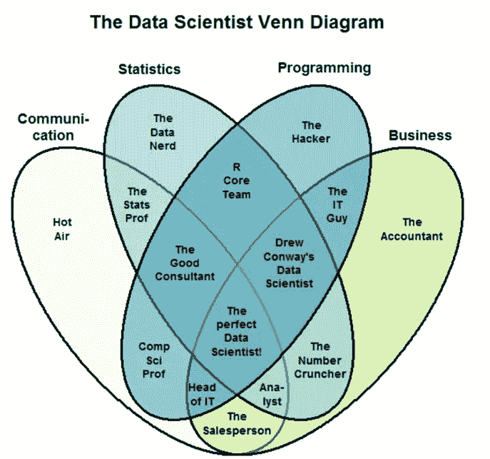
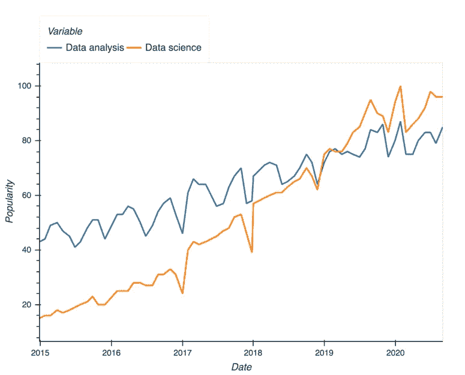
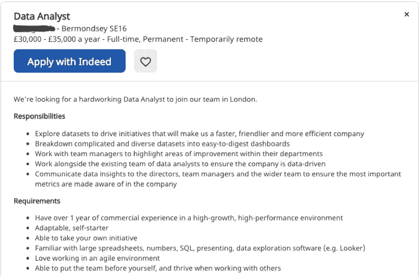
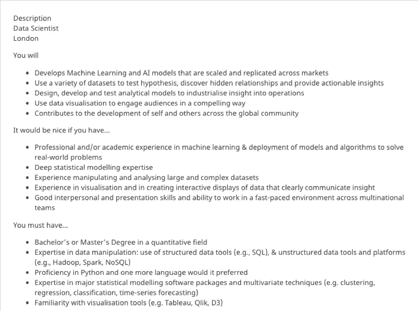

# 数据分析师与数据科学家

> 原文：<https://towardsdatascience.com/data-analyst-vs-data-scientist-a83af97ad472?source=collection_archive---------2----------------------->

## 对“21 世纪最性感的工作”的角色和责任、重叠点和期望的比较分析。

照片由来自 Unsplash 的活动创作者拍摄。

数据科学被标榜为 21 世纪最性感的工作，近年来已成为最受欢迎的职业之一——通常只围绕名人进行炒作。世界各地的公司都拿出丰厚的薪水、声望和运用影响力的特权来吸引分析人才。在所有宣传的背后，是数字数据日益增长的重要性，它目前正在改变我们的生活和工作方式。

难怪越来越多的爱好者想打入这个新领域。但在闭眼冒险进入数据科学和分析领域之前，有抱负者最好先了解一下可用的路线。鼓励感兴趣的候选人通过确定切入点和要求开始他们的旅程，更多地了解各种数据子字段之间的差异，以及在提交工作申请之前他们的简历需要如何改进。

沿着这一思路继续下去，一个问题自然会出现。数据科学家和数据分析师的头衔到底有什么区别？毕竟，这两种职业似乎都肩负着从数据中提取商业价值的任务。精通逻辑的读者可能已经知道，共享相似性并不意味着互换性。一个可以补充另一个，因为两者都在为实现一个共同的目标而努力。野外的许多现象在某些领域有相似之处，而在另一些领域则截然不同。

这篇文章的目的是找到差异问题的答案。不仅从理论的角度，而且从一个经验丰富的专业人士的角度，他看到了数据团队在现实世界中是如何运作的。这是因为，众所周知，头衔及其花哨的反响是一回事，而现实的日常工作量则是完全不同的另一回事。

说到这里，我们先来看看这两个角色的共同特征，然后再探讨它们的不同之处。

# **相似性—数据分析师与数据科学家**

事实上，通过肯定他们共有的几个方面并概述他们的不同之处，我们可以更好地把握这两个角色。注册为 Stephan Kolassa 的 data science stack-exchange 博客试图通过使用维恩图(条目 2403)来直观地划分差异。

Stephan Kolassa 的图表。经允许重新发布。【https://datascience.stackexchange.com/a/2406/2853 号

从这张图表中可以推断出许多值得注意的地方。更明显的是，数据科学家和数据分析师的角色密切相关，占据彼此相邻的象限。实际上，这意味着他们应该总是在相同的业务单元中工作，除非分析师作为敏捷框架中团队的一部分被绑定到特定的项目团队。很符合逻辑，对吧？两者都使用数据为业务目标服务，都需要传统统计方面的专业知识。

他们还分享了这个沟通象限:通过数据故事向企业领导人传达有用的见解，或者创建直观的工具，带来“数据驱动”的决策。不需要太多思考，很容易理解数据科学家和数据分析师只有在他们能证明他们的工作有用时才值得拥有。正是因为这个原因，你会发现这两种工作几乎在所有的招聘广告中都需要视觉和语言交流技能。尽管如此，我们能通过查询日益聪明的万维网找到更多的相似之处吗？

使用 Python 脚本从一个免费的来源加载 Google 搜索词数据，我们可以看到这两个工作角色还有另一个共同点。近几年，类似的职业也见证了一个相似的流行趋势，一个爆炸性的趋势。但就共同点而言，也就这些了，简单地总结为三点:(1)为商业优势提供数据洞察力，(2)卓越的沟通，以及(3)在公众眼中的受欢迎程度。

作者使用谷歌趋势拍摄的照片。

顺便说一句，如果你想知道，谷歌趋势数据来自个人搜索引擎查询的无偏样本——匿名、分类和地理分组，以衡量公众对特定主题的兴趣。2016 年发布了该数据的一个巨大增强，使所有主题类别的情感都可以实时获得。我碰巧有多年利用这些数据的经验。

**数据分析师—职位描述**

无论如何，我们现在将转向分开的细节。这最好通过例子来完成，从互联网上挖掘数据科学家和数据分析师的代表性职位描述。入门级的一个写着:

数据分析师招聘广告示例。作者照片。

典型的数据分析师角色是以咨询为中心的，这可以从实际工作规范的例子中看出。他们主要关注的是从 Excel 电子表格和 SQL 数据库中获取数据，通过回顾性分析、A/B 测试得出深刻的结论，并提供基于证据的商业建议。最后一点说明了为什么使用可视化工具(如 Tableau)的报告例程与透视表一样重要。另一方面，数据建模通常局限于基本的监督学习或其统计等价物:回归分析。

根据经验，我还可以说，新手有时会忘记提供推荐的阶段总是最重要的。他们可能会被远离商业环境的时髦词汇和流行技术所误导。这就是为什么分析师学习如何挖掘可以采取行动的见解是如此重要，这些见解可以用视觉上引人注目和易于理解的格式呈现。分析师是精通技术的调查记者，他们提供深入的见解。

**数据科学家—工作描述**

现在，我们来看一个类似的典型数据科学家角色的例子，我们将探讨一些关键差异。第一个值得注意的是“必须具备”和角色职责部分的长度。当然，对普通数据科学家的要求比数据分析师高得多，这部分解释了为什么前者的薪水比后者高。但是炒作背后有实质内容吗，或者数据科学仅仅是一个现代神话？

数据科学家招聘广告示例。作者照片。

公平地说，出于这个原因，数据科学家被认为不仅仅是分析奇才。他们应该是构建者，使用高级编程来创建管道，在生产环境中以近乎完美的准确度进行预测和推荐。与像调查记者一样的分析师相比，他们更多的是面向产品开发而不是咨询。尽管数据科学家也需要提供以数据为导向的商业建议。有人说，这个头衔是为了表明这个角色是三个领域的融合:数学/统计学、计算机科学和领域专长。据说下面的引用最好地概括了这一点:“数据科学家是比任何软件工程师都更擅长统计，比任何统计学家都更擅长软件工程的人。”

**差异—数据分析师与数据科学家**

**更大的数据量意味着更高的赌注:期望也是如此。与分析师不同的是，他们第一天平均会收到 50 万行 50 列的电子表格，数据科学家可能会在第一天看到数万列数据的关键。每个人都会期待他们从这些海量数据中神奇地召唤出洞察力和智慧的宝石。如果留给他们自己的设备，他们将被期望摄取、转换、探索和建模大量杂乱和非结构化的数据。正如 medium 上一些机智的作家所言:“数据科学家这个头衔让人联想起一个人的近乎神秘的能力，这个人能够轻松地从深度数据湖中获得洞察力，这个人对数据有一双超自然的手，就像 21 世纪的胡迪尼一样！”**

**数据科学需要更多的编码**。尽管数据科学家和数据分析师获取数据的目的相同，但他们使用的方法和工具却大相径庭。虽然数据分析师主要使用 SQL 方言将可管理的数据块粘贴到电子表格和编程接口中，如 R Studio 和 Jupyter 笔记本，但数据科学家预计会适应在云计算环境中工作(AWS、Databricks、Hadoop 等)。).

在那里，他们接收、处理和模拟大量数据，其数量级通常被称为大数据。有鉴于此，很容易理解为什么数据科学工作会增加那些长得离谱的技术要求清单。大型组织中的新员工不可避免地会继承大量有时没有文档记录的遗留脚本和定制算法，他们需要替换或维护这些脚本和算法。考虑到这一点，高级编程技能成为必备技能也就不足为奇了，在大多数入门级数据分析师职位中，拥有高级编程技能是件好事。

**数据分析师与业务利益相关者的联系更加紧密**。因为正如我们在对这些差异的长篇论述中所发现的，数据分析师的工作实际上不需要太多的编码，这揭示了一个更微妙的问题。技术世界的细心观察者会证实，技术复杂性几乎总是伴随着障碍。他们在决策者和动手的工程师和科学家之间制造了空白。反过来，这也是产品经理填补沟通鸿沟的空间。由于数据科学工作通常被神秘的迷雾所包围，公司的普通员工倾向于向分析师寻求帮助。

这是我在商界经常注意到的一个现象:数据科学家往往更加孤立。另一方面，数据分析师倾向于更多地参与和参与其他业务部门，随时帮助解决问题，如修复 Excel 电子表格，通过分析性问题帮助客户推销，以及通过仪表板促进整体业务绩效。因此，如果这篇文章的读者更多的是一个喜欢在微观环境中有所作为的顾问，那么分析师的职位会更加令人满意。简而言之，篱笆那边的草并不总是更绿。

**数据分析师与数据科学家—结论**

考虑到所有因素，我们探讨了数据科学家和数据分析师的职业是如何进行比较和对比的。我们已经了解了它们在编程强度、建模中使用的数据量、自动化方面的复杂性以及查看样本招聘广告所需的教育背景方面的差异。当然，我们预料到了差异。但令人惊讶的是，我们也开始意识到这两个相似的职业实际上是多么相似。本质上，它们都寻求从数据集中获取洞见。

**参考文献**

**1)**[https://HBR . org/2012/10/data-科学家-21 世纪最性感的工作](https://hbr.org/2012/10/data-scientist-the-sexiest-job-of-the-21st-century)

**2)**[https://data science . stack exchange . com/questions/2403/data-science-without-knowledge-of-a-specific-topic-is-it-was-purchasing-as-a-ca](https://datascience.stackexchange.com/questions/2403/data-science-without-knowledge-of-a-specific-topic-is-it-worth-pursuing-as-a-ca)

**3)**https://trends.google.com/trends/?geo=US