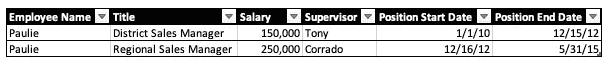
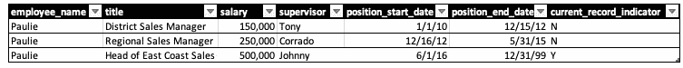
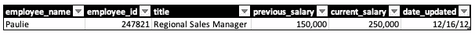
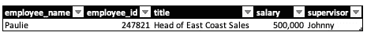
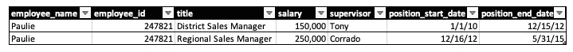

# 数据分析师的渐变维度入门

> 原文：<https://towardsdatascience.com/data-analysts-primer-to-slowly-changing-dimensions-d087c8327e08?source=collection_archive---------8----------------------->

## 数据分析师访谈通常包括技术和行为两部分

来源:托比亚斯·菲舍尔在 [Unsplash](https://unsplash.com/s/photos/databases?utm_source=unsplash&utm_medium=referral&utm_content=creditCopyText) 上拍摄的照片

我遇到了一个相对直接的 SQL 挑战，但是包括一个注释，即挑战的假设表中的列是缓慢变化的维度类型 2。我不知道这些是什么，但幸运的是，这是一个带回家的挑战，所以我有机会研究它，并在挑战和面试过程中取得成功。除了知道对我的编码挑战的影响，我还好奇为什么这对数据分析师的角色很重要。

当我通过参加数据科学训练营实现职业转型时，导师和同事们都说谷歌会是你最好的朋友，这表明解决你面临的问题需要研究——并非所有问题都有简单或直接的答案。

但在这种情况下，谷歌并没有很大的帮助。截至 2021 年，当搜索“缓慢变化的维度”时，第一个结果现在是一篇[维基百科文章](https://en.wikipedia.org/wiki/Slowly_changing_dimension)，当我提出我的编码挑战时，它并不存在。相反，我找到的最佳结果是一个描述不同类型的渐变维度的 Oracle primer ,但是其余的结果并不太有帮助。我把注意力转向搜索 YouTube，发现了一个[有用的结果，是由一位名叫 Tech 蔻驰](https://youtu.be/XqdZF0DJpUs)的用户提供的，他解释了缓慢变化的维度，这种方式有助于应对面试挑战，以及在我作为数据分析师的日常工作中适用的重要知识。

下面我总结了我的研究结果，并指出数据分析师的应用。

我提供这些细节的目的是:

*   综合我自己的研究发现，帮助他人增强知识或准备面试
*   确定缓慢变化的维度可能会对查询产生影响的情况
*   提供背景知识，说明为什么缓慢变化的维度与数据分析师的日常工作相关。

# 那么什么是缓变维度(SCD)？

SCDs 指的是数据仓库概念，其中维度包含当前和历史数据。这是在数据仓库中维护历史细节的常用方法，但是它们的使用将取决于业务需求和数据仓库的目的。

基本上，维度会随着时间而缓慢变化，而不是按照预定的时间间隔变化，维度变化的频率没有固定的模式。

这就产生了一个问题，即数据仓库是存储当前数据还是历史数据，或者两者都存储。该决策可能由业务需求决定，并将由数据架构师或工程师实施和管理，但是理解所使用的维度类型和基本原理对于数据分析师响应业务问题和有效履行其职责的能力至关重要。

使用渐变维度的一个业务案例可能是，我们可能需要考虑我们知道哪些属性会随着时间的推移而变化，但我们不一定期望在规定的时间间隔内发生变化。例如，考虑一个销售部门，随着客户数量的变化，负责特定客户的个人客户经理也会发生变化。这些变化将随着公司获得新客户而发生，但我们不知道具体什么时候会发生变化，因为销售部门的员工每年 6 月都会有预定的晋升和工资变动。

那么缓变维度的不同类型有哪些呢？

# SCD 类型 0

第一种类型被称为类型 0。这指的是在数据仓库中从不改变也不会更新的属性。SCD 类型 0 的一个示例是我们不希望更改的记录，如出生日期或员工在公司的开始日期。因此，我们不希望这个维度在我们的数据仓库中发生变化。

# SCD 类型 1

渐变维度类型 1 是指在数据仓库中维护记录的最新快照，而没有任何历史记录的实例。

SCD 类型 1 通常用于更正维度中的错误，更新错误或不相关的值。不保留历史记录—如果记录包含错误和所需的更新，我们是否希望保留现在已被否决的不准确的历史记录？

一个真实世界的例子来自你的作者。我的名字是`Nicolas`,但是人为错误或自动更正等工具通常认为我名字的正确拼法是更常见的`Nicholas`,名字中有一个`h`。

假设这个错误是人力资源团队在我加入一家新公司时犯的。当然，我希望记录能准确反映我的名字，这样 HR 就可以在源系统中更改我的名字。从源系统构建的数据仓库中的任何表，如雇员姓名和角色表，都将被更新以反映这种变化。

SCD 类型 1 将更新记录以准确反映我的姓名，从而纠正姓名拼写中的错误。不正确的记录将被更新，而不会向数据仓库添加任何新的行或列。

但是，假设该记录不是不正确的姓名，而是诸如雇佣历史表之类的东西—例如，雇员在公司中的角色和薪水。

当一个雇员得到晋升时，SCD 类型 1 记录将反映他们的新职位—先前的记录被覆盖。因此，如果我们确定我们不需要先前的历史(例如，纠正一个错误)，SCD 类型 1 可能满足我们的目的。

但是考虑下面的例子:Paulie 是地区销售经理，被提升为区域销售经理。由于他的提升，数据仓库中的 employee 表将被更新。先前的记录和雇佣历史将被覆盖，以反映新的职位、工资、主管等。

在 SCD 类型 1 中，雇佣历史将被覆盖。所以在上面的例子中，我们的表将保留第二行——Paulie 目前的职位是`Regional Sales Manager`,但他以前的职位是`District Sales Manager`,这不会保留在我们的表中。

然而，我们想要保留历史可能有正当的理由。例如，人力资源部门可能希望方便地访问某人的主管或工资历史记录，或者确定员工更换角色的频率。在后一种情况下，SCD 类型 1 将是不合适的，因为我们将丢失历史，这将引导我们进入下一种类型的缓慢变化的维度。

# SCD 类型 2

那么当我们想维护历史的时候用什么呢？引入渐变维度类型 2。

对于 SCD Type 2，每当源系统中有变化时，都会向数据仓库表中添加一个新行。在生成的表中，将会有更多的记录，但是先前的历史记录将被保留并可查询。

在 SCD 类型 2 中，有两种方法来区分当前记录和历史记录:

*   表示当前记录的列
*   `to_date`和`from_date`栏目

继续上面的例子，考虑保利现在已经被提升为东海岸销售主管。

因为我们现在正在查看 SCD 类型 2，所以来自 Paulie 之前角色的所有记录都将保留在我们的`employee_history`表中。

表格中的当前记录将通过一个标志(`current_record_indicator` )或当前记录将具有标准化替代高日期的日期范围(例如`position_end_date = '12-31-9999'`)来表示。

查询该表时，为了确保返回当前记录，我们将添加一个过滤条件，例如:

`WHERE current_record = 'Y'`或`WHERE position_end_date = '12-31-9999'`

根据表的结构、数据仓库和业务需求，可能只有一个或两个列/方法可用。

概括一下 SCD 类型 2，其主要好处是记录的历史将被维护，但是，如果数据的结构有可能改变(例如，向表中添加新列)或者向表中添加新行增加了表的大小，使得表变得不可管理，则不太可能使用这种类型。

根据我的经验，SCD 类型 2 很常见，了解如何获得感兴趣的当前记录很重要。一个重要的考虑因素是在构建 SQL 查询时是否对连接条件有影响。当连接到 SCD 类型为 2 的表时，在连接条件中包含当前记录标志是很重要的，否则可能会影响结果。

# SCD 类型 3

下一种缓慢变化的维度是类型 3，在我的职业生涯中，我还没有遇到过这种情况，我对这个主题的研究表明，这种类型很少使用。

不是向表中添加新行来反映每个记录的更改，而是添加一个额外的列。

考虑前面的例子，Paulie 从地区销售经理晋升为区域销售经理。为了获取 Paulie 的新工资，我们在表中添加了一个新行，保留了以前的历史记录。

相反，对于 SCD 类型 3，我们将有一行，但有一个额外的列来表示以前和当前的薪金，以及记录的更新日期:

SCD 类型 3

这将从原始状态和当前状态比较保利的工资，但如果工资再次发生变化，跟踪历史将更加困难。这种方法的优点是，它提供了在发生更改之前和之后比较记录的能力，但是保留了有限的历史。

# SCD 类型 4

下一个缓慢变化的维度是类型 4。这里引入了历史表的概念。历史数据将像在 SCD 类型 2 中一样被维护，但是这里的区别在于历史将被维护在数据仓库中的单独的表上。当前记录将包含在主表中。

对于 SCD 类型 4，对于源系统中的每一个变更，一个记录将被添加到历史表中。

继续我们在销售部门的 Paulie 和他的晋升的例子:我们在数据仓库中的`employee`表将反映 Paulie 目前作为东海岸销售主管的角色；

员工表(当前记录)

而另一个`employee_history`表将包含有关 Paulie 在同一家公司的先前职位的历史数据:

SCD 类型 4 历史表

对 Paulie 的工资或职位历史感兴趣的人力资源经理可以通过加入`employee_id`在`employee_history`表中查找以前的记录。

# 包扎

以上反映了我自己的研究和经验，同时介绍了这个数据架构概念对数据分析师角色的适用性。这绝不是详尽的，对于那些真正对构建数据仓库感兴趣的人，我鼓励进一步的研究或寻求数据架构师的帮助。