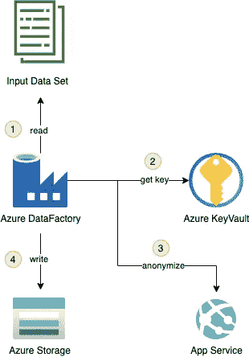
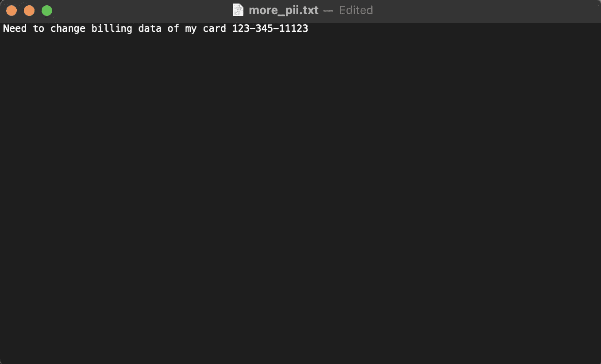
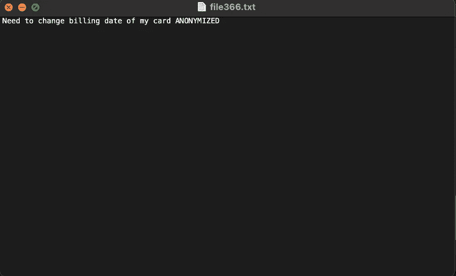
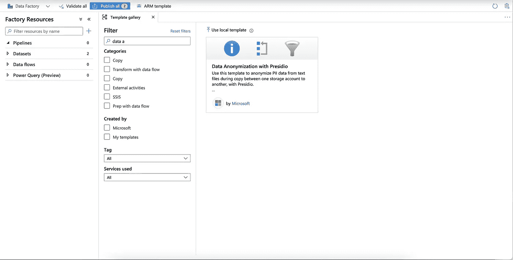
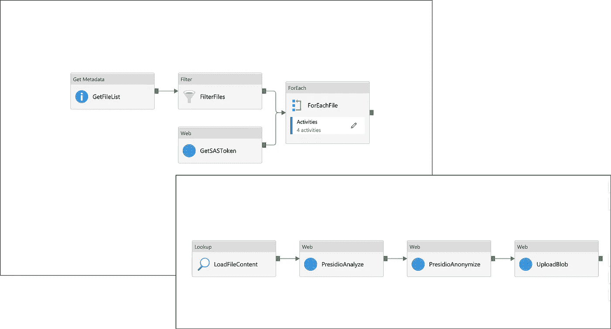

# 基于 Presidio 的 Azure 数据匿名化 ETL

> 原文：<https://towardsdatascience.com/data-anonymization-etl-on-azure-using-presidio-55323eba60e9?source=collection_archive---------19----------------------->

## 创建数据管道以从文本中移除私有数据

马库斯·斯皮斯克在 [Unsplash](https://unsplash.com?utm_source=medium&utm_medium=referral) 上的照片

数据匿名化或去标识化是某些系统的关键部分，也是许多组织的核心要求。通过用文本和图像中的模仿实体来屏蔽、散列甚至替换 PII 实体的能力所揭示的场景包括将数据移动到云或合作伙伴，从真实数据生成测试数据，存储数据以供 AI/ML 处理等。

下面的文章演示了如何使用 Azure 和 [Presidio](https://github.com/microsoft/presidio) 创建一个全功能的 [ETL](https://en.wikipedia.org/wiki/Extract,_transform,_load) 流程，将一组文档从一个位置移动到另一个位置，同时对文本中的 PII 实体进行清理、替换、散列或加密。

# 普雷西迪奥和生态系统

一些读者可能已经知道了 [Presidio](https://github.com/microsoft/presidio) ，这是一个 PII 身份识别和匿名库，由[商业软件工程](https://devblogs.microsoft.com/cse/btc/)小组作为微软开源项目维护。该团队最近发布了一个新版本 V2.0，主要目标是简化 Presidio 的评估并支持集成到数据管道中。

作为 V2.0 版本的一部分，Presidio 团队提供了不同的部署[示例](https://github.com/microsoft/presidio/tree/main/docs/samples)，如 Kubernetes(presi dio V1 本地且唯一的部署选项)、Azure App Service(该团队将其用于内部 V2.0 开发和生产环境)等。

这篇文章将关注如何使用内置的“Presidio 数据匿名化”模板将 Presidio 与 Azure 数据工厂集成，该模板是该团队与 Azure 数据工厂产品组合作开发的。它是为那些已经拥有 Azure Data Factory 实例和存储帐户的数据工程师准备的，他们希望匿名化 PII 数据的内容。

此外，Presidio 生态系统包括 [presidio-research](https://github.com/microsoft/presidio-research) 存储库，团队在其中维护使用 presidio 的高级场景。例如，presidio_evaluator 库使用 presidio 在分析真实数据的基础上[生成假数据](https://github.com/microsoft/presidio-research/tree/master/presidio_evaluator/data_generator)。

# Azure ETL 的构建块

这篇文章中涉及的场景采用了一个通用类型的输入数据集，一个 Azure 存储 blob 容器，并使用 Azure 服务将该数据集移动到另一个位置，在那里文件的内容已经对所有 PII 实体进行了匿名化。

使用的 Azure 服务有:

[Azure Data Factory](https://docs.microsoft.com/en-us/azure/data-factory/)——一个基于云的 ETL 服务，它将托管转换管道。

[Azure Storage](https://docs.microsoft.com/en-us/azure/storage/) —提供 ETL 持久层。

[Azure Key-Vault](https://docs.microsoft.com/en-us/azure/key-vault/general/) —以安全的方式存储 Azure 存储访问密钥，以便在 ETL 中使用。

[Azure App Service](https://docs.microsoft.com/en-us/azure/app-service/) —托管 Presidio 作为 HTTP REST 端点。

下图显示了使用 Presidio 作为 HTTP 端点的 ETL 系统各部分之间的关系。

以 Presidio 为 HTTP 端点的数据匿名化 ETL

1.从源读取数据集。

2.从 Azure Key Vault 获取 Azure 存储的访问密钥。

3.将集合中每个文档的文本值发送给 Presidio 进行匿名处理。

4.将匿名文本保存到 Azure Blob 存储上随机命名的文本文件中。

数据匿名化管道的输入是一组包含 PII 文本的文档，例如:

文本输入文件

管道的输出文件应该如下所示:

文本输出文件

# 提供 Azure 服务

如果你已经有一个 Azure 数据工厂实例，从 [Azure 数据工厂 UI](https://ms-adf.azure.com/) 浏览到模板库，搜索名为“使用 Presidio 的数据匿名化”的模板。按照屏幕上的说明配置先决条件基础架构，并连接您的 Azure 存储输入容器。

使用预签名模板的数据匿名化

如果您没有 Azure 数据工厂的实例，您可以继续使用 Presidio [端到端](https://github.com/microsoft/presidio/blob/main/docs/samples/deployments/data-factory/presidio-data-factory.md)示例，展示 Presidio 到数据工厂的两种集成模式(作为 HTTP 端点和作为 Databricks Spark 作业)。这些示例还将提供 Azure 数据工厂并设置所需的管道，而不使用带有 Presidio 模板的数据匿名化。

# 运行样本

从 [Azure 数据工厂 UI](https://ms-adf.azure.com/) 打开名为 Anonymize 的管道。

匿名化管道活动

## 使用 Presidio 模板库进行数据匿名化

*   **获取文件列表** —从源容器中获取文件列表。
*   **FilterFiles** —从列表中过滤目录，只处理文件。
*   **foreach file**—For-Each 循环，包括数组中每个文档的执行子句。
*   **GetSASToken** —从 Azure Key Vault 获取 SAS 令牌。将在以后用于写入 blob 容器。
*   **LoadFileContent —** 将文本文件的内容加载到数据集中。
*   **PresidioAnalyze** —将文本发送到 Presidio analyzer 端点。
*   **Presidio 匿名化** —将来自 presidio 分析器的响应发送到 presi dio 匿名化器端点。
*   **UploadBlob** —将来自 Presidio 的匿名响应保存到目标 Azure Blob 存储上的文本文件中。

点击调试按钮，并填写以下管道参数:

*   **SourceStore_Location —** 源容器名称。
*   **目标存储名称—** 目标帐户名称。
*   **目标存储位置—** 目标容器名称。具有在提供 ARM 模板(presidio)期间创建的容器的默认值。
*   **密钥库名称—** Azure 密钥库名称。
*   **Analyzer_Url —** Analyzer 应用程序服务 Url。
*   **匿名器 _Url —** 匿名器应用服务 Url。

随着管道的运行，您应该会看到在目标 blob 容器上创建的文件，其中的数据是匿名的 PII 内容。

# 结论

Presidio V2.0 带来了巨大的变化，并为 Presidio 社区带来了比以前更多的利用平台的机会。

本文中详细描述的示例可以很容易地修改，以适应其他 ETL 场景，例如:

*   **更改匿名化方法** —您可以将本示例中使用的匿名化机制从简单的替换实现更改为任何受支持的[匿名器](https://github.com/microsoft/presidio/tree/main/presidio-anonymizer#anonymizer)，作为所有实体类型或特定实体类型的默认匿名器。您也可以加密 PII 数据，并在以后使用解密重新打开它。
*   **其他输入/输出** —从 MongoDB、Elasticsearch 或其他来源读取 JSON 数组，并将清理后的数据移动到另一个实例。
*   **混合工作流** —使用混合 Azure 数据工厂工作负载的[预览和本地 Hortonworks Hadoop 集群，在数据离开组织场所之前对其进行匿名处理。](https://github.com/Azure/Azure-DataFactory/tree/main/SamplesV1/HybridPipelineWithOnPremisesHortonworksHadoop)
*   **流数据** —更改笔记本以使用 Spark-streaming 来实现仅分析管道，该管道在传输中的消息从一个事件源传输到另一个事件源时对其执行。

我们邀请您加入不断发展的 Presidio 社区，贡献示例、文档、错误修复或问题，或者直接联系 presidio@microsoft.com 的团队。如果您有任何问题，或者想和我们谈谈您使用 Presidio 的大规模场景，我们非常乐意！