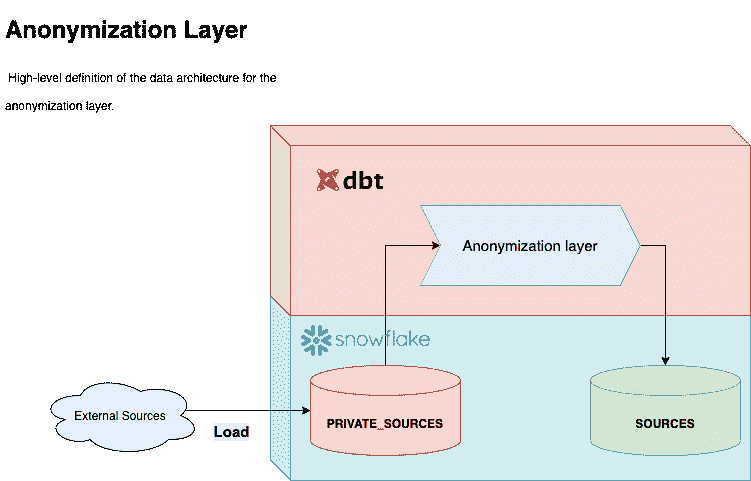

# 使用雪花和 DBT 的数据匿名层

> 原文：<https://towardsdatascience.com/data-anonymization-layer-using-snowflake-and-dbt-c5f84e398358?source=collection_archive---------7----------------------->


图片来自[爱丽丝·罗玛](https://www.instagram.com/laliceroma)

## 使用 DBT 匿名化雪花上数据的可扩展方法

**HousingAnywhere** 是一个面向中长期租赁的在线市场平台。像任何其他数据驱动的业务一样，我们必须处理个人信息和 **GDPR** 法规。在这篇简短的文章中，我将向你介绍我们匿名化 **PII** (个人身份信息)的解决方案。我将使用的技术是[](https://www.snowflake.com/)**【1】**一个流行的数据仓库云解决方案和[**DBT**](https://cloud.getdbt.com/)【2】(数据构建工具)一个数据转换工具。****

****从一些上下文开始；每天，我们的报告和分析都是由我们从各种来源获取的数据提供的，涵盖了我们业务的各个方面。这就产生了一个问题，*我们如何防止用户和服务不必要地访问暴露 HousingAnywhere 客户端 pii 的原始数据？*****

```
**from
┌──────────────────┬──────────────────────┬─────────┐
│       NAME       │         EMAIL        │ COUNTRY │
├──────────────────┼──────────────────────┼─────────┤
│ Tommaso Peresson │ [placeholder@mail.com](mailto:tompere96@gmail.com) │ IT      │
└──────────────────┴──────────────────────┴─────────┘to
┌──────────────────┬──────────────────────┬─────────┐
│       NAME       │         EMAIL        │ COUNTRY │
├──────────────────┼──────────────────────┼─────────┤
│ 87444be...eb6b21 │ 3c33076...e1ceaf     │ IT      │
└──────────────────┴──────────────────────┴─────────┘**
```

# ******简介******

## ****数据仓库配置****

****为了使这个解决方案有效，您的数据仓库中需要两个区域:第一个阶段存储来自外部源的所有原始数据，另一个阶段容纳匿名化转换的结果。为此，我将创建两个数据库，分别命名为 **PRIVATE_SOURCES** 和 **SOURCES** 。如果你需要一些帮助来达到这个阶段，请遵循这个指南。****

********

****图片来自 Tommaso Peresson****

****另一个关键要素是管理访问控制和权限，以便 **PRIVATE_SOURCES** 数据库只能由管理员和数据工程师访问，而 **SOURCES** 数据库可以由任何人访问。我不会深入讨论这个话题，但是如果你想了解更多关于特权和访问控制的知识，请阅读本文【4】。****

****我们还需要一个包含要影响的列名及其各自的匿名方法(`anonymization_mapping`)的信息的表，以及一个包含用于安全散列的[](https://en.wikipedia.org/wiki/Salt_(cryptography))**【5】**的表。********

# ******匿名化层******

******如果没有匿名化，任何有权访问数据仓库的人都可以窃取和使用个人信息。泄露数据就像输入`**select * from users**`一样简单。从这个 [pos](https://discourse.getdbt.com/t/pii-anonymization-and-dbt/29) t[6】中得到启发，我们决定使用 DBT 构建一个匿名化层。******

****让我们通过查看一个我们想要匿名的模型中的最终用法的例子来开始揭示我们的解决方案。****

****正如您可能看到的，在 select 之后有一个宏调用。这是为了取代`*`操作符并增加匿名化转换。我们的目标是找到一个可维护和可伸缩的解决方案，它不是文本密集型的，因为我们有数百个表，手动选择每一列当然不是一个很好的解决方案。让我们深入到宏中去理解实现细节。****

# ****深入研究实现****

****让我们来看看组成这个系统的两个 DBT 宏。****

****1。从`anonymize_columns()`开始，这个宏的目的是替换`*`操作符，并向特定列添加匿名化转换。****

****我们可以说这个宏执行两种不同的操作:****

## ****1.1 创建映射****

****(`**rows 2:13**`)从`[private_sources.information_schema](https://docs.snowflake.com/en/sql-reference/info-schema.html).columns`中获取所有的列名，并用列名上的`anonymization_mapping`将它们连接起来。因此，我们将有一个包含 object 中的表的列的表，并与正确的匿名化函数配对。*例如*`users`表有三列:`name`、`email`和`country`。在我们的具体例子中，我们可能只想匿名化`name`和`email`列，而不去碰`country`。****

****要做到这一点，我们的`anonymization_mapping`将必须包含这两行，指示哪些列必须被转换以及使用哪个函数:****

```
**ANONYMIZATION_MAPPING (config)
┌───────────────────┬─────────────┬───────────┐
│ TABLE_NAME_FILTER │ COLUMN_NAME │ FUNCTION  │
├───────────────────┼─────────────┼───────────┤
│ production.users  │ name        │ full_hash │
│ production.users  │ email       │ full_hash │
└───────────────────┴─────────────┴───────────┘**
```

****在将它与语句中包含的查询中的`information_schema.columns`连接之后，映射将如下所示****

```
**mapping (sql statement output)
┌───────────────────┬─────────────┬───────────┐
│ TABLE_NAME_FILTER │ COLUMN_NAME │ FUNCTION  │
├───────────────────┼─────────────┼───────────┤
│ production.users  │ name        │ full_hash │
│ production.users  │ email       │ full_hash │
│ NULL              │ country     │ NULL      │
└───────────────────┴─────────────┴───────────┘**
```

******注意**我们也可以将`anonymization_mapping`中的`TABLE_NAME_FILTER`留空，这将匿名化**每一列**的匹配名称**，而不通过表**过滤 **。这在我们有多个具有相同列名的表必须匿名的情况下很有用。******

## ****1.2 打印字段名及其转换****

****(`**rows 14:27**`)这部分宏使用上一步(`mapping`)的输出，通过将列名映射到正确的匿名函数，打印出要放入`select`语句中的正确的**列名**和**函数**。例如，遵循上一个示例时，宏的输出将是:****

```
**SHA256(name) as name,
SHA256(email) as email,
country**
```

****最终编译后的模型如下所示:****

```
**select
 **SHA256(name) as name,
 SHA256(email) as email,
 country**
from 
 private_sources.production.users**
```

****有效地匿名化了表中的敏感内容。****

****2。第二个宏用于分组并轻松使用不同的**匿名化转换。**这只是将选择的转换应用到一个列。为了展示它的用法，我包含了两种不同的方法，一种是散列整个单元格的内容，另一种是对单元格的内容应用一个 *REGEX* 来仅匿名化电子邮件地址的用户部分。****

```
**FROM: [tompere@housinganywhere.com](mailto:tompere@housinganywhere.com)
TO: SHA256(tompere+salt)@housinganywhere.com**
```

****同样重要的是要强调，无论何时使用散列函数，都需要**添加**盐**，否则我们的散列将容易受到 [**字典**攻击](https://en.wikipedia.org/wiki/Dictionary_attack#:~:text=In%20cryptanalysis%20and%20computer%20security,a%20dictionary%20or%20previously%20used)。******

# **结论**

****GDPR** 法规的目的是提高消费者对持有和处理个人数据的组织的信心，以及标准化和简化欧盟范围内的信息自由流动。在 **HousingAnywhere** 中，我们始终相信，用户的隐私是建立对我们平台的信任和信心的关键，这也是我们在设计数据基础设施时如此小心的原因。**

**最后，还应该提到一个事实，即 **Snowflake** 提供了一个现成的匿名化解决方案，名为**动态数据屏蔽**，仅适用于企业账户。**

**感谢 [Julian Smidek](https://medium.com/u/620e80a41755?source=post_page-----c5f84e398358--------------------------------) 成为如此伟大的经理人:)**

**[1] *DBT 云*。2021 年 5 月 20 日访问。[https://cloud.getdbt.com/](https://cloud.getdbt.com/)。**

**[2] *DBT 话语*。PII 匿名化和 DBT——建模”，2018 年 4 月 26 日。[https://discourse.getdbt.com/t/pii-anonymization-and-dbt/29](https://discourse.getdbt.com/t/pii-anonymization-and-dbt/29)**

**【3】*第二步。创建雪花对象—雪花文档。*2021 年 5 月 20 日访问。[https://docs . snow flake . com/en/user-guide/getting-started-tutorial-create-objects . html](https://docs.snowflake.com/en/user-guide/getting-started-tutorial-create-objects.html)。**

**[4] *《雪花特权与访问控制综合教程——特雷弗的代码》。*2021 年 5 月 20 日访问。https://trevorscode . com/comprehensive-tutorial-of-snow flake-privileges-and-access-control/。**

**[5] *盐(密码术)*。2021 年 5 月 17 日，维基百科。[https://en.wikipedia.org/w/index.php?title=Salt_(密码术)& oldid=1023634352](https://en.wikipedia.org/w/index.php?title=Salt_(cryptography)&oldid=1023634352) 。**

***【6】雪花。数据云|雪花|支持最关键的工作负载'*。2021 年 5 月 20 日访问。[https://www.snowflake.com/](https://www.snowflake.com/)。**