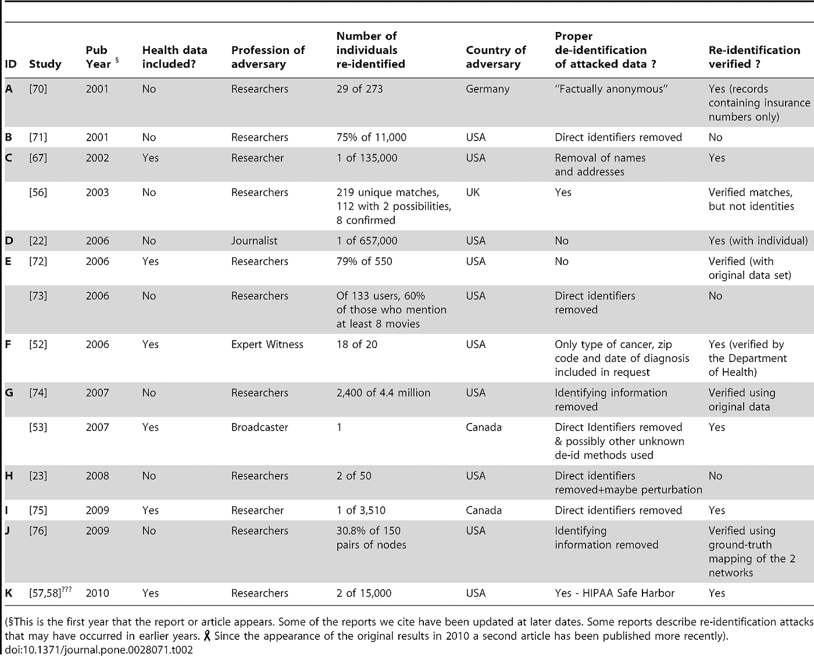

# 数据匿名化:一位前怀疑论者的观点

> 原文：<https://towardsdatascience.com/data-anonymization-perspectives-from-a-former-skeptic-f35790a2042a?source=collection_archive---------30----------------------->

## [行业笔记](https://towardsdatascience.com/tagged/notes-from-industry)

来源:https://unsplash.com/photos/1tnS_BVy9Jk

在[的上一篇文章](/demystifying-de-identification-f89c977a1be5?source=your_stories_page-------------------------------------)中，我回顾了匿名化、去标识化、编辑、假名化和标记化的定义。如果您不知道这两个术语之间的区别，这是一个很好的起点。

最相关的是，匿名化的定义是“可识别个人身份的数据被改变的过程，这种改变的方式使其不再能与给定的个人联系起来”( [IAPP 隐私术语表](https://iapp.org/resources/glossary/))。在实践中，匿名化实际上意味着被篡改的数据与特定个人相关联的可能性“微乎其微”。

当我第一次开始从事隐私增强技术的工作时，我一直生活在同态加密中。我非常不信任匿名化，并认为任何不这么认为的人都不了解事实。毕竟，辛西娅·德沃克(Cynthia Dwork)有一句名言“匿名化数据不是”，她因在差分隐私方面的突破性研究而闻名。

你见过多少次像下面这样的头条([黑暗日报](https://www.darkdaily.com/researchers-easily-reidentify-deidentified-patient-records-with-95-accuracy-privacy-protection-of-patient-test-records-a-concern-for-clinical-laboratories/))？

**所以匿名化是行不通的吧？**

我真的这么认为。我相信标题和专家暗示匿名化是无效的。作为我博士学位的一部分，我决定详细研究这些重新识别攻击，研究已经重新识别的数据，以及在数据集中重新识别的记录的百分比:

“我们发现，通过将记录的未加密部分与个人的已知信息(如医疗程序和出生年份)关联起来，可以在不解密的情况下重新识别患者”([黑暗日报](https://www.darkdaily.com/researchers-easily-reidentify-deidentified-patient-records-with-95-accuracy-privacy-protection-of-patient-test-records-a-concern-for-clinical-laboratories/))

或者

“2016 年的一项研究发现，使用年龄、性别、医院和年份等数据将麻醉记录与 2013 年德克萨斯州住院患者公共使用数据文件进行匹配的风险为 42.8%。”([HIPAA 去识别数据集中的再识别风险:MVA 攻击](https://www.ncbi.nlm.nih.gov/pmc/articles/PMC6371259/))

和

“[Sweeney]然后能够唯一地识别出州长 Weld 的医疗记录。她注意到，剑桥只有 6 名选民与州长的出生日期相同，其中只有 3 名是男性，而且只有一名选民与州长住在同一个邮政编码区。([HIPAA 去识别数据集中的再识别风险:MVA 攻击](https://www.ncbi.nlm.nih.gov/pmc/articles/PMC6371259/))

我发现，这些标题中提到的数据集的真正问题是，它们从一开始就不是真正匿名的:它们包括准标识符(例如，出生年份、年龄、性别、大致位置)，这些标识符在发布时没有考虑人口和数据集统计数据。所以这并不是说数据集被完全匿名，也不是说重新识别它们很容易。事实是，这些数据集被错误地标记为匿名。*他们从一开始就不配拥有这个称号。*

这部分是由于社区经历了学习曲线，以理解为了完全匿名化数据集需要做什么。起初，人们认为简单地删除直接标识符(全名、社会保险号等)。)就行了。发现准标识符如何影响在数据集中重新识别一个个体的可能性，需要一些磕磕绊绊。

这些观点在埃尔·埃马姆、k .容克、e .阿巴克尔、l .和马林的《[对健康数据的再识别攻击的系统综述](https://journals.plos.org/plosone/article?id=10.1371/journal.pone.0028071)》中得到证实，其中涵盖了对再识别攻击的严重性或有效性的误解。在这篇文章中，作者指出，根据现有标准，只有一次对真正匿名的数据成功进行了重新识别攻击(见下表中的 K)，即使是这一次攻击，重新识别风险也只有 2/15000——远低于 HIPAA 安全港的[可接受的重新识别风险阈值 0.04%](https://www.ncvhs.hhs.gov/wp-content/uploads/2016/04/BARTH-JONES.pdf) 。

他们在下表中总结了他们的发现:

图片:对去标识数据集的重新标识攻击列表。14 次攻击中只有两次是针对适当匿名化的数据集。这些攻击中只有一个( **K** )的重新识别得到了验证。15，000 个记录中有 2 个被重新识别。感谢哈立德·埃尔·埃马姆教授允许我复制这张表格。

该表中的来源 57 和 58 不容易在网上找到，也没有列在多伦多大学的图书馆目录上，所以挖掘导致重新识别 15，000 条记录中的 2 条的弱点并不容易。作为参考，这两篇论文是:

*   57.《比你想象的更难:符合 HIPAA 的记录的再识别风险的案例研究》。芝加哥:芝加哥大学的 NORC。摘要# 302255；2011.[ [谷歌学术](https://scholar.google.com/scholar_lookup?title=Harder+than+you+think:+a+case+study+of+re-identification+risk+of+HIPAA-compliant+records&author=P+Kwok&author=M+Davern&author=E+Hair&author=D+Lafky&publication_year=2011&)
*   58.去认同的安全港方法:实证检验。2010.第四届国家 HIPAA 西部峰会。

多亏了研究人员和记者的重新识别攻击，以及 k-匿名、l-多样性和 t-紧密度等概念，隐私社区开始理解匿名化在不同视角下的含义。这些概念考虑了基于个人的准识别符的重新识别的可能性，以及如何以最佳方式汇总这些准识别符，以最大限度地降低重新识别的风险。为了理解这三个概念，包括它们的局限性和优势，一篇理想的论文是 2007 年由李宁辉、和 Suresh Venkatasubramanian 撰写的名为[t-closey:Privacy Beyond k-anonymous and l-diversity](https://www.cs.purdue.edu/homes/ninghui/papers/t_closeness_icde07.pdf)的论文。

匿名化方法已经成功地用于许多临床试验数据集，目的是共享研究数据。2015 年由哈立德·埃尔·埃马姆、萨姆·罗杰斯和布拉德利·马林撰写的题为[匿名和共享个人患者数据](https://www.bmj.com/content/bmj/350/bmj.h1139.full.pdf?casa_token=NwqT3F-i9xkAAAAA:U_T2t8ZaB1xWBgDOH7QbgQAuwMXJ6FehY07q_C0AztDejEDxp08awbjyWeOlMLOl14lV-W0z1OVjmw)的论文中引用了四个最近的例子；即:

*   [葛兰素史克试验储存库](https://www.clinicalstudydatarequest.com/)
*   [数据球项目](https://www.projectdatasphere.org/)
*   耶鲁大学开放数据访问项目
*   [进口免疫学数据库和分析门户](https://www.immport.org/home)

总之，匿名化远非易事。甚至需要多年的专业知识和经验来适当地概念化准标识符如何影响再识别风险。这个术语经常被记者和公司完全误用。

**致谢**

感谢 John Stocks 和 Pieter Luitjens 对本文早期草稿的反馈。