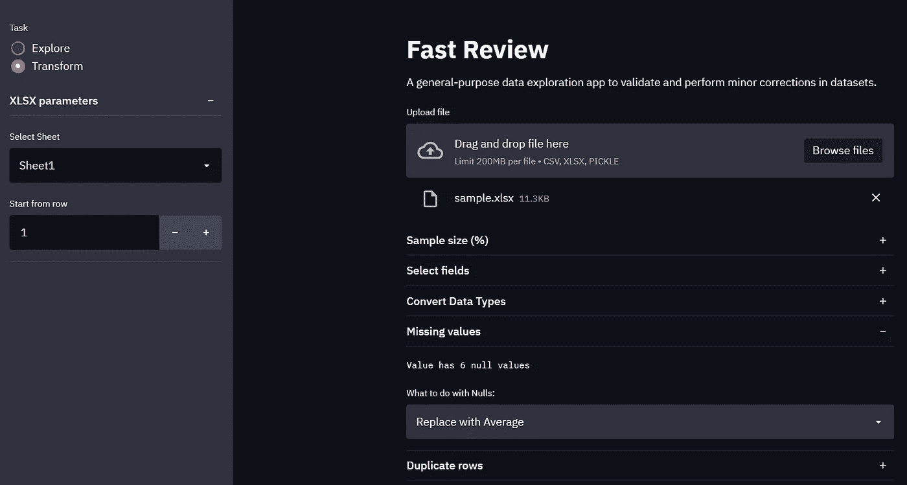

# 使用 Python 的 Streamlit 的数据应用

> 原文：<https://towardsdatascience.com/data-apps-with-pythons-streamlit-b14aaca7d083?source=collection_archive---------3----------------------->

## 以最快的方式将脚本转换成应用程序的基础知识

Streamlit 是一个易于使用的框架，非常适合构建 web 应用程序，而无需纠结于布局、事件处理程序或文档树。

其友好的方法使其成为探索数据集、展示机器学习模型、计算机视觉、自然语言处理、数据可视化和许多其他以数据为中心的项目的一个伟大工具。



快速回顾—由作者使用 Streamlit 制作—图片

在本文中，我们将构建一个简单的应用程序来使用 Streamlit 探索和转换数据集。

## 入门指南

安装之后，我们将创建一个名为`app.py`的文件，并从一些简单的东西开始。

```
#/app.py
import streamlit as st #pip install streamlitst.title('Explore a dataset')
```

在我们的环境终端中，我们可以转到保存脚本的目录，使用下面的命令运行 Streamlit，一旦启动，它将打开我们的默认浏览器并显示我们的页面。

```
streamlit run app.py
```


Streamlit run —作者截图


没有地方比得上 localhost—作者截图

厉害！现在让我们添加一些文本到我们的文件，并再次保存它。

一旦我们保存，Streamlit 将检测到更改，并让我们重新运行或总是重新运行页面。

```
# app.py
import streamlit as stst.title('Explore a dataset')
st.write('A general purpose data exploration app')
```


重新运行按钮—作者截屏

如果 Streamlit 由于某种原因没有检测到更改，或者没有任何更改，但是您想要重新运行它，您可以在右上角的菜单中找到此选项。


更新页面—作者截图

## 导入数据

我想构建一些简单的东西来对数据集进行一些快速的预探索和转换。在开始分析之前，我可以在某个地方验证数据并做一些小的调整。

我们可以从通常的`pd.read_csv(file_path)`开始。但是我想要更动态的东西，我可以改变文件，而不必写代码。

```
import streamlit as stst.title('Explore a dataset')
st.write('A general purpose data exploration app')file = st.file_uploader("Upload file", type=['csv'])st.write(file)
```


文件上传者—作者截图

就这样，我们有了一种将文件上传到应用程序的方法。如果没有上传文件，它将返回 None，但是如果我们上传了一个扩展名正确的文件，它会给我们一个包含该文件的对象。

返回的对象是 BytesIO 的子类，我们可以像使用任何其他文件一样使用它——这意味着我们用 Pandas 读取它不会有任何问题。


文件上传者—作者截图

## 写作

我们可以检查文件是否已上传，然后毫不费力地用熊猫阅读。让我们获取一些关于数据集的信息，并尝试显示它。

```
import streamlit as st
import pandas as pddef explore(df):
  # DATA
  st.write('Data:')
  st.write(df) # SUMMARY
  df_types = pd.DataFrame(df.dtypes, columns=['Data Type'])
  numerical_cols = df_types[~df_types['Data Type'].isin(['object',
                   'bool'])].index.values df_types['Count'] = df.count()
  df_types['Unique Values'] = df.nunique()
  df_types['Min'] = df[numerical_cols].min()
  df_types['Max'] = df[numerical_cols].max()
  df_types['Average'] = df[numerical_cols].mean()
  df_types['Median'] = df[numerical_cols].median()
  df_types['St. Dev.'] = df[numerical_cols].std() st.write('Summary:')
  st.write(df_types)def get_df(file):
  # get extension and read file
  extension = file.name.split('.')[1] if extension.upper() == 'CSV':
    df = pd.read_csv(file)
  elif extension.upper() == 'XLSX':
    df = pd.read_excel(file, engine='openpyxl')
  elif extension.upper() == 'PICKLE':
    df = pd.read_pickle(file) return dfdef main():
  st.title('Explore a dataset')
  st.write('A general purpose data exploration app')file = st.file_uploader("Upload file", type=['csv' 
                                             ,'xlsx'
                                             ,'pickle']) if not file:
    st.write("Upload a .csv or .xlsx file to get started")
    return df = get_df(file)
  explore()main()
```


数据框-作者截图

`write`方法不仅仅用于文本；我们可以用它来显示列表、字典、Pandas 数据框、Matplotlib 图形、Plotly、Altair、Graphviz 以及许多其他内容。我们甚至可以通过设置参数`unsafe_allow_html=True`来编写 HTML。

## 输入

我们将使用`slider`来帮助我们对数据集的一部分进行采样，并使用`multiselect`来选择我们想要的列。

```
import streamlit as st
import pandas as pddef explore(df)...**def transform(df):
  # Select sample size
  frac = st.slider('Random sample (%)', 1, 100, 100)
  if frac < 100:
    df = df.sample(frac=frac/100)** **# Select columns
  cols = st.multiselect('Columns', 
                        df.columns.tolist(),
                        df.columns.tolist())
  df = df[cols]** **return df**def get_df(file)...def main():
  st.title('Explore a dataset')
  st.write('A general purpose data exploration app') file = st.file_uploader("Upload file", type=['csv']) if not file:
    st.write("Upload a .csv or .xlsx file to get started")
    returndf = get_df(file) **df = transform(df)**explore(df)main()
```


重新运行按钮—作者截屏

我们如何使用 Streamlit 设置输入非常简单，他们有一系列类似的组件来帮助我们构建应用程序。

**文件 _ 上传器**，**滑块**，**选择 _ 滑块**，**选择框**，**多选**，**颜色 _ 选择器**，**文本 _ 输入**，**数字 _ 输入**，**文本 _ 区域**，**时间 _ 输入**，**日期 _ 输入**，

**我们的页面开始变大，我仍然想添加更多的探索组件和更多的转换。**

**在这种情况下，侧边栏是一个方便的类。我们可以将控件添加到侧边栏，节省页面空间，但我想使用侧边栏来选择我们将使用应用程序的哪一部分。**

```
import streamlit as st
import pandas as pddef explore(df): ...def transform(df): ...def get_df(file): ...def main():
  st.title('Explore a dataset')
  st.write('A general purpose data exploration app') file = st.file_uploader("Upload file", type=['csv', 
                                               'xlsx', 
                                               'pickle']) if not file:
    st.write("Upload a .csv or .xlsx file to get started")
    return df = get_df(file) **task = st.sidebar.radio('Task', ['Explore', 'Transform'], 0)** **if task == 'Explore':
    explore(df)
  else:
    transform(df)**
```

****

**需要注意的是，使用 Streamlit 实现状态并不容易。**

**如果我们对 Transform 进行更改并转到 Explore，它将不会保存我们对数据框所做的更改，因为它将重新运行整个应用程序。在这种情况下，唯一不变的是我们上传的文件。**

**如果我们反其道而行之，文件仍然是一样的，但是来自 Transform 的所有其他输入将重置为它们的默认位置。**

**有一些变通方法——您可以实现一个简单的 DB 来存储来自用户的输入，并使用会话来了解他们是否已经发送了输入。**

**M Khorasani 写了一篇关于用 PostgreSQL 实现这一点的很棒的文章— [用 Streamlit 实现有状态架构](/implementing-a-stateful-architecture-with-streamlit-58e52448efa1)。**

## **布局**

**接下来，我们将添加一种方法来转换字段的数据类型。因此，当我们有一个数字或日期作为字符串时，我们可以在开始分析之前轻松处理它。**

**我们将使用一个循环为数据集中的每个字段创建一个输入。你可能会想象我们的页面会有很大一部分被这些控件填充，用于一些大的数据集。**

**侧边栏非常有用，我们可以用扩展器和栏给页面添加更多的组织。**

```
import streamlit as st
import pandas as pddef explore(df): ...**def download_file(df, types, new_types, extension):
  for i, col in enumerate(df.columns):
    new_type = types[new_types[i]]
    if new_type:
      try:
        df[col] = df[col].astype(new_type)
      except:
        st.write('Could not convert', col, 'to', new_types[i])**def transform(df):
  frac = st.slider('Random sample (%)', 1, 100, 100)
  if frac < 100:
    df = df.sample(frac=frac/100)

  cols = st.multiselect('Columns'
                        ,df.columns.tolist()
                        ,df.columns.tolist()) df = df[cols]
  **types = {'-':None
           ,'Boolean': '?'
           ,'Byte': 'b'
           ,'Integer':'i'
           ,'Floating point': 'f' 
           ,'Date Time': 'M'
           ,'Time': 'm'
           ,'Unicode String':'U'
           ,'Object': 'O'}
  new_types = {}** **expander_types = st.beta_expander('Convert Data Types')** **for i, col in enumerate(df.columns):
    txt = 'Convert {} from {} to:'.format(col, df[col].dtypes)
    expander_types.markdown(txt, unsafe_allow_html=True)
    new_types[i] = expander_types.selectbox('Field to be converted:'
                                            ,[*types]
                                            ,index=0
                                            ,key=i)
  st.text(" \n") #break line** **# first col 15% the size of the second  
  col1, col2 = st.beta_columns([.15, 1])** **with col1:
    btn1 = st.button('Get CSV')
  with col2:
    btn2 = st.button('Get Pickle')** **if btn1:
    download_file(df, types, new_types, "csv")
  if btn2:
    download_file(df, types, new_types, "pickle")**def get_df(file): ...
def main(): ...main()
```

****

**好吧。让我们完成将数据帧转换成可下载文件的`download_file()`方法；我们需要 pickle io 和 base64。**

```
import streamlit as st
import pandas as pd
**import pickle
import io
import base64**...def download_file(df, types, new_types, extension):
  for i, col in enumerate(df.columns):
    new_type = types[new_types[i]]
    if new_type:
      try:
        df[col] = df[col].astype(new_type)
      except:
        st.write('Could not convert', col, 'to', new_types[i]) **# csv
  if extension == 'csv': 
    csv = df.to_csv(index=False)
    b64 = base64.b64encode(csv.encode()).decode()** **# pickle
  else: 
    b = io.BytesIO()
    pickle.dump(df, b)
    b64 = base64.b64encode(b.getvalue()).decode()** **# download link
  href = f'<a href="data:file/csv;base64,{b64}" download="new_file.{extension}">Download {extension}</a>'** **st.write(href, unsafe_allow_html=True)**...
```

## **更进一步**

**我们接触了向我们的应用程序添加内容的方法，了解了输入、侧栏和一些可以改善页面布局的测试组件。现在，您可以探索所有其他方便的 [Streamlit 方法](https://docs.streamlit.io/en/stable/api.html)，查看社区创建了什么[【1】](https://github.com/jrieke/best-of-streamlit)[【2】](https://streamlit.io/gallery)，甚至开发[您的组件](https://docs.streamlit.io/en/stable/streamlit_components.html)。**

**有些用户自制的组件可以帮助您快速构建应用程序。例如，我们可以用只有四行代码的 Pandas Profiling 替换我们的 Explore 部分。**

```
from pandas_profiling import ProfileReport
from streamlit_pandas_profiling import st_profile_reportdef explore(df):
  pr = ProfileReport(df, explorative=True)
  st_profile_report(pr)
```

****

**总的来说，Streamlit 是开发数据应用程序的一个很好的框架。你可以自动化一个过程，给它一个友好的界面，而不需要努力，随着社区的成长和积极的开发，会有不断的改进和创新。**

**您可以在这里找到本文中使用的代码的改进版本[，在这里](https://github.com/Thiagobc23/Fast-Review)找到其现场版本[。](https://share.streamlit.io/thiagobc23/fast-review/main/fast-review.py)**

****

**感谢阅读我的文章！**

****资源:** [https://streamlit.io/](https://streamlit.io/)；
[https://pandas.pydata.org/docs/](https://pandas.pydata.org/docs/)；
https://github.com/pandas-profiling/pandas-profiling；
[https://github.com/okld/streamlit-pandas-profiling](https://github.com/okld/streamlit-pandas-profiling)；
[https://docs.python.org/3/library/io.html](https://docs.python.org/3/library/io.html)；
[https://docs.python.org/3/library/pickle.html](https://docs.python.org/3/library/pickle.html)；
[https://docs.python.org/3/library/base64.html](https://docs.python.org/3/library/base64.html)；**