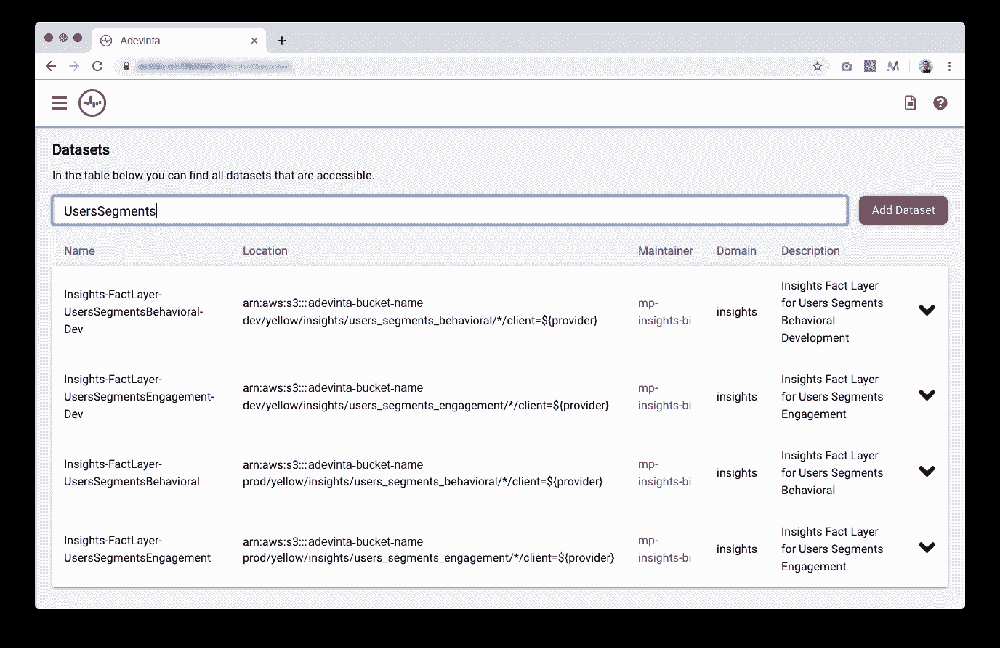
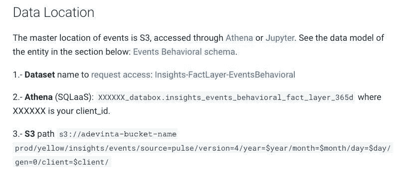
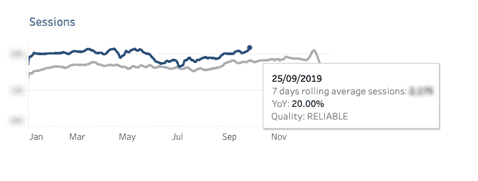

# 数据作为产品与数据产品。有什么区别？

> 原文：<https://towardsdatascience.com/data-as-a-product-vs-data-products-what-are-the-differences-b43ddbb0f123?source=collection_archive---------1----------------------->

## 通过例子理解“数据产品”和“数据作为产品”之间的异同

绿色绳网由[克林特·王茂林](https://unsplash.com/@clintadair?utm_source=unsplash&utm_medium=referral&utm_content=creditCopyText)在 [Unsplash](https://unsplash.com/?utm_source=unsplash&utm_medium=referral&utm_content=creditCopyText) 上制作

自从 Zhamak Dehghani 的[数据网格介绍文章](https://martinfowler.com/articles/data-monolith-to-mesh.html)发表以来，在数据网格环境内外，围绕什么是“数据产品”的定义已经有了很多讨论。

通过澄清本文中的几个定义，我们希望“数据产品”和“数据作为产品”的概念对于任何进入数据和数据网格世界的人来说都变得更加清晰。

# 数据产品

让我们从“数据产品”的一般定义开始。

[美国前首席数据科学家 DJ Patil](https://twitter.com/dpatil) 将数据产品定义为“通过使用数据促进最终目标的产品”(摘自其著作*Data Jujitsu:The Art of Turning Data into Product，* 2012)。

这意味着，任何数字产品或功能都可以被视为“数据产品”，如果它使用数据来促进目标的实现。例如，如果我看到的主页中的新闻项目是基于我以前的导航数据动态选择的，那么数字报纸的主页可以是一种数据产品。

2018 年， [Simon O'Regan](https://twitter.com/Simon_O_Regan) 发表了一篇名为[设计数据产品](/designing-data-products-b6b93edf3d23)的文章，列出了非常清晰的数据产品示例，并按类型进行分组:原始数据、派生数据、算法、决策支持和自动化决策。

以下是示例数据产品的列表，包括它们所属的类别和用于访问它的接口:

*   **一个公司仪表盘，显示您企业的主要关键绩效指标。**该数据产品属于决策支持系统类型，其访问界面为可视化界面。
*   **数据仓库。**该数据产品是原始数据、衍生数据和决策支持系统的混合体。访问它的接口可能是 SQL 查询。
*   **附近推荐餐厅列表。由于这份名单是专门为你设计的，所以这个数据产品是一个自动决策的产品。访问它的界面是一个应用程序或网站。**
*   **谷歌地图上的“更快路线现已可用”通知**是一个决策支持数据产品(因为你是决策者)，其界面是一个网络/应用程序。
*   **自动驾驶汽车**也是数据产品。因为它是自动驾驶的，所以属于自动决策型。它的界面就是，嗯，汽车本身。

# 数据作为一种产品

数据网格范式的原则之一是将[数据视为一种产品](https://martinfowler.com/articles/data-mesh-principles.html#DataAsAProduct)。有时这一原则被缩写为“数据产品”，因此产生了混淆。

“数据产品”是一个通用概念(如上所述)，“数据作为产品”是所有可能的数据产品的子集。更具体地说，如果我们使用西蒙的类别，“作为产品的数据”属于“数据产品”的原始或派生数据类型。

如果我们深入到数据网格世界，Zhamak Dehghani 的[原始文章](https://martinfowler.com/articles/data-monolith-to-mesh.html)中的这段引文是理解数据作为产品的定义的关键:*“领域数据团队必须将产品思维应用于他们提供的数据集；将他们的数据资产视为他们的产品，将组织的其他数据科学家、ML 和数据工程师视为他们的客户。”*

总之，“作为产品的数据”是将产品思维应用于数据集的结果，确保它们具有一系列能力，包括可发现性、安全性、可探索性、可理解性、可信度等。

# 数据作为产品的一个例子

那么，数据作为一种产品是什么样子的呢？作为产品的数据包含代码、数据和元数据，以及运行它所必需的基础设施。此外，它需要实现前面描述的功能。

在我们于 2019 年在巴塞罗那举行的数据委员会会议上发表的题为“*一个有效的联合信息基础设施”* ( [视频](https://www.youtube.com/watch?v=l5MlnBIby3o)，[博客文章](https://medium.com/@xgumara/a-federated-information-infrastructure-that-works-5a4feb387863)文字稿)的演讲中，我们通过列出数据集的质量，举了一个数据集作为产品在 [Adevinta](https://www.adevinta.com) 中使用的例子:

**可发现的**

为了使作为产品的数据可被发现，需要一个搜索引擎，用户必须能够在该引擎中注册数据集并请求访问它们(这将增加安全性，另一个功能将在下面解释)。

该功能的第一次迭代可能只是您实际的内部 intranet 中的一个数据集列表，您可以从中迭代和增量构建。请记住，流程和文化比过早部署终极数据目录工具更重要(这对于员工来说可能太复杂而无法使用)。

*ade vinta 定制构建数据目录的一个示例，使数据集可被发现*

**可寻址**

拥有可寻址的数据集使您的团队更有效率。一方面，数据分析师和数据科学家可以自主地寻找和使用他们需要的数据。另一方面，数据工程师很少被人打断，他们会问在哪里可以找到关于 x 的数据。

*使数据集可寻址的“数据作为产品”的元数据*

**自描述和互操作**

正如我们在解释 [Adevinta 的数据网格之旅](https://medium.com/adevinta-tech-blog/building-a-data-mesh-to-support-an-ecosystem-of-data-products-at-adevinta-4c057d06824d)的博客文章中所评论的，数据集需要包含使其可以理解的元数据，并遵循相同的命名约定(这将使数据集具有互操作性)。我们发现这些元数据对我们的数据分析师非常有用:

*   数据位置(如上所示)
*   数据起源和数据映射
*   抽样资料
*   执行时间和新鲜度
*   输入前提条件
*   使用数据集的笔记本或 SQL 查询示例

**值得信赖和安全**

定期自动检查数据质量是实现数据作为一种产品的可信特性的必要条件。数据集的所有者需要对这些检查的结果做出相应的反应。

必须在管道输入和输出处进行质量检查，并且向数据消费者提供上下文数据质量信息没有坏处；比如 Tableau 仪表盘。

*在 Tableau 仪表板中显示的上下文数据质量*

最后，注册的数据集不应该自动提供给所有人。员工需要请求访问他们中的每一个人，数据控制人员需要单独授予或拒绝访问权限。

当请求访问时，必须指定需要访问的时间以及访问的目的。

# 进一步阅读

将数据理解为一种产品是在您的组织中成功实施数据网格的基础。你可以通过阅读这篇文章中引用的以下文章来扩展关于这个主题的知识:

*   [西蒙·奥里甘设计数据产品](/designing-data-products-b6b93edf3d23)
*   [如何从单一数据湖转移到分布式数据网](https://martinfowler.com/articles/data-monolith-to-mesh.html)
*   [数据网格原理和逻辑架构](https://martinfowler.com/articles/data-mesh-principles.html)Zhamak Dehghani 著
*   [Xavier Gumara Rigol 在 Oda](https://medium.com/oda-product-tech/data-as-a-product-at-oda-fda97695e820) 发布的产品数据
*   [构建数据网格以支持 Adevinta 的数据产品生态系统](https://medium.com/adevinta-tech-blog/building-a-data-mesh-to-support-an-ecosystem-of-data-products-at-adevinta-4c057d06824d)Sandra Real 和 Xavier Gumara Rigol
*   Xavier Gumara Rigol 的文章