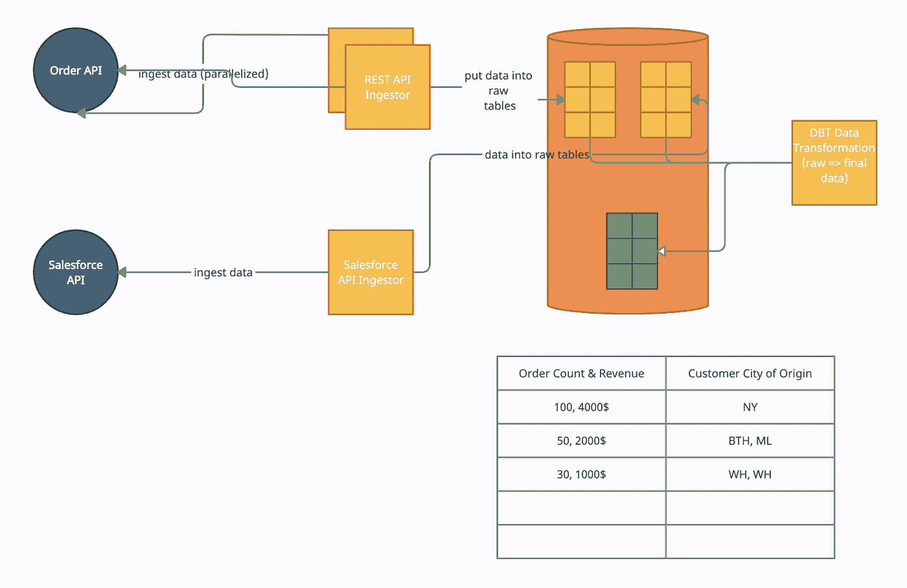
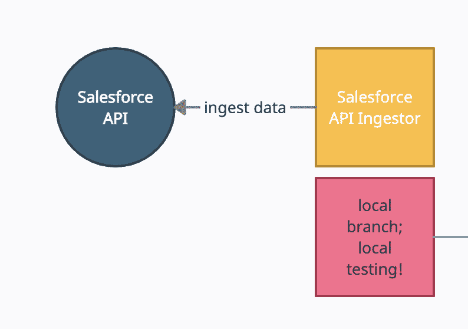
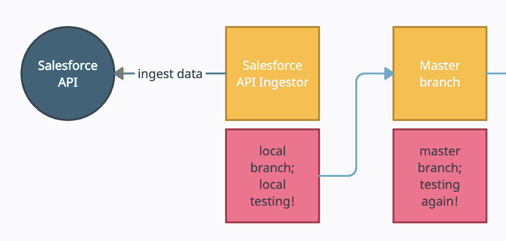
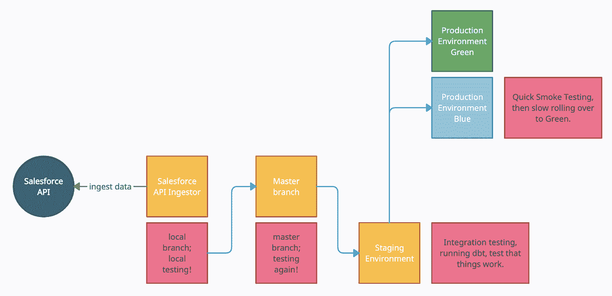

# 数据即代码—实现分析数据集的零生产缺陷

> 原文：<https://towardsdatascience.com/data-as-code-achieving-zero-production-defects-for-analytics-datasets-824251339952?source=collection_archive---------22----------------------->

## [行业笔记](https://towardsdatascience.com/tagged/notes-from-industry)

## 如何应用真实数据作为代码哲学，使用软件开发中关于数据的可靠方法来实现接近零的产品缺陷。

是的，零缺陷！那太棒了。图片由作者提供。

数据团队将近 60%的时间花在运营上，而不是创造价值。根据[数据厨房研究&园丁调查](https://medium.com/data-ops/add-dataops-tests-for-error-free-analytics-741ee48bd5cc)，他们的数据系统也经历了大量的错误。**然而，在软件开发世界中，我们已经有了哲学，允许高性能的团队快速且高质量地交付，没有任何这些问题。**

那么我们为什么不延续完全相同的做法呢？毕竟，它们起源于精益制造领域，并且已经被带到了软件领域。这就是应该称之为 ***的数据为*** 。

让我们看看来自软件世界的工具和实践如何转移到一个简单的例子，一个 EL (T)工作流，并使我们的示范团队能够:

1.  将平均恢复时间(MTTR)缩短至几分钟(或几秒钟)。
2.  增加“数据部署”和测试的频率
3.  将失败率(生产错误的相对数量)更改为 0%左右

如果你想知道为什么我们要看这三个指标，这是四个指标中的三个，这四个指标是[区分高绩效团队和一般团队的](https://www.thoughtworks.com/radar/techniques/four-key-metrics)。听起来是个不错的目标，对吧？

***警告*** *，这才是真正的“数据如码”，而不仅仅是“啊对了，请版本化数据。这看起来有点奇怪，这就是为什么我要用一个例子。强调为什么这种数据生产流程会产生接近 0%的生产缺陷。*

# 我们的例子，数据 Ingestors 丹，戴夫，达纳

让我介绍三个朋友:丹、戴夫和黛娜。他们三个都是数据感应器。机器。Dan 和 Dave 是“REST 吸入器”的实例，Dana 是“Salesforce API 吸入器”的实例。

他们三个都可以使用数据 git，一个可以由 lakeFS 这样的解决方案托管的数据 git。他们可以使用它，就像任何人类开发人员使用他们的代码库一样。

丹、戴夫和达娜是优秀的开发人员。他们坚持持续集成的所有好原则，经常提交，本地测试，等等…

*旁注:为什么我要提到 lakeFS？因为与其他工具一样，lakeFS 操作并不是数据的实际复制，而主要是元数据操作。因此，下面提到的复制操作实际上只需要几秒钟，即使是万亿字节的数据。*

# EL (T)数据流

我们的数据流非常简单。我们将一个 REST API 用于“订单”,而 Salesforce API 使用一些公共转换工具将这两个源连接在一起，并获得一些由典型的客户相关数据划分的客户统计数据。

图片由作者提供。

# 我们的参考工作流性能

我们的参考工作流程很简单:

*   数据入口设置为每小时接收一次数据。
*   其余的 ingestors 只有一个源，但它很大，所以并行化到 N=2
*   摄取的数据放在一个“原始表”中，并在运行后使用诸如 great-expectations 这样的工具进行测试。
*   如果原始源代码中有一个错误，只有那部分会被暂停，开发人员必须检查并可能修复它。

如果生产中出现问题，例如创建“客户表”的转换(是的，我知道我们可以在它上面有一个物化视图)，那么我们就丢失了客户数据。**恢复**是指删除数据/修复一些数据问题，然后重新运行一次转换= > *，以 30 分钟到一个小时*来衡量。在一般的公司里，这种情况一个月会发生几次。

这已经描述了典型数据设置中的上述指标。

**现在，让我们来看看 Dan、Dave & Dana 的智能版本与我们的参考工作流程有何不同！**

— — — —

丹、戴夫&达娜……

# Dana 提交 Salesforce API 客户数据

图片由作者提供。

Dana 知道好数据的关键是“经常承诺”。这样，错误很快就被发现，并被控制在一个很小的“爆炸半径”内。所以她**每 5 分钟跑一次**。

在她“运行”之前，她通过在 lakeFS“danar unx 2021–01–01–101”中创建一个分支，将“数据存储库”克隆到她的本地系统中(不是真正的本地系统，但是让我们保持类比)，该分支受到保护并且仅对她可见。

当她运行时，她接收数据，然后提交给她的个人分支。

她没有将数据推送到生产系统的原始表中，**而是将它们“本地”**保存一分钟，并使用这个名为“great-expectations”的酷工具运行测试，该工具运行一系列基本测试，如“非空”等。并检查原始数据的异常值和变化的分布。

# 首次改进本地测试

当测试中断时会发生什么？Dana 对此无能为力(…然而，她毕竟不是机器学习系统之类的东西…)，所以它只是保持原样，而人类开发人员会收到通知说*danar unx 2021–01–01–10*1 失败了。

人类开发人员现在可以检查分支，并在不干扰生产数据的情况下调查问题。

生产数据会发生什么变化？

*   所有系统保持运行。
*   再过 5 分钟，Dana 将下一个数据块带到*danar unx 2021–01–01–102*并运行她的新测试。
*   如果数据错误还没有修复，数据就不在主分支中，所以测试通过了，新数据就在那里。
*   大家都很开心。

感觉有点像一个中转区，损坏的数据在这里得不到处理，对吗？

接下来会发生什么？

# 推到母版上

图片由作者提供。

然后，Dana 继续将她的数据放入原始存储库中。自动创建并批准一个合并请求，再次运行测试，并将数据推送到常规的升级订单中。

让我们称数据为 **dartifact** ，因为它现在实际上是一个“数据工件”，或者更像是一个“飞镖”,从生产环境返回到某个中央 git 存储库和 CI 服务器。

# 到舞台环境中

图片由作者提供。

接下来不是生产环境，毕竟 Dana 是一个很棒的开发者。她知道她必须将自己的数据集成到其他数据中，就像她刚刚做的那样，还要集成到其他组件中。

因此，数据一旦被推入中央存储库，就被提升到一个暂存环境。这个登台环境还用于测试和集成所有软件组件。因此，它运行着我们最新版本的数据转换工具。

现在，我们的 CI 服务器可以执行一系列集成测试，这意味着运行数据转换工具并执行其测试。

为了让这个工作流与 lakeFS 一起工作，我们必须滥用分支机制，至少调用一个分支“env-staging ”,并给予它特殊的访问权限保护，就像它只能通过集成组件访问一样，等等。当然，这也可以在 lakeFS API 级别上处理，这可能是最好的方法。

# 试运行环境中的二次改进集成测试

当测试中断时会发生什么？

开发人员在显示器上的常规**信息辐射器**上得到通知，这是任何使用 CI 的团队都应该在中心位置拥有的。

东西修好了，我们的生产系统也没有问题了。其他数据只是流过有问题的部分。

最重要的是，我们还将最新的 dbt 模型与新数据进行集成，然后再投入生产。

# 等等，但是我们的数据太大了，无法运行两次转换

如果转换时间太长，我们该怎么办？那就有多种选择了！

我们已经创造了数据“dartifact”。这意味着，我们可以像对待任何其他通过我们的促销订单的软件工件一样对待它。例如，我们可以将我们的数据与某种配置一起提交，这些配置只一起构成 dartifact。

一种可能的配置是:对真实数据的采样机制保持分布完整，但仍然使它在登台环境中变得更小。

或者它可以是一个数据掩码，如果在分段环境中需要的话，它可以屏蔽个人信息。

# 提升到生产

图片由作者提供。

最后，Dana 可以将她的数据推广到生产中。多亏了今天可用的令人敬畏的自动化，这实际上只需要几分钟。

但是由于 Dana 仍然是一个聪明的开发人员，所以她没有直接提升到生产环境。相反，她做了一个“蓝绿色部署”，这意味着她将新的 dartifact 推入 lakeFS 中的第二个分支“production-blue”。

然后，她对数据进行一系列冒烟测试，然后才慢慢地将生产流量从“绿色生产”切换到“蓝色生产”。

# 第三项改进产品冒烟测试和即时回滚

如果东西坏了怎么办？如果冒烟测试失败，则一切正常，不会影响生产流量。

如果它真的崩溃了，那么我们仍然有一个超级简单的回滚选项，我们可以在 lakeFS 之上的任何 CI 中实现它。只需将旧的 dartifact 重新部署到我们的生产分支，或将生产流量切换回旧的工作分支“绿色生产”。

我们仍然需要回滚主分支，以防止将来的合并再次破坏生产系统。

# 丹和戴夫怎么办？

丹和戴夫遵循相同的工作流程。除此之外，有人忘记在他们的系统中设置“本地测试”选项。

有问题吗？不会，因为一旦他们将数据提交给 master，并将其推送到原始存储库，它就会被集成，从而被测试。有人会抓住它，实施本地测试，并感到高兴。

此外，由于两者并行工作，数据确实需要被集成，测试必须在中央存储库中再次运行，在那里它们的两个数据版本被合并在一起。

# 看看这些数字

与我们的参考工作流相比，看看此工作流实现了什么:

1.  **平均恢复时间:**在参考工作流中，从 30 分钟到 1 小时不等。对我们来说，如果数据真的中断了，我们只需切换 lakeFS 中的一个分支。这是一个元数据操作，意味着它需要几秒钟才能到达一个正在运行的系统。由于事先进行了密集的测试，而且块很小，修复也非常快。
2.  **变更失败率:**由于我们在新工作流程中有 4 个测试层，与参考工作流程中的 1-2 个相比，我们将变更失败率降低到接近 0。
3.  **数据部署的频率:**在我们的参考工作流中是每小时一次，这里是每 5 分钟一次。是的，这是真的，在参考工作流中也可能是 5 分钟，如果我们放任不管的话。到 5 分钟意味着减少修复某个东西所花的时间，因为可能的错误区域要小得多。

# 转换工具呢？

当然，现在我们把数据作为代码，就像基础设施作为代码一样，我们必须把东西集成在一起。这意味着一旦提交了变更，dbt 工具也将触发针对数据的集成测试。

推入存储库的新转换也是如此。

# 这不是又贵又慢吗？

如上所述，成本是可调整的和相对的。同样显而易见的是，实际上一直移动数据是没有意义的。相反，像 lakeFS 这样的工具或任何其他类似的工具都非常适合，因为这些工具处理根本不移动数据的元数据操作。

当然，就像通常的软件开发一样，对于每种情况，在提交大小和获得满足我们对数据的要求的度量的时间间隔之间都有一个最佳点。

可能仍然需要一些技术创新，如更好的数据 CI 工作流，但该流程已经可以用现有的技术很好地实现。

的确，如果你的目标是尽可能便宜地获取数据，那么这种工作流程不是你要找的…

*但考虑到“数据是世界上最宝贵的资产”，我敢肯定，在快速交付******高质量*** *上多花一点钱是值得的。***

***对如何建立伟大的数据公司、伟大的数据密集型产品、成为伟大的数据团队感兴趣，还是对如何利用开源构建伟大的东西感兴趣？然后考虑加入我的* [*免费简讯《三个数据点周四》*](http://thdpth.com/) *。它已经成为数据初创企业、风投和数据领导者值得信赖的资源。***