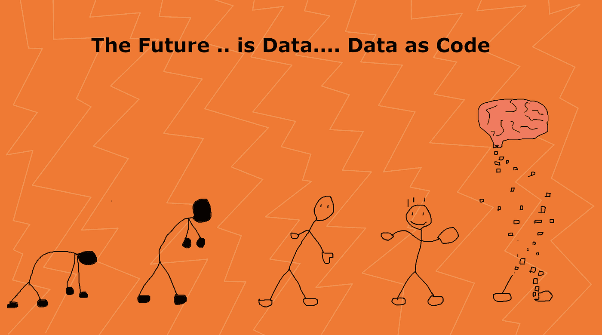
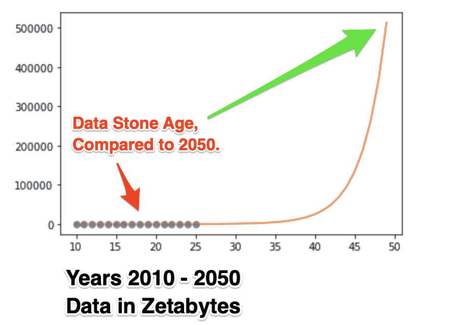
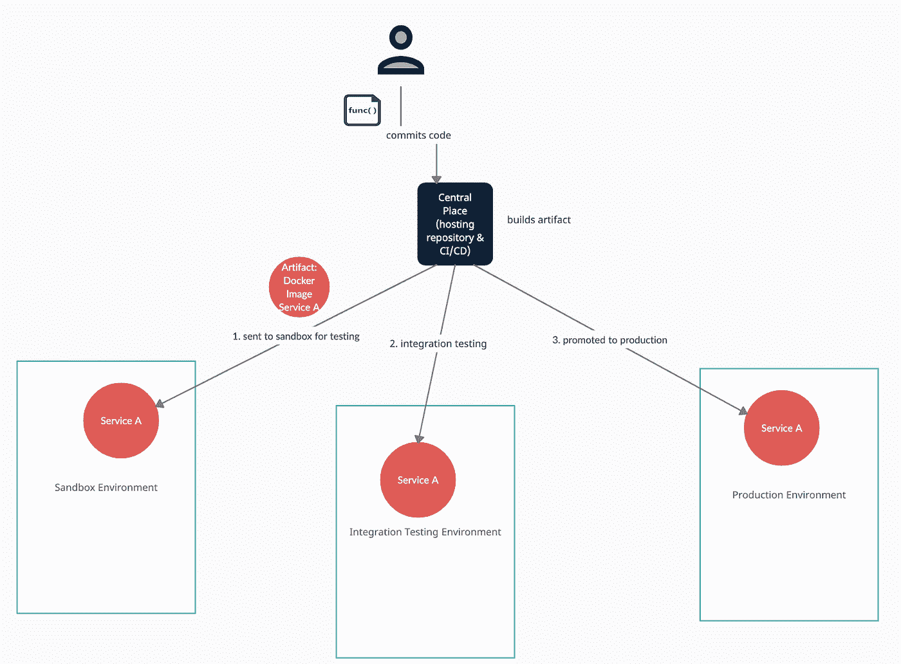
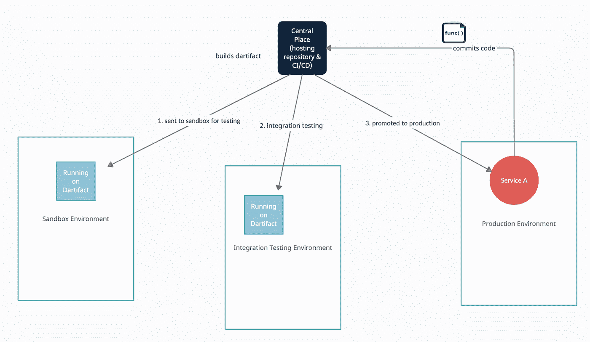
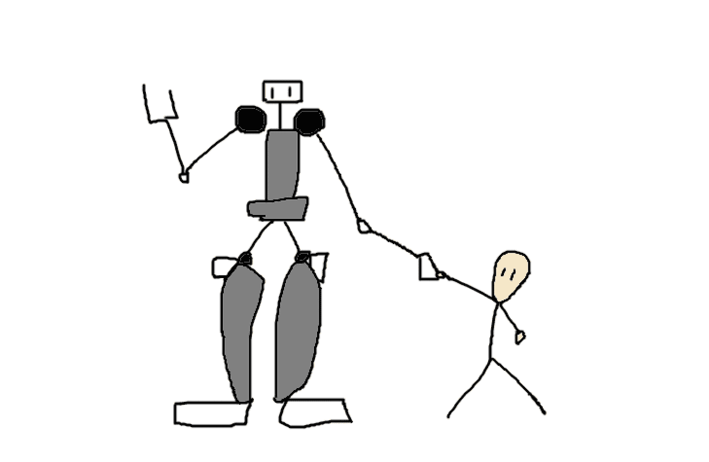
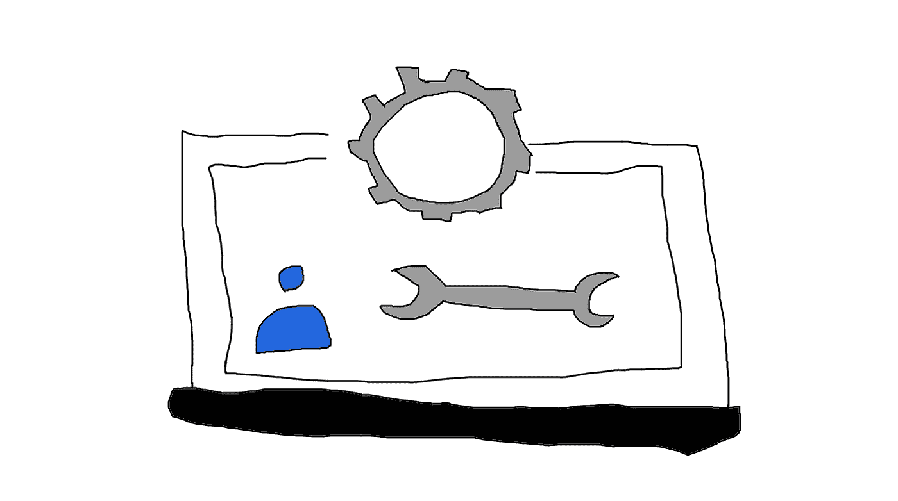

# 数据即代码——原则，它是什么，为什么是现在？

> 原文：<https://towardsdatascience.com/data-as-code-principles-what-it-is-and-why-now-aaf1e24fa732?source=collection_archive---------10----------------------->

## 不，DaC 不仅仅是版本控制数据！它将整个软件工程工具链应用于数据。为此，我们需要原则。

*本帖是小编的一部分，开头是:* [*数据作为代码——实现分析数据集的零生产缺陷*](/data-as-code-achieving-zero-production-defects-for-analytics-datasets-824251339952) *。*

图片由 Sven Balnojan 提供。

数据作为代码是一个简单的概念。就像基础设施是代码一样。它只是说“把你的数据当作代码”。然而，在 IaC 于 2011 年出现在 ThoughtWorks 的雷达上之后，它仍然花了大约 10 年的时间“入驻”，并且仍然处于一个不稳定的位置，IaC 的倡导者认为他们需要提醒人们以下几点:

> " ….*说“像对待代码一样对待基础设施”是不够的；我们需要确保来自软件世界的来之不易的知识也能一致地应用于整个基础设施领域”*

就这么多了。由于我认为我们不应该再等 10+年来获得高质量的**数据应用** **快速**，所以我写了这篇文章(系列)。

# **那么什么是 DaC 呢？**

*数据即代码:使用我们在软件中学习到的良好实践，并将它们应用于所有数据领域的数据，运营数据、分析数据、数据科学数据、……版本管理、自动化测试、CI 系统、……以实现* ***快速交付高价值数据的目标*** *。*

我担心的是，数据即代码(DaC)将比 IaC 需要更长的时间才能起步，这对我们所有人来说都是一个巨大的福利损失。我认为，到目前为止，围绕 DaC 概念的讨论忽略了三个重要概念。这三个概念是“dartifacts”、“人类辅助机器工程”和“数据集成”。

我将解释这些概念以及它们为什么如此重要，并解释我们应该在数据世界中遵循的原则。

尽管谈论“旧模式失败”的所有方式可能是合理的，但我喜欢关注新世界、新概念和新机会。

# 发生了什么事？新世界中的老方法

这种情况已经发生，并将在未来几年继续发生…

*作者对数据量做的非常粗略的估计。可能完全被夸大了。这只是一个简单的指数预测。*

我们应用程序中的数据呈指数级增长。它不仅仅在操作上被用来**存储对象，“记忆事物”，而且还被用来**分析事物，做出更好的决定。第三，它以一种“**解析运算**”的方式为机器学习应用提供动力。后两种应用产生了数据使用的寒武纪大爆发。****

**因此，可用数据量和数据价值都呈指数增长曲线。**

**在我看来，这将引领一个时代，数据将成为未来的电力，为一切提供动力。**

**问题:**在这个新世界里，我们继续以旧的方式工作。尽管我们应该应用制造技术的黄金标准，但我们已经学会了将软件应用于数据。****

# **DaC 世界中的概念**

**人们谈论“数据即代码”，但迄今为止，我还没有看到任何接近我脑海中必然发生的事情。已经在朝着正确的方向前进的是我们需要对数据进行版本化(参见例如像 [dvc](https://dvc.org/) 或 [lakeFS](https://lakefs.io/) 这样的工具)并测试它(参见[蒙特卡洛](https://www.montecarlodata.com/)或[远大前程](https://greatexpectations.io/))。**

**我认为这是因为围绕数据作为代码的讨论中缺少了三个重要的概念。让我们来看看它们。**

# **Dartifacts**

**软件工件是在软件开发过程中创建的东西。通常，开发人员开发一些代码，将它推入中央存储库，然后进入 CI/CD 系统，在那里进行构建。然后交付到不同的“阶段”进行测试，最后推广到生产。**

****

**图片由作者提供。**

**另一方面，dartifact 也是一个工件，但不是这个意义上的软件开发过程。它是由部署在这些阶段中的任何一个阶段的系统创建的，然后像飞镖一样被发送回中心位置。一个特殊的例子当然是数据。**

****

**图片由作者提供。**

**请注意，人类创造的人工制品有点像一套“护栏”，而现在 dartifact 是一个自我进化的系统。这就把我们带到了下一点，未来的软件工程。**

# **人类辅助机器工程**

**那么，服务应该提交数据吗？那太好了，但是如果东西坏了，机器不能自己修理东西，对吗？实际上，我们已经在“ [CD4ML](https://martinfowler.com/articles/cd4ml.html) ”的框架中使用了正确的工作流来解决这个问题。**

**对于持续/在线学习机器学习模型，ThoughtWorks 宣传了一个有些类似的工作流程。它看起来像这样:**

1.  **我们在 CD 系统中为我们的机器学习模型建立了一个测试和评估管道。**
2.  **我们引入类似“如果新模型没有击败上一个，就不要使用它，否则自动部署它”的测试。**
3.  **我们部署了一个新的机器学习模型。我们还用它部署了数据收集器。**
4.  **每当有一批新数据(比如一天的数据)时，数据收集器将数据提交给 git，触发管道，评估新模型，并可能发布它。**

**当然，当管道出现故障时，机器学习工程师会收到通知，并可以处理模型。因为毕竟，如果它随着更多的数据而变得更糟，这意味着某些东西很可能会被破坏。但他现在有机会简单地提供更好的护栏，让系统在其上处理事情，从而不断改进自己。**

**那就是**人类辅助机器工程**，机器做“开发”，人类进来做“繁重的工作”。到目前为止，我还没有在任何讨论中看到这个话题，但我认为这是一个重要的话题，因为我看不到任何其他发展领域的未来。**

***想过吗？作为一名开发人员，你为什么要解决一个之前已经解决了 10000 次，并且在网上数百万行代码中公开的问题呢？这听起来很像机器应该做的事情……***

****

**人工辅助？图片由作者提供。**

# **集成数据**

**在基础设施成为代码之前，只有软件。现在有了两个额外的集成点。当然，问题是，既然当我把软件当作代码时，基础设施只是为了运行软件而存在，那么我该如何处理软件呢？但是这个问题只有两个选择:**

1.  **以基础设施+软件为一个单元**
2.  **将它们视为独立的单元**

**另一方面，对于作为代码的数据，我觉得我们有了更多的选择，仅仅是因为它是第三个，而且因为它实际上有多种用途。**

# **三种实用的数据类型**

**我实际上看到了今天使用的三种不同的“数据类型”或“数据应用程序类别”。这些**操作**数据的主要目的是为了**记住事情**。然后是**分析**目的，其主要目的是帮助**人类做出更好的决策**。最后是**分析操作**，它通常也被视为分析，其目的是**自动帮助某人做出更好的决策**(无论是在帮助你做出更好电影选择的推荐系统中，还是在具有预测的实际决策支持系统中，等等。).**

**我喜欢将后两者分开，只是因为目前只有分析性的操作数据应用程序像代码一样接近数据，就我所知，它使用的是 CD4ML/CML 工作流。**

# **DaC 的原则**

**DaC 中的原则几乎都是现代优秀软件开发原则的一对一翻译。然而，如果我们看看数据世界，它们根本没有被使用，在上面概述的三个数据领域的任何一个…**

**我们为什么要这样做？因为这些原则中的大部分最初来自精益制造世界，在那里关注的仅仅是同时提高流程的产量和质量。它造就了丰田，也造就了大多数现代科技巨头。那么，如果我们关心数据流，为什么要忽略那些非常有效的方法呢？**

****

**软件工程！图片由作者提供。**

**进入，原则。**

## **(1)版本控制中的一切**

**这听起来像是一个显而易见的问题，这是一个经常被称为“数据即代码”的东西，但是正如你所看到的，它仅仅涵盖了数据即代码的 5%。**

*****原则:把你的数据保持在版本控制中。关于它的一切。*****

## **(2)小提交—小块数据**

**出于某种原因，我们将数据“批量处理”成大批量。然而，从软件世界我们已经知道，如果我们犯了一个大错误，我们破坏它的可能性非常大，并且修复它的努力也很大。**

*****原理:提交小的 DaC 变化。*****

**这是一种心态的转变。然而，在我们用新数据重新训练我们的机器学习模型之前，一旦我们获得了大量新数据，我们现在提倡不断的重新训练。**

**请记住速度和大小之间的权衡，但仅此而已。我认为通常人们害怕“经常提交数据”，因为他们认为它会更经常地损坏。但事实正好相反，新的/更改的数据集越小，修复它就越容易。**

**这当然只有在“提交/摄取/…经常”不会导致生产系统崩溃的情况下才有效，所以让我们来看看其他原则。**

## **(3)代码创建者的本地单元测试**

**我们都在将代码推送到中央存储库之前对其进行单元测试，因为我们不想提交不完整的代码。**

**然而，数据采集器和其他系统通常会将数据直接采集到生产系统中，而不进行任何测试。**

*****原理:DaC dartifact 的创建者也“本地”测试它，然后将其推送到中央系统。*****

**作为一个例子，这意味着，你的在线机器学习系统将运行一个测试，例如检查它的统计分布。如果失败，它不会将数据推入系统进行训练，而是将新的数据“放在一边”。**

## **(4)走促销顺序**

**软件构建首先被部署到沙箱，然后是集成环境，最后是生产环境。**

**然而，无论是数据入口，还是一些在线学习机应用程序，以及运营数据，都被直接转储到生产系统中。**

*****原理:DaC 走晋升顺序，和其他一样。*****

**对于运营数据来说，这听起来可能有些奇怪，但我觉得这是有价值的。想想看，您可能正在备份您的大型生产数据库。为什么您会简单地假设其中的数据没有损坏？为什么您会认为可以使用它来恢复，而不首先在集成阶段进行测试呢？为什么你会认为它还能和其他东西集成在一起？**

## **(5)所有阶段的数据相同**

**一个推论是这个原则。我们在所有级上保持相同的 DaC。通常情况下，公司只在非生产阶段保留少量样本或虚假数据。我主张 180 度大转弯。为什么？因为我们希望在生产中面临的相同环境中测试我们的 dartifact，否则，我们不能依赖我们的测试并降低我们的数据质量，产生更多的错误，并以更慢的数据交付时间结束。**

**当然，就像软件一样，我们当然可以应用远离环境的配置，它可以是:**

1.  **较低阶段的“取样”配置或**
2.  **屏蔽 PII 数据的屏蔽配置**

**对于尺寸敏感的读者来说:没有理由让这种事情发生。这并不意味着我们必须一直拷贝数万亿字节的数据。这可以作为根本没有任何复制的元数据操作发生。额外的好处是:如果我们只使用元数据操作，从我的角度来看，这应该是 GDPR 兼容的(尽管我不是律师)。**

## **(6)主干发展，分枝少**

*****原则:我们只保留 1-2 个分支，包括主干/主干用于我们的数据。*****

**这确保了我们实际上执行了上述原则，比如本地测试和晋升阶梯。**

## **(7)我们跟随变化的轴心**

****原则:我们沿着变化的轴线切割 DaC 和数据服务，而不是与之正交。****

**这意味着我们试图把事情做得更小，而是在领域边界上。我们尽量不要把数据摄取和我们新的很酷的机器学习系统分开，毕竟，它们是一起工作的。这意味着我们不会将我们的 BI 系统分割成“接收/转换/清理/存储/保存”部分，而是分割成“业务组件单元 1/业务单元 2/…”比特。**

**为什么要这么做？首先，遵循[数据网格](https://martinfowler.com/articles/data-monolith-to-mesh.html)概念的所有想法，这是正确的做法。其次，如果我们通过大规模的数据湖来引导机器学习组件的数据摄取，我们几乎没有机会测试系统的整体完整性。我们将没有机会真正确保真正的价值生产单元，即机器学习组件的质量。我们将仅仅能够确保“分段”的完整性，这与产生价值的单元的完整性非常不同。**

**另一方面，如果我们将所有的部分放在一个架构量子中，就很容易确保组件的完全完整性，从而让它整天持续改进。**

## **(8)经常集成代码库和组件**

*****原则:经常集成您的数据，以及创建它的应用程序、存储它的应用程序和它的基础设施。*****

**我认为，对于任何曾经恢复过数据备份的人来说，这应该听起来很熟悉:恢复数据备份后，事情根本不会以同样的方式工作，因为围绕数据的事情在发展，但数据后退了一步。因此，将数据一次又一次地与其他所有东西(基础设施和软件组件)集成是至关重要的，就像我们不断将所有软件组件和基础设施相互集成一样。**

## **(9-…)我肯定还有更多**

**…**

# **数据有什么不同不是更突出？**

**我认为人们已经接近这种心态，因为数据正在成为这个星球上最有价值的资源，但是处理数据的管道还没有跟上。**

**有两件事与迄今为止代码作为代码和基础设施作为代码的情况有本质的不同:**

1.  **机器将完成这里的大部分提交工作。**
2.  **庞大的数据量。**

**但话说回来，基础设施与代码也有很大不同，至少代码只是大小不同，基础设施实际上有不同的外观，因此需要代码到实际物理基础设施的大量映射。**

**正如上面所解释的，我不认为机器工作在代码上是一件新鲜事。**

**因此，也许数据作为代码是一种思维转变，但我不觉得这是一个巨大的转变，这种新的最有价值的产品在提高质量和速度方面的好处是巨大的。**

**一个悬而未决的问题仍然是，我们需要像在 IaC 中那样在数据之上有一个抽象层吗？例如用于屏蔽数据？我不知道，还有待观察什么会起作用。**

# **还缺少什么——我们需要开发什么？**

**当我偶然发现 [lakeFS](https://lakefs.io/) 时，我对这个话题很感兴趣。因为在我看来，他们可能会朝一个方向前进:**

**1.能够模拟分布式数据，**

**2.将数据的读取模型从数据存储中分离出来。**

**在我看来，这正是我们需要让所有原则像魔咒一样工作的原因，因为如前所述,“数据量”不允许频繁应对，特别是当我们的目标是加速而不是减慢时。**

**这就像我们用来做 IaC 的基础设施之上的抽象层。**

***还缺少什么？技术上来说，一切皆有可能。但是大多数事情还不简单。在数据仓库中获取数据或通过 CI 系统运行数据仍然很困难。***

# **你该何去何从？进一步阅读**

**如果这引起了你的注意，那么一个好去处就是应用文章。对于运营分析数据应用的阅读，你真的应该阅读 ThoughtWorks 的[文章。](https://martinfowler.com/articles/cd4ml.html)**

**由于在分析空间中没有任何东西，我花了一些时间写了一篇关于使用[数据作为代码在数据世界中实现零生产缺陷的配套文章](/data-as-code-achieving-zero-production-defects-for-analytics-datasets-824251339952)。**

**我还没有在运营数据领域看到任何东西，但是我确信已经有聪明的人在这样做来保护他们的备份等。**

# **结束语**

**这更像是一个思想实验，是让人们将数据视为代码的一个步骤，而不是基于构建工作模型的经验。所以，如果你有任何这样的例子，我很想听听！**

***对如何建立伟大的数据公司、伟大的数据密集型产品、成为伟大的数据团队感兴趣，还是对如何利用开源构建伟大的东西感兴趣？然后考虑加入我的* [*免费简讯《三个数据点周四》*](http://thdpth.com/) *。它已经成为数据初创企业、风投和数据领导者值得信赖的资源。***