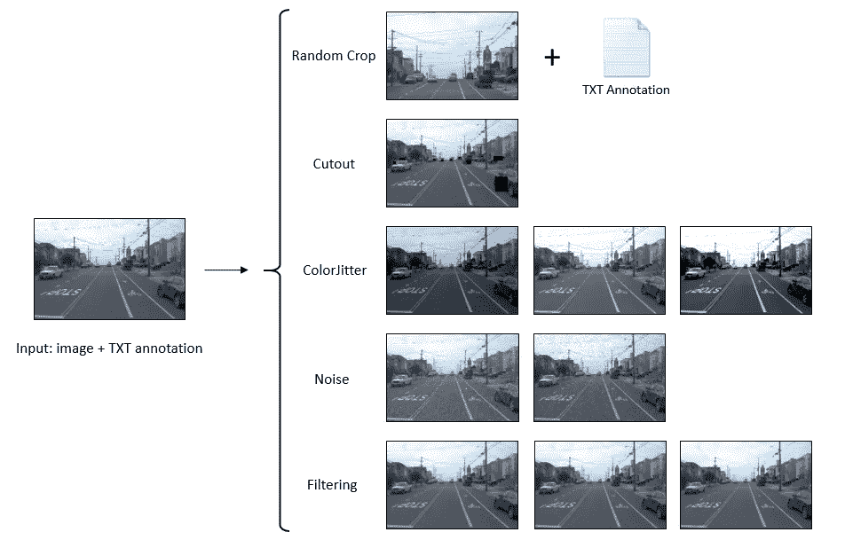

# 用 Python 和 OpenCV 进行数据扩充编译

> 原文：<https://towardsdatascience.com/data-augmentation-compilation-with-python-and-opencv-b76b1cd500e0?source=collection_archive---------10----------------------->

## 防止模型过度拟合

照片由 [Ulises Baga](https://unsplash.com/@ulisesbaga?utm_source=medium&utm_medium=referral) 在 [Unsplash](https://unsplash.com?utm_source=medium&utm_medium=referral) 上拍摄

数据扩充是一种增加数据集多样性的技术，无需收集任何更多的真实数据，但仍有助于提高模型准确性并防止模型过度拟合。在这篇文章中，您将学习使用 Python 和 OpenCV 实现最流行和最有效的对象检测任务的数据扩充过程。

即将推出的数据扩充方法包括:

1.  *随机作物*
2.  *断流器*
3.  *色彩抖动*
4.  *添加噪声*
5.  *过滤*

首先，在继续之前，让我们导入几个库并准备一些必要的子程序。

下面的图片是在这篇文章中使用的样本图片。

图片:WAYMO 数据集中的 tr03–14–18–1-FRONT.jpg

# 随机作物

*随机裁剪*随机选择一个区域，并将其裁剪出来，形成一个新的数据样本，裁剪后的区域应具有与原始图像相同的宽高比，以保持物体的形状。

作者图片

从上图可以看出，左图显示的是带有真实边界框(红色)的原始图像，右图是通过裁剪橙色框内的区域创建的新样本。在新样本的注释中，移除了与左侧图像中的橙色框不重叠的所有对象，并且将位于橙色框边界上的对象的坐标调整为适合新图像样本。原始图像的*随机裁剪*的输出是新的裁剪图像及其注释。

# 断流器

*Cutout* 是由 *Terrance DeVries* 和 *Graham W. Taylor* 在他们的[论文](https://arxiv.org/abs/1708.04552)中于 2017 年推出的，是一种简单的正则化技术，在训练期间随机屏蔽输入的方形区域，可用于提高卷积神经网络的鲁棒性和整体性能。这种方法不仅非常容易实现，而且证明了它可以与现有形式的数据扩充和其他正则化结合使用，以进一步提高模型性能。

如论文中所述，应用*剪切*来提高图像识别(分类)的准确性，因此，如果我们将相同的方案部署到对象检测数据集，则可能导致丢失对象，尤其是小对象的问题。下图中，*剪切*区域(黑色区域)内的大量小物体被移除，这不符合数据增强的精神。

作者图片

为了使这种方式适用于对象检测，我们可以进行简单的修改，而不是仅使用一个掩模并将其放在图像中的随机位置，当我们随机选择一半数量的对象并对这些对象区域中的每一个应用剪切时会更好。增强后的图像显示为下图中的右图。

作者图片

剪切的输出是一个新生成的图像，我们没有删除对象或改变图像大小，然后生成的图像的注释是原始的。

# 色彩抖动

*ColorJitter* 是另一种简单的图像数据增强，我们随机改变图像的亮度、对比度和饱和度。我相信这个“家伙”很容易被大多数读者理解。

作者图片

# 添加噪声

在常识中，噪声被认为是图像中的一个意外因素，然而，几种类型的噪声(例如，高斯、椒盐噪声)可以用于数据增强，并且*添加噪声*是深度学习中一种非常简单且有益的数据增强方法。在下面的例子中，为了增加数据，高斯噪声和椒盐噪声被添加到原始图像中。

作者图片

对于那些不能识别高斯噪声和椒盐噪声之间的区别的人来说，高斯噪声具有从 0 到 255 的值范围，这取决于配置，因此，在 RGB 图像中，高斯噪声像素可以是任何颜色。相反，椒盐噪声像素只能有两个值 0 或 255，分别对应于黑色(胡椒)或白色(盐)。

# 过滤

本文介绍的最后一个数据扩充程序是*过滤*。类似于*加噪*，*滤波*也简单易实现。实施中使用的三种类型的滤波包括*模糊(均值)*、*高斯*和*中值*。

作者图片

# 摘要

作者图片

在这篇文章中，我向大家介绍了一个关于为目标检测任务实现数据扩充的教程。你们可以在这里找到我的完整实现。如果你觉得它有帮助，请毫不犹豫地给它一颗星。欢迎你访问我的脸书粉丝页，这是一个分享关于机器学习的东西的页面:[投入机器学习](https://www.facebook.com/diveintomachinelearning)。

今天够了。感谢您抽出时间！