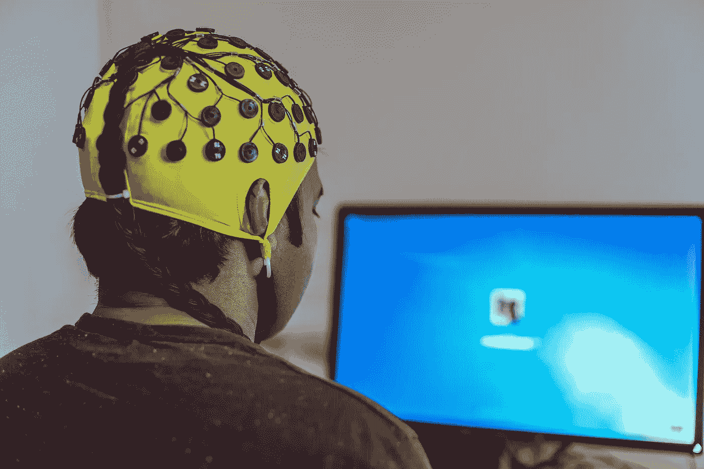
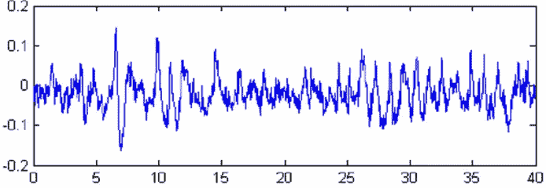
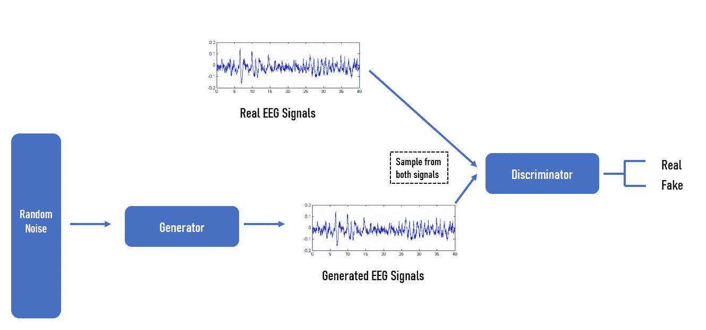

# 脑-机接口的数据增强

> 原文：<https://towardsdatascience.com/data-augmentation-for-brain-computer-interface-35862c9beb40?source=collection_archive---------30----------------------->

## 结合脑机接口和生成对抗网络的新商业应用

图片来自 [Pixabay](https://pixabay.com/fr/photos/eeg-int%C3%A9gration-hirnstrommessung-2680957/)

尽管脑机接口(BCI)取得了重大进展，但在现实环境中收集脑电图(EEG)信号仍存在许多问题。**这种情况使得 BCIs 很难成为可扩展的设备。**

脑-机接口一直面临着严重的数据相关问题，如缺乏足够的数据、校准时间过长和数据损坏。在我的最新项目中，我们探索了利用数据增强方法(如生成对抗网络)来创建合成 EEG 信号的想法。

事实上，数据增强(DA)是解决这些问题的潜在解决方案。在数据增强技术中，成功应用于图像处理的生成对抗网络方法受到了广泛关注。

在本文中，我将解释在非侵入性脑机接口环境中创建足够的训练数据的问题，并给出一个针对 EEG 数据集的数据扩充技术的非详尽列表。我还将解释在实际应用中如何使用 GANs 来帮助 BCI。

# BCI 和数据采集

脑机接口(Brain-computer interface，BCI)系统旨在为几种使用情况连接大脑和外部设备。

时至今日，在 BCI 获取大脑数据最常用的方式是**脑电图。**这种方法无创，便携，相对便宜。对于大多数项目，需要大量的脑电信号。

> **脑电图** (EEG)是“一种记录大脑电活动的电生理监测方法”( [1](https://en.wikipedia.org/wiki/Electroencephalography) )。

对于非侵入式 BCI 应用，EEG 是用于脑-机接口的最主要的信号采集方法。它具有非侵入性捕获人类大脑皮层电活动的能力。

**然而，由于多种原因，EEG 并不代表获取数据的可扩展方式:**

*   它要求受试者(或患者)经历长时间的校准过程。
*   一些收集的数据可能已损坏。
*   在 EEG 数据集上训练的分类器倾向于对不同时间记录的数据进行较差的概括，即使是对同一个人。
*   EEG 信号因受试者而异，甚至受试者内部也因会话而异。这种情况对于实时分析尤其成问题，在实时分析中，固有的模型是基于过去的神经数据训练的，用于解码当前的神经活动。
*   收集所需数量的样本通常既困难又昂贵。
*   BCI 系统通常需要很长的校准时间，这对于商业应用来说仍然太长了。可能的解决方案需要来自其 EEG 信号先前已被记录的许多其他用户的数据，或者来自同一用户的过去试验的大量数据集。
*   深度学习固有地受限于 EEG 数据集，因为它们的大小相对较小。
*   分类器在 BCI 系统中的性能高度依赖于训练数据的质量和数量。
*   大型公开的脑电图数据集并不常见。
*   诸如脑解剖、帽放置和受试者之间的动力学等因素极大地限制了 EEG 分析在个体之间的普遍性。

此外，BCI 应用程序仍然经常依赖于在实验室中收集的训练数据，在实验室中，用户在受控环境中执行任务。

现实是，即使是一个单一的主题，BCI 团队也必须经历许多耗时的实验环节，才能训练好机器学习模型，使其足够有用。因此，具有特定领域方法的处理管道通常用于清理、提取相关特征和分类 EEG 信号。

使用现有条件可以获得额外的数据，但是从商业角度来看，通过几次长时间的校准会话来记录脑电图(EEG)数据是不可扩展的。

> BCI 领域的一个重要限制是训练样本非常有限。利用如此有限的数据构建一个可靠且可用的系统是一项挑战。

不幸的是，如果没有足够的特定对象数据，即使是迁移学习方法也无法解码不同的 EEG 信号类别。

> ***迁移学习*** *是一种“监督学习技术，它在一个新的网络上重用以前训练过的模型的一部分，该网络负责一个不同但相似的问题。”(* [*2*](https://www.google.com/search?q=Transfer+learning+definition+&client=firefox-b-d&sxsrf=ALeKk01oHaTIJLVLnV9vXw1xj-4SVM9EQQ%3A1616332208588&ei=sEVXYIa2I8v0kgXPsqTYBA&oq=Transfer+learning+definition+&gs_lcp=Cgdnd3Mtd2l6EAMyBggAEBYQHjIGCAAQFhAeMgYIABAWEB4yBggAEBYQHjIGCAAQFhAeOgQIABBHOgUIABDLAVCnR1jyUWChU2gAcAN4AIAB8gGIAZkNkgEFMC45LjKYAQGgAQGqAQdnd3Mtd2l6yAEIwAEB&sclient=gws-wiz&ved=0ahUKEwiGzobZusHvAhVLuqQKHU8ZCUsQ4dUDCAw&uact=5) *)*

所需要的是一种自动生成人工 EEG 试验以扩充现有数据集的方法。生成方法是解决这些限制的潜在解决方案。

通过利用生成技术，有可能以时间和成本有效的方式提高分类器的鲁棒性。合成生成的 EEG 信号可以证明非常有利于提高训练用于分类 EEG 数据的模型的准确性和泛化能力。

# 数据增强和 BCI

存在两种方法来生成扩充数据。

*   通过应用几何变换:平移、旋转、裁剪、翻转、缩放等。
*   通过向现有的训练数据添加噪声。增加训练集的大小有助于用附加参数训练更复杂的模型，并减少过度拟合。

然而，与图像不同， **EEG 是来自不同电极的噪声、非平稳时间序列的集合。**此外**，**几何变换并不直接适用于 EEG 数据，因为那些可能影响时域特征。

在经典的计算机视觉项目中，标注者可以很容易地决定一个增强的数据集是否仍然类似于原始类(例如，动物或物体)。对于 EEG 信号，事情更复杂…换句话说，正确标记增强数据集可能具有挑战性。

作者图片

# 脑电图的数据增强技术

数据扩充有助于增加可用的训练数据，便于使用更复杂的 DL 模型。它还可以减少过拟合，提高分类器的准确性和稳定性。

数据扩充已经或多或少地成功应用于许多 EEG 任务，例如:

*   睡眠阶段
*   运动想象
*   脑力负荷
*   情绪识别任务。

GANs 和 variable Auto-encoder(VAE)已经证明了从各种数据集捕捉关键元素以生成真实样本的效率( [3](https://arxiv.org/pdf/1901.07429.pdf) )。

另一种方法包括“从最初可用的少量 EEG 试验中生成人工 EEG 试验，以相关的方式增加训练集的大小。”( [4](https://hal.inria.fr/inria-00599325/document) )根据作者的说法，“这种方法是通过首先将每个可用的训练 EEG 试验分成几个片段，并生成新的人工试验，作为来自不同和随机选择的训练试验的片段的串联来实现的。”

**脑电信号的其他数据增强方法包括(非穷尽列表):**

*   滑动窗口方法(一种将时间序列数据集重构为监督学习问题的方法)
*   噪声添加
*   抽样法
*   傅立叶变换(用频率分量表示周期信号的一种方法)

# 关注甘斯

生成对抗网络是一种相对较新的 ML 技术，其中两个人工神经网络通过竞争同时训练彼此。机器人使机器能够想象和创造自己的新奇形象。

GAN 和相关的深度学习算法被更多地用于和讨论在计算机视觉项目中生成合成图像。EEG 通常可以在频域中随着时间的推移被分析和可视化为频谱图(通过傅立叶或小波变换)。

使用 EEG 信号的 GAN 架构示例，图片由作者提供

光谱图可以像图像一样处理。因此，为图像开发的数据增强方法(GANs)可以应用于图像。**通过 DA 过程生成的频谱图然后被转换回 EEG 信号。**

最近有一些尝试将 GANs 用于 EEG 信号:

在这篇研究论文( [5](https://www.crcv.ucf.edu/papers/camera_ready_acmmm_BNI08.pdf) )中，“当这个人在看一些图像时，脑电图被记录下来，然后这个脑电图被发送到 GANs 以重新生成显示的图像”。他们报告说，GANs 优于变分自动编码器(VAE)，但生成的图像质量仍然很低。

在另一项研究中( [6](https://www.semanticscholar.org/paper/Deep-EEG-super-resolution%3A-Upsampling-EEG-spatial-Corley-Huang/be380a48c62308414da2706d289b6d526df19f7c) )，研究人员应用 GANs 对 EEG 信号的空间分辨率进行上采样。在最后一项研究( [7](https://pubmed.ncbi.nlm.nih.gov/30440924/) )中，GAN 用于生成合成情感识别 EEG 数据。作者“使用带有两个情绪识别数据集的条件 WGAN，从噪声分布中以差分熵的形式生成 EEG。”

# 标准 GANs 的问题

没有任何修改的 GANs 容易出错和不稳定。一个著名的场景叫做“模式崩溃”。当鉴别器仅学会将输入分布的几个窄模式识别为实数时，就会发生这种情况，导致生成器产生有限数量的可微分输出。

> 众所周知，训练 GAN 具有普遍的不稳定性问题。

处理模型不稳定和模式崩溃的一种方法是利用由 Arjovsky 等人首次提出的 wasser stein GAN(WGAN)([8](https://arxiv.org/abs/1701.07875))。WGANs 的目标是最小化真实数据分布和虚假数据分布之间的差异，防止模式崩溃。这种方法已经成功地用于创建无噪声的脑电图数据。

其他作者( [9](https://githubmemory.com/repo/basel-shehabi/EEG-Synthetic-Data-Using-GANs) )提到了诸如“WGAN 可以使用所谓的梯度惩罚来处理消失/爆炸梯度”的问题其他研究人员可能会使用纯深度卷积 GAN (DCGAN)，通过使用不同内核大小的卷积层来提取信号特征。

## 使用甘斯和 BCI 的商业应用

除了改进数据集的能力之外，GANs 还可以用于为 BCI 创建新的用例。可以肯定的是，GANs 将很快被用于将思想转化为图像。赫尔辛基大学的第一项研究是操纵神经活动，以适应生成计算机模型，并产生符合人类操作员意图的新信息。

正如我们在本文中看到的，有几种数据扩充技术可以改进数据集，例如，添加噪声。尽管 GAN 的 EEG 是一个新兴主题，但现有的少数研究表明，它是解决与 EEG 处理和可扩展性相关的几个问题的一种有前途的方法。

# **关于这个话题的更多信息，我推荐以下研究论文和文章:**

*   [基于深度学习的脑电图数据增强](https://authors.library.caltech.edu/104903/1/DataAugmentationForDeepLearningBasedEeg.pdf)
*   [用于脑机接口的生成对抗网络](https://foc.us/blog/2020/08/26/generative-adversarial-networks-for-brain-computer-interface/)
*   [MIEEG-GAN:生成人工运动成像脑电图信号](https://pure.ulster.ac.uk/ws/portalfiles/portal/78860285/Generating_Artificial_Electroencephalography_Signals_EEG_GAN.pdf)
*   [新的脑机接口将思想转化为图像](https://www.psychologytoday.com/us/blog/the-future-brain/202009/new-brain-computer-interface-transforms-thoughts-images)
*   [模拟大脑信号:通过基于神经的生成模型为改进的 SSVEP 分类创建合成 EEG 数据](https://arxiv.org/pdf/1901.07429.pdf)
*   [生成人工脑电信号以减少 BCI 校准时间](https://hal.inria.fr/inria-00599325/document)
*   [基于生成对抗网络的脑-机接口数据增强](https://ieeexplore.ieee.org/document/9177281?denied=)
*   [Brain2Image:将大脑信号转换成图像](https://www.crcv.ucf.edu/papers/camera_ready_acmmm_BNI08.pdf)
*   [使用条件 Wasserstein GAN 进行情绪识别的 EEG 数据增强](https://pubmed.ncbi.nlm.nih.gov/30440924/)
*   [瓦塞尔斯坦甘](https://arxiv.org/abs/1701.07875)
*   [使用生成式对抗网络(GANs)创建人工/合成脑信号‘脑电图’(EEG)数据](https://githubmemory.com/repo/basel-shehabi/EEG-Synthetic-Data-Using-GANs)