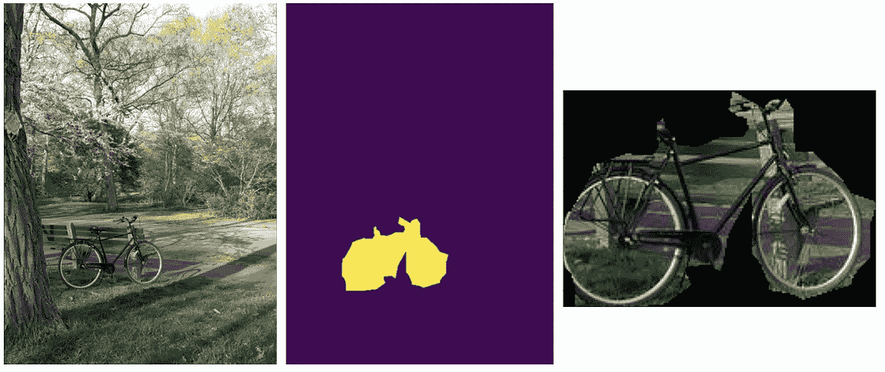
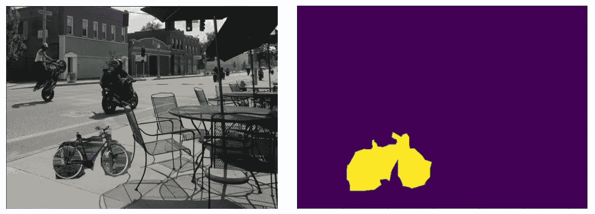
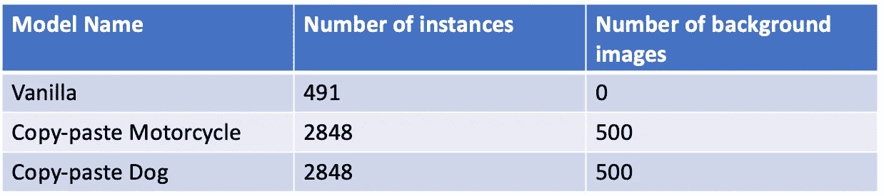
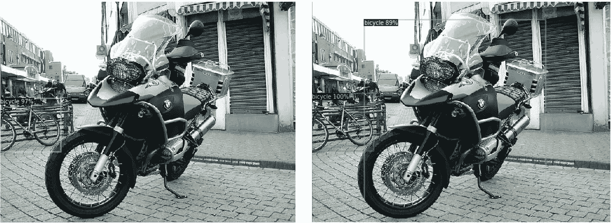
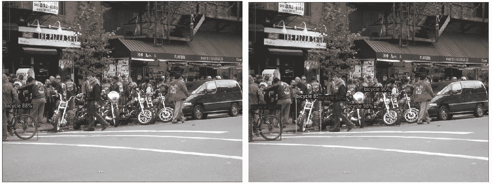
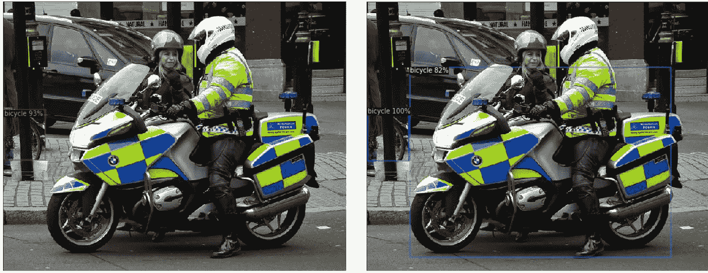
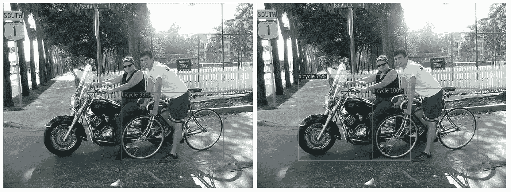
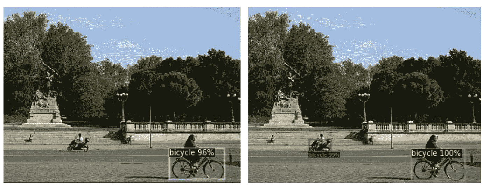
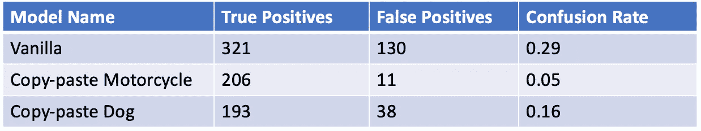

# 使用复制粘贴的数据扩充

> 原文：<https://towardsdatascience.com/data-augmentation-reducing-model-confusion-with-copy-paste-8f41884ca9d1?source=collection_archive---------22----------------------->

## [思想与理论](https://towardsdatascience.com/tagged/thoughts-and-theory)，[行业笔记](https://towardsdatascience.com/tagged/notes-from-industry)

## 减少相似类之间的模型混淆

图片经 shutterstock.com 许可使用，Adnan Ahmad Ali/shutterstock.com

Doma 数据科学的首要主题之一是可推广性。这对于在我们的产品中成功实施我们的机器学习模型非常重要，因为我们的数据来源广泛，并且支持新客户的快速加入(例如冷启动问题)。随着我们向改进模型性能迈进，误报可能是一个主要障碍。简而言之，当计算确定一个实例包含导致模型将其与该实例不包含的东西混淆的特征时，在机器学习模型预测中会出现误报。一个简单的例子是一只被误认为是狗的猫。两者都是四条腿的毛茸茸的动物，所以数学算法没有识别出它们的区别是可以原谅的。然而，鉴于 Doma 的每个订单都需要处理多达 100 页左右的文档，我们必须确保我们的错误率很低。

在这篇博客文章中，我将重点关注如何使用数据增强来减少计算机视觉模型中产生假阳性的混乱。最近，我们独立发现，所谓的数据增强“复制-粘贴”技术对于提高在较小数据集上训练的计算机视觉模型的性能非常有效。复制-粘贴技术通过复制对应于要检测或识别的特定对象的图像片段并将其粘贴到其他图像上来生成额外的训练数据，从而扩充数据集(更多细节见下文)。几乎在我们发现的同时，一篇关于复制粘贴技术的文章最近发表在谷歌大脑的 [arxiv](https://arxiv.org/pdf/2012.07177.pdf) 研究人员上。关于 arxiv 的论文主要侧重于经验意义上的总体模型性能。在这里，我将重点介绍使用这种技术来减少由于容易混淆的类而导致的误报率。

# 构建数据集

作为这种技术的演示，我们从上下文中的公共对象(COCO) [2]开源数据集:[https://cocodataset.org](https://cocodataset.org)构建了一个小型数据集。这是一个非常大的行业标准数据集，用于对几个计算机视觉任务进行基准测试。对于当前的用例，重点将放在容易混淆的类的对象检测上。作为一个具体的例子，我将集中讨论自行车和摩托车。从视觉角度来看，这些物体显然是相似的:有两个轮子的车辆，它们经常出现在相似的环境中，并且经常有一两个人坐在上面。

我们创建了一个由 200 幅自行车图像组成的单一训练数据集，包括边界框注释。然而，我们将利用也包括在 COCO 数据集中的遮罩注释(指示图像中哪些像素包含感兴趣的对象的多边形)来执行复制-粘贴技术。为了理解复制-粘贴数据增强如何能够减少模型混乱，我们将创建两个附加的训练集，它们使用复制-粘贴技术用图像来增强，但是使用两种不同类型的背景图像。这将允许我们探索复制粘贴技术中的选择如何影响整体性能。

## 使用复制粘贴方法

我们可以建立一个自行车的扩充数据集，但要利用 COCO 提供的掩码。首先，我们选择了 200 张带注释的自行车图像，使用 COCO 的工具对这些图像进行了过滤，以确保这些图像中不存在摩托车。接下来，使用 COCO 注释为每幅图像提供的掩码，我们可以定位属于每辆自行车的所有像素。利用这一点，我们可以为每个图像生成每辆自行车的剪切图像。在选择的 200 个图像数据集中，共有 491 个自行车实例。接下来，我们选择了 500 张包含摩托车但被过滤掉自行车的图片。

图一。左图:可可自行车图片示例。中间:一辆自行车的面具。右图:使用蒙版提取(剪切)的自行车图像。需要注意的一点是，COCO set 中的遮罩并没有最高级别的精确度。通常它们包括许多背景像素(注意自行车轮胎右侧的额外像素)。改编自[原图](https://www.flickr.com/photos/comradecosmobot/7127088719/)，版权 2012 [ComradeCosmobot](https://www.flickr.com/photos/comradecosmobot/) 并在[attribute 2.0 Generic(CC BY 2.0)许可](https://creativecommons.org/licenses/by/2.0/)下提供

图二。左图:COCO 的摩托车图像，图像上随机粘贴了之前提取的自行车。右图:由我们的粘贴代码生成的掩码显示了粘贴自行车的位置。改编自[原始照片](https://www.flickr.com/photos/pasa/9433256316/)，版权 2013 [Paul Sableman](https://www.flickr.com/photos/pasa/) 并根据[attribute 2.0 Generic(CC BY 2.0)许可证](https://creativecommons.org/licenses/by/2.0/)提供，以及改编自[原始照片](https://www.flickr.com/photos/comradecosmobot/7127088719/)，版权 2012 [ComradeCosmobot](https://www.flickr.com/photos/comradecosmobot/) 并根据[attribute 2.0 Generic(CC BY 2.0)许可证](https://creativecommons.org/licenses/by/2.0/)提供

我们的数据扩充过程从 COCO 中选择的 200 个图像数据集中提取了 491 个自行车实例，并将每个实例分别粘贴到最多五个不同的图像上，这些图像包含摩托车而不包含自行车。对于那些有兴趣了解如何用 python 处理图像的人，请看:[https://automatetheboringstuff.com/chapter17/](https://automatetheboringstuff.com/chapter17/)。图 2 显示了流程结果的几个例子。因为有些摩托车图像比复制的自行车图像小，所以这个过程偶尔会失败。一种解决方法是减小自行车的尺寸。然而，相反，我们选择简单地忽略这些相对罕见的情况。

每次迭代都会产生一个额外的图像和一个额外的自行车实例。在处理了 500 幅摩托车图像之后，复制粘贴的扩充数据集具有 2557 幅图像和 2848 个自行车实例。

# 实验细节

## 区域卷积神经网络

[区域卷积神经网络](https://arxiv.org/pdf/1311.2524.pdf)最初于 2014 年推出[3]。从那时起，已经有了许多迭代，并且许多当前技术水平的对象检测和实例分割模型都是基于该架构的。这使得 RCNNs 成为展示如何使用复制粘贴数据扩充方法来减少对象检测的假阳性的良好选择。在这里的工作中使用更快的 RCNN 方法。

对于 RCNN 的高级介绍，我建议从系列博客文章[的第一篇开始，该系列博客文章](/understanding-object-detection-and-r-cnn-e39c16f37600)给出了从最初的 RCNN 到更快的 RCNN 的发展之旅。为了开发，我们构建了[探测器 2 框架。](https://github.com/facebookresearch/detectron2)

## 培养

我们训练了三种不同的更快的 RCNNs。一个是在没有复制粘贴数据增强的情况下，对 200 张自行车图像进行训练。在训练中，我们只做了一个简单的随机水平翻转的增强技术。将有效的训练数据集大小增加到 400 个图像，这也将自行车实例的数量加倍，从 491 个增加到 982 个。从现在开始，我们将把它称为普通模型。

第二个更快的 RCNN 模型是在同样的 400 幅图像上训练的，但我们也包括了通过将自行车复制粘贴到摩托车图像上而产生的增强图像。还允许随机翻转，这导致自行车实例的总数为 5696。然而，人们必须记住，在香草模型的意义上，这些并不是唯一的。该模型将被称为复制粘贴摩托车模型。

最后，以与复制粘贴摩托车模型完全相同的方式训练第三个更快的 RCNN 模型，只有一点不同。不是用摩托车贴自行车的背景图片，而是没有自行车的狗的背景图片。

为了公平的比较，所有的模型都被训练了 5000 次迭代，批量大小为 2。在下一节中，我们将展示这些模型的结果。有关这三种模式的总结，请参见下表 1:

表 1:为比较而训练的模型。作者图片

## 估价

为了测试每个模型在多大程度上混淆了摩托车类别和自行车类别，对包含自行车和摩托车的 200 幅图像进行了评估。这个数据集中自行车实例的总数是 965。正如所料，普通模型将大量的摩托车混淆为自行车，而复制粘贴模型很少预测到摩托车是自行车

为了直观检查的目的，我们显示了五对结果，其中香草模型将非常明显的摩托车混淆为自行车。

示例 1 —左侧:复制粘贴模型的结果检测到一辆自行车。右图:vanilla 模型的结果检测到两辆自行车，其中一辆是摩托车。改编自[原始照片](https://www.flickr.com/photos/kenjonbro/3336231222/)，版权 2009 [肯](https://www.flickr.com/photos/kenjonbro/)并以[署名-非商业性 2.0 通用(CC BY-NC 2.0)](https://creativecommons.org/licenses/by-nc/2.0/) 提供

示例 2 —左侧:复制粘贴模型的结果检测到一辆自行车。右图:vanilla 模型的结果检测到 5 辆自行车，其中 4 辆是摩托车。改编自[原始照片](https://www.flickr.com/photos/20158323@N04/3045398800/)，版权 2008[P](https://www.flickr.com/photos/pasa/)SliceofNYC 并在[attribute 2.0 Generic(CC BY 2.0)许可下提供](https://creativecommons.org/licenses/by/2.0/)

示例 3 —左侧:复制粘贴模型的结果检测到一辆自行车。右图:vanilla 模型的结果检测到两辆自行车，其中一辆是摩托车。改编自[原图](https://www.flickr.com/photos/kenjonbro/6842482507/)，版权 2012 [肯](https://www.flickr.com/photos/kenjonbro/)并以[署名-非商业性-共享相似 2.0 通用(CC BY-NC-SA 2.0)](https://creativecommons.org/licenses/by-nc-sa/2.0/) 发布

示例 4 —左侧:复制粘贴模型的结果检测到一辆自行车。右图:vanilla 模型的结果检测到两辆自行车，其中一辆是摩托车。改编自[原始照片](https://www.flickr.com/photos/mi8/14313061/)，版权 2005 [britt](https://www.flickr.com/photos/mi8/) ，以[署名-非商业性使用-类似共享 2.0 通用(CC BY-NC-SA 2.0)](https://creativecommons.org/licenses/by-nc-sa/2.0/) 发布

示例 5 —左侧:复制粘贴模型的结果检测到一辆自行车。右图:vanilla 模型的结果检测到两辆自行车，其中一辆是摩托车。改编自[原始照片](https://www.flickr.com/photos/sterte/1545832778/)，版权 2007 [Stefano Arteconi](https://www.flickr.com/photos/sterte/) 并以[署名-非商业性-共享 2.0 通用(CC BY-NC-SA 2.0)](https://creativecommons.org/licenses/by-nc-sa/2.0/) 发布

总的来说，vanilla 模型正确检测到的自行车数量(真阳性)为 321 辆，而误识别为自行车的摩托车数量(假阳性)为 130 辆。对于复制粘贴的摩托车模型，206 辆自行车被正确识别，11 辆摩托车被错误识别为自行车。请注意，我们没有考虑两个模型中实际上不是摩托车的类的任何误报。本质上，我们是在看摩托车被贴上自行车标签的混淆率。在这些术语中，复制粘贴模型的混淆率仅为 0.05，而普通模型的混淆率高达 0.29。当然，混乱越小越好。复制粘贴狗模型的假阳性率也降低了——它只把 38 辆摩托车误认为是自行车。然而，真阳性的数量是三个模型中最少的，只有 193 个。这些结果总结在下表 2 中:

表 2:模型评估。形象。作者图片

# 最后的想法

我们对复制-粘贴技术的演示表明，这种增强确实减少了自行车和摩托车之间的混淆，并表明这是一种很有前途的技术，可以应用于其他类容易混淆的情况。执行此技术的成本是额外的工作，即构建一个额外的类别(此处为摩托车)图像数据集，该模型预计会将其与要检测的类别(此处为自行车)相混淆。然而，这个额外的数据集不需要任何注释，因此构建起来相对便宜。

我们还可以看到，通过复制粘贴增强技术来减少混淆，在很大程度上依赖于粘贴实例的图像的选择。在将自行车粘贴到只有摩托车或只有狗的图像上的情况下，我们发现前者的模型有更多的真阳性和更少的假阳性——这两者都是可取的。当粘贴到狗身上时，与普通模型相比，假阳性的数量明显减少，只是没有复制粘贴摩托车模型多。事实上，复制粘贴狗模型的混淆率是复制粘贴摩托车模型的 3 倍以上。

最后，如上所述，COCO 数据集的注释掩码并不像人们希望的那样干净。如果使用具有更精确掩模的数据集，则预期复制-粘贴技术将给出甚至更好的结果，因为模型将可能较少了解注释方法中固有的特性，而更多了解待检测的实际对象的特征。然而，尽管如此，我们的实验表明，复制粘贴技术可以大大降低假阳性率。

参考资料:

[1] G. Ghiasi，Y. Cui，A. Srinivas，R. Qian，T. Lin，E.D. Cubuk，Q. V. Le 和 B. Zoph，[简单的复制粘贴是一种用于实例分割的强大的数据扩充方法](https://arxiv.org/pdf/2012.07177.pdf) (2020)，arxiv.org:2012.07177v2 [cs .简历]

[2] T.-Y .林、m .梅尔、s .贝隆吉、l .布尔德夫、r .吉尔希克、j .海斯、p .佩罗娜、D .拉马南、C. L .兹尼克和 p .多拉尔。[微软 COCO:上下文中的通用对象](https://arxiv.org/abs/1405.0312) (2014)，arxiv:1405.0312【cs。简历]

[3] R. Girshick，J. Donahue，T. Darrell，和 M. Jitendra，[精确对象检测和语义分割的丰富特征层次](https://arxiv.org/pdf/1311.2524.pdf) (2014)，arxiv:1311.2524 [cs .简历]

[4] S. Ren，K. He，R. Girshick，和 J. Sun *，* [更快的 R-CNN:使用区域提议网络实现实时对象检测](https://papers.nips.cc/paper/2015/file/14bfa6bb14875e45bba028a21ed38046-Paper.pdf)[神经信息处理系统进展 28 (NIPS 2015)](https://papers.nips.cc/paper/2015) (2015)

[5] Y .吴和 a .基里洛夫，f .马萨，w .罗和 R，吉希克，[detectron 2](https://github.com/facebookresearch/detectron2)(2019)