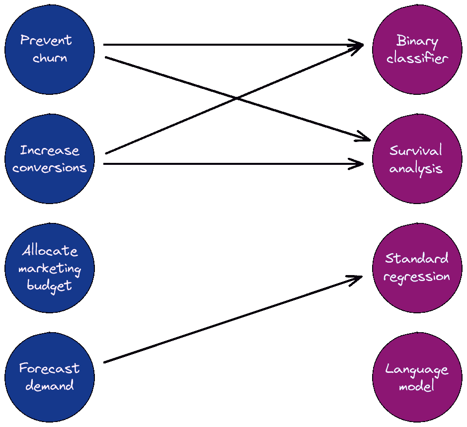
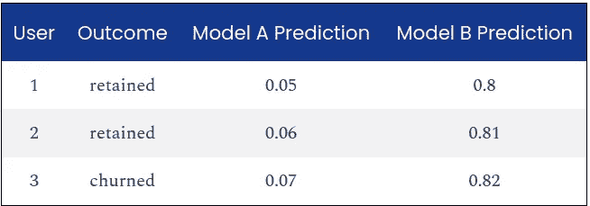

# 数据先于模型，但首先是问题公式化

> 原文：<https://towardsdatascience.com/data-before-models-but-problem-formulation-first-b4c2a9a3e978?source=collection_archive---------29----------------------->

## [行业笔记](https://towardsdatascience.com/tagged/notes-from-industry)

## 将业务目标框定为建模任务是数据科学家的真正衡量标准

将问题公式化想象成一个二分图，目标是在右栏中为左栏中的业务任务找到最佳方法。有些任务可以用多种方法解决，有些方法可能不适合任何任务。图片作者。

几位杰出的人工智能思想领袖今年早些时候在推特上发表了主题为*数据*在应用机器学习中比模型架构和优化更重要的文章。弗朗索瓦·乔莱写道:

> *ML 研究人员使用固定的基准数据集，并花费所有的时间搜索他们控制的旋钮:架构优化。在 applied ML 中，您可能会将大部分时间花在数据收集和注释上——这是您的投资会得到回报的地方。*
> 
> *-弗朗索瓦·乔莱(@ fchollet)*[*2021 年 1 月 24 日*](https://twitter.com/fchollet/status/1353421758699687942?ref_src=twsrc%5Etfw)

吴恩达插话说，他同意乔莱的观点，还需要做更多的工作来传播创建和组织数据的最佳实践。

*我甚至在[专业化机器学习模型](https://www.crosstab.io/articles/professionalizing-machine-learning)和[建立生存分析](https://www.crosstab.io/articles/events-to-durations)中写过几次关于数据相对于模型的重要性。*

获得正确的数据当然至关重要。但 Chollet 和 Ng 似乎是从“ML 优先”的角度来说的，这是一个公理，即预测模型——而不是其他——是应用 ML 项目如何工作的。在这种心态下，数据可能很重要，但它只是达到预测模型目的的一种手段。

我认为问题公式化甚至比数据或模型更重要。Christoph Molnar 更直截了当地指出:

> 你表达问题的方式
> 
> *比*更重要
> 
> *你抛给你的问题的 ML 算法的选择*
> 
> *-Christoph Molnar(@ Christoph Molnar)*[*2021 年 1 月 24 日*](https://twitter.com/ChristophMolnar/status/1353337173718822918?ref_src=twsrc%5Etfw)

# 什么是问题公式化？

问题公式化是为业务问题设计数据科学解决方案的过程。在这篇文章中，我假设业务问题已经定义并给出；一个不同但相关的问题是从现有的分析或建模工作中创造商业价值。

莫尔纳尔在[的第二条推特](https://twitter.com/ChristophMolnar/status/1353338337579442183)中列出了问题形成的一些要素:

*   “预测目标的选择”
*   "要使用的数据"
*   “如何处理预测”

我唯一的意见是把最后一项提前；问题公式化的第一部分是计划你的系统将如何被使用，以及它将如何解决业务问题。

以**防流失**问题为例。从 ML-first 的角度来看，它看起来很简单；在给定的一个月里，每个用户要么呕吐，要么不呕吐。Bam，让我们训练一个二进制提升树分类器来预测下个月的流失。完成了。

但是然后呢？

# 将如何解释输出？

我们面临的第一个问题是[校准](https://scikit-learn.org/stable/modules/calibration.html)。许多二进制分类器的训练和调整方式只取决于输出预测分数的*等级*，而不是它们的实际值。假设我们的验证集中有 3 个用户，预测来自两个模型 A 和 B:

对于许多二元分类器，来自模型 A 和 B 的预测将同样好，因为对于每一个，我们可以选择一个阈值来完美地区分保留用户和流失用户。

在像防流失这样的应用中，这些值确实很重要！客户成功团队将直接读取分数，并且更担心有 80%机会产生客户的用户，而不是有 7%机会产生客户的用户，即使*我们*知道这些分数不应该相互比较。**为了使流失预测模型有用，我们应该校准分数，使它们具有现实意义。**

一般来说，我们需要了解我们的受众将如何解释我们的输出，无论是模型预测、BI 仪表板、实验结果还是任何其他工件。

# 这个方法真的能解决问题吗？

好了，我们解决了校准问题，现在我们有了一个完美的客户流失预测模型。客户成功团队应该如何处理它？

*   他们应该接触那些有 10%或 50%或 90%流失率的用户吗？
*   如果每个用户对客户成功团队的干预有不同的反应会怎样？如果我们的干预对用户没有影响，那么用户的流失概率是 20%还是 80%有关系吗？
*   如果客户成功团队无论如何都要联系每一位客户*呢*？在这种情况下，我们的预测模型是无用的；相反，我们应该学会哪种干预最有效。

这些问题没有正确的答案，因为商业问题是**防止**流失，而不是预测它。一个预测模型本身并不能解决问题。

# 选择正确的目标变量

我们关于转化率建模的[权衡的文章](https://www.crosstab.io/articles/conversion-rate-model-tradeoffs)展示了选择预测目标的重要性的一个例子。最终的任务是了解用户如何从一个序列的一个阶段(例如销售漏斗)转换到下一个阶段。我们可以通过两种方式将此表述为数据科学任务:

1.  通过选择一个固定长度的时间窗口来观察转换，将转换视为一个*二元*目标。如果主体在窗口内转换，则成功，否则失败。
2.  模型*用户转化需要多长时间*。这是一个右删截的数字目标。

目标变量的选择决定了我们需要收集的数据以及什么类型的模型是合适的。

# 问题公式化是一项基本的数据科学技能

出色的问题表述是优秀数据科学家最明显的标志之一，也是我在面试时寻找的关键因素之一。是什么让某人擅长于此？

*   **好奇心**，了解企业如何运作。
*   **诚实**，对自己，对观众。我们应该正视我们方法的局限性和对我们结果的正确解释，尤其是当我们知道我们的方法不能完全解决给定的问题时。
*   **知识广度**，通过大量实际应用问题的实践经验和阅读其他数据科学家的经验。为了评估替代配方，我们需要了解选项。
*   **远见**，设想每个潜在解决方案的路线图和架构，并在承诺一个选项之前确定利弊。

应用数据科学与数据科学课程和训练营的方法论重点之间往往存在鸿沟。问题公式化是这个鸿沟的核心，所以掌握问题公式化是确保你的工作为你的组织增值的最好方法之一。

# 笔记

1.  逻辑回归是一个显著的例外，它通过构造得到了很好的校准。
2.  两个模型输出的 AUC 也是相同的，因为每个模型中所有阈值的真阳性和假阳性率是相同的。

*原载于*<https://www.crosstab.io>**的交叉表风筝。**