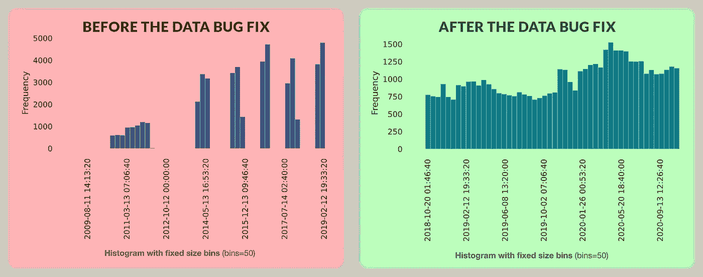
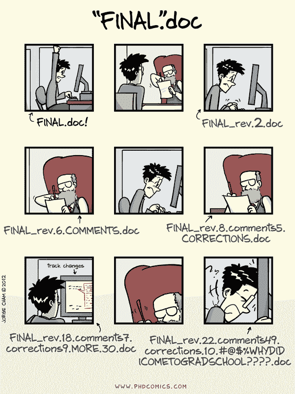
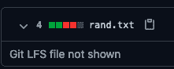

# 数据错误&如何修复它们

> 原文：<https://towardsdatascience.com/data-bugs-how-to-fix-them-610f73296aaa?source=collection_archive---------56----------------------->

卡梅隆·巴恩斯在 [Unsplash](https://unsplash.com?utm_source=medium&utm_medium=referral) 上的照片

数据科学家从痛苦的经历中知道，代码中的错误通常不是大难题。根据错误的经典定义，数据本身包含错误——意外的行为，通常是由错误的假设导致的。

在这篇文章中，我想分享我个人的一个数据错误的故事，它非常能说明你在数据科学工作中会遇到的错误类型。

在 DAGsHub，我们正在创建工具，使这些错误更容易修复。我将展示我如何在这个具体的案例中应用这些工具。修复数据错误是一个具有挑战性的过程，工具也没有我们想象的那么神奇。 ***我们马上就到！*** 😉

# 背景

我们为 DAGsHub 制作的第一个教程是一个“标准的”MNIST 教程。

这很好也很简单——也许太简单了！许多用户评论说，他们厌倦了 MNIST 的教程，它们根本不代表现实——数据已经是干净的、平衡的、有标签的、统一的。这只是简单的图像。看到 MNIST 的教程会立刻打消他们的兴趣，因为他们觉得你可以用 MNIST 把任何东西变得好看，不管它实际上是好是坏。

因此，我们决定基于真实世界的数据创建一个新的教程。我们决定使用 StackExchange API 来生成一个 CSV 文件，该文件包含来自许多问题的数据，特别是来自 CrossValidated 的数据，该数据处理有关统计的问题。这些问题包括文本和表格元数据。要预测的标签是“这是否被标记为机器学习问题？”，你可以很容易地把它想象成一个为写问题的用户提供的推荐系统，或者一个在后端 BI 或自动化中使用的工程化功能。标签也非常不平衡，只有 10%的正面标签。

简而言之，这个新教程比 MNIST 更忠实地代表了现实。

# 问题是

当我生成原始数据时，我没有考虑按日期排序——我只是**错误地认为**我将从网站的历史记录或最新问题中获取所有问题。哎呀。我想我们都曾经历过这种情况。

我最终得到的是 50，000 个样本，这是 API 愿意返回的上限。更糟糕的是，样本在时间上分布不均匀！如果这是一个完全随机的选择，那就更好了。但我甚至没有那么幸运。我不知道是什么样的奇怪采样导致了我实际得到的时间分布:

数据科学家的 pic 前后—比较数据时间分布。作者图片

底线——虽然我成功地在数据上建立了一个像样的模型，但我使用的数据却被破坏了。**我有一个完全与数据相关的错误，我的代码没有任何改变可以修复它。**我需要完全替换数据。在其他情况下，也许我会发现有一部分数据只需要手动丢弃。这类故事在现实生活中很常见。

# 在 Github 上这个场景可以做什么？

*   *案例 1:* 数据存储在一些外部存储器中，比如 S3，下载它的 URL 作为代码的一部分保存在 Github 上。在这种情况下，我可以转到存储桶并替换存储在那里的数据。然而，我会丢失旧数据，甚至更糟的是，我会丢失数据版本和现有代码之间的关系！后来，弄清楚我的代码、实验和结果模型的哪个版本来自于这些破碎的数据变得非常困难。我很可能会忘记，即使不会，当我休假或离开公司时会发生什么？谁想拿我的工作，谁就注定要失败。
*   *案例 2:* 如果我在 S3 上创建一个新版本的数据，将其命名为`data_v2.csv`，并在我的代码中更改 URL，会怎么样？欢迎来到版本地狱:

欢迎来到版本地狱。照片由 [PhDComics](https://phdcomics.com/) 拍摄

*   *案例 3:* 我们使用 Git-LFS。Git-LFS 是 Git 的一个扩展，它允许你有效地对大文件进行版本控制。它不完全是 Git 的一部分——不支持 diffs 和 merges 之类的东西，因为在大数据上计算它们太昂贵了。此外，您需要一台能够处理 LFS 的专用服务器。幸运的是，GitHub 做到了这一点。不幸的是，仍然存在问题——您为 LFS 获得的存储量是有限的，并且它几乎不是一个成熟的数据存储解决方案。我更愿意将这些大文件存储在一些合适的云存储中，并找到一种方便的方法将它们链接到我的 Git repo。更重要的是，当你试图比较这些大文件的版本时，GitHub 提供的信息非常有限。逐行比较是不实际的，但我觉得有比这更有用的东西要说:

Git-LFS 数据差异(修改的行数也不正确—文件要大得多)。作者截图，来自 [GitHub](https://github.com)

即使上述所有技术问题都解决了，还有一个人的方面被完全忽略了——改变数据的影响是什么？好的，文件已更改，但这如何影响我的指标？现在数据分布不同了吗？我有没有想看的之前和之后的可视化效果？在 vanilla Git 和 Github 中，我只能有意义地比较文本和一些图像。

# 你能在 DAGsHub 上做什么？

我们依靠 [DVC](https://dvc.org/) 将你的数据文件连接到你的 Git 提交——类似于 Git-LFS，但更灵活，允许你将数据存储在你自己的云存储上，并有许多其他很酷的数据科学特定功能。

DAGsHub 允许您查看笔记本和直观的笔记本差异，这有助于您理解底层数据，并创建数据版本的自定义可视化比较。您还可以查看一些数据格式的内容(更多内容即将推出)，作为 UI 的一个集成部分。我们的目录区分功能也使得比较大型数据集成为可能。最后，专门针对这样的问题，我们创建了[数据科学拉请求](https://dagshub.com/blog/data-science-pull-requests/)，它让您可以对数据执行与对代码相同的审查过程。

有了这些工具，我现在可以用新的、正确的版本替换我的数据文件，使用 DVC 和 Git 提交新版本，瞧！数据现在是固定的…

…嗯，差不多了。我仍然需要将数据推送到我的遥控器上，否则，这个项目对于没有我的笔记本电脑的人来说是毫无用处的。

# 建立云存储很难

好了，现在我们可以获得一个版本控制的数据拉取请求，用有意义的数据科学信息来指导决策。我们的数据存储在具有世界规模容量的成熟存储设备上。太棒了。

但是，让我们面对现实吧——建立云存储是一件痛苦的事情。信用卡？我是？存储桶保留策略？服务帐户？

Blech🤢！

这太难了。如果我们希望开源数据科学蓬勃发展，我们必须让它更容易获得。善意的人会希望帮助找到并修复 bug，但是我们不应该强迫他们去钻牛角尖。摩擦是创造力和生产力的杀手。

**它应该像 git push 一样简单，访问控制应该自动处理。**

我们正在 DAGsHub 努力工作，以使这成为现实(敬请期待更多)。

# 摘要

在现实生活中，数据是杂乱的，无论您需要迭代代码还是模型，您都需要迭代数据和注释。回到老派版本地狱不是一个解决方案。数据应被视为版本受控的源代码，对数据的修改应经历与其他所有事情相同的审查过程。不仅如此——为了实现真正的开源，我希望任何人都能对我的数据做出修正。