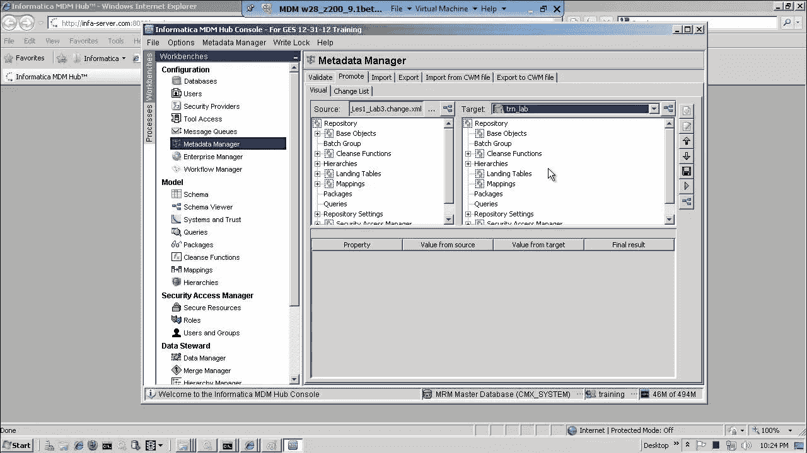
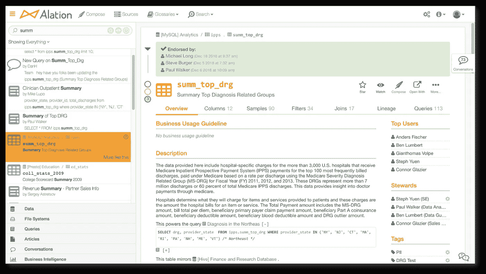
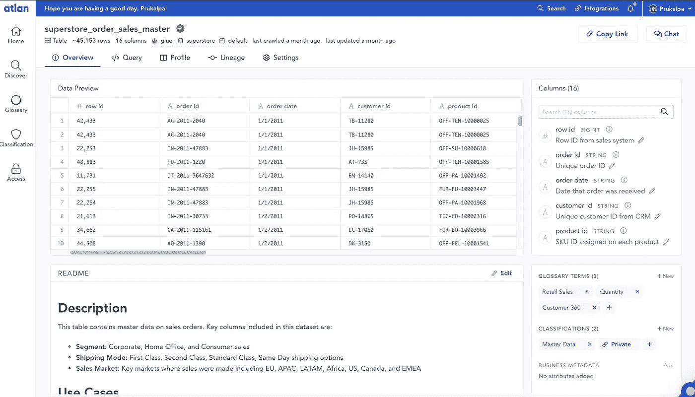

# 数据目录 3.0:现代数据栈的现代元数据

> 原文：<https://towardsdatascience.com/data-catalog-3-0-modern-metadata-for-the-modern-data-stack-ec621f593dcf?source=collection_archive---------3----------------------->

## 是时候采用现代元数据解决方案了，这种解决方案与现代数据堆栈的其他部分一样快速、灵活且可扩展

照片由[哈尼恩·克里姆利](https://unsplash.com/@haneenkrimly)拍摄

2020 年给我们的日常词汇带来了很多新词——想想*冠状病毒*、*德方德*和*说大话*。但是在数据世界中，另一个短语正在流传… **现代数据堆栈**。

数据世界最近围绕着处理海量数据的最佳工具集，也就是“现代数据堆栈”而汇聚起来。这包括在同类最佳的工具上建立数据基础设施，如用于数据仓库的 [Snowflake](https://www.snowflake.com/) ，用于数据湖的 [Databricks](https://databricks.com/) ，以及用于数据接收的 [Fivetran](https://fivetran.com/) 。

好的方面？现代数据堆栈速度超快，易于在几秒钟内扩展，并且几乎不需要开销。坏事吗？在将治理、信任和上下文引入数据方面，它仍然是一个新手。

这就是元数据的用武之地。

那么现代元数据在今天的现代数据堆栈中应该是什么样子呢？基本数据目录如何发展成为数据民主化和治理的强大工具？为什么元数据管理需要范式转变才能跟上当今的需求？

在过去的一年里，我与 350 多位数据领导者交谈过，了解他们在现有元数据管理解决方案方面面临的基本挑战，并构建了现代元数据管理的愿景。我喜欢把这种方法叫做**[**数据目录 3.0**](http://www.atlan.com) **。****

# **为什么现代数据堆栈比以往任何时候都更需要“现代”元数据管理？**

**几年前，数据主要由组织中的 IT 团队使用。然而，今天的数据团队比以往任何时候都更加多样化-数据工程师、分析师、分析工程师、数据科学家、产品经理、业务分析师、公民数据科学家等等。这些人中的每一个人都有自己喜欢的、同样多样化的数据工具，从 SQL、Looker 和 Jupyter 到 Python、Tableau、dbt 和 r。**

> **这种多样性既是一种力量，也是一种奋斗。所有这些人都有不同的处理问题的方式、工具、技能、技术堆栈、工作方式……本质上，他们每个人都有独特的“数据 DNA”。**

**结果往往是协作中的混乱。令人沮丧的问题，如“这个列名实际上是什么意思？”以及“为什么仪表盘上的销售数字又错了？”当快速团队需要使用数据时，让他们慢半拍。**

**这些问题并不新鲜。毕竟，Gartner 发布元数据管理解决方案魔力象限已经超过 5 年了。**

**但是还是没有好的解决办法。大多数数据目录只不过是 Hadoop 时代的创可贴解决方案，而不是与当今现代数据堆栈背后的创新和进步保持同步。**

# **元数据管理的过去和未来**

**就像数据一样，在过去的三十年里，我们对元数据的思考和处理方式也在稳步发展。它可以大致分为三个发展阶段:数据目录 1.0、数据目录 2.0 和数据目录 3.0。**

## **数据目录 1.0:IT 团队的元数据管理**

***时间:20 世纪 90 年代和 21 世纪初
产品:Informatica、Talend***

****

**Informatica 在 2012 年的元数据管理器。([来源](https://www.youtube.com/watch?v=GG5tXviMexg))**

**从技术上来说，元数据从古代就已经存在了——例如亚历山大图书馆的每一卷卷轴上都贴有描述性标签。然而，元数据的现代概念可以追溯到 20 世纪后期。**

**在 20 世纪 90 年代，谢天谢地，我们把软盘放在一边，接受了这个叫做互联网的新奇工具。很快，大数据和数据科学风靡一时，组织试图找出如何组织他们新收集的数据。**

**随着数据类型和格式以及数据本身的爆炸式增长，IT 团队负责创建一个“**数据清单**”。像 Informatica 这样的公司在元数据管理方面处于领先地位，但是对于 IT 人员来说，建立和保持新的数据目录是一项持续的斗争。**

> **“数据仓库团队经常花费大量时间谈论、担心元数据，并对元数据感到内疚。由于大多数开发人员天生厌恶文档的开发和有序归档，元数据经常被从项目计划中删除，尽管每个人都承认它很重要。**
> 
> **拉尔夫·金博尔，2002 年**

## **数据目录 2.0:由数据管家提供支持的数据清单**

***时间:2010 年
产品:Collibra，Alation***

****

**2019 年 Alation 的数据目录。([来源](https://www.cbu.ac.zm/tc/alation-announces-50m-series-c-investment-as-data-catalog-biz-takes-off/))**

**随着数据变得越来越主流，并在 IT 团队之外传播，数据管理的理念开始生根发芽。这指的是一组专门负责管理组织数据的人。他们将处理元数据，维护治理实践，手工记录数据，等等。**

**与此同时，元数据的概念也发生了变化。随着公司开始建立大规模的 Hadoop 实施，他们意识到简单的 IT 数据清单已经不够了。相反，新的数据目录需要将数据清单与新的业务环境结合起来。**

**就像这个时代超级复杂的 Hadoop 系统一样，Data Catalog 2.0s 很难设置和维护。**它们涉及僵化的数据治理委员会、正式的数据管理员、复杂的技术设置和漫长的实施周期。**总而言之，这一过程可能需要长达 18 个月的时间。**

**这个时代的工具基本上是建立在整体架构之上，并在内部部署。每个数据系统都有自己的安装，公司不能通过简单的云更新来推出软件变更。**

> ****技术债务增加，元数据管理开始逐渐落后于现代数据堆栈的其他部分。****

## **元数据范式转变的需要**

**虽然数据基础架构堆栈的其余部分在过去几年中不断发展，并且 Fivetran 和 Snowflake 等工具允许用户在不到 30 分钟的时间内建立一个数据仓库，但数据目录却跟不上。即使是试用 Data Catalog 2.0 时代的元数据工具，也需要大量的工程时间来进行设置，更不用说与销售代表进行至少 5 次通话来获得演示了。**

**由于缺乏可行的替代方案，现代数据堆栈的最早采用者和大多数大型科技公司都求助于构建自己的内部解决方案。一些著名的例子包括 Airbnb 的 [Dataportal](https://medium.com/airbnb-engineering/democratizing-data-at-airbnb-852d76c51770) ，脸书的 [Nemo](https://engineering.fb.com/2020/10/09/data-infrastructure/nemo/) ，LinkedIn 的 [DataHub](https://github.com/linkedin/datahub) ，Lyft 的 [Amundsen](https://eng.lyft.com/amundsen-lyfts-data-discovery-metadata-engine-62d27254fbb9) ，网飞的 [Metacat](https://netflixtechblog.com/metacat-making-big-data-discoverable-and-meaningful-at-netflix-56fb36a53520?gi=e8f325ce768d) ，以及优步的 [Databook](https://eng.uber.com/databook/) 。**

**然而，并不是所有的公司都有这样的工程资源，构建几十个类似的元数据工具并不是特别高效。**

> **是时候采用现代元数据解决方案了，这种解决方案与现代数据堆栈的其他部分一样快速、灵活和可伸缩。**

# **数据目录 3.0:面向不同数据用户的协作工作区**

**今天，我们正处于元数据管理的转折点—从缓慢的内部部署数据目录 2.0 向新时代数据目录 3.0 的转变。就像从 1.0 到 2.0 的跳跃一样，这将是我们如何看待元数据的一个根本性转变。**

**Data Catalog 3.0 的外观和感觉与 Data Catalog 2.0 一代中的前辈不同。相反，Data Catalog 3.0s 将建立在**嵌入式协作**的前提下，这是当今现代工作场所的关键，它借鉴了 Github、Figma、Slack、incidence、Superhuman 和其他当今常见的现代工具的原则。**

****

**想象数据目录 3.0 的用户体验。(图片提供:[亚特兰蒂斯](https://atlan.com/))**

# **数据目录 3.0 的 4 个特征**

## **1.数据资产>表格**

**Data Catalog 2.0 一代的构建前提是“表”是唯一需要管理的资产。但现在完全不同了。**

> ****如今，BI 仪表盘、代码片段、SQL 查询、模型、特性和 Jupyter 笔记本都是数据资产。****

**3.0 代元数据管理需要足够灵活，以便在一个地方智能地存储和链接所有这些不同类型的数据资产。**

## **2.端到端的数据可见性，而不是零敲碎打的解决方案**

**数据目录 2.0 时代的工具在改进数据发现方面取得了重大进展。然而，他们没有给组织一个“真实的单一来源”的数据。关于数据资产的信息通常分布在不同的地方——数据沿袭工具、数据质量工具、数据准备工具等等。**

> ****Data Catalog 3.0 将帮助团队最终实现圣杯，即关于组织中每个数据资产的真实信息的单一来源。****

## **3.为元数据本身就是“大数据”的世界而构建**

**我们正在快速接近一个元数据本身将成为大数据的世界。能够处理和理解元数据将帮助团队更好地理解和信任他们的数据。**

**这就是为什么新的 Data Catalog 3.0 应该不仅仅是元数据存储。**

> **它应该从根本上利用元数据作为一种数据形式，可以像所有其他类型的数据一样进行搜索、分析和维护。**

**今天，云的基本弹性使得这一点前所未有地成为可能。例如，查询日志只是当今可用的一种元数据。通过解析 Snowflake 中查询日志的 SQL 代码，可以自动创建列级血统，为每个数据资产分配流行度分数，甚至推断每个资产的潜在所有者和专家。**

## **4.嵌入式协作时代来临**

**Airbnb 在[分享他们关于推动采用内部数据门户的经验](https://www.slideshare.net/neo4j/graphconnect-europe-2017-democratizing-data-at-airbnb)时说了一些深刻的话:“设计数据工具的界面和用户体验不应该是事后的想法。”**

> **由于数据团队的基本多样性，数据工具需要设计成与团队的日常工作流程无缝集成。**

**这也是**嵌入式协作**真正活跃起来的地方。嵌入式协作是指工作发生在你所在的地方，摩擦最少。**

**如果您可以在获得链接时请求访问数据资产，就像使用 Google Docs 一样，而所有者可以在 Slack 上获得请求，并在那里批准或拒绝它，会怎么样？或者，如果当您检查数据资产并需要报告问题时，您可以立即触发与您的工程团队的 JIRA 工作流完美集成的支持请求，该怎么办？**

**嵌入式协作可以统一几十个浪费时间、造成挫折、导致数据团队工具疲劳的微工作流，而不是让这些任务变得令人愉快！**

# **下一步是什么？**

**任何处理数据的人都知道，数据目录早就应该赶上现代数据堆栈的其余部分了。毕竟，如果没有使数据变得可理解的资产——文档、查询、历史、词汇表等等，数据是毫无意义的。**

**随着元数据本身成为大数据，我们正处于元数据管理变革性飞跃的风口浪尖。虽然我们还不了解 Data Catalog 3.0 时代的一切，但很明显，在未来几年，现代元数据管理产品将会崛起，在现代数据堆栈中占据应有的位置。**

****想了解更多关于第三代数据目录的信息吗？** [**查看我们的电子书**](https://atlan.com/resources/data-catalog-primer/) **。****

****发现此内容有帮助？在我的时事通讯《元数据周刊》上，我每周都写关于活动元数据、数据操作、数据文化和我们的学习建设的文章。** [**在此订阅。**](https://metadataweekly.substack.com/)**