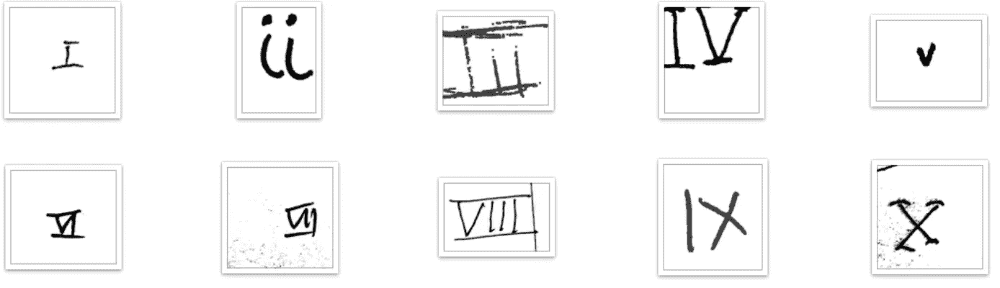
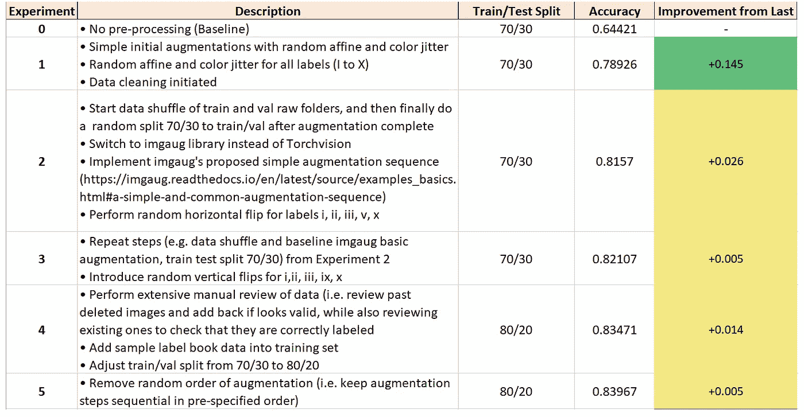
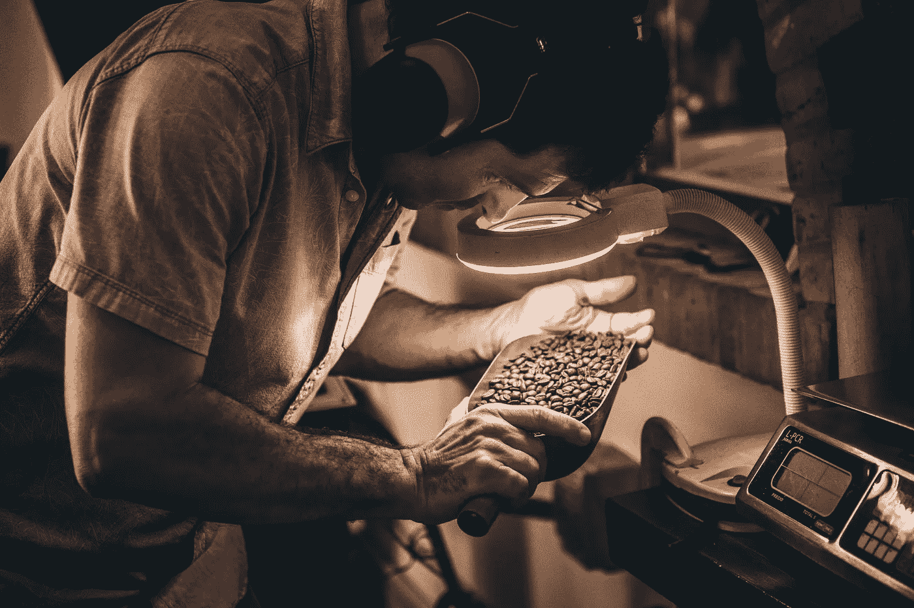
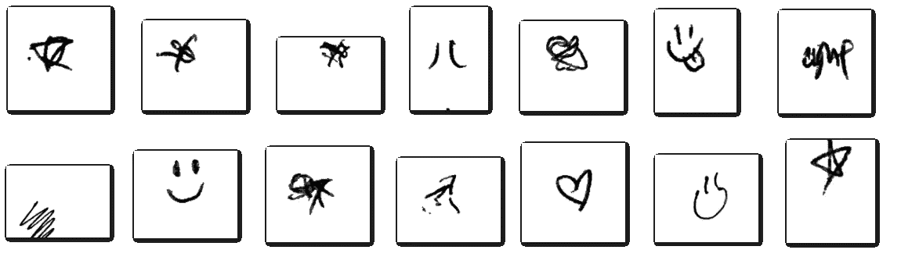
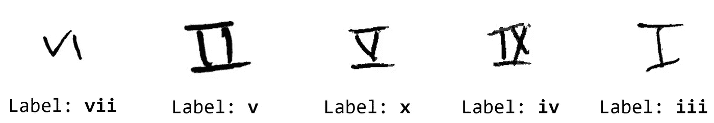
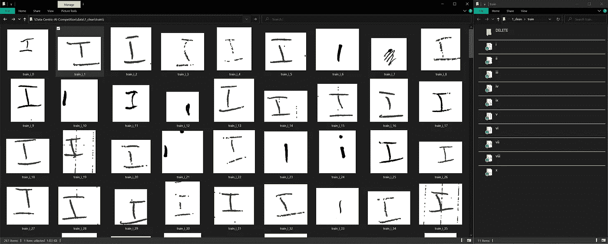
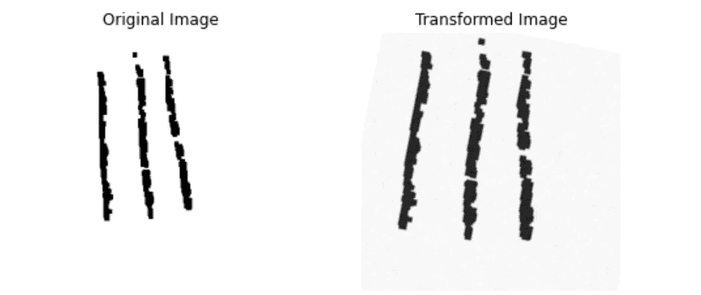
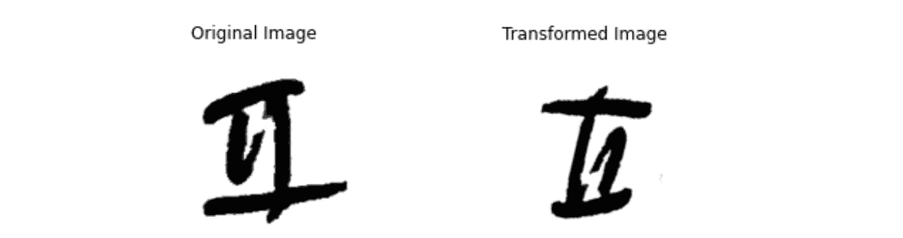
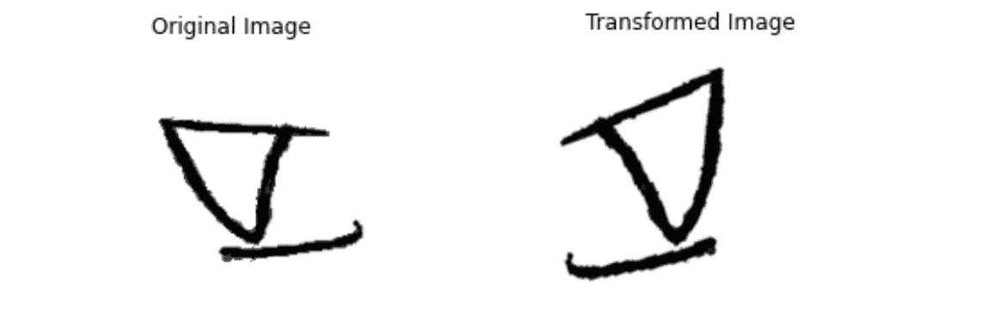
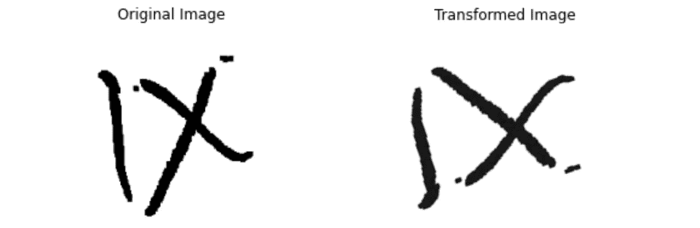

# 以数据为中心的人工智能竞赛——前 5%完成的提示和技巧

> 原文：<https://towardsdatascience.com/data-centric-ai-competition-tips-and-tricks-of-a-top-5-finish-9cacc254626e?source=collection_archive---------23----------------------->

## 由吴恩达和 DeepLearning 组织的竞赛中排名第一的提交材料的技术。人工智能

卡伦·艾姆斯利在 [Unsplash](https://unsplash.com?utm_source=medium&utm_medium=referral) 上的照片

数据是人工智能的食物，通过从以模型为中心转向以数据为中心的方法，模型性能的改善有巨大的潜力。这就是最近由[吴恩达](https://en.wikipedia.org/wiki/Andrew_Ng)和[深度学习组织的](https://www.deeplearning.ai/) [**以数据为中心的人工智能竞赛**](https://https-deeplearning-ai.github.io/data-centric-comp/) 背后的动机。AI 。

在这篇文章中，我分享了我的 **Top 5%** 提交的技巧(约 84%的准确率)、可行和不可行的方法，以及我和其他高级参与者从实验中获得的经验。

# 内容

> ***【1】****[*竞赛目标*](#fec6)*[*实验跟踪*](#374b)***(3)****[*技巧我的最佳投稿*](#bbfc)***

****

**照片由 [Pietro Mattia](https://unsplash.com/@pietromattia?utm_source=medium&utm_medium=referral) 在 [Unsplash](https://unsplash.com?utm_source=medium&utm_medium=referral) 上拍摄**

# **(1)竞赛目标**

**在传统竞赛中，数据集是固定的，而参与者竞争构建高性能的高级模型架构。**

**这场比赛打破传统，由**固定模型** ( [ResNet50](https://worksheets.codalab.org/bundles/0x57030e4a2d034af4b8efa38df4ff6af6) )代替数据集。因此，参与者需要通过使用标签校正和数据扩充等技术来改进数据。**

**该数据集包含 2880 幅手写罗马数字图像，范围从 1 到 10(即 *I* 到 *X)。*数据被分成训练集和验证集，每个集合包含对应于十个数字的子文件夹。**

****

**十种罗马数字图像样本|作者根据公开比赛数据整理**

**目标是**改进图像数据集**，使得模型(当针对隐藏测试集进行评估时)能够以最高可能的**准确度**识别罗马数字标签。**

# **(2)实验跟踪**

**而不是使用先进的 ML 跟踪工具(如 [MLFlow](https://mlflow.org/) 、 [W & B](https://wandb.ai/site/experiment-tracking) 等。)对于实验管理，我选择了老式的微软 Excel，因为它非常适合这些简单的任务。**

**目的是记录每一个变化的影响，并用它来指导随后的实验。下面是我使用的电子表格模板的快照:**

****

**用于实验跟踪的电子表格模板|作者图片**

# **(3) *我的最佳投稿技巧***

**你可以在这个 [**GitHub repo**](https://github.com/kennethleungty/Data-Centric-AI-Competition) 内的'[*Full _ Notebook _ Best _ submission . ipynb*](http://localhost:8888/notebooks/Data%20Vault/GitHub/Data-Centric-AI-Competition-2021/Full_Notebook_Best_Submission.ipynb)' Jupyter 笔记本中找到我的最佳提交的代码，所以可以查看一下，进行全面的逐步演练。**

**我不会用每一步的细节来淹没你，我会把重点放在四个最有影响力的技巧上。**

## **(I)结合训练和验证数据**

**在数据探索过程中，我发现验证集中的图像比训练集中的图像更清晰，更能代表数字。**

**因此，我**将来自训练和验证** **的图像组合起来，将**放入一个单独的文件夹中，以实现**更均衡的分布**。**

****还有一个单独的`label_book`文件夹，包含每个标签的五个“最佳”示例。我还将这些理想样本放入数据集，以丰富数据集。****

*****注意:虽然对训练集和验证集的视觉检查在技术上并不严格，但*[*GoDataDriven*](https://godatadriven.com/blog/three-tips-for-data-centric-ai-and-one-data-science-lesson/)*团队创建了一个嵌入的可视化来证明它们之间风格分布的差异。你可以在这里找到 UMAP 的*<https://sp-ao.shortpixel.ai/client/to_webp,q_glossy,ret_img/https://godatadriven.com/wp-content/uploads/2021/08/altair.png>**。******

**********

*****照片由[蒂姆·莫斯霍尔德](https://unsplash.com/@timmossholder?utm_source=unsplash&utm_medium=referral&utm_content=creditCopyText)在 [Unsplash](https://unsplash.com/s/photos/inspection?utm_source=unsplash&utm_medium=referral&utm_content=creditCopyText) 上拍摄*****

## *****㈡注重数据清理*****

*****考虑到这是一场以数据为中心的竞争，可以预计会有大量的工作进入数据清理。在这个过程中有两种主要的问题需要处理:*****

*   ********无关图像********

**********

*****与十个罗马数字无关的图片示例|由作者根据公开比赛数据编辑*****

*****这些嘈杂的不相关的例子被移到一个单独的文件夹中**从模型训练中排除**。虽然这缩小了数据集的大小，但记住**数据质量胜过数据数量**是至关重要的。*****

*   ********误贴图片********

**********

*****贴错标签的图片示例|由作者根据公开竞赛数据编辑*****

*****根据我的判断，我把贴错标签的图片放到了合适的文件夹里。我自己进行数据清理的好处是**在重新标记过程**中引入了一致性，这是关键，因为许多例子都是高度不明确的。*****

*****我通过使用**拖放方法和两个并排打开的窗口**，尽可能简单地执行数据清理。*****

*****(较宽的)左边窗口突出显示图像，而右边窗口列出了我可以将图像移入的不同文件夹。*****

**********

*****我删除或重新标记图像的拖放方法。我的宽屏显示器当然让我更容易执行。|作者图片*****

## *****㈢有针对性的翻转*****

*****我利用 [***imgaug***](https://imgaug.readthedocs.io/en/latest/) 进行数据增强，因为我发现它有更广泛的增强器选项。应用了一系列涉及以下变换的普通增强:*****

*   *****[调整尺寸](https://imgaug.readthedocs.io/en/latest/source/api_augmenters_size.html#imgaug.augmenters.size.Resize)和[裁剪](https://imgaug.readthedocs.io/en/latest/source/api_augmenters_size.html#imgaug.augmenters.size.Crop)*****
*   *****[高斯模糊](https://imgaug.readthedocs.io/en/latest/source/api_augmenters_blur.html#imgaug.augmenters.blur.GaussianBlur)和[加性高斯噪声](https://imgaug.readthedocs.io/en/latest/source/api_augmenters_arithmetic.html#imgaug.augmenters.arithmetic.AdditiveGaussianNoise)*****
*   *****[线性对比度](https://imgaug.readthedocs.io/en/latest/source/api_augmenters_contrast.html#imgaug.augmenters.contrast.LinearContrast)和[相乘](https://imgaug.readthedocs.io/en/latest/source/api_augmenters_arithmetic.html#imgaug.augmenters.arithmetic.Multiply)(用于随机对比度调整)*****
*   *****[仿射变换](https://imgaug.readthedocs.io/en/latest/source/api_augmenters_geometric.html#imgaug.augmenters.geometric.Affine)，如缩放、平移、旋转和剪切*****

**********

*****作者从增强|图像的一般序列转换的示例*****

*****上面的顺序相当标准，所以没有太多讨论。*(详情可参见* [***GitHub 回购***](https://github.com/kennethleungty/Data-Centric-AI-Competition) *)******

*****更有趣的是，我采用了一种**有针对性的随机翻转**方法。根据标签的不同，我应用了**水平**翻转(`fliplr`)、**垂直**翻转(`flipud`)、**两个**，或者**无**。*****

*****在所有这些翻转中，最重要的事情是确保生成的增强图像仍然类似于原始的罗马数字。*****

*   ********水平和垂直翻转:* i、ii、iii、x*******

*****这四个标签(I、ii、iii、x)适合两种类型的翻转，因为得到的图像看起来仍然像原始数字。*****

**********

*****标签为“**ii**”|作者图片的水平+垂直翻转示例*****

*   ********仅水平翻转:* v*******

*****对于标签 **v** ，只有水平翻转才有意义。*****

**********

*****标签为“**v**”|作者图片的水平翻转示例*****

*   ********仅垂直翻转:* ix*******

*****对于标签 **ix** ，只有垂直翻转才有意义。*****

**********

*****标签为“**IX**”|作者图片的垂直翻转示例*****

*   ********无烙:*** **四、六、七、八*******

*****对于剩余的标签，执行任何形式的翻转都会导致无法识别或不正确的数字。因此，没有为带有这些标签的图像编写翻转脚本。*****

## *****㈣最大限度地限制数据集的大小*****

*****每次提交最多可提交 10，000 张图片。回想一下，原始数据集只有 2，880 个，因此尽可能增加我们的数据大小是有意义的。*****

*****我为 10 个标签中的每一个设置了 1，000 个图像的目标大小，以实现平等的表示。这是通过用在原始图像上随机增加产生的新图像来补充每个标签的数据来完成的。*****

*****通过以上技术，我实现了 **83.97%** (前 5%，排名 24)的模型准确率。这一准确性显著高于基线(64.4%)，距离 85.82%的中标提交仅< 2%。*****

**********

*****我在排行榜上的最终位置|作者图片*****

# *****(4)什么没有起作用*****

*****以下是我尝试过的一些技术，这些技术似乎没有改善数据集:*****

*   *****增加图像的大小(例如 500 x 500)*****
*   *****在增加步骤的序列中引入随机顺序*****
*   *****应用形态学操作(例如，膨胀/腐蚀、Otsu 阈值处理)*****
*   *****进一步增加增强的强度，例如更剧烈的旋转、剪切、对比等。*****
*   *****将数据集加满到 10，000 时，确保每张图像至少增加一次。*****

# *****(5)最好的想法*****

*****其他参与者所使用的创造性技术给我留下了深刻的印象，也让我感到谦卑。以下是一些已发表的例子:*****

*   *****GoDataDriven 创建了一个 [Streamlit 应用程序来连续放大图像](https://godatadriven.com/blog/three-tips-for-data-centric-ai-and-one-data-science-lesson/)。*****
*   *****Johnson Kuan 开发了一种[数据增强技术](/how-i-won-andrew-ngs-very-first-data-centric-ai-competition-e02001268bda)，将最近邻增强图像(基于嵌入)添加到训练集中。*****
*   *****作为增强的一部分，Pierre-Louis Bescond 利用了正方形裁剪和背景噪声传递函数。*****
*   *****瓦利德·达布比用[的龙卷风(人在回路机器学习的实现)](https://medium.com/@walid.daboubi/andrew-ngs-data-centric-ai-competition-how-i-reached-around-82-of-accuracy-on-using-tornadoai-daaad2ccb147)进行数据标注。*****

*****还有一个[赛后论坛线程](https://community.deeplearning.ai/t/post-competition-idea-sharing/33565/55)充满了精彩的想法。*****

*****如果您遇到其他排名靠前的创新解决方案，请告诉我，我很乐意将它们添加到这个列表中。*****

**********

*****由[absolute vision](https://unsplash.com/@freegraphictoday?utm_source=medium&utm_medium=referral)在 [Unsplash](https://unsplash.com?utm_source=medium&utm_medium=referral) 上拍摄的照片*****

# *****(6)学习要点*****

*   *****简单不等于低质量。虽然与其他提交的方法相比，我的方法很简单，但它们仍然产生了出色的结果，并且优于许多其他创新技术。我希望这对任何热衷于尝试以数据为中心的技术的人都是一种鼓励。*****
*   *****在数据科学领域，一个问题有许多解决方案，所以不要害怕尝试你所有最疯狂的想法。*****
*   *****平衡收益和成本很重要。当我发现我剩下的想法并没有提高准确性时，我决定不投入额外的时间和精力进行实验，因为回报是递减的。*****
*   *****以数据为中心的方法无疑会越来越受欢迎，尤其是因为建模只是整个 ML 管道的一小部分。*****

# *****在你走之前*****

*****欢迎您**加入我的数据科学学习之旅！**点击此[媒体](https://kennethleungty.medium.com/)页面，查看我的 [GitHub](https://github.com/kennethleungty) ，了解更多精彩的数据科学内容。*****

*****你可以在这里 找到这篇文章 [**的 GitHub 回购。同时，享受采用以数据为中心的方法的乐趣！**](https://github.com/kennethleungty/Data-Centric-AI-Competition)*****

*****</top-python-libraries-for-image-augmentation-in-computer-vision-2566bed0533e>  </russian-car-plate-detection-with-opencv-and-tesseractocr-dce3d3f9ff5c> *****