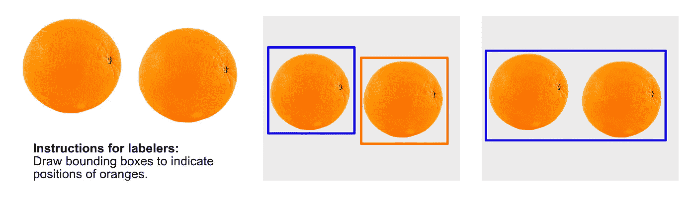

# 以数据为中心与以模型为中心的人工智能？答案很清楚

> 原文：<https://towardsdatascience.com/data-centric-vs-model-centric-ai-the-answer-is-clear-4b607c58af67?source=collection_archive---------11----------------------->

## 目前人工智能的方法有问题。但是有一个解决办法。

布兰登·洛佩兹在 [Unsplash](https://unsplash.com/s/photos/decision?utm_source=unsplash&utm_medium=referral&utm_content=creditCopyText) 上的照片

通常在笔记本和学习材料中，你会发现很多通过参数优化来提高机器学习模型准确性的方法。这只能让你到此为止。

在现代机器学习中，数据就是一切，但在人工智能项目中，数据经常被忽视，也没有得到妥善处理。结果，数百个小时被浪费在优化基于低质量数据的模型上。这就是为什么您的模型的准确性明显低于预期的主要原因——这与模型调整无关。

不要让这种事发生在你身上。

每一个 AI 解决方案都由两部分组成:代码(模型)和数据。库让你为相同的结果编写越来越少的代码，但是没有人能告诉你如何充分准备数据。这是以数据为中心的方法的一般要点。更多的细节在一点。

今天的文章回答了以下问题:

*   什么是以数据为中心的 AI？
*   数据数量与数据质量——你应该选择哪一个？
*   哪里可以找到好的数据集？

# 什么是以数据为中心的 AI？

吴恩达的话再次充满智慧。在他在 [YouTube](https://www.youtube.com/watch?v=06-AZXmwHjo) 上长达一小时的会议中，Andrew 做了一个特别的陈述，这确实击中了要害:**你的模型架构已经足够好了**。

这是有意义的——天才团队致力于模型架构(想想 ResNet、VGG、EfficientNet…) —所以可以肯定他们做了正确的功课。不要试图改进他们的工作，这是一个你不想对抗的风车。

话虽如此，你的机器学习方法可以是以模型为中心的，也可以是以数据为中心的:

*   **以模型为中心的方法**:询问如何改变模型以提高性能。
*   **以数据为中心的方法**:询问如何改变或改进数据以提高性能。

以模型为中心的方法对从业者来说更有趣。这很容易理解，因为实践者可以直接应用他们的知识来解决特定的任务。另一方面，没有人想整天标记数据，因为这被视为一项乏味的低技能工作。

别做那种人。数据和模型一样重要，甚至更重要。

在同一个 [YouTube](https://www.youtube.com/watch?v=06-AZXmwHjo) 会议上，Andrew 提出了另一个让你思考的观点:*在最近的出版物中，99%的论文是以模型为中心的，只有 1%是以数据为中心的*。

事实证明，大多数性能提升都是通过以数据为中心的方法实现的。例如，请看下面的图片，它取自上述会话:

图 1 —基线、以模型为中心和以数据为中心的方法性能比较(图片由作者提供)

我不太了解钢铁缺陷检测、太阳能电池板，也不了解表面检测，但当我看到一个时，我知道准确性的提高。以模型为中心的方法对基线提供了零或接近零的改进，但是可能花费了从业者数百小时的时间。

总结一下——不要试图比一屋子的博士更聪明。相反，在尝试改进模型之前，请确保您的数据质量是一流的。

# 数据数量与数据质量

**数据量**代表可用的数据量。通常的方法是收集尽可能多的数据，并留给神经网络来学习映射。

稍后我会分享我的顶级网站来寻找好的大型数据集，但让我们在 [Kaggle](https://www.kaggle.com/) 上探索平均数据集大小。如下图所示:

图 Kaggle 上数据集大小的分布

如您所见，大多数数据集并没有那么大。在以数据为中心的方法中，数据集大小并不太重要。当然，你不能在三张图片上训练一个神经网络，但重点是转移到质量上，而不是数量上。

**数据质量**就是质量。如果你没有成千上万的图片也没关系——它们的高质量和正确的标签是至关重要的。

看一下下面的例子，它显示了数据贴标签机如何为对象检测任务的图像贴标签:

图 3 —绘制物体检测边界框的不同方法( [i](https://www.youtube.com/watch?v=06-AZXmwHjo) 作者的图像)

想迷惑一个神经网络？这很简单——只要给东西贴上不一致的标签。如果你关心数据质量，严格的标注规则是必不可少的。尤其是当你有多个贴标机的时候。

然而，一个问题仍然存在— **多少数据是足够的？**

这比你想象的要难回答。大多数算法在文档中都有最小的推荐数据点数。例如， [YOLOv5](https://docs.ultralytics.com/tutorials/training-tips-best-results/) 推荐每类至少 1500 张图片。我已经设法用较少的样本得到了好的结果，但是准确性肯定会随着更多的训练样本而提高。

总而言之，拥有丰富的数据是额外的好处，而不是必须的。只要在较小的数据集中提供较高的数据质量，您就可以事半功倍。

# 哪里可以找到好的数据集？

现在，我们将探索两种资源，您可以通过它们免费下载高质量的数据集。第一个是数据科学社区的知名人士，而另一个是专门从事特定领域的新人。

## 卡格尔

是的，你几乎可以在 [Kaggle](https://www.kaggle.com/) 上找到任何东西。这是一个用于查找任何来源的数据集(表格、图像等)的既定资源。

图片 4 — Kaggle 数据集主页(图片由作者提供)

如果你是数据科学和机器学习的新手，Kaggle 是一个不错的起点。它也非常适合那些想在比赛中试试运气的人。如果你赢了，这些也可能是经济上的好处。

## Graviti 开放数据集

这是这个街区的新成员。 [Graviti](https://gas.graviti.com/open-datasets/?utm_medium=0812Dario) 提供了一系列高质量的数据集，主要用于计算机视觉。

图 5 — Graviti 开放数据集主页(图片由作者提供)

有超过 1100 个数据集可用，但并不是所有的数据集都最终确定。然而，他们的团队每天都在增加新的数据集，所以未来看起来很光明。例如，下面是他们的 [nuScenes](https://gas.graviti.com/dataset/motional/nuScenes/?utm_medium=0812Dario) 数据集通过可视化功能可视化后的样子:

图片 6 —重力核场景数据集(图片由作者提供)

如您所见，该网站易于使用，并为您提供了在线浏览数据集或本地下载数据集的选项。

# 包扎

现在你有了它——对以数据为中心的人工智能方法的基本介绍。归结起来就是更关心数据质量而不是数据数量。然而，高质量的数据集很难找到。这就是本文前面部分的由来。

如果你想建立一个高质量的机器学习模型，你需要一个高质量的数据集。对于日常使用， [Kaggle](https://www.kaggle.com/) 是一个很好的起点。如果你对计算机视觉和人工智能感兴趣，试试 [Graviti](https://gas.graviti.com/open-datasets/?utm_medium=0812Dario) 吧——它是完全免费的。

*喜欢这篇文章吗？成为* [*中等会员*](https://medium.com/@radecicdario/membership) *继续无限制学习。如果你使用下面的链接，我会收到你的一部分会员费，不需要你额外付费。*

<https://medium.com/@radecicdario/membership>  

# 保持联系

*   在[媒体](https://medium.com/@radecicdario)上关注我，了解更多类似的故事
*   注册我的[简讯](https://mailchi.mp/46a3d2989d9b/bdssubscribe)
*   在 [LinkedIn](https://www.linkedin.com/in/darioradecic/) 上连接