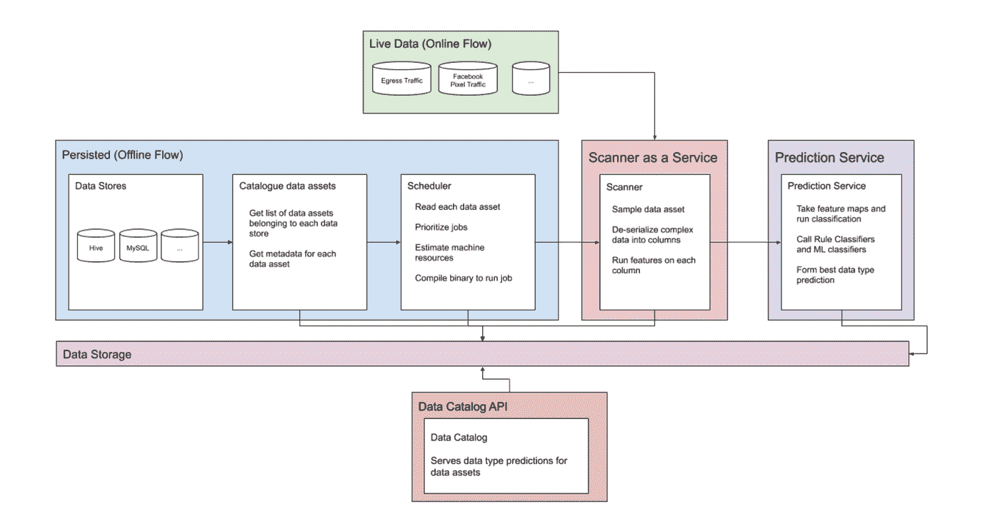

# 大规模数据分类

> 原文：<https://towardsdatascience.com/data-classification-at-mega-scale-ba47f81791db?source=collection_archive---------26----------------------->

## 为什么组织应该考虑使用新的自动化方法来解决由来已久的数据分类问题

图片来源: [Pixabay](https://pixabay.com/illustrations/computer-circuit-board-cpu-security-6560745/)

数据分类是一个老问题，也是关键组织流程的核心，如数据保护、数据安全和法规遵从性。随着现代组织积累的海量数据，数据分类不再能够通过手动数据管理或启发式规则来解决，而是 AI/ML 技术的一个令人信服的用例。

在本文中，我将讨论分类的基础知识、现代企业面临的挑战，以及如何使用人工智能模型实现分类，包括一个大规模人工智能分类系统的真实例子。

# 什么是数据分类？

数据分类的主要目的是将数据组织成类别。它包括分析数据，然后创建基于内容、文件类型或其他元数据的类别。您可以对结构化和非结构化数据使用数据分类。[数据分类通常是数据隐私条例规定的一项要求](https://satoricyber.com/data-classification/data-classification/)。

除了实现合规性，组织还利用数据分类来获得对其风险缓解的洞察，并定义[数据保护策略](https://cloudian.com/guides/data-protection/data-protection-policy-9-things-to-include-and-3-best-practices/)。例如，数据分类可以帮助组织了解他们将最有价值的数据存储在哪里，以及他们的用户最常创建哪些类型的敏感数据。

# 企业数据分类的挑战

数据只有在能够提供有意义的见解时才有用。然而，数据池有时更像一片沼泽，而不是一个清晰的信息池。当这种情况发生时，可能需要几个月的时间，组织才能理解和分类他们的数据。

最初对数据进行分类时，组织需要筛选成千上万的结构。巨大的数据量并不是唯一的挑战，数据质量也会减慢这一过程。

电话号码格式和错别字会显著降低数据质量，并混淆算法。此外，如果分类数据使用不当，也可能会减慢分类过程。

# 人工智能/人工智能分类技术

机器学习算法可以快速处理数据和执行动作。分类算法在大型数据集上训练，接受新的未知数据并生成预测，通常是每个分类标签的基于概率的置信度得分。

以下是用于分类数据的常用策略:

*   **贝叶斯定理** —使用文档的特征来预测它属于某个类别的概率。如果文档的许多组成部分与一个类别有共同的特征，这个原则说文档可能是类别的一部分。
*   **决策树**——通过提问推断文档属性的算法。该算法会提出问题，以缩小选项范围并了解数据点所属的类别。
*   **K-最近邻**——将一条新数据与数据库中包含的相似数据点进行比较的算法。它可以帮助预测文档的类别，并为相关文档提供推荐。
*   **神经网络** —使用数百万虚拟神经元来模拟认知过程的算法。神经网络体系结构已经出现，它能够以比人类更好的性能执行语言处理和分类任务。

# 示例实现:使用 PyTorch 进行大规模分类

在论文《面向安全和隐私的可扩展数据分类》( [Tanaka，Sapra 和 Laptev，2020](https://arxiv.org/pdf/2006.14109.pdf) )中，作者描述了一种可扩展的、基于人工智能的分类系统，该系统满足以下要求:

*   可以对持久(历史)和在线(实时)数据进行分类
*   可以处理任何类型或格式的数据，包括长文本记录和大型表格
*   准确的分类，能够在未来添加新的数据类型
*   支持实时入口流量的快速分类
*   [可扩展的基于云的架构](https://spot.io/resources/aws-auto-scaling-scaling-ec2-ecs-rds-and-more/)支持大数据量

下图显示了系统架构:

图片来源:[arxiv.org](https://arxiv.org/pdf/2006.14109.pdf)

该系统由三部分组成:持久数据处理、在线数据处理和 ML/启发式规则。

**持久化数据处理**

该组件从所有数据存储中收集元数据，并形成一个易于高性能查询的目录。对于每个数据存储，它会估计扫描数据所需的计算资源，并运行一个作业来执行扫描。Jobs 对数据运行伯努利样本，并从每一列中提取特征，将特征传递给机器学习算法以生成分类预测。

**在线数据处理**

该系统提供了一个 API，任何向组织吸收新数据的系统都可以访问该 API。API 基于相同的 ML/启发式规则引擎为数据提供实时预测。

**启发式规则和 ML**

研究人员为大规模自动分类创建了两个支持系统:

*   为简单的分类场景提供基线的手动试探法。这采用静态规则的形式，当特定特征具有特定值时，静态规则导致特定的分类决策。
*   一个基于 PyTorch 的模型，分成多个模块，可以独立替换或调整，而不会影响整体性能。该模型支持 100 多种数据类型，包括电子邮件和短信等非结构化内容。

PyTorch 模型定义了分别处理基于文本的稀疏特征和基于数字的密集特征的嵌入。这些特征变成一个向量，该向量经过批量归一化和非线性激活，以产生每个分类标签的 0 和 1 之间的输出。参数扫描技术用于寻找最佳学习速率、批量大小和调整其他超参数。

# 可扩展数据分类:4 个最佳实践

以下是设计有效的大规模数据分类系统的几种方法:

1.  **自动化一切** —当您需要对大型数据集、多种数据类型以及数千兆字节或数千兆字节的数据进行分类时，自动化变得至关重要。请记住，数据不是静态的，您应该有办法处理历史数据和每天流入系统的新数据。
2.  **利用人类知识**——不要仅仅依赖算法。利用主题专家并利用他们的知识来构建一个健壮的系统。您可以使用人类专家来定义静态规则，以在特定情况下覆盖算法，或者使用他们的专业知识来为每个分类场景更好地选择和调整 ML 算法。
3.  **解释性预测** —分类通常用于合规或安全目的，你需要理解为什么一种算法以某种方式对数据进行分类，以及这种分类是否真的有效。再次，让人类专家参与进来，仔细微调算法，以确保你对自己的预测充满信心。
4.  **计划资源** —大型分类项目可能需要大量资源。确定当前和预期的数据量、您计划使用的算法及其计算要求、基础架构(内部部署或基于云)、IT 支持和主题专家，以帮助构建一个强大的分类流程。

# 结论

在本文中，我解释了数据分类的基础知识，并涵盖了:

*   人工智能/最大似然分类的工作原理——从经典的朴素贝叶斯到神经网络
*   自动分类的实际应用
*   结合启发式规则和机器学习模型的大规模分类系统的示例实现
*   在您的组织中实施基于人工智能的分类的最佳实践

我希望这将有助于您探索新的自动化方法来解决古老的数据分类问题。