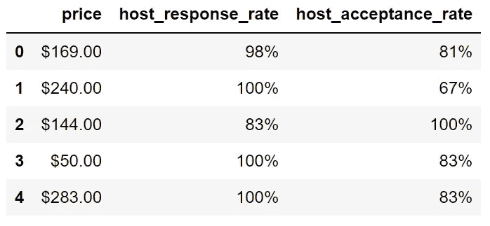

# 基于 Python Pandas 和 Seaborn 的 Airbnb 数据集的数据清洗和 EDA

> 原文：<https://towardsdatascience.com/data-cleaning-and-eda-on-airbnb-dataset-with-python-pandas-and-seaborn-7c276116b650?source=collection_archive---------12----------------------->

## 发现改变价格的特征


照片由[斯蒂芬·惠勒](https://unsplash.com/@stephen2002?utm_source=unsplash&utm_medium=referral&utm_content=creditCopyText)在 [Unsplash](https://unsplash.com/s/photos/airbnb?utm_source=unsplash&utm_medium=referral&utm_content=creditCopyText) 拍摄

Airbnb 把有地方租的人和需要地方住的人联系起来。它变得如此受欢迎和成功，以至于我们大多数人都将 Airbnb 视为我们旅行计划中的一个选项。

在确定一个地方的价格时，有几个因素起着关键作用。主人应该为他们的住处列出一个合理的价格。

另一方面，寻找住处的人会从几个方面来评估房源，比如位置、面积、便利设施，最重要的是价格。

在本文中，我们将尝试找出哪些功能对一个地方的价格有影响。有许多 Airbnb [数据集](http://insideairbnb.com/get-the-data.html)可以通过 [creative commons](https://creativecommons.org/licenses/by/4.0/) 许可获得，因此可以随意使用和探索它们。

我们将为 Python 使用 Pandas 和 Seaborn 库。因此，本文也将是这些库的实用指南。

在[网站](http://insideairbnb.com/get-the-data.html)上有很多可用的数据集。我们将使用的是 2021 年 7 月 7 日西班牙巴塞罗那的列表文件。让我们从导入 Pandas 开始，从 CSV 文件中读取数据来创建一个数据帧。

```
import pandas as pdlistings = pd.read_csv("listings.csv")print(listings.shape)
(17079, 74)
```

有两个清单文件。一定要用 74 列的。

# 数据清理

某些列的格式不适合分析。例如,“价格”、“主机接受率”和“主机响应率”列存储为字符串。

```
listings[
    ["price","host_response_rate","host_acceptance_rate"]
].dtypes# output
price                   object
host_response_rate      object
host_acceptance_rate    object
dtype: object---------------------------------------------------------listings[
    ["price","host_response_rate","host_acceptance_rate"]
].head()# output
```



(图片由作者提供)

这些列需要转换成数字格式。我们可以使用`astype`函数来改变数据类型。但是，需要事先删除“$”和“%”字符。

```
listings["price"] = listings["price"].str[1:].str.replace(",","").astype("float")listings["host_response_rate"] = listings["host_response_rate"].str[:-1].astype("float") / 100listings["host_acceptance_rate"] = listings["host_acceptance_rate"].str[:-1].astype("float") / 100
```

由于“$”和“%”字符是字符串中的第一个和最后一个字符，我们可以使用它们的索引来删除它们。

`str[1:]`选择从第二个字符开始的所有字符，而`str[:-1]`选择直到最后一个字符的所有字符(最后一个字符除外)。然后，`astype`函数将数据类型改为 float。

这些列现在如下所示:


(图片由作者提供)

有一个名为“浴室文本”的列，其中包含一些信息:浴室数量和浴室类型。

```
listings[["bathrooms_text"]].head()
```


(图片由作者提供)

我认为最好是两个单独的栏目，分别列出浴室的数量和类型。我们可以通过使用`str`访问器下的`split`函数来完成这项任务。

```
listings["bathroom_qty"] = listings["bathrooms_text"].str.split(" ", expand=True)[0]listings["bathroom_type"] = listings["bathrooms_text"].str.split(" ", expand=True)[1]
```


(图片由作者提供)

# 探索性数据分析

数据集中有 74 个要素。最好将它们分成一些主要的组，以保持我们分析的完整性。

我想从价格这个目标变量开始。

## 价格

让我们创建一个 price 列的直方图，以了解它的分布情况。我将使用 Seaborn 库进行数据可视化，所以第一步是导入它。

```
import seaborn as sns
sns.set_theme(font_scale=1.5, style="darkgrid")
```

直方图可通过使用`displot`功能创建。

```
sns.displot(data=listings, x="price", kind="hist", aspect=1.5)
```


价格直方图(图片由作者提供)

由于价格非常高的异常值，分布是高度偏斜的。在这种情况下，最好取价格的对数。

```
listings = listings[listings.price!=0]listings.loc[:,"log_price"] = np.log(listings.loc[:,"price"])sns.displot(data=listings, x="log_price", kind="hist", aspect=1.5)
```


价格的自然记录(图片由作者提供)

在记录日志之前，我从数据框中删除了一些价格为 0 的列表。价格似乎呈对数正态分布。

## 主持

关于主人的一些特征在一个地方的价格中起着关键作用。例如，比起未验证的主机，人们更倾向于信任具有验证身份的主机。

```
listings.groupby(
    ["host_identity_verified"], 
    as_index=False
).agg(
    avg_price = ("price","mean"),
    qty = ("price","count")
)
```


(图片由作者提供)

列表按`host_identity_verified`列分组，并计算每组的平均价格。“t”代表真，“f”代表假。主机经过验证的列表平均价格要高得多。

最好也检查每组中的列表数量，以确保数据不是非常不平衡。

让我们用类似的方法检查主机响应时间。响应更快的主机可能平均价格更高，因为没有人喜欢等待太久。

```
listings.groupby(
    ["host_response_time"], as_index=False
).agg(
    avg_price = ("price","mean"),
    qty = ("price","count")
).sort_values(
    by="avg_price", ascending=False
).reset_index(drop=True)
```


(图片由作者提供)

除了前面的例子，使用`sort_values`函数按平均价格对结果进行排序。这有助于我们更清楚地看到响应时间和价格之间的关系。

正如预期的那样，平均价格随着响应时间的增加而降低。

## 大小

一个地方的大小或容量是价格的决定因素。`accommodates`栏显示了这个地方可以容纳多少人。

让我们使用箱线图来比较不同`accommodates`值的价格分布。

```
sns.catplot(
    data=listings, 
    x='accommodates', y='log_price', kind='box',
    height=6, aspect=1.8, width=0.5
)
```

将`kind`参数设置为 box 的 Seaborn 的`catplot`函数创建一个盒图。`height`和`aspect`参数调整绘图的大小。最后，`width`参数改变图中方框的大小。


(图片由作者提供)

我们清楚地看到，一般来说，价格随着容纳价值的增加而增加。

*   盒子的底线是第一个四分位数，所以 25%的值在这条线以下。
*   方框中间的线表示中间值。一半的数值在这条线以下。
*   方框的顶行是第三个四分位数，这意味着 75%的值在这条线以下。

一半的值在盒子的底部和顶部线之间，所以我们得到了值分布的概况。底部和顶部的点表示异常值。

## 有效性

有几个栏目与一个地方的可用性有关。例如，`availability_30`列显示了未来 30 天的可用天数。

我们还可以看到未来 60、90 和 365 天的可用天数。

让我们检查一下可用天数和价格之间是否存在相关性。

```
listings[[ 
    'availability_30', 'availability_60', 
    'availability_90', 'availability_365',
    'log_price'
]].corr()
```


(图片由作者提供)

可用天数和价格之间似乎有一点正相关。我们还发现，未来 30 天、60 天和 90 天的可用天数之间存在高度正相关，这其实并不令人意外。

有一个名为`instant_bookable`的栏目可能会对价格产生影响。急需一个地方的人会寻找可以立即预订的地方。对他们来说，钱通常是第二关心的事情。

```
listings.groupby(
    ['instant_bookable'], as_index=False
).agg(
    avg_price = ("price","mean"),
    qty = ("price","count")
)
```


(图片由作者提供)

## 地方的类型

数据集中有酒店房间、私人房间、共享房间和整个家庭。我们可以使用 group by 函数的箱线图来检查价格如何根据地点的类型而变化。

```
sns.catplot(
    data=listings, 
    x='room_type', y='log_price', kind='box',
    height=6, aspect=1.8, width=0.5
)
```


(图片由作者提供)

一般来说，私人房间和共享房间更便宜。我们在私人房间类别中看到许多异常值。它们可能位于城市中非常受欢迎的地方。

## 舒适

我们通常在预订或租房时会考虑一个地方的便利设施。例如，一台像样的咖啡机可能会改变游戏规则。

数据集中有一个名为`amenities`的列，但它包含了这个地方所有可用的便利设施。为了检查某个功能或设施对价格的影响，我们需要从该列中提取它。

谢天谢地，使用 Python 和 Pandas，这是一个简单的操作。下面的代码片段使用列表理解来检查“咖啡机”是否存在于便利设施列中。

```
listings.loc[:,"has_coffee_maker"] = ['coffee maker' in row.lower() for row in listings.amenities]
```

在检查之前，每个值都被转换成小写，因为我们感兴趣的是“咖啡机”、“咖啡机”或咖啡机的任何其他大写和小写组合。

```
listings.has_coffee_maker.value_counts()False    8777
True     8298
Name: has_coffee_maker, dtype: int64
```

几乎一半的地方都有咖啡机。让我们看看有和没有咖啡机的地方的平均价格。

```
listings.groupby(
    ["has_coffee_maker"]
).agg(
    avg_price = ("price", "mean")
)
```


(图片由作者提供)

## 位置

位置是一个地方非常重要的特征。在某些情况下，靠近某个地方是极其重要的，位置是人们花钱的目的。

“邻居”和“邻居组”栏让我们了解这个地方的位置。我们将根据这些值检查平均价格。

如果您想更进一步，有一个单独的邻域文件，其中包含每个邻域的地理坐标。这有助于进行彻底的基于位置的评估。例如，当有重要的足球比赛时，靠近诺坎普可以提高价格。

```
listings.groupby(
    ["neighbourhood_group_cleansed"], as_index=False
).agg(
    avg_price = ("price", "mean"),
    qty = ("price", "count")
).sort_values(
    by="avg_price", ascending=False
).reset_index(drop=True)
```


(图片由作者提供)

Les Corts 是最贵的邻里团体。让我们也来看看 Les Corts 内不同社区的平均价格是如何变化的。

```
listings[listings.neighbourhood_group_cleansed=="Les Corts"].groupby(
    ["neighbourhood_cleansed"]
).agg(
    avg_price = ("price", "mean"),
    qty = ("price", "count")
).sort_values(
    by="avg_price", ascending=False
)
```


(图片由作者提供)

# **结论**

我们试图探索来自西班牙巴塞罗那的 Airbnb 数据集。我们的重点是了解一个列表的不同特征如何影响它的价格。

当然，我们可以更深入，寻找更具体的特征和关系。然而，我们所做的展示了探索性数据分析过程中的典型操作。

我们还做了一些数据清理，以便使数据更适合数据分析。

*别忘了* [*订阅*](https://sonery.medium.com/subscribe) *如果你想在我发表新文章时收到电子邮件。*

*你可以成为* [*媒介会员*](https://sonery.medium.com/membership) *解锁我的全部写作权限，外加其余媒介。如果您使用以下链接，我将收取您的一部分会员费，无需您支付额外费用。*

<https://sonery.medium.com/membership>  

感谢您的阅读。如果您有任何反馈，请告诉我。