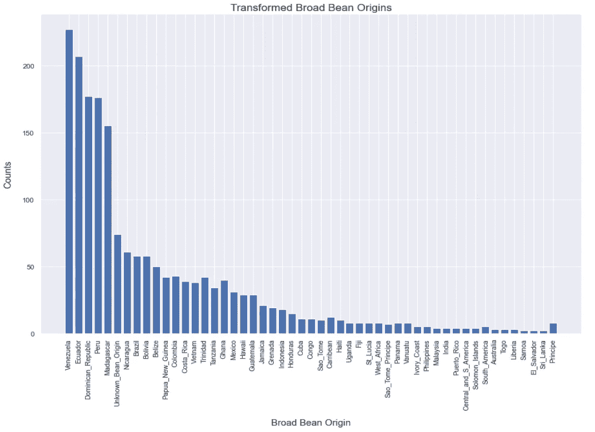

# 数据清理和特征工程:机器学习中被低估的部分

> 原文：<https://towardsdatascience.com/data-cleaning-and-feature-engineering-the-underestimated-parts-of-machine-learning-10681dae4cf7?source=collection_archive---------10----------------------->

## 数据清洗和特征工程被应用于杂乱的巧克力棒评级数据集

照片由 [Vicky Yu](https://unsplash.com/@vicky_yu?utm_source=medium&utm_medium=referral) 在 [Unsplash](https://unsplash.com?utm_source=medium&utm_medium=referral) 上拍摄

# 介绍

每个人都想进入机器学习领域。每个人都希望加载数据，并希望直接根据这些数据训练机器学习算法。在大学里，我们只处理干净的数据集，比如 MNIST 或 CIFAR-10 数据集。在那里，你可以直接从应用不同的机器学习算法开始，并对它们进行比较。但是在现实中，你并没有得到一个完美和干净的数据集。你通常会得到一个非常混乱的数据集，在应用机器学习之前，需要进行大量的数据清理和特征工程。一般来说，机器学习本身是整个过程中较小的部分，而数据清洗和特征工程是较大的部分。这篇文章展示了来自 Kaggle 的[巧克力棒评分数据集的数据清理和特征工程。这个数据集是相当混乱的，允许提出一些数据清理的想法。笔记本可以在我的](https://www.kaggle.com/rtatman/chocolate-bar-ratings) [github 页面](https://github.com/patrickbrus/IBM_Machine_Learning_Professional/tree/master/Regression)找到。一些功能工程的想法是从 Kaggle 上的笔记本[中得到启发的。](https://www.kaggle.com/allunia/how-good-does-your-chocolate-taste)

# 数据集

巧克力棒评级数据集包含关于巧克力棒及其评级的信息。目标是使用关于巧克力棒的给定信息并预测巧克力棒的等级。表 1 显示了所有可用的特性以及每个特性的简短描述。

表 1:巧克力棒评级数据集中所有可用特征的概述(按作者分类的表格)。

在数据集的描述中，陈述了使用客观质量和主观解释的组合来评估每个巧克力。评级本身是使用一个批次的巧克力棒完成的，批号、年份和审查日期都包含在数据集中。表 2 显示了不同等级及其含义的概述。

表 2:所有评级级别及其含义的概述(按作者分类)。

# 探索性数据分析、数据清理和特征工程

本章描述了使用特征工程探索数据集、清理数据和创建一些新特征的过程。本章的目标是准备数据，以便它可以直接用于以后的机器学习。使用 Pandas 加载数据，并存储在 Pandas 数据框中。

作为第一步，pandas 数据帧头函数用于获得数据的初始视图。列名格式不正确，包含换行符。图 1 显示了数据帧的头部。

图 1:包含巧克力棒评级数据集的熊猫头像数据框(图片由作者提供)。

因此，作为第一步，列名被重命名(图 2)。

图 2:重命名巧克力棒评级数据框列的代码(由作者编写)。

其次，使用 pandas 数据框函数 *info()* 来快速检查哪些数据类型可用以及数据是否缺失。列 *Company、Spec_Bean_Origin_or_Bar_Name、Cocoa_Percent、Company_Location、Bean_Type* 和 *Broad_Bean_Origin* 是分类特征，必须进行转换。当查看缺失值时，只有特征 *Broad_Bean_Origin* 和 *Bean_Type* 在 *1795 个*总样本中包含一个缺失值。然而，当查看数据帧头(图 1)时，特性 Bean_Type 的前五行是空的，因此应该算作缺失值。因此，获取 *Bean_Type* 的第一个条目，以便检查其值，并使用此条目将这些值替换为 *NaN* (图 3)。

图 3:获取 bean 类型的缺失值指示，并用 NaN 替换所有列的缺失值(由作者编写代码)。

将 *Bean_Type* 的空值替换为 *NaN* 后，再次调用 *info()* 函数，此时显示该特征包含 *891* 个缺失值，几乎是样本总数的 *50%* 。特性 *Broad_Bean_Origin* 也有一些缺失值，现在包含了 *74 个*缺失值。

下一步，通过移除尾随百分比符号并将数据类型转换为数字数据类型来转换特性 *Cocoa_Percent* 。

然后，创建一个数字和分类特征列表，并绘制每个数字特征的直方图(图 4 和图 5)。

图 4:创建数字和分类特征列表并对其进行初步探索性数据分析的代码(由作者编写)。

图 5:巧克力棒评分数据集的数字特征直方图(图片由作者提供)。

可以看出，数据集中的审查期从 2006 年到 2017 年。特性 *Cocoa_Percent* 的分布似乎有点倾斜，可以在以后进行转换。大部分评分在三到四之间，意味着大部分巧克力棒是“满意的”。

在对分类特征进行更仔细的检查后，可以看到它们包含了大量的类别(表 3)，并且还包含了某些类别的部分单个例子，这对于机器学习算法来说不是很有帮助。因此，这些是首先要改造的。

表 3:所有分类特征的概述以及每个特征的不同类别的数量(图片由作者提供)。

## 转换 Bean 类型

第一个转换的分类特征是 *Bean_Type* 。图 6 显示了所有可用 bean 类型的直方图。

图 6:转换后所有可用 bean 类型的直方图(图片由作者提供)。

最常见的豆类有 Criollo、Trinitario、Forsastero。大多数其他 bean 类型只是这些 bean 类型的混合。Blend 也经常出现，但只是表示这个 bean 类型是其他 bean 类型的混合。其他一些不太常见的豆类有贝尼亚诺豆、马蒂纳豆、EET 豆、国家豆和亚马逊豆。因此，创建一个包含所有这里提到的 bean 类型的列，然后检查每个样本是否存在这些类别。如果出现任何类别，那么该样本的 category 列将被加 1。如果一个样本包含多个 bean 类型，则设置多个类型。因此，混合的 bean 类型可以映射到分类特征。bean 类型也包含许多缺失值。这里，缺失值被映射到类别 *Unknown_Bean_Type* ，因为当几乎 *50%* 的数据缺失*时，其他数据插补方法可能会很困难。*

了解巧克力棒是否含有混合豆类也是有用的。可能这已经对最终评分有影响了。因此，增加了一个名为 *Num_Beans* 的新特性。这个特性包含了巧克力棒所含的不同豆类的数量。

最后，添加了一个特性 *Is_Blend* 来保存巧克力棒是否包含混合豆类，并且类型为 Blend 的豆类也为该特性获得了 true。

图 7 显示了执行上述步骤的代码。

图 7:转换 bean 类型特性列的代码(作者代码)。

## 转换酒吧的特定地理区域

下一个被转换的特征是*Spec _ Bean _ Origin _ or _ Bar _ Name*。有 *1039* 不同的类别，很多。还有许多类别只包含一个值，这不会为机器学习算法提供任何有用的信息。

经过更仔细的检查，很明显，许多国家和城市在逗号后包含了无用的信息。因此，所有行值都用逗号分割，只保留第一部分。这已经将类别的数量减少到 682 个不同的类别。此外，一些类别在国家或城市名称后包含“w/ nibs”。这也被删除，并将类别数量减少到 *672* 。最后，单次出现类别被映射到类别“其他”，这将不同类别的大小减少到 *209* 。图 8 显示了这些转换的代码。

图 8:转换巧克力棒原产地的特定地理区域的代码(由作者编写)。

## 改造蚕豆产地

作为下一个特性，蚕豆源( *Broad_Bean_Origin* )将被仔细检查。总共有 *100* 个不同的类别，有些类别也只是其他更常见类别的逗号分隔列表。此外，有些国家有时会有不同的写法(如多米尼加共和国，D.R .，D. Republic，多米尼加共和国)。因此，使用正则表达式是为了确保所有不同的拼写都映射到同一个国家。

蚕豆原点特征也包含 *74* 缺失值。这些丢失的值被类别*未知 _Bean_Origin* 替换。

在格式化国家和替换丢失的值之后，逗号分隔的列表被分割以获得类别列表，然后应用与特性 *Bean_Type* 相同的方法。

在所有的转换之后，只剩下 *51* 个不同的类别。图 9 显示了对该特征应用所有变换后的最终直方图。这里不包含代码，因为代码很多。如果你有兴趣了解我是如何进行这些转换的，请随意查看我的 github 页面上的 jupyter 笔记本。

图 9:转换后所有可用蚕豆源的直方图(图片由作者提供)。

## 转变公司位置

特征*公司位置*是最后转换的分类特征。这里，只有公司位置的单次出现再次被替换为类别“其他”。

## 最终转换

最后，使用 pandas *get_dummies()* 函数转换剩下的所有分类列。

作为最后一个变换，可可百分比的倾斜特征使用对数变换进行变换。由此，偏斜度从 *1.06* 降低到 *0.3* 。图 10 显示了应用变换前后的直方图。可以看出，转换后的直方图看起来比转换前的直方图更加均匀。

最后一步，通过使用数据的 *20%* 进行测试，将数据分为训练和维持测试集。

图 10:对数变换前(左)和变换后(右)的数字特征可可百分比直方图(图片由作者提供)。

# 结论

巧克力棒评级的杂乱数据集现在已经清理干净，并添加了一些可能有用的功能。对分类特征进行编码，并创建训练集和保留测试集，并存储在 csv 文件中。现在可以直接使用它们来对这个数据集执行一些机器学习。如果你有兴趣看我如何在这个数据集上应用机器学习，那么我鼓励你看看我的 [github 页面](https://github.com/patrickbrus/IBM_Machine_Learning_Professional/tree/master/Regression)上相应的 jupyter 笔记本。

# 未来的工作

目前，单一类别被映射到一个新的类别“其他”。但也许有另一种方法可以进一步减少单一类别，并映射到更有意义的类别。这同样适用于缺失值，它们也映射到“其他”类别。这里，可以使用数据插补策略，并且可以将机器学习算法的性能与这里给出的策略进行比较，以便检查这是否可以进一步提高性能。