# 数据清理——如何处理熊猫丢失的值

> 原文：<https://towardsdatascience.com/data-cleaning-how-to-handle-missing-values-in-pandas-cc8570c446ec?source=collection_archive---------8----------------------->

## 删除值、填充值、替换值


照片由 [Gabby K](https://www.pexels.com/@gabby-k?utm_content=attributionCopyText&utm_medium=referral&utm_source=pexels) 从 [Pexels](https://www.pexels.com/photo/cutout-paper-appliques-of-sick-and-healthy-human-figures-5841972/?utm_content=attributionCopyText&utm_medium=referral&utm_source=pexels) 拍摄

# 处理熊猫中缺失的值

数据清洗是 EDA 中的重要步骤之一。数据清理可以通过多种方式完成。其中之一是处理丢失的值。

让我们了解一下如何处理数据集中的缺失值。

# 目录

1.  识别缺失值
2.  替换丢失的值
3.  填充缺失值
4.  删除缺少的值

# 识别缺失值

不同类型的缺失值:

*   标准缺失值
*   非标准缺失值
*   意外缺少值

## 标准缺失值

空白单元格，NaN，n/a →在 Pandas 中，这些单元格默认被视为空值。

标准缺失值只能被熊猫检测到。

**示例:**我创建了一个简单的数据集，其中包含不同类型的空值

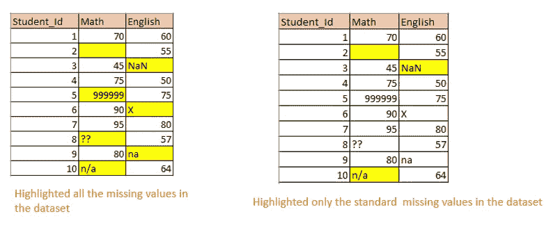

student.csv(图片由作者提供)

让我们导入数据集

```
df=pd.read_csv(“student.csv”)
df.head(10)
```

2. **df.isnull()。sum()** →它将返回每一列中 null 值的计数。它将只计算标准的空值。

```
df.isnull().sum()
```

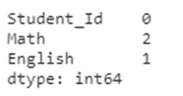

仅计算 3 个标准缺失值。[空白单元格，NaN，不适用]

3. **df[《数学》]。isnull()** →返回一个布尔数组。true-表示空值。

```
**df["Math"].isnull()**
```

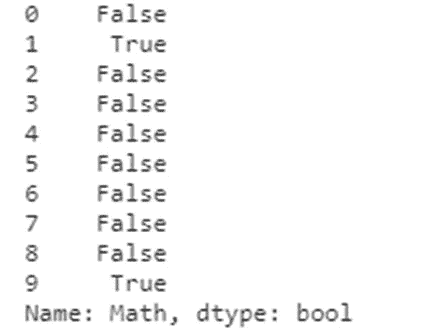

## 非标准缺失值

有时会像**一样输入缺失值..，__，—，缺失，na，** **@，？？、***** 等。

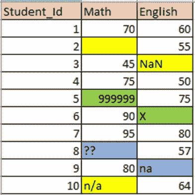

不同类型的缺失值-突出显示。

现在让我们检查“数学”和“英语”列中的所有唯一值。通过检查这一点，我们可以识别数据集中所有非标准的缺失值。

```
df[“Math”].unique()
```

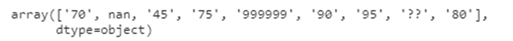

```
df[“English”].unique()
```


它将返回该特定列中的所有唯一值。我们可以确定哪些是其他值，这些值将被视为“缺失值”。

从这两列唯一值中，我们可以识别出一些缺失值，如`**na**` 和`??`

这些是非标准的缺失值。

## 意外缺少值

基于数据集的上下文来识别意外丢失的值。这里的分数只有 0 到 100 分。所以`**999999**`和 `**X**`也被标识为缺失值。

# 替换丢失的值

1.  **df.replace(旧值，新值)** → **旧值**将被**新值**替换

```
missing_values=[**'??'**,**'na'**,**'X'**,**'999999'**]
df=df.replace(missing_values,np.NaN)
df
```

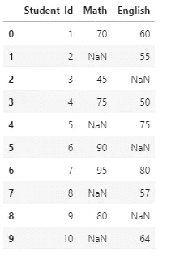

现在所有缺少的值都被替换为 NaN。现在很容易处理所有的空值。我们可以删除所有的空值，或者用平均值/中值来填充它们。

# 填充缺失值

## 填补缺失值的不同方法

1.  均值/中值，众数
2.  菲儿，菲儿
3.  插入
4.  替换

## 1.均值/中值，众数

*   **数值数据→平均值/中值**
*   **分类数据→模式**

在有数字数据的列中，我们可以用平均值/中值来填充缺失的值。

均值-当数据没有异常值时。 ***的意思是平均值*** 。平均值会受到异常值的影响。

【举例。如果我们计算一个房间里员工的平均工资，如果公司 CEO 走进来，平均工资会更高。不可能是代表金额。在这种情况下，我们可以选择中值]

中值-当数据有更多异常值时，最好用中值替换它们。 ***中位数是中间值*** (50%)

在包含分类数据的列中，我们可以通过模式填充缺失的值

***模式—最常见值*** *。*

**让我们用平均值**来填充缺失的值

1.  首先，我们必须检查列的数据类型。

```
df.dtypes
```

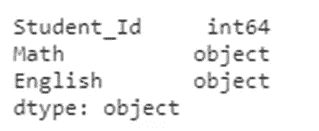

“数学”和“英语”属于“对象”数据类型。我们必须转换成“浮点”数据类型来计算平均值。

2.更改列的数据类型并计算平均值

```
df[**"Math"**]=df[**"Math"**].astype(**"float64"**)m=round(df[**"Math"**].mean(),2)
m
```

产量:75.83

3.现在用平均值-75.83 填充“数学”栏中缺少的值

```
df[**"Math"**].fillna(m,inplace=**True**)
df
```

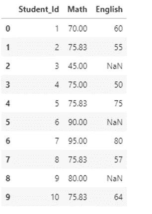

## 分类数据

如果我们想要替换分类数据中缺失的值，我们可以用 mode(最常见的值)来替换它们

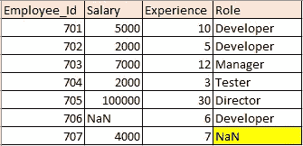

员工. csv

1.  让我们替换“角色”列中的空值

```
df=pd.read_csv(**"employee.csv"**)
m=df[**"Role"**].mode()
m
#Output0    Developer
dtype: object
```

2.它返回一个 series 对象，包含最常见的值。我们必须选择系列中的特定值。

```
m=df[**"Role"**].mode()[0]
m
#Output:'Developer'
```

3.填写值

```
df[**"Role"**].fillna(m,inplace=**True**)
df
```

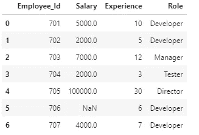

“角色”列中的空值替换为“开发人员”

## 2.菲儿，菲儿

**b 填充** —向后填充—它将向后传播第一个观察到的非空值。
**ffill** —向前填充—它向前传播最后观察到的非空值。

如果我们的数据集中记录了连续几天的温度，我们可以通过 bfill 或 ffill 来填充缺失的值。与这类数据集的平均值/中值相比，它会更加准确。

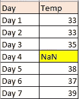

天气. csv

1.  **b 填充**

```
df1=pd.read_csv(**"weather.csv"**)
df1.bfill(inplace=**True**)
df1
```

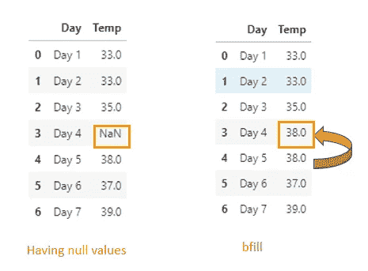

bfill

**2。ffill**

```
df1.ffill(inplace=**True**)
df1
```

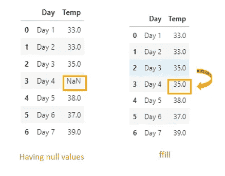

ffill

# 3.插入

interpolate()是填充缺失值的方法之一。

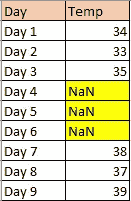

天气 2.csv

我们已经连续三天缺少值了。我们可以使用插值方法，而不是用相同的值填充所有三行。

bfill/ffill 将为后续缺失值填充相同的值。

```
df2=pd.read_csv(**"weather1.csv"**)
df2=df2.interpolate()
df2
```

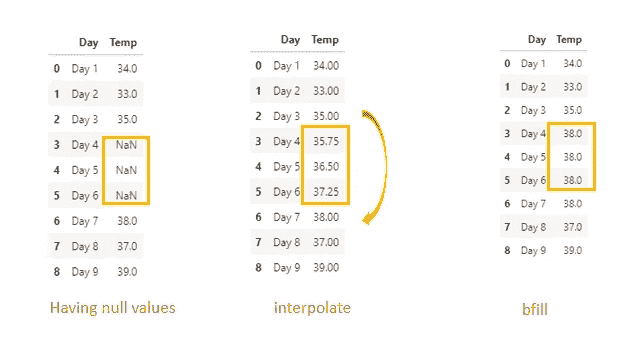

插值 vs bfill[图片由作者提供]

让我们在使用内插法与 bfill 填充连续缺失值后可视化数据集

```
**import** seaborn **as** sns
sns.pointplot(x=**"Day"**,y=**"Temp"**,data=df3,color=**'darkorange'**)
```

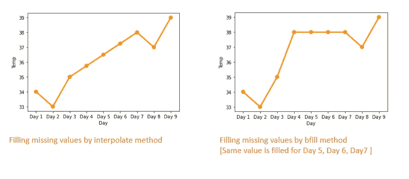

从图中，我们可以看到缺失值是如何通过插值方法填充的[默认情况下使用线性方法]

## **4。更换**

有时，我们可以使用 replace 方法替换特定的缺失值。

就像我们可以从外部来源获取数据并替换它。

# 删除缺少的值

1.  移除数据集中的所有空值

```
df.dropna()
```

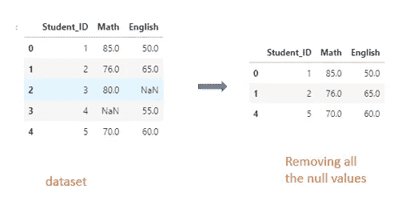

2.删除特定列中的空值

```
df.dropna(subset=[**"Math"**])
```


# 结论

数据清理包括许多步骤。我只讲述了如何处理数据集中缺失的值。还有更多类似于修复无效值、拆分列、合并列、过滤子集、标准化数据、缩放数据。

感谢阅读！

*关注这个空间，获取更多关于 Python 和数据科学的文章。如果你喜欢看我的更多教程，就关注我的* [***中***](https://medium.com/@IndhumathyChelliah) ，[***LinkedIn***](https://www.linkedin.com/in/indhumathy-chelliah/)***，***[***Twitter***](https://twitter.com/IndhuChelliah)***。***

*点击这里成为中等会员:*[*https://indhumathychelliah.medium.com/membership*](https://indhumathychelliah.medium.com/membership)