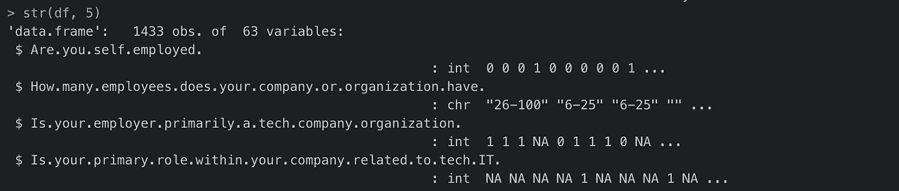
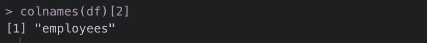
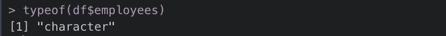
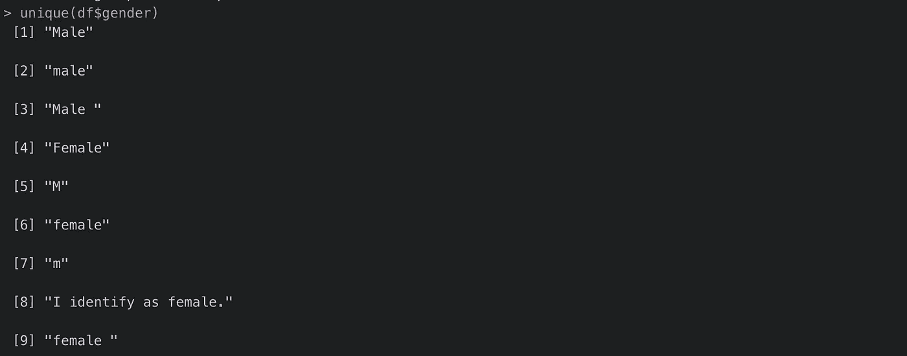
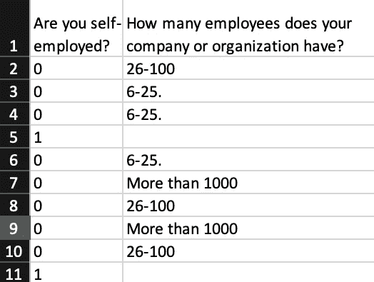
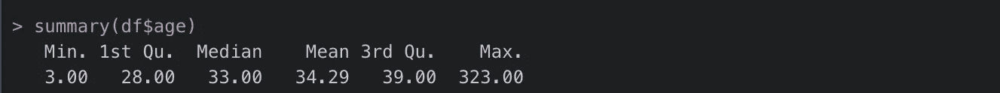
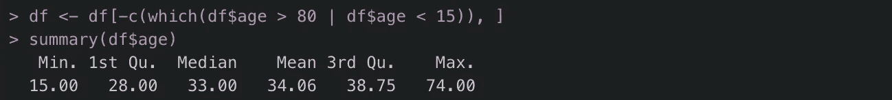
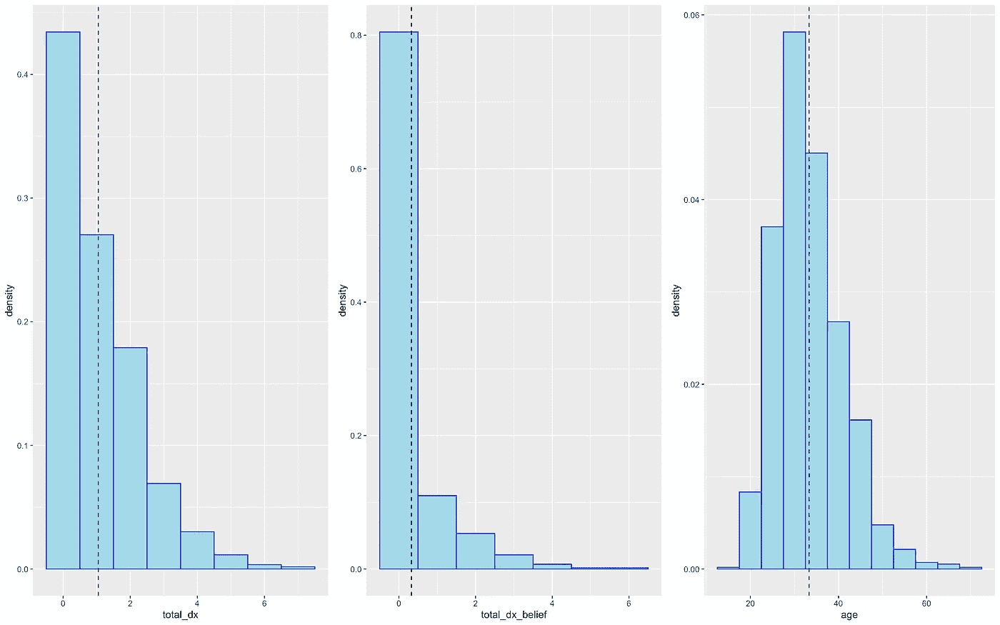
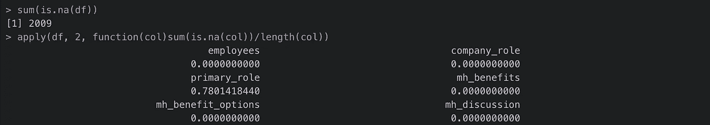

# R 中的数据清理变得简单

> 原文：<https://towardsdatascience.com/data-cleaning-in-r-made-simple-1b77303b0b17?source=collection_archive---------0----------------------->

## 标题说明了一切


[JESHOOTS.COM](https://unsplash.com/@jeshoots?utm_source=medium&utm_medium=referral)在 [Unsplash](https://unsplash.com?utm_source=medium&utm_medium=referral) 上拍照

**数据清洗。**为下游目的识别、纠正或删除不准确原始数据的过程。或者，更通俗地说，这是向分析就绪数据集迈出的乏味但完全必要的第一步。在数据科学家的时代，数据清理可能不是最性感的任务，但永远不要低估它完成或破坏一个统计驱动的项目的能力。

更详细地说，让我们把数据清理想象成一块空白画布的准备工作，探索性的数据分析和统计建模油漆的一笔一划很快就会使它完全生动起来。如果你的画布最初没有被清理干净，也没有恰当地符合项目目标，那么无论你画得多漂亮，接下来对你的艺术的解读都将是混乱的。

数据科学项目也是如此。**如果你的数据准备不足，不管你的统计技巧多么前沿，不可靠的结果都会困扰你的工作。对于任何以将数据转化为公司或学术价值为生的人来说，这是一个可怕的前景。**

> 俗话说:垃圾进来，垃圾出去

不幸的是，现实世界的数据清理可能是一个复杂的过程。许多预处理都是依赖于数据的，不准确的观察值和缺失值的模式通常是每个项目及其数据收集方法所特有的。当手工输入数据时尤其如此(*数据验证，有人知道吗？*)或者是非标准化、自由反应的产物(想想从自然保护和心理学等领域搜集的推文或观察数据)。

**然而，“卷入”并不一定要翻译成“失去”**是的，每个数据帧都不一样。是的，数据清理技术依赖于个人数据争论偏好。但是，与其被这些未知所淹没，或者不确定什么才是真正的“干净”数据，你可以采取一些通用步骤来确保你的画布马上就可以进行统计绘制了。

> TL；DR: *数据清洗听起来很可怕，但是无效的发现更可怕。以下是一些有助于保持数据清理步骤清晰简单的工具和提示。*

让我们开始吧。

## 输入 R

r 是处理数据的极好工具。像 [tidyverse](https://www.tidyverse.org/) 这样的软件包使得复杂的数据操作变得几乎没有痛苦，并且作为统计学的通用语言，对于许多数据科学家和社会科学研究者(比如我自己)来说，这是一个自然的起点。也就是说，它绝不是数据清理的唯一工具。这只是我们在这里要用的一个。

对于替代的数据清理工具，请查看这些关于 [Python](/data-cleaning-in-python-the-ultimate-guide-2020-c63b88bf0a0d?source=false---------2) 、 [SQL](/cleaning-and-transforming-data-with-sql-f93c4de0d2fc) 和[语言中立方法](/the-ultimate-guide-to-data-cleaning-3969843991d4)的文章。

## 接下来，输入一个简单的清单

不管 R 有多有用，如果您错过了装订数据清理步骤，您的画布仍然会准备不足。为了尽可能保持简单，以下是清理原始数据时应始终考虑的最佳实践清单:

1.  *熟悉数据集*
2.  *检查结构错误*
3.  *检查数据异常*
4.  *决定如何处理缺失值*
5.  *文件数据版本及变更*

如果这些步骤仍然有点模糊，请不要担心。我们将使用下面的示例数据集更详细地介绍每一项。

## 最后，输入一个真实的例子

工具箱和清单很酷，但是两者在现实世界中的应用才是真正的学习。

在下文中，我们将按顺序检查数据清理清单的每个步骤。为了演示这些步骤，我们将使用目前在 [Kaggle](http://kaggle.com) 上可用的“[技术调查中的精神健康](https://www.kaggle.com/osmi/mental-health-in-tech-2016)”数据集，以及相关的 R 代码片段。

## 第一步:熟悉数据集

一个重要的“预数据清理”步骤是**领域知识**。如果你正在做一个与亚马逊地区的 Potoo 睡眠模式相关的项目，但不知道 Potoo 实际上是什么，那么你可能无法很好地理解变量的含义，哪些变量是重要的，或者哪些值可能需要认真清理。

> 简而言之:如果你的变量一开始对你没有意义，在进入数据清理之前，一定要仔细阅读或者咨询专家。

为了保持在我自己的临床心理学领域，我将使用前面提到的“[技术调查中的心理健康](https://www.kaggle.com/osmi/mental-health-in-tech-2016)”数据集，这是 2016 年的一系列调查反馈，旨在捕捉技术员工的心理健康状况和工作态度。为了更深入地了解这些数据，请点击这里查看原始资料。

从文件大小到数据类型，充分了解数据集是动手清理数据之前的另一个关键步骤。没有什么比意识到一个核心特性充满了噪音或者在分析过程中发现内存不足更让人恼火的了。


照片由[蒂姆·高](https://unsplash.com/@punttim?utm_source=medium&utm_medium=referral)在 [Unsplash](https://unsplash.com?utm_source=medium&utm_medium=referral) 上拍摄

为了避免这种情况，我们可以采取一些快速的初始步骤来确定什么可能需要额外的关注。要在打开之前确定数据文件的大小，我们可以使用:

```
file.info("~/YourDirectoryHere/mental-heath-in-tech-2016_20161114.csv")$size
```

我们使用的数据文件是 1104203 字节(或 1.01 MB)，无论如何都不是大数据。RAM 短缺在这里很可能不是问题。

```
#an initial look at the data frame
str(df)
```



从输出中，我们还可以看到数据帧由 1433 个观察值(行)和 63 个变量(列)组成。还列出了每个变量的名称和数据类型。我们将在第 2 步中回到这些信息。

像上面这些快速而肮脏的方法可以有效地让你开始熟悉手头的东西。但是请记住，这些功能只是探索型数据分析的冰山一角。查看这个资源中的[,了解这里没有介绍的 EDA 的潜行高峰。](/simple-fast-exploratory-data-analysis-in-r-with-dataexplorer-package-e055348d9619)

## 步骤 2:检查结构错误

现在我们对数据有了一个感觉，我们将评估数据框的结构错误。这些错误包括输入错误，如错误的数据类型、非唯一的 ID 号、错误标记的变量和字符串不一致。如果在您自己的数据集中有比下面提到的更多的结构性缺陷，请确保在您的数据清理中包括额外的步骤来解决这些问题。

**a)标签错误的变量**:用 [names()](https://www.rdocumentation.org/packages/base/versions/3.6.2/topics/names) 函数查看所有变量标签。我们的示例数据集有很长的标签，很难在接下来的代码中调用。我们可以用 [dplyr 的](https://dplyr.tidyverse.org/) [rename()](https://dplyr.tidyverse.org/reference/rename.html) 来修改它们，如下所示:

```
df <- df %>% rename(employees = How.many.employees.does.your.company.or.organization.have.)colnames(df)[2]
```



**b)错误数据类型:**这些可以通过步骤 1 中使用的 [str()](https://www.rdocumentation.org/packages/utils/versions/3.6.2/topics/str) 函数或更明确的 [typeof()](https://www.rdocumentation.org/packages/base/versions/3.6.2/topics/typeof) 函数来确定。这个数据集中有几个不正确的数据类型，但是让我们继续使用“employees”变量来演示如何识别和更新这些错误:

```
typeof(df$employees)
```



返回“字符”，但变量实际上应该是一个具有 5 个级别的因子:“6–25”、“26–100”、“100–500”、“500–1000”和“大于 1000”。我们可以使用 [as.factor()](https://www.rdocumentation.org/packages/h2o/versions/2.4.3.11/topics/as.factor) 函数相应地改变数据类型:

```
df$employees <- as.factor(df$employees)
```

**c)非唯一 ID 号**:这个特殊的数据集没有 ID 标签，响应者由行号标识。但是，如果包含 ID 号，我们可以用 [duplicated()](https://www.rdocumentation.org/packages/base/versions/3.6.2/topics/duplicated) 函数或 dplyr 的 [distinct()](https://dplyr.tidyverse.org/reference/distinct.html) 函数删除重复项，如下所示:

```
#with duplicated()
df <- df[!duplicated(df$ID_Column_Name), ]#with distinct()
df <- df %>% distinct(ID_Column_Name, .keep_all = TRUE)
```

**d)字符串不一致**:这包括可能干扰数据分析的打字错误、大写错误、标点错位或类似的字符数据错误。

以我们的“性别”专栏为例。

```
unique(df$gender)
```



输出继续。事实上，总共有 72 个独特的回应。正如我们所看到的，由于不一致的大写字母和术语缩写而存在差异。为了统一这些响应，我们可以使用正则表达式结合 [gsub()](https://www.rdocumentation.org/packages/base/versions/3.6.2/topics/grep) 来识别常见字符模式，并将所有女性识别响应转换为虚拟编码值“1”，将所有男性识别响应转换为“0”。

```
df$gender <- gsub("(?i)F|(?i)Female", "1", df$gender)
df$gender <- gsub("(?i)M|(?i)Male", "0", df$gender)
```

正则表达式根据字符串数据有很大的不同。点击这里查看 R [的正则表达式备忘单，了解如何使用它们。](https://www.rstudio.com/wp-content/uploads/2016/09/RegExCheatsheet.pdf)

此外，要注意丢失的值被错误地表示为字符“NA”值，而不是 NA 数据类型。使用以下代码修复实例:

```
df <- df %>% na_if(gender, "NA")
```

## 步骤 3:检查数据的不规则性

接下来，我们将评估数据集的不规则性，这包括准确性问题，如**无效值**和**异常值**。同样，这是杂乱数据框中的两个常见陷阱，但是要注意您自己的数据特有的不规则性。

**a)无效值**:这些是没有逻辑意义的响应。例如，我们数据集中的第一个问题(“你是自雇人士吗？”)应该与第二个(“你的公司或组织有多少员工？”).如果第一栏中有一个“1”表示该个人是自雇人士，则第二栏中应该有一个“NA ”,因为他或她不为公司工作。



另一个常见的例子是年龄。我们的数据集由技术员工的回答组成，这意味着任何报告年龄大于 80 岁或小于 15 岁的人都可能是输入错误。让我们来看看:



可以肯定地说，一个 3 岁和 323 岁的孩子没有完成员工调查。要删除无效条目，我们可以使用以下代码:

```
df <- df[-c(which(df$age > 80 | df$age < 15)), ]
```



离群值:这是一个有很多争论的话题。查看[维基百科](https://en.wikipedia.org/wiki/Outlier)的文章，深入了解什么是离群值。

经过一点特征工程(查看完整的数据清理脚本[此处](https://github.com/emiburns/mental-health-in-tech-medium-project)供参考)，我们的数据集有 3 个连续变量:*年龄*、*每个回答者诊断出的精神疾病数量*，以及*每个回答者认为有精神疾病的数量*。为了了解数据的分布情况，我们可以绘制每个变量的直方图:



“total_dx”和“total_dx_belief”都严重倾斜。如果我们想要减轻极端异常值的影响，有 3 种常见的方法可以做到:*删除异常值*、*替换值*(又名 W *insorize* )或*什么都不做*。

**删除观测值**:定位并删除有极值的观测值。这在处理明显是人为输入错误导致的极端值时很常见(如之前在我们的“年龄”列中输入的 323 年值)。但是，如果不是这样，就要小心了，因为删除观察结果会导致重要信息的丢失。

**Winsorize** :当一个异常值对你的模型假设或结果产生负面影响时，你可能希望用一个不那么极端的最大值来代替它。在 Winsorizing 中，在数据的预定百分位之外的值被识别并被设置为所述百分位。以下是我们数据集 95% Winsorization 的示例:

```
#looking at number of values above 95th percentile 
sum(df$total_dx > quantile(df$total_dx, .95))df <- df %>% mutate(wins_total_dx = Winsorize(total_dx))
```

**什么都不做**:对，就是……什么都不做。如果离群值虽然极端，但包含了与您的项目目标相关的重要信息，那么这是最好的方法。这是我们对“total_dx”变量采取的方法，因为每个受访者报告的精神疾病数量有可能成为科技员工对精神健康态度的重要预测指标。

**补充说明**:这可能是大数据时代，但小样本仍然是临床领域的严峻现实，包括我自己。如果这也是你的现实，要格外小心异常值，因为它们对样本均值、标准差和方差的影响会随着样本量的减少而增加。

## 步骤 4:决定如何处理丢失的值

这里我将直接切入正题:*没有单一的“最佳”方法来处理数据集中的缺失值*。


照片由 [krakenimages](https://unsplash.com/@krakenimages?utm_source=medium&utm_medium=referral) 在 [Unsplash](https://unsplash.com?utm_source=medium&utm_medium=referral) 上拍摄

这听起来可能令人生畏，但是理解您的数据和领域主题(*回想一下步骤 1？*)可以派上用场。如果您非常了解您的数据，那么您也很有可能知道哪种方法最适合您的特定场景。

我们数据集的大部分 NA 值都是由相关回答造成的(例如，如果您对一个问题的回答是“是”，则可以跳过下面的问题)，而不是人为错误。这种差异在很大程度上可以用自雇和公司雇佣的定向问题产生的不同回答模式来解释。将数据集分成两个框架(一个用于公司雇佣的应答者，一个用于个体雇佣的应答者)后，我们计算公司雇佣的特定数据集的总缺失值:

```
sum(is.na(df))#percent missing values per variable
apply(df, 2, function(col)sum(is.na(col))/length(col))
```



这看起来可能缺少很多值，但是，经过进一步的检查，唯一缺少值的列是那些针对自雇响应者的列(例如，“您是否有医疗保险(私人保险或国家提供的保险)，其中包括精神健康问题的治疗？”).该变量中缺失的值应该在我们公司使用的数据集中，因为它们被公司政策覆盖。

这让我们想到了第一个选择:

a)删除变量。删除具有 NA 值的列。在具有大量数据和很少缺失值的项目中，这可能是一种有效的方法。在我们的情况下，这也是可以接受的，在我们的情况下，自雇变量没有给我们的公司雇佣数据集增加重要的信息。

但是，如果您正在处理一个较小的数据集和/或多个 NA 值，请记住移除变量会导致大量信息丢失。

**b)移除观察**。删除具有 NA 值的行。同样，这在大型项目中可能是一种可以接受的方法，但是要注意有价值信息的潜在损失。要删除带有缺失值的观察值，我们可以很容易地再次使用 dplyr 库:

```
#identifying the rows with NAs
rownames(df)[apply(df, 2, anyNA)]#removing all observations with NAs
df_clean <- df %>% na.omit()
```

**c)估算缺失值**。用推断的替换值替换 NA 值。我们可以使用给定变量的平均值、中值或众数来实现，如下所示:

```
for(i in 1:ncol(df)){
  df[is.na(df[,i]), i] <- mean(df[,i], na.rm = TRUE)
}
```

此外，我们还可以使用线性回归等预测方法估算连续值，或者使用逻辑回归等方法估算分类值。 [**使用库**](https://data.library.virginia.edu/getting-started-with-multiple-imputation-in-r/)**[mouse](https://cran.r-project.org/web/packages/mice/index.html)的多重插补** 也可用于连续或分类数据。当实现这些方法时，请注意，如果缺少的值和数据集属性之间没有关系，结果可能会产生误导。你可以在这里了解更多关于这些技术和它们相关的 R 包[。](https://www.kdnuggets.com/2017/09/missing-data-imputation-using-r.html)

[KNN 插补](https://www.rdocumentation.org/packages/impute/versions/1.46.0/topics/impute.knn)为输入连续或分类缺失值提供了另一种可能的替代方法，但请记住，这可能非常耗时，并且高度依赖于所选的 k 值。

```
#imputing missing values with the caret package's knn method
df_preprocess <- preProcess(df %>% dplyr::select(primary_role),
                            method = c("knnImpute"),
                            k = 10,
                            knnSummary = mean)df_impute <- predict(df_preprocess, df, na.action = na.pass)
```

使用支持缺失值的算法。如果使用 NA 值，有些算法会出错，有些则不会。如果希望将 NA 保留在数据集中，请考虑使用能够处理缺失值的算法，如线性回归、k-最近邻或 XGBoost。这一决定也很大程度上取决于项目的长期目标。

## 步骤 5:记录数据版本和所做的更改

为后面的乡亲们大声说清楚:**好的研究是可复制的研究**。如果你或第三方不能从你使用的*相同的原始数据集*中重现*相同的干净数据集*，你(或任何其他人)就不能验证你的发现。

清晰的文档是良好数据清理的一个重要方面。你为什么要做出这些改变？你是怎么做到的？你用的是什么版本的原始数据？这些都是你需要能够回答的重要问题。像 [R Markdown](https://rmarkdown.rstudio.com/) 和 [RPubs](https://rpubs.com/) 这样的工具可以无缝地将文档编织到你的 R 项目中。如果你还不熟悉的话，可以去看看。你未来的自己会感谢你。

对于那些已经走到这一步的人，感谢阅读！

在整篇文章中，我们借助一个简单的清单和真实数据集应用程序，阐明了基本的数据清理步骤以及在 R 中实现这些步骤的潜在方法。要进一步了解，你可以在我的 GitHub repo [这里](https://github.com/emiburns/mental-health-in-tech-project)找到完整的 R 脚本。

请记住，尽管该指南是一个有效的锚，但数据清理是一个由数据集和手边的长期统计目标强烈预测的过程。不要害怕发挥创造力！画布本身可以很快成为一件艺术品🎨