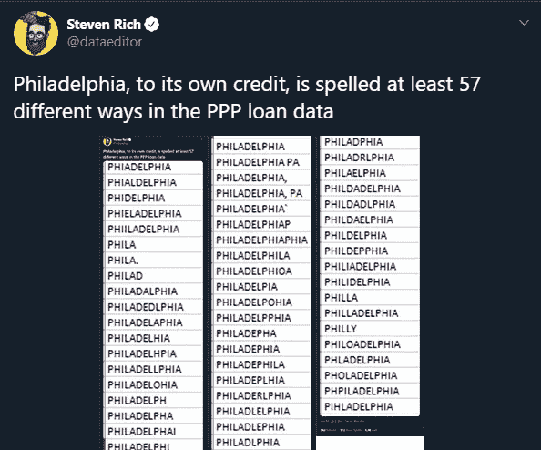
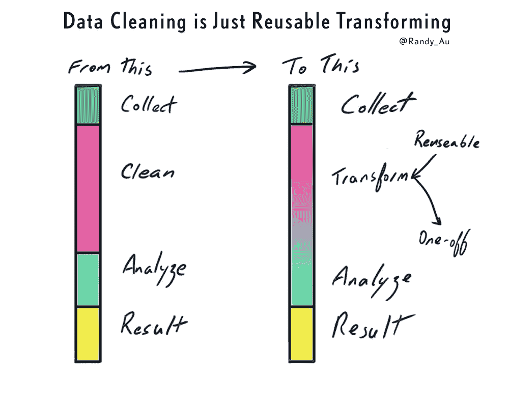

# 数据清理是分析，而不是繁重的工作

> 原文：<https://towardsdatascience.com/data-cleaning-is-analysis-not-grunt-work-edb386f9429d?source=collection_archive---------24----------------------->

## [行业笔记](https://towardsdatascience.com/tagged/notes-from-industry)

*曼哈顿哈德逊河沿岸有一个切割非常奇怪的树桩(反正从 2018 年开始)，几乎像一把椅子。但是如果你仔细看，这棵树已经长在一些旧的铁栅栏周围，留下了一个对无心电锯操作者来说不可战胜的树桩(摄影:Randy Au)*

*TL；DR:清洗数据被一些人认为是卑微的工作，在某种程度上低于性感的“真正的”数据科学工作。我叫 BS。* *清理数据的行为将数值/判断/解释强加于数据，旨在允许下游分析算法运行并给出结果。那跟做数据分析一模一样。事实上，“清理”只是进行全面数据分析过程中的一系列可重用数据转换。一旦我们接受了这个框架，我们需要采取的步骤就是更自然地清理数据流。我们希望允许我们的分析代码运行，控制无用的方差，消除偏见，并记录下来供他人使用，这一切都是为了服务于我们希望在未来运行的一系列潜在分析。*

已经是周四了(短暂的几周是最糟糕的)，我再次在 Twitter 上询问人们是否有人对我应该写的东西有想法。我得到的一个回复是:“清洗”。说真的，就是这样。

起初我认为这要求有点过分。数据清理是一个古老的话题，我能在时事通讯中写些什么来促进对话呢？

然后我开始看现有的关于数据清理的文章…它变得 ***烦人*** 。有一大堆东西都试图听起来很权威，说着同样的话。但是作为一个从业者，我看得出没什么用。这就像教科书中令人恼火的“留给读者做练习”。上次我对一个技术写作话题感到恼火，它催生了一个[怪物 SQL 优化帖子](https://counting.substack.com/p/learning-sql-201-optimizing-queries-regardless-of-platform-918a3af9c8b1)。

然后，我开始认真思考数据清理作为一个概念，并陷入了整个认识论的兔子洞。

所以让我们开始吧。

# 现有的数据清理写是相当无用的

首先，让我们从现有的关于“数据清理”的文章的问题开始。

[维基百科关于数据清理的帖子](https://en.wikipedia.org/wiki/Data_cleansing)对数据质量的重要品质做了很好的总结:有效性、准确性、完整性、一致性、一致性。它还有一个关于“过程”的部分，非常枯燥和学术化(以一种消极的方式)，根本不会帮助你清理任何数据。

接下来，当我搜索“数据清理”时，我将从谷歌上的顶部链接中抽取一些帖子。我会提供链接作为参考，这样你就知道我在抱怨什么了。

这个[高排名的页面](/the-ultimate-guide-to-data-cleaning-3969843991d4)就像是维基百科页面开始时更友好的扩展。幸运的是，它在 process 部分列出了一大串用于清理数据的示例技术，比如清理空间、删除不相关的值等等。有一些例子和插图！

[这一篇](https://www.geotab.com/blog/data-cleaning/)是我从未听说过的某个数据产品网站的类似博客的随机帖子。它很短，主要是“数据质量很重要，你需要持续监控它”。他们没有错，但也没什么帮助。然后他们会给出一个流程循环来清理、验证和监控您的数据…我想这是因为他们在向您销售产品中的一些功能。

接下来， [Tableau 加入了重复游戏](https://www.tableau.com/learn/articles/what-is-data-cleaning)，解释为什么干净的数据很重要，列出了类似的步骤清单，并在最后加上了数据质量的品质！还不错，但与目前为止的其他参赛作品非常相似。

数据科学教育网站[上的这个](https://elitedatascience.com/data-cleaning)说了“好数据>更好的算法”之类的话，还有机器人的卡通图片(我喜欢可爱的东西)，所以这是一个加分项。接下来就是检查清单，删除不良观察，修正错误，填补缺失值，等等。我在这里得到了他们的“销售”技能，但仍然。

模式识别大脑感知模式！

> 如果你想要一个高排名的数据清理帖子，只需记住“数据质量很重要”、“审计数据、发现错误、修复错误、监控、重复”和“良好数据质量的品质”这些概念。举几个例子。用<1000 字做。
> 
> *盈利！(字面意思，通过广告和产品销售)*

我最大的不满是，这些都是肤浅的清单，“去找到坏的东西并清理它！使用这些工具/技术。容易！”如果这么简单，我们就不会花这么多时间做了。你经常会收到一个“好数据具有这些品质”的列表，所以去看看你的数据，确保它具有这些品质。如果没有，就想办法把这些品质强加到数据上。与此同时，每个读者都在想，“那么，怎么做呢？”

*旁注:如果你搜索“数据清洗理论”，会有一些更好的讨论。*

还有[努力](https://www.leapwork.com/blog/automate-data-cleansing)到[自动化](https://cudbg.github.io/lab/cleaning)数据清理([通常在 AI](http://ceur-ws.org/Vol-2454/paper_8.pdf) 的帮助下，因为显然 AI 让一切变得更好)。这些努力的一部分源于有太多该死的数据，人类不可能分析所有的数据。但是这些产品/功能也旨在减少清理数据的苦差事，甚至不用看它。对此我非常怀疑。自动化很重要，但实际做清洁也很重要。

打扫卫生是一项艰难而细致入微的工作，为什么我们要像洗衣服一样对待它呢？我们没有给出如何分析数据的清单，对吗？(哦不，[有时人们显然会这样做](https://blog.k2datascience.com/essential-checklist-for-any-data-analysis-or-science-project-7c4fa924e563)……)

在这篇文章之前，我从未认真考虑过数据清理。但是，当我以批判的眼光看待它时，我发现我们已经在数据分析过程的一个乏味、令人沮丧的部分上贴上了一个令人不快的标签(谁想做清理工作，不妨称之为“舀数据猫砂”)。然后通过层层抽象和糟糕的教育，我们已经忘记了它有多重要。

然后，我们讲述恐怖故事，并进行“关注”研究，即 [80%](https://blog.ldodds.com/2020/01/31/do-data-scientists-spend-80-of-their-time-cleaning-data-turns-out-no/) 、 [60%](https://www.dataversity.net/survey-shows-data-scientists-spend-time-cleaning-data/#:~:text=Data%20scientists%20spend%2060%25%20of,enjoyable%20part%20of%20their%20work.) 、 [40%](https://businessoverbroadway.com/2019/02/19/how-do-data-professionals-spend-their-time-on-data-science-projects/) ，不管怎样，昂贵的数据科学家的时间有百分之多少都花在清理数据上。这一统计数据本身似乎更像是一种模糊的方向表达，而不是确凿的事实。利·多兹在这里写了一篇关于粗略统计的更详细的文章。

无论这种说法的实际真相是什么，其含义和行动呼吁都是明确的——如果我们让清理过程变得更简单、更快速、*自动化*，我们将迎来数据科学生产力的天堂。首席执行官们可以节省员工人数和薪水。每个员工都可以从一个漂亮的图形用户界面上进行简单的分析。数据科学家将使用*最佳*算法解决性感问题。会有满溢的酒杯，洞见会毫不费力地从天而降。

撇开愚蠢不谈，停下来想想数据清理实际上是什么。而不是“消除错误以提高数据质量”的机械定义。也不是“数据质量越好，结果越好”的终极目标。先说本体。

我们执行数据清理，因为我们怀疑有关于我们关心的一些主题的有用信号。例如，我怀疑当一个重要的截止日期临近时，我的抱怨量会增加。但是我感兴趣的信号被淹没在大量的噪音和错误中:我的发帖量与截止日期不相关，我的时区随着历史而改变。我下载了奇怪的数据，所以可能会有漏洞。我用两种语言写作。我发了很多微博，所以我不能阅读所有的微博并手工编码。

**我们正在进行清理，因为我们希望从噪声中提取有用的信号，为此，我们决定在数据点级别“可纠正”某些噪声。**因此，我们清洁这些部件，以免它们影响我们的分析。

# 等等，但那是数据分析！

我们称之为数据清理，因为不知何故，它“不是我正在做的真正的分析”，而是“之前的东西”。真正的工作是使用带有名称的算法，而不是“查找和替换”。我只是被迫做这种卑微的劳动，这样我就可以实现我作为真理带来者的真正荣耀。

这种清洁工作被认为是机械的，而且“不困难”。一个高中生或 RA 可以这样做，他们花费了我一部分薪水。但是考虑到一个 16 岁的人脑有多复杂，我不这么认为。

这里有一个非常典型的清洁情况。*边注，嵌入长得离谱所以我截屏* [*原文推文这里*](https://twitter.com/dataeditor/status/1280278987797942272) *。感觉就像在费城滚动了几英里。*

# 清理数据的行为是优先转换数据的行为，以便您选择的分析算法产生可解释的结果。这也是数据分析的行为。

如果我们的算法如此神奇，以至于我们可以只输入原始文本日志，而真正的见解却掉了出来，你猜怎么着，我们永远不会清理。我们的计算机不在乎我们的数据有多难看——都是 1 和 0。回归将高兴地向你提供的任何数字表中吐出系数。所有这些清理工作的真正原因是原始数据的信噪比太低，不符合我们的意图。我们需要提高数据质量来放大信号，以便我们的工具能够找到。

我们这样做:决定每个拼错费城的用户仍然有效，即使他们不会拼他们的家乡。我们没有简单地使用所有的模型特征，因为只有 3 个特征是重要的。我们需要排除具有 XYZ 档案的用户，因为我们给了他们特殊的折扣，他们会在销售页面上偏向我们的 A/B 实验。所有这些来自法国的用户都不算，因为我们没有在那里投放广告。需要排除来自错误#12345 的重复事件，否则会使我们的结果有偏差。

以上都是我们通过决策清理数据的例子。您可能会将一些分类为“清理”，一些分类为“分析”，但是它们都是非常相似的转换类别。被贴上“清理”和“分析”标签的似乎更多的是对其价值的判断——让我们听起来聪明的好东西被称为“分析”。

# 但是清洁是机械的。分析有意图！

分析意味着我们在寻找意义。清理，一个主要用于“修复质量问题”的步骤，比如打字错误和收集错误，难道没有分析的意图，这是两者之间的区别因素吗？

没有。

因为清理操作本身会对数据进行价值判断。回到费城的例子，对你来说似乎显而易见的是，所有这些拼写错误应该被分组在一起，并被清理为相同的正确值。作为一个经常分析互联网上打开的文本框中的垃圾数据的人，这是我看到这些数据时的自动反应。这是因为我所做的工作通常希望来自给定位置的所有数据被分组在一起。

但是如果你在做语言学研究呢？那些错别字其实对你来说极其有价值。将这种差异标准化会使这方面的任何分析变得不可能。如果我们不存储原始数据(这是推荐的最佳实践，只有一些人遵循)，它将永远丢失。

选择以任何一种方式转换数据必然意味着您已经选择用它来做某些事情，而排除其他事情。无论变化是大(输入缺失值、删除条目)还是小(删除尾部空格、规范化日期格式)，都没有关系。

作为一个例子，地球上最大的数据生成/收集系统之一，大型强子对撞机[生成如此多的数据，以原始形式](https://home.cern/science/computing/processing-what-record)存储是不可能的。因此，物理学家花费了无数的思考和精力，利用几十年的特定领域知识，创造出定制的算法来过滤和预选要记录的内容。它是为特定目的而构建的—他们实际上设计并控制了整个工具链，包括硬件。

*这里应该有些功劳:重申我写的东西没有一样是新的，在写这篇文章的中途，我发了一条关于数据清理的微博，它像病毒一样传播开来。* [*有人在惊人的推特数据群里*](https://twitter.com/kfvanes/status/1304381035690549248) *指点我* [*本刊出自于由凯蒂·罗森和特雷弗·穆尼奥斯(2019)*](https://dhdebates.gc.cuny.edu/read/untitled-f2acf72c-a469-49d8-be35-67f9ac1e3a60/section/07154de9-4903-428e-9c61-7a92a6f22e51) *。*

*来自数据人文领域(尽管 15 年前我做了一些计算哲学/社会学，但我甚至不知道这个领域的存在),它更有说服力地讨论了关于数据清理的非常相似的观察结果。非常推荐阅读！*

*亦作* [*另一位伟人*](https://twitter.com/SabinaLeonelli/status/1304447292355870720) *把我与* [*联系起来本文*](https://link.springer.com/chapter/10.1007/978-3-030-37177-7_5) *比较了两种宽泛的清理数据的方法，在无序中强加秩序。它还涉及经济学和生物学领域如何保存原始数据，预计未来可能需要重新分类(重新清理)。*

*[*还有一个牛逼的人*](https://twitter.com/angelawcrow/status/1304750592561164288) *给我指了 danah boyd 的* [*作品*](https://www.danah.org/papers/#articles)*[*这篇论文*](https://www.danah.org/papers/2012/BigData-ICS-Draft.pdf) *讨论了很多大数据的关键问题，包括数据清洗。指出当数据清理对你甚至可以用一组数据说什么有巨大影响时，它被认为是微不足道的。也很值得一读。***

# **清理数据可以让您了解自己的数据**

**我坚信，作为一名数据科学家，了解你的数据至关重要。这是我告诉每个向我寻求建议的人的一件事。只有当你知道已经收集了什么，什么**还没有**被收集，它是如何被收集的，陷阱在哪里，隐藏的依赖在哪里，等等，你才能使用你的数据做出自信的陈述。**

**达到这种熟悉程度的唯一方法是努力工作，深入熟悉手头的数据集。人们通常将这项工作归于分析的“探索性数据分析”阶段，但是 EDA 经常发生在数据已经被部分清理的时候。真正原始的、不干净的数据通常甚至不能在软件中正常运行，因为一些意想不到的事情通常会出错。解决这些问题会带来大量关于数据集的知识(和问题)。(好吧，精明的读者会注意到这不是唯一的方法，最终熟悉一个数据集的最好方法是亲自收集数据，但这是另一个话题。)**

**我们中的大多数人并不在严格的机构工作，这些机构会仔细记录数据收集的每一个细节，比如美国人口普查局。在我们的世界里，不存在能够回答关于方法论、数据质量和清洁度的微小问题的手册。此外，让我们诚实地说，我们当中有多少使用人口普查数据的人真正读过这些文件？绝对不是我。**

**我将提出这样的主张，清理数据是获得对底层数据的坚实理解的先决条件。如果你把这种责任委托给其他人，不管是其他人还是机器，你都有可能对你的数据做一些危险的事情。务实的问题是我们愿意承担多大的风险，以及你是否意识到自己在承担风险。**

**在许多情况下，这种危险的影响很小——通常很少有人会在意你是否曲解了人口普查数据，制作了一张糟糕的地图来发布。出于权宜之计，你可能愿意相信人口普查在维护高质量数据方面做得很好，并接受你可能会因为没有阅读某处的脚注而做一些愚蠢的事情。**

**通过在完全信任的基础上保证足够好的数据质量，您可以节省时间并直接跳到 EDA。当使用一个简单用途的众所周知的、可靠的资源时，这是一个非常诱人的立场。但是，即使有可靠的来源，不一致也确实存在，并且可以在以后被发现。希望这不会打乱你的发现。**

**但是如果你制作的地图被用来做生死攸关的决定呢？还是为了寻求真理的严肃学术研究？那么风险就更大了，你需要绝对确定你的发现不是一些人为的数据。不要相信别人的清洁。**

# **但是我们不能对每个分析都做清洗！那要花很长时间！它不会扩展！**

**不是每个数据分析都这样。对于每个数据**设置**。从清洁中学到的知识不会在一夜之间消失。您编写的用于执行清理的代码不会丢失。**

**清理是熟悉数据集的一种强大方法，也是生成所需数据集以获得有趣结果的一种强大方法。如果你非常了解这些数据，你可以蒙着眼睛浏览，你就不会再做手工清理了。到那时，您已经有了已经构建好的代码、工具和指南，并且对工具非常熟悉。**

**我并没有说我们不能自动化我们选择做的清洁操作。自动化的问题在于，它可能会将对底层数据的理解与数据的分析和解释分离开来。当我查询一个数据仓库时，我不熟悉由不知名的工程师编写的大量管道，每个管道每小时对万亿字节的数据进行非常具体的转换。这总是让我处于一个非常不舒服的位置，对我工作的基础没有 100%的信心。**

**但是，如果你正在做清理工作，编写清理代码，并使用它来实现自动化，这不是一个问题。你是发现所有问题并实施所有修复的人。希望你**记录并传播**这些知识，这样其他人可以受益并节省时间和精力。否则，你只是让别人不得不相信你的分析判断。**

# **没有人能幸免于变化**

**在所有这些工作中，每个人都需要担心的一件事是需要持续关注数据质量从我们脚下转移的情况。对于任何长期运行的数据操作来说，这都是一个持续的风险。**

**无论是自动化还是手动流程，如果底层数据收集流程发生变化，那么一切都完了。因此，预计偶尔不得不重新清洁操作。**

**在现代分布式系统基础设施设置中，防范这些情况是极其困难的。有些东西总是在变化或破裂的过程中，这些都有不可预知的副作用。**

# **让我们将数据清理重新定义为“构建可重用的转换”**

**一旦你把数据清理工作的地位提升到等同于“全面数据分析”的地位，我们就会陷入这种不安的境地，一切都是分析。将巨石柱分析过程分成几个阶段的冲动太强烈了，无法抗拒。作为一个阶段，我们已经有了探索性的数据分析，有些东西必须填补空白。**

**我建议我们开始将数据清理视为“构建可重用的转换”，原因有二:**

**首先，分析使用转换从数据中提取洞察力。我们以某种方式(如聚类、SVM、决策树)洗牌，通过某种镜头(如回归、统计推断)审视数据，我们看到了以前未知的模式和真相。**

**第二，典型的数据清理操作是在分析过程的早期进行的，以便为“真正的分析”做准备。我们能够这样做的唯一原因是，这些早期的清理转换可以在大量的分析中重复使用。随着我们越来越接近最终的分析，可重用性逐渐降低。**

**因此“清理数据”的行为实际上是构建一个转换库，该库在同一数据集的多个分析中可以重用。在某个很大程度上任意的截止点，您将数据交给其他人使用。**

****

**好了，现在我已经滔滔不绝地讲述了数据清理是分析过程的一个关键部分，让我们来完成数据清理即分析的过程。**

# **“更好地”进行数据清理**

**当您开始将数据清理视为“我需要采取的步骤，以使我的分析算法产生有用的结果”，而不是“在我可以使用我的数据之前，这里有一个我需要检查的属性和错误的列表”，世界看起来有点不同。我们可以从我们的最终分析目标开始反向工作。**

# **首先，除非你非常确定，否则不要做永久性的改变**

**当我们开始清理和分析的时候，我们将会在早期做出一系列将来可能会后悔的决定。我们想避免这种情况。因此，第一条规则是尽可能保留原始数据的副本。实际上，在开始工作之前，我已经压缩并单独存档了一个原始数据集，这样我就不会不小心扔掉它。**

**只有当有压倒一切的限制时(比如 LHC 的体积问题)，你才应该考虑永久丢弃数据。在这样做之前，你最好确定你的数据清理过程的质量。与无法撤销任何错误并需要收集新数据的遗憾相比，数据存储相对便宜。**

# **其次，永远要留下完整的分析文件记录**

**我以前曾经更详细地写过关于这个主题的文章，但是你总是想要一份你的分析的书面记录。从原始数据到最终呈现的转换过程中的每一步都应该有指向之前步骤的链接/参考。这可以提醒你做了什么来完成一个分析，以便日后重现，它也允许你回答关于分析是如何完成的问题(“你考虑了 X 吗？”)几个月后，几年后。**

**在 Jupyter 笔记本、colab 和版本控制的时代，没有太多的理由不提供线索。随着时间的推移，您的清理转换库将变得足够健壮，您可以将它打包到一个库中。**

**记住这些基础知识，我们就可以开始清理/分析我们的数据了。**

# **目标 1:修复那些会让你的分析算法窒息的东西**

**我们都应该非常熟悉这一系列事件:你把数据格式化，把它放入你选择的软件中，点击“分析事物！”按钮，annnnnnd…它崩溃了——无效输入、意外的空值、负持续时间、不正确的数组大小。虫子。**

**乍一看，这类问题似乎是最机械的，很容易通过自动化处理。这些是突然出现的随机空值，通过表单验证的荒谬表情符号，应该是唯一的重复 id，由于日志系统时钟不同步，具有时间戳的数据条目暗示着时间旅行。通常这些很容易发现，因为你的数据管道崩溃或给出其他无意义的结果。**

**当人们嘲笑数据清理时，他们正在思考这些问题。有数不清的变化，他们都很讨厌处理。通常你修复了一个，满怀希望地期待你花了几天时间进行的分析最终会有结果…然后一个新的出现了。**

**许多这些问题的解决似乎也很容易。只需去掉 Unicode，将所有的 NULLS 变成空白，直接忽略重复的代码，只需让我的代码运行！**

**遗憾的是，在生产环境中，我们无法掩盖所有这些问题。那些怪癖都是 bug。有时它们是无辜的，您可以安全地去掉 Unicode。但有时它们是一个更阴险的错误的结果，一个将偏见引入整个系统的错误。就像可能出于某种难以理解的原因，由于第二个日志记录错误，只有带有表情符号的名字才会出现在数据集中。**

**问题是，仅仅从数据上看，没有办法知道一个错误属于无辜的灾难范围的哪一部分。你必须去跑腿分析这个问题，自己找出答案。这将大大降低你的工作速度，甚至可能迫使你扔掉你的数据集！这通常是吃力不讨好和不受欢迎的工作。这就是为什么我们讨厌这样做。**

**但是如果你做不到，你的分析可能就站不住脚了。**

# **目标 2:减少不必要的变化**

**在柏拉图式球形奶牛落入真空的完美理想世界中，数据集中唯一存在的差异是“重要的差异”。A 组的每个人都在测试中得了 35 分，B 组的每个人都得了 95 分。组 A 和组 B 是克隆体，仅在处理 t 上不同。**

**显然，我们必须处理现实世界中的变化。但是你可以想象“清理”数据的方法，这种方法可以给各种算法，如回归、k-means 等，提供最大的信号。，同时仍然保持在伦理和统计的界限内。简单的例子是固定拼写和规范标点符号。更高级的情况包括将值分类。**

**当人们使用大 A 进行“分析”时，他们通常能够找到控制这种差异的方法，使用名称为“特征选择”、“归一化”或“特征生成”的方法，所有这些方法都涉及到用一些差异信息来换取算法上的好处。当他们不想吹嘘它的时候，他们会把它塞进一个脚注/附录，称之为“清洗”。**

**有些测量的方差对我们有用，有些可以去掉而不影响我们的目标分析。了解其中的区别是从事数据工作的一个重要部分。**

# **目标 3:消除偏见(尽你所能)**

**偏见是我们的敌人。我们希望我们的工作是稳健的和可推广的，而数据中的偏见会毁了这一点。如果你打算为你花在数据准备上的时间和大脑周期做预算，那就在这里花大部分时间。**

**用于控制偏差的许多常见操作包括丢弃某些数据条目、填充缺失值或校正/重新采样/重新映射值，所有这些都是为了控制渗入原始数据的特殊数据偏差。**

**这就是**专业知识至关重要的地方**。某个主题的专家能够更好地识别数据集中潜在偏差的位置。这些人知道在哪里发现收集的数据中的明显偏见:数据收集错误(重复等)，内部测试者帐户，人口过采样，受访者的自我选择，等等。但是专家们也应该知道如何识别数据集中隐含的结构性偏差，什么*没有*被收集，并且能够想出策略来最小化这些问题带来的损害。**

**领域知识还会告诉你手头的任务是否需要清理。如果我们不在乎人们从哪个城市申请贷款，我们就永远不用担心清理 50 多种拼写错误的“费城”。如果我们怀疑我们可能需要它，我们会投入一些精力来修复它。**

**随着目前所有关于机器学习和算法偏见的道德使用的讨论，清理数据的这一方面比以往任何时候都更加重要。如果有偏见的数据进入 ML 系统，就会发生不好的事情，[像计算机视觉系统在处理深色皮肤颜色方面仍然有问题](https://www.wired.com/story/best-algorithms-struggle-recognize-black-faces-equally/)。**

**当你达到这一水平时，你正在进行的许多清理操作应该开始变得非常具体，以实现你的最终目标，很难判断你是在清理还是在做分析。这些步骤越来越复杂，需要更严格的论证。**

# **我在给别人做数据集，我怎么知道要清理什么？**

**除非你知道人们会用这些数据做什么，否则你不会知道。即使你知道，你仍然必须猜测什么可能有助于他们的分析，而不是伤害它。到目前为止，最重要的事情是**完整地记录下**每一个清洁决定，以备将来之需。**

**知道在哪里停下来并交给下一个人是这个过程中最难的部分。你必须预见未来，预测人们将要做什么。因为我甚至不能预测我自己会做什么样的分析，更不用说别人了，所以你不会 100%正确，你必须做出调整。最好提前为该迭代做好计划。**

# **谢谢！**

**希望这篇博文能帮助你稍微改变一下看待清理数据的方式。我承认我甚至没有停下来认真思考“什么是清洁？”直到这篇文章引发了各种有趣的问题。有很多更聪明的人对此有更好的思考和写作，就像我之前链接的那些论文。**

***我是 Randy Au，目前是 UX 定量研究员，前数据分析师，通用数据和技术爱好者。计数材料时事通讯是一个关于数据科学、UX 研究和技术的不那么性感的方面的每周数据/技术博客。偶尔会谈到其他有趣的话题。***

***最初发表于*[T5【https://counting.substack.com】](https://counting.substack.com/p/data-cleaning-is-analysis-not-grunt)*。欢迎推文和评论。***