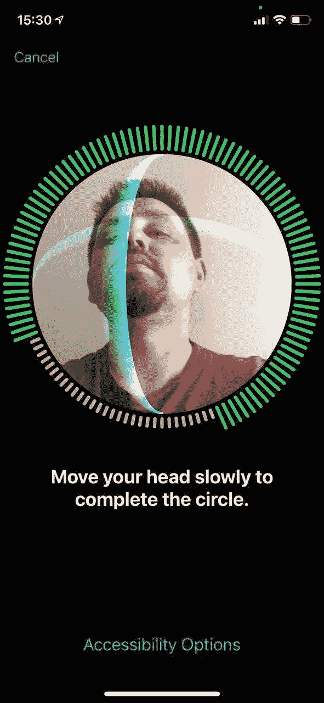
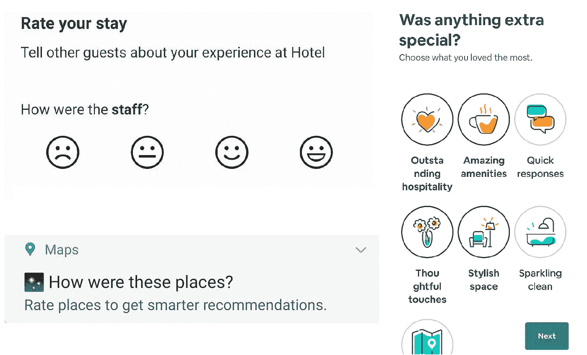
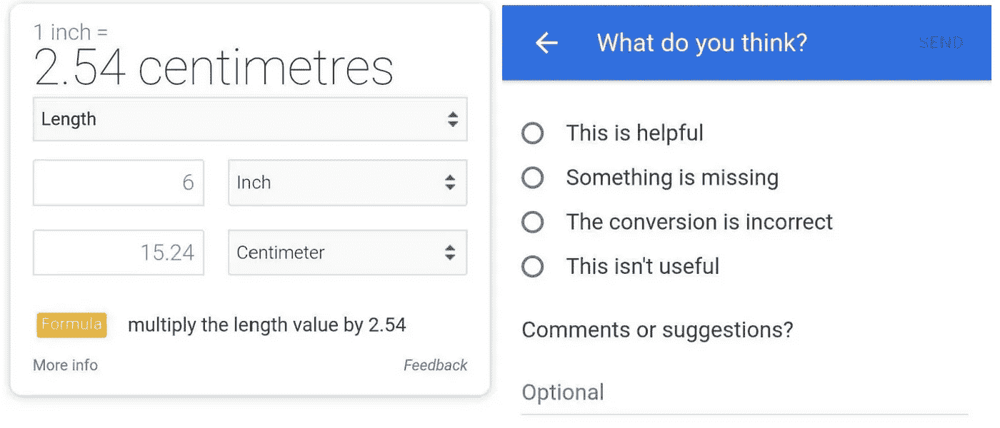
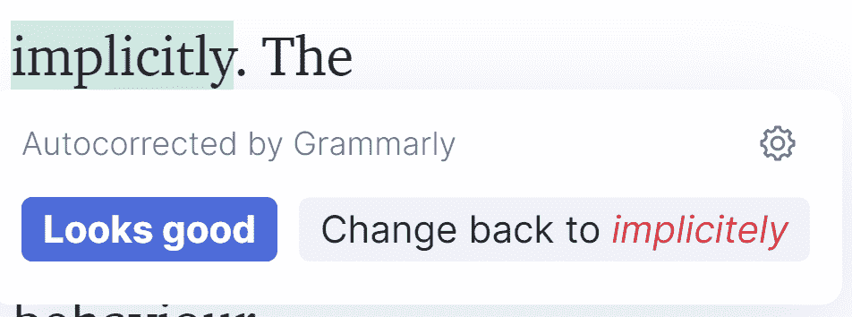
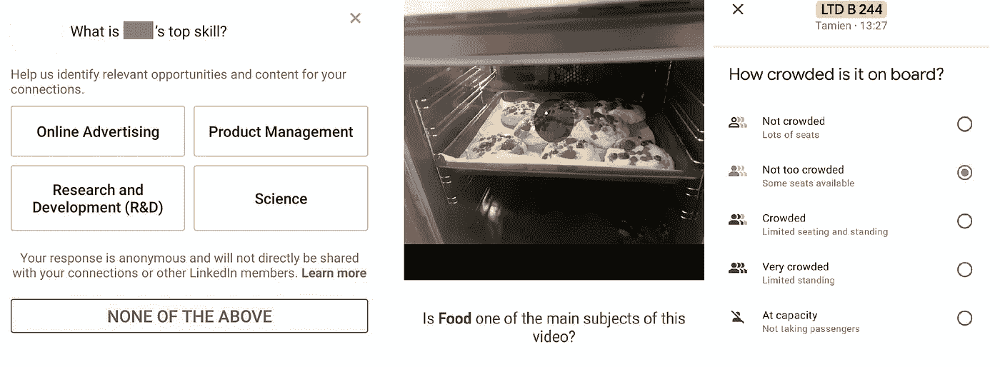

# 机器学习产品中的数据收集

> 原文：<https://towardsdatascience.com/data-collection-in-machine-learning-products-816c1e1951b1?source=collection_archive---------29----------------------->

## 带示例

布雷特·乔丹在 [Unsplash](https://unsplash.com?utm_source=medium&utm_medium=referral) 上的照片

当我刚刚开始我的数据科学之路时，对我来说一切都是关于精确建模的。但我很快意识到，要提供真正的价值，模型不能存在于真空中。为了获得合理的性能，我遗漏了数据的重要方面，不太清楚用户对模型结果的反应。 ***因此，我开始从我认为或知道的 ML 驱动的产品中收集例子，以了解不同公司收集数据的方式来解决这些问题。在这篇文章中，我想分享一些我收集的案例，大部分来自面向消费者的产品，以及它们为从事数据驱动产品的数据科学家和产品经理解决了什么问题。***

尽管我下面描述的许多模式并不完全是专门针对 ML 产品的，并且可以应用于任何数字产品，但当涉及到 ML 时，它们变得至关重要。为什么？ML 模型可以在他们从未见过的例子上操作，或者在高度个性化的环境中操作，所以他们几乎不可能对每个输出进行测试。因此，允许用户反馈有助于识别不太好的体验。此外，一些模型能够动态地整合反馈，并几乎立即调整用户体验。最重要的是，ML 模型是以数据为基础的，所以规模化的优质数据收集是优质模型的基础。

**免责声明 。我不*实际上*知道这篇文章中描述的元素在真实产品中是如何工作的——这篇评论是基于我的理解和公司在公开的文章和演示中分享的信息。我在这里描述的是我的观点——“我可能会做什么”。**

我将写几类数据收集:

1.  预体验—用于在使用前调整产品功能。
2.  反馈——用于衡量用户对产品体验的反应。
3.  众包——用于收集与特定用户的产品体验无关的额外数据。

# 体验前模式—准备好开始了吗？

体验前数据收集可用于快速个性化产品。这里的目标是快速收集相关数据。这有助于确保用户尽快接触到数据驱动的产品功能。在某些情况下，这是让产品发挥作用的唯一方法。因此，数据收集需要在产品或功能的开始阶段进行。它可以以填写用户资料、设定个人目标或校准产品的形式出现。

有一系列可能的 ML 学习模型可以涉及个性化——推荐器、分类器、回归模型等等。他们可以将收集的数据用作模型要素或标签。

记住 ***也很重要，当你要求用户分享信息时，你需要为他们提供价值作为回报*** 。

## 目标和偏好——我想，我喜欢，我是

对于 ***推荐器*** 系统，收集偏好数据有助于解决用户“冷启动”问题。我们可以在从用户与系统的交互中获得足够的隐式数据之前，构建一个初始特征向量。在下面的例子中，Spotify 用户被要求在入职时选择至少 3 位最喜欢的艺术家。然后，可以将协同过滤应用于用户的选择，以提供初始播放列表推荐。

**(左)**图片由作者提供，截图取自作者在 [Coursera](https://www.coursera.org/) 内容推荐设置| **(中)**图片由作者提供，截图取自作者在 [Youper](https://www.youper.ai/) onboarding 的体验，心理健康目标| **(右)**图片由作者提供，截图取自作者在[Spotify](https://open.spotify.com/)favorite artists on boarding 屏幕的体验。

由于用户通常希望在入职期间回答一些问题，这也是一个捕捉行为方面的机会，否则很难衡量，如动机或兴趣。

重要的是要对你要问的问题的数量和类型有足够的选择性，以避免侵犯用户的隐私或使用户的入职时间太长而无法完成。 ***所以你需要了解什么样的数据可能对你的模型最有鉴别能力。在问用户一个额外的问题之前，你需要做用户或领域研究，与专家交谈，分析可用数据以确定最有希望的方向。然后提出假设，试着收集一些数据来验证它是否带来了有用的信号。***

## 校准—我们来调整一下

校准通常用于传感器数据，以确保该工具在每个特定设备上都能按预期工作。一个例子可能是 Face ID，其中人脸识别模型的最后一层应该根据特定用户的数据进行训练。校准可以用来获得正面的类样本——从不同角度看用户的面部。

苹果 [Face ID 校准](https://support.apple.com/en-us/HT208109)界面|图片由[弗拉基米尔·雅基莫夫](https://medium.com/@yakimov88)提供，经允许后发布，截图由弗拉基米尔在设置 Face ID 时拍摄。

# 反馈模式——你觉得怎么样？

反馈被称为输出，可以反馈给系统。当我们考虑 ML 的产品环境时，反馈可以通过用户对模型输出的反应来定义，该模型可以用来改善用户体验。

## 隐性与显性—观察或询问

***隐性反馈*** 通过观察用户对产品组件的反应(点击、鼠标悬停、转化、参与持续时间)来收集。

隐式反馈的好处是它不需要用户的额外操作，所以它是为每个人收集的。与此同时，仅依赖隐式反馈会使理解用户行为背后的细微推理变得更加困难。如果没有额外的信息，就无法判断用户在停止播放 YouTube 视频时是感到无聊还是变得忙碌。然而，当用户再次回到应用程序时，理解原因对于决定显示此内容或类似内容至关重要。此外，在许多情况下，需要花费时间来收集足够的区别性隐式数据，以便为每个用户做出准确的决策。

不是任何用户活动数据收集都可以被视为反馈。例如，我的 Spotify 流媒体历史记录需要与我的推荐联系起来，才能成为反馈。我是从建议的曲目中选择播放列表还是搜索特定曲目？我在播放播放列表时跳过了任何曲目吗？反馈问题总是——对体验的反应是什么？

[Spotify](https://open.spotify.com/) 流媒体历史作者的数据样本。

像脸书反应或保存到书签这样的工具也可以归因于隐性反馈。他们都在帮助用户实现他们的目标——让他们的朋友知道他们关心这个帖子，或者确保在将来可以方便地访问重要的项目。这些动作向模型发出信号，表明特定内容对该用户很重要。与此同时，他们对动机的理解也有所不同——对一个帖子的反应是 [*关心*](https://www.facebook.com/careers/life/the-story-of-facebooks-care-reaction) 和*生气*。

***明确的反馈*** 通过提出明确的问题来获得。如果用户可以选择不回答(就用户体验而言，这是一个很好的做法)，这种类型的反馈带有[自我选择偏差](https://www.statisticshowto.com/self-selection-bias/)。只有参与的用户或有强烈意见的用户才会愿意提供。

**(左)**图片由作者提供，截图取自作者在 [Facebook Messenger](https://www.messenger.com/) 语音通话反馈屏幕| **(右)**图片由作者提供，截图取自作者在 [Gmail](https://mail.google.com/mail/u/0/) 收件箱的广告体验。

同时，通过询问更多关于体验的具体问题，可以帮助你更深入地理解问题。

## 正面与负面反馈——喜欢还是讨厌

***正反馈*** 确认与产品互动成功。我喜欢它，它很有用，这对我很有用。
***负反馈*** 突出系统的问题或允许改变不想要的结果。我不喜欢它，它是不正确的，我不想这样。

“对话不重要”|图片由作者提供，截图取自作者在 [Gmail](https://mail.google.com/mail/u/0/) 桌面收件箱的体验。

例如，Gmail 的“对话不重要”功能可以为预测邮件重要性的模型收集正确的标签。它可用于改进模型整体或特定用户的个性化预测。

只有在大多数配置中，隐式反馈往往是积极的，而显式反馈在一个界面元素中既可以是积极的，也可以是消极的。

## 询问与允许反馈

我们可以选择 ***主动向*** 用户 ***询问反馈*** ，通过发送推送通知或使其成为产品流的一部分。

例如，它可以用作主动学习算法的一部分，在这种情况下，获取特定案例的标签很重要。向相关用户寻求标签会增加他们做出反应的机会。例如，Airbnb 或 Booking.com 等服务可以主动联系用户，通过询问新物业来解决项目“冷启动”问题，或者通过比较不同用户的反应来建立用户档案。

**(左上)**图片来自作者，截图来自作者入住后【Booking.com】[发给作者的房产评级推送通知(酒店名称已修改)| **(左下)**图片来自作者，截图来自作者到访后](https://www.booking.com/)[谷歌地图](https://www.google.com/maps/)发给作者的房产评级推送通知| **(右图)**图片来自作者入住后 [Airbnb](https://www.airbnb.com/) 发给作者的房产评级应用内流程截图

***被动反馈*** 较少干扰用户体验，但仍可访问。用户可以使用它来纠正或报告他们的体验。正如我之前提到的，有时我们无法测试模型在现实生活中会遇到的所有边缘情况，因此允许这样的反馈可以让我们对负面或混乱的用户体验保持透明。

[Google 搜索](https://www.google.com/search?q=inch+to+cm)的单位转换器中的反馈|作者图片，作者通过搜索“英寸到厘米”截图，打开反馈调查。

## ***确认反馈*** —我们做对了吗？

确认反馈类似于主动反馈。在这种情况下，产品变更是主动进行的，用户可以选择确认或拒绝。在下面的例子中，语法上自动纠正单词，但允许用户通过确认改变来提供正面反馈，或者通过回滚到最初键入的单词来提供负面反馈。然后，该反馈可以用作分类模型的标签。这些将是重要的标签，因为模型犯了一个错误，这个错误已经被用户纠正了。

[语法上](https://app.grammarly.com/)自动更正|图片由作者提供，截图由作者在使用语法上的自动更正时，通过键入“隐含地”进行截图。

# 众包模式——帮助我们帮助他人

在上面的例子中，用户通常希望在分享数据后马上发生一些事情，以改善他们的体验，或者表达他们对刚刚发生的交互的看法。通过众包，用户可以被激励提供数据来影响其他用户或随着时间的推移获得更好的产品质量。

这可能是您获得关于没有足够数据的项目的更多信息的方式，方法是询问几个用户，获得您不确定的预测标签，或者为尚不存在的全新产品收集数据。在下面的例子中，Linkedin 要求其他用户填写他们的联系信息，这不会影响他们的即时体验。

**(左)**“帮助我们识别相关机会”——图片由作者提供，截图取自作者的 [Linkedin](http://linkedin.com) feed 并被修改以隐藏个人信息| **(中)**“帮助我们了解你的视频是关于什么的”——图片由作者提供，截图取自作者的“帮助改进 [Google Photos](https://www.google.com/photos/about/) ”以作者的视频为特色的流程| **(右)**“在公交车上是什么感觉？”—图片由作者提供，截图取自作者的[谷歌地图](https://www.google.com/maps/)搜索。

# **结论**

收集相关数据是建立有效的 ML 模型和它们所驱动的伟大产品的重要工具。在多样化的数据收集机制方面与产品和 UX 团队密切合作，可以帮助数据科学家及时获得相关数据点，从而确保更好的模型性能。

*如果您想了解机器学习的产品和 UX 方面的更多信息，请查看:*

1.  苹果人机界面指南— [输入](https://developer.apple.com/design/human-interface-guidelines/machine-learning/inputs/explicit-feedback/)

2.[以人为中心的机器学习](https://medium.com/google-design/human-centered-machine-learning-a770d10562cd) —共同学习和适应的计划

3.贾瓦黑尔，加维什，索姆佐尔，马丁，科斯特科娃，帕蒂。(2010).在线音乐推荐服务中隐式和显式反馈的比较。10.1145/1869446.1869453.