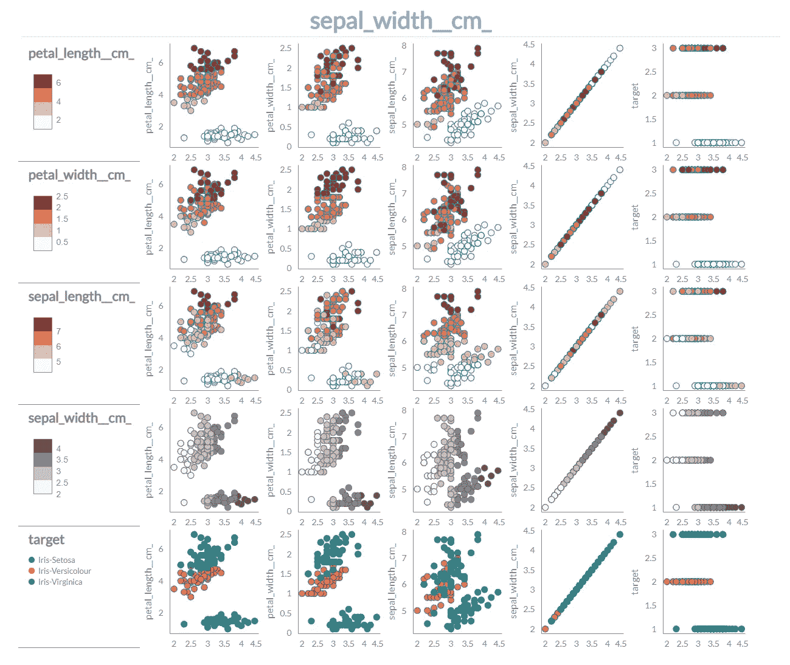
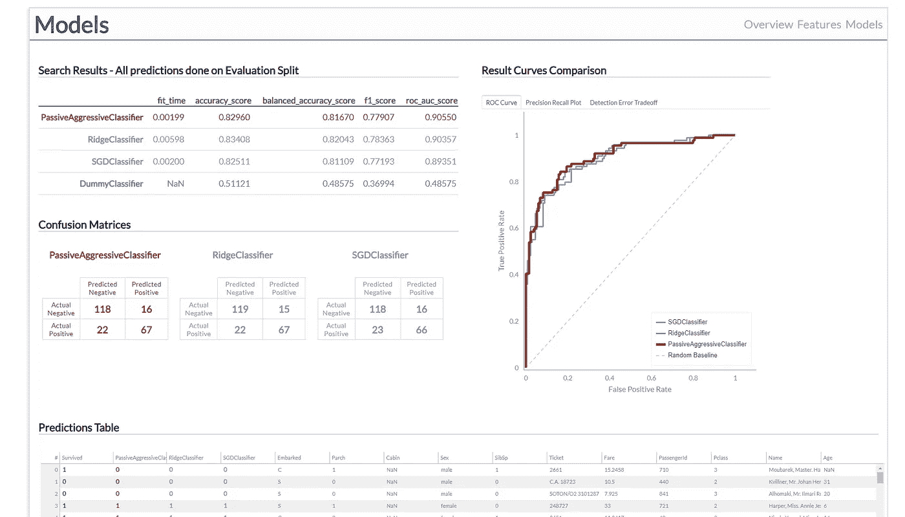
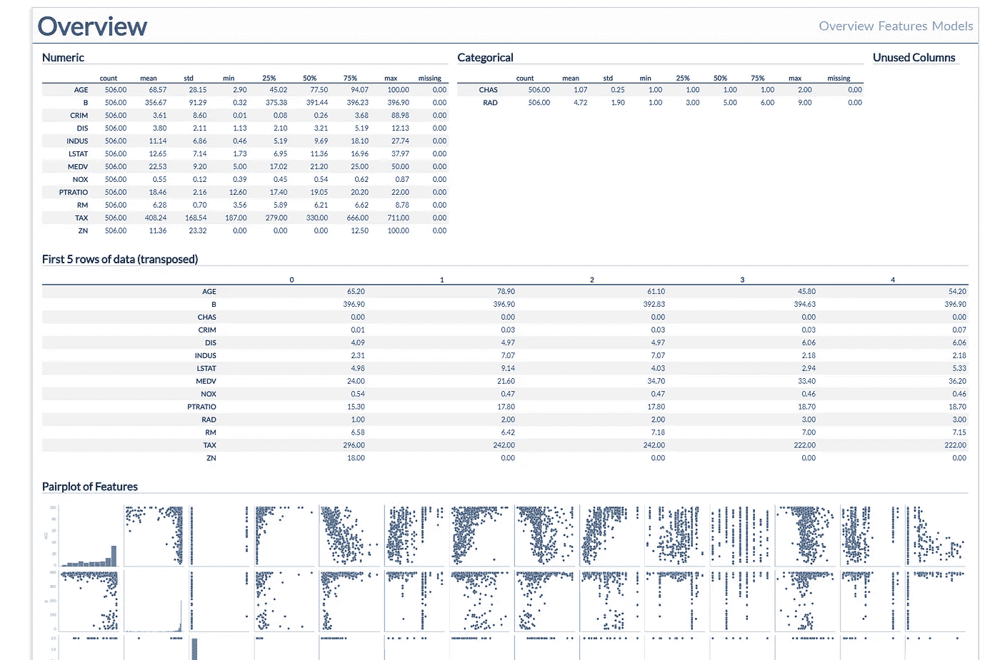
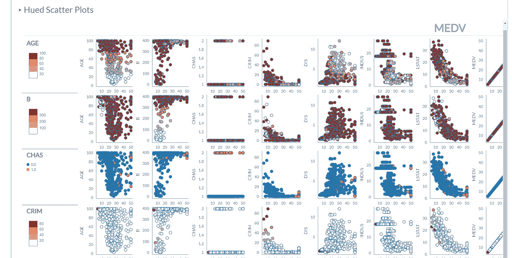
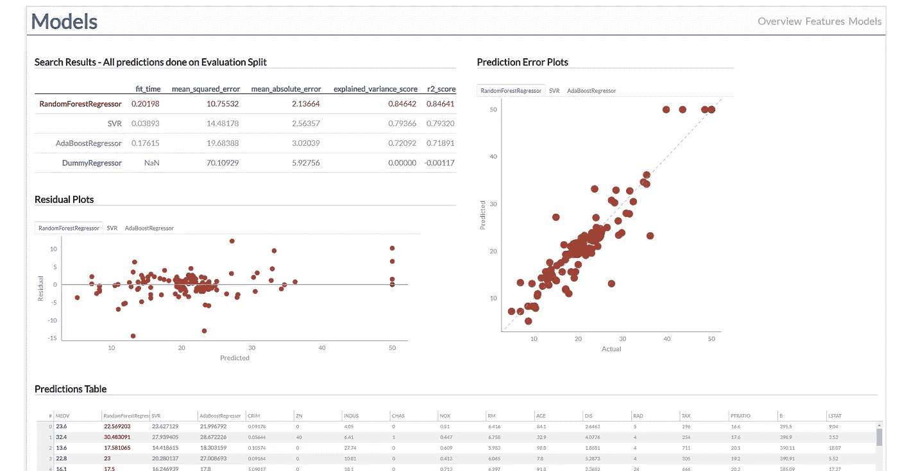

# data_dashboard:用于 EDA 和基线 ML 模型创建的 Python 包

> 原文：<https://towardsdatascience.com/data-dashboard-python-package-for-eda-and-baseline-ml-model-creation-f10840a6cea0?source=collection_archive---------23----------------------->

## 基于 HTML 的仪表板，让您的头脑环绕在数据周围



要素页面中的散点图网格(Iris 数据集)

你曾经被提供了一个 Excel 电子表格，CSV 文件或任何其他数据，没有任何有用的上下文，但有一个任务是“从中做出有用的东西”吗？或者也许你刚刚参加了另一个 Kaggle 比赛，下载了数据，并开始想知道从哪里开始？我记得在那里，我用 Jupyter Notebook 在一些单元格中创建了无数的表格，在其他单元格中创建了可视化，并在其他地方创建了我自己的注释。最后，我只剩下一个乱七八糟的笔记本，根本不知道下面发生了什么。恼怒和恼怒之下，我冒险踏上了创建代码的旅程，这些代码不仅能完成所有的工作，还能以一种实际上有助于理解数据的方式呈现数据。因此，经过大量的思考和更多的编码，我成功地完成了这个版本，它不仅可以处理几乎所有的数据，还可以为其他人(不仅仅是我)所用。向您呈现…

# 数据 _ 仪表板



HTML 仪表板中的一个页面

data_dashboard 是一个 Python 包，它试图在您获得数据但不知道从哪里开始时帮助您。该软件包旨在:

*   通过描述性统计和可视化提供数据概述，帮助数据科学家理解数据；
*   通过提供直观的界面，帮助进行特征工程/转换/数据清理；
*   通过对一组预定义的模型(可以定制以满足数据科学家的需求)执行 GridSearch，创建最佳可能的“基线”机器学习模型(sk learn)；
*   创建 HTML Dashboard，它不仅是用户友好的和易于导航的，而且是一个专注于设计和风格的(为了美学上的愉悦和“商业”演示准备)；
*   为初级数据科学家提供教育材料，他们可能缺乏广泛操作数据和创建适当可视化的能力；

您可以通过 pip 下载该软件包:

```
pip install data-dashboard
```

要开始使用它，你需要三样东西:

*   ***X*** :您的数据(已经载入内存)
*   ***y*** :你的目标变量(已经载入内存)
*   ***output _ directory***:创建仪表板的文件夹路径

请记住，没有必要预先转换您的数据——Dashboard 会处理好的。如果你手头没有任何数据集，你可以使用内置的例子(sklearn 的玩具数据集)。

这样一来，仪表板的创建就非常简单了:

```
from data_dashboard import Dashboard
from data_dashboard.examples import irisoutput_directory = “your_path/dashboard_output”
X, y, descriptions = iris()# descriptions is an optional argument, more in documentation
dsh = Dashboard(X, y, output_directory, descriptions)  dsh.create_dashboard()
```

HTML Dashboard 将在提供的输出目录中创建，并在您的默认浏览器中打开供您研究。如果您对定制仪表板的创建感兴趣，请访问这里的文档。

如果您不能创建自己的仪表板，您还可以查看已部署的示例(使用 Titanic 数据集):【https://example-data-dashboard.herokuapp.com/

# 仪表盘

Dashboard 只不过是一组“静态”的 HTML 文件——不需要将它们放在服务器上或用 localhost 模拟来查看它们。您可以自由地移动文件或删除它们，并快速创建新的文件(没有任何额外的复杂性层)。但是，请记住，用于创建可视化和表格的每一部分数据都是直接嵌入到 HTML/JS 代码中的——除非您的数据是公开的，否则全局共享该仪表板是不明智的。

创建的仪表板分为 3 个部分:

*   概观
*   特征
*   模型

## 概观



仪表板的概览页面

创建的控制面板的第一页是概述，这是理解数据的简单而重要的开始。你的 ***X*** 中的每一个特征都在这里得到各自的统计数据:平均值、中值、最小值、最大值等等。分类变量也是如此，它们在内部被转换成数字以实现这一点。如果您的特性不会在流程中使用(例如，这是一个*日期*类型的特性)，它的名称将包含在未使用的列部分。请记住，表格中的所有功能名称(例如图中所示的*年龄*)都是“可悬停的”——当鼠标指针经过它们时，会出现一个包含附加信息的描述框。最后但同样重要的是，页面的底部元素是一个很好的老式 seaborn pair plot——所有有用的信息都浓缩在一个图中。

## 特征


仪表板的功能页面

“功能”页面让您深入了解单个功能及其与其他功能的关系。这里最重要的是左上角的“汉堡”按钮——你可以用它来改变当前的功能。页面也被分成更小的子部分，以防止不必要的混乱。

前两个部分侧重于活动要素-第一部分是描述性统计数据和分布直方图，第二部分是具有实际变换要素的变换器。如前所述，Dashboard 会转换所有提供的数据，以便在模型训练中使用。然而，默认转换器非常简单——如果您觉得它们不够用，您可以随时进一步定制它们(或者甚至预先转换您的功能并完全跳过 Dashboard 的转换)。同样，如果你感兴趣，请参考[文档](https://data-dashboard.readthedocs.io/en/latest/dashboard.html#setting-custom-preprocessors-in-dashboard)。另一件需要注意的事情是数字类型特征的额外可视化行-3 个不同的转换器用于“归一化”值，然后将它们绘制为直方图-这样您可以决定哪个归一化器在这方面做得最好。

第三部分是特征之间具有皮尔逊相关性的热图。这是页面中交互性最差的可视化，因为它不响应功能的变化。可视化也不“关心”相关的方向-0.8 和(-0.8)在颜色强度方面被视为相同。还对“原始”值和标准化值计算相关性。对结果要有所保留，因为分类变量与数值变量的处理方式是一样的。



特征页面中的散点图网格

页面的最后一部分是散点图网格。还记得 seaborn 在概览页面上的 pairplot，以及它是如何绘制每个特性之间的关系的吗？这是同一个概念，但有一个额外的变化——选择的特征现在在每个情节中起着一个着色因素的作用。您可能会发现识别数据中的一些模式很有用。

另一方面，有时 seaborn 的总览成对图和散点图网格都没有创建。有一个很好的理由，因为那些元素是基于你的 ***X*** 中的特性——你拥有的越多，需要创建的支线剧情就越多( *n* )。因此，如果达到一个任意的限制，那么这两个元素在运行时和可视化上都将被禁用(在大约 200 个或更多的图中寻找模式没有什么意思)。[文档](https://data-dashboard.readthedocs.io/en/latest/dashboard.html#disabling-pairplots)为您提供了在需要时如何启用它们的方法。

## 模型



Dashboard 的工作并不仅限于使用表格和可视化工具进行探索性数据分析，还将对您的数据进行搜索、选择和训练。Dashboard 会自动评估目标变量内部的内容，并决定它所面临的问题类型(回归、二元分类或多类分类)。接下来，网格搜索一组默认模型，并选择性能最佳的模型(基于您选择的评分函数)。这一步是可定制的——您可以控制是对所有模型进行网格搜索，还是只对性能最好的“默认”模型进行审查(类似于 [LazyPredict](https://github.com/shankarpandala/lazypredict) 包)。此外，您还可以提供自己的模型及其参数来进行搜索和比较。如果你感兴趣的话，一切都写在[文档](https://data-dashboard.readthedocs.io/en/latest/dashboard.html#models)中。

为了说明这一点，Dashboard 试图纳入所有关于训练模型的良好实践—数据被分成训练集和测试集，所有模型和变压器的训练都是在训练集上完成的，您在仪表板中看到的结果是使用测试集计算的。

最后但并非最不重要的一点是，模型页面中包含了适当的可视化——您可以比较表现最佳的模型，查看它们在特定问题评估方面的不足之处，等等。根据问题的类型，将创建不同类型的可视化(例如，二元分类的 ROC/Precision-Recall/DET 曲线、回归的预测误差和残差以及多类分类的混淆矩阵)。情节是使用[散景](https://bokeh.org/)库构建的，因此它们是高度交互式的——你可以四处移动情节，放大或缩小，点击图例以静音一些元素，悬停以获得附加信息，等等。

表中始终包括表现最佳的模型的分数，您可以看到模型在不同的评分函数下是如何工作的，而不仅仅是在开始时选择的那个。此外，每个模型名称都是“可悬停的”(类似于表中的特征名称)，但它将向您显示用于创建模型的参数，而不是描述。

类似地，预测表也存在于所有类型的问题中——这是一个简单的表，比较不同模型对每行数据的预测。您可以尝试使用它来识别任何“有问题”的行。

# 结论

data_dashboard 包的创建不仅是为了自动化数据科学家在第一次接触新数据时需要解决的所有初始步骤，而且是为了以用户友好和以设计为中心的方式完成这些步骤。理解数据是成功分析和预测的关键之一——培养这种“纽带”,你很快就会成为大师。希望 data_dashboard 能在这方面帮助你！

## 证明文件

[https://data-dashboard.readthedocs.io/en/latest/](https://data-dashboard.readthedocs.io/en/latest/)

## 开源代码库

<https://github.com/maciek3000/data_dashboard>  

## 放弃

请记住，这是我第一次尝试 Python 包(甚至是其他人使用的开源代码)。如果你遇到任何问题或者你觉得有些地方可以改进，请随时联系我(任何社交门户或电子邮件:【dowgird.maciej@gmail.com】T2)。我很乐意得到反馈！