# Tableau 中的数据加密

> 原文：<https://towardsdatascience.com/data-densification-in-tableau-93c0a6bfcc5f?source=collection_archive---------19----------------------->

## 理解 Tableau 中的数据加密所需的一切

索尔·梅尔卡多在 [Unsplash](https://unsplash.com?utm_source=medium&utm_medium=referral) 上的照片

先说几个重要的问题。

## **为什么我需要知道 Tableau 中的数据加密？**

好吧，如果你曾经建立一个仪表板，你想显示任何类型的曲线路径，像地图上的飞行路径，桑基图，径向图等。你需要数据加密。

Tableau 不支持任何类型的现成曲线图表。因此，我们使用数据加密来构建它们。

## 什么是数据增密？

数据增密基本上是一种对数据集进行增密的技术，或者更简单地说，是增加数据集中的观察次数。

我们举个例子。假设，我们的数据集中有两个点，如下图所示，我们想用这些点构建一条弧线。

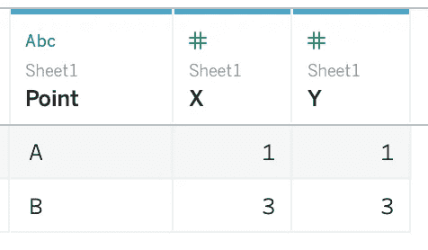

数据集(作者提供的图片)

让我们拖动列和行货架上的 X 和 Y，并将它们更改为尺寸。我们只得到两分。如果不添加更多的点，Tableau 无法绘制圆弧。

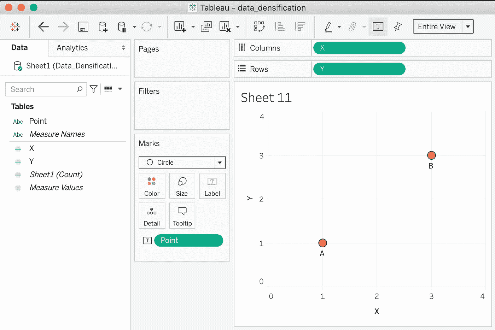

使用 Tableau 绘制数据集(图片由作者提供)

## 如何增加数据集的密度？

本质上，我们将在同一个 excel 表中创建另一个选项卡(我们将它用作数据源)并添加这些额外的点。它应该看起来像这样。

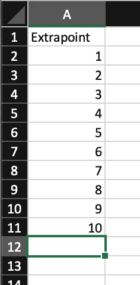

数据加密的额外加分(图片由作者提供)

现在，我们将用两个数据点在这个工作表和原始数据集之间进行交叉连接。*交叉连接或笛卡尔连接基本上是将第一个表的每一行与第二个表的每一行结合起来的连接。* Tableau 默认不支持交叉连接。因此，我们通过使用一个带有内部连接的公共关键字来欺骗 Tableau。这个关键字可以是任何内容。我用了“十字架”这个词。

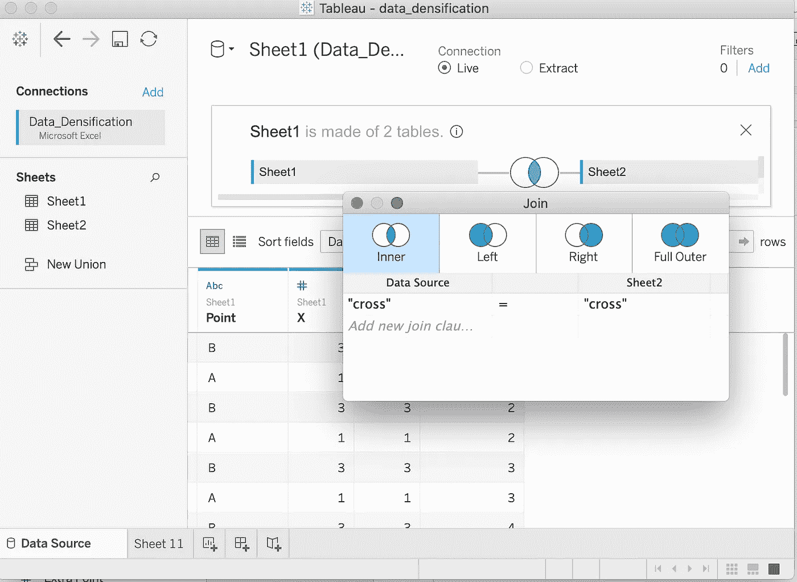

Tableau 中的交叉连接(图片由作者提供)

在这一步之后，我们将看到 10 倍于原始数量的观察结果(在本例中为 20)。我们已成功加密数据集。

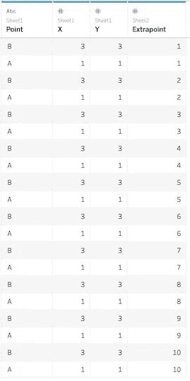

增密数据集(按作者分类的图像)

## 如何使用数据加密绘制曲线图表？

在尝试创建弧之前，让我们尝试使用这些点绘制一条增密的直线。对于制作直线，我们 ***不需要*** 增密数据，但是为了更好地理解这个概念，我们将首先从增密直线开始。

> O 你的目标是画出 10 个均匀分布的点，并用它们画一条线。

现在，要在这条线上添加这些点，我们需要两样东西-

*   两个连续点之间的距离
*   他们的坐标，以便他们可以被标绘

## 间隔

想想你如何将一根 12 英寸长的棍子分成两部分。你可能会先将长度分成两半(6 英寸)，然后从两端开始将它折断 6 英寸长。

Bartosz Kwitkowski 在 [Unsplash](https://unsplash.com?utm_source=medium&utm_medium=referral) 上拍摄的照片

使用相同的原理，通过 n 个等距点分割该线，我们得到该线的长度并除以(n-1)。

所以，间距应该是—

> (3–1)/(10–1) = 0.222

## 这 10 个点的坐标

既然知道了起点(1，1)的坐标，就可以用间距来计算所有多余点的 x 坐标。

一旦我们得到了 x 坐标(1，1.22，1.44，1.66，1.88 …)，我们需要用公式将它映射到额外的点，这样我们就可以在计算的字段中使用它，而不是硬编码。

x =(额外点+I)*间距

其中 I = x/间距-额外点

I =(1/0.222)-1 = 3.5

加分 1 = (1+3.5)*0.222 = 1

加分 2= (2+3.5)*0.222 = 1.22

加分 3= (3+3.5)*0.222 = 1.44

加分 4= (4+3.5)*0.222 = 1.66

加分 5= (5+3.5)*0.222 = 1.88

加分 6= (6+3.5)*0.222 = 2.10

加分 7= (7+3.5)*0.222 = 2.32

加分 8= (8+3.5)*0.222 = 2.54

加分 9= (9+3.5)*0.222 = 2.76

加分 10= (10+3.5)*0.222 = 2.98

请注意，我们正在画的这条线的方程是 y=1x+0。所以，基本上 y=x。

## 表格计算

首先，我们计算间距，然后用它计算 x 和 y 坐标。

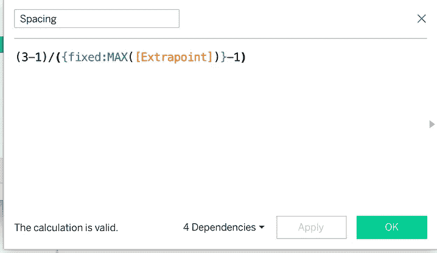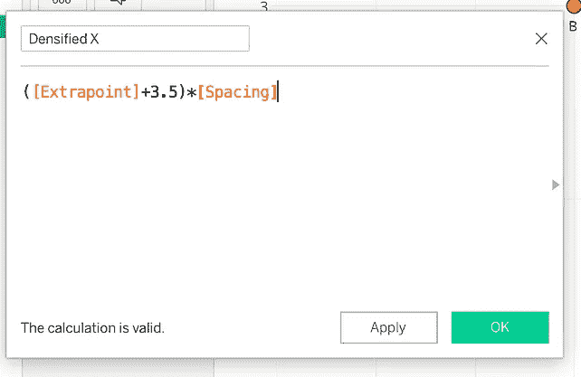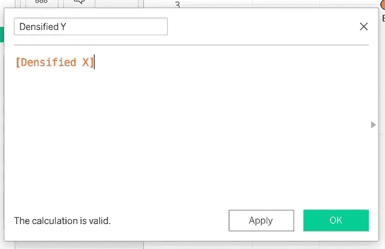

Tableau 计算字段(图片由作者提供)

结果是相同的直线上有更多的点。

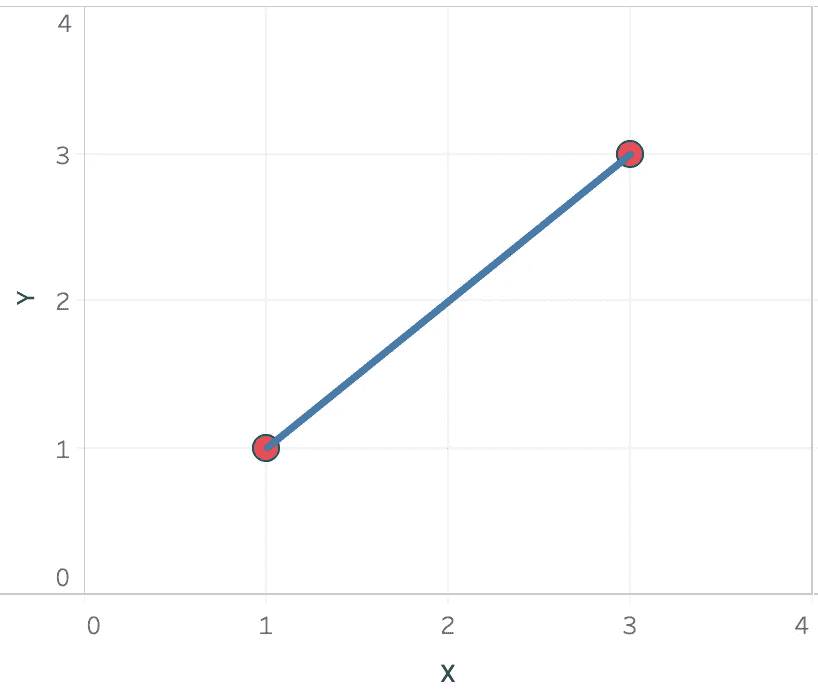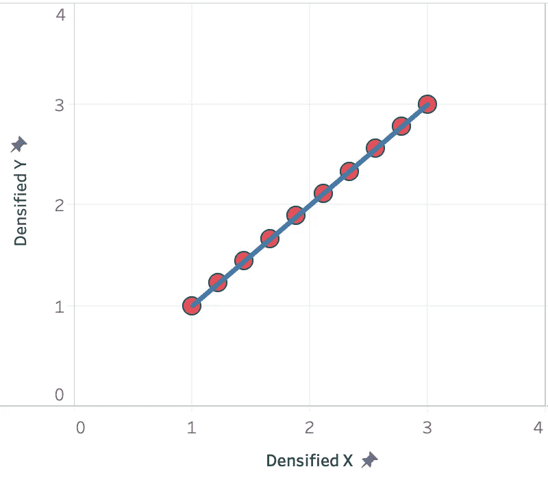

数据加密前后(图片由作者提供)

现在，让我们用同样的方法画一个圆弧。为此我们将使用三次方程-

> y=x

由于方程不再是线性的，我们需要根据上面的方程改变 y 坐标。

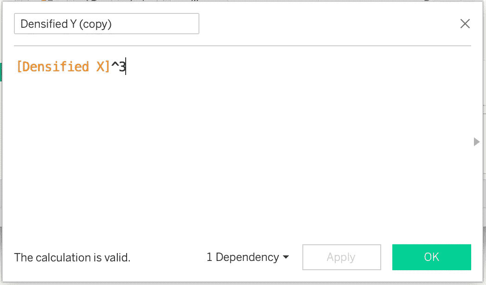

Tableau 计算字段(图片由作者提供)

将增密的 X 坐标和新的 Y 坐标拖动到列和行架上，并将其更改为尺寸。我们在这里。我们的电弧准备好了！

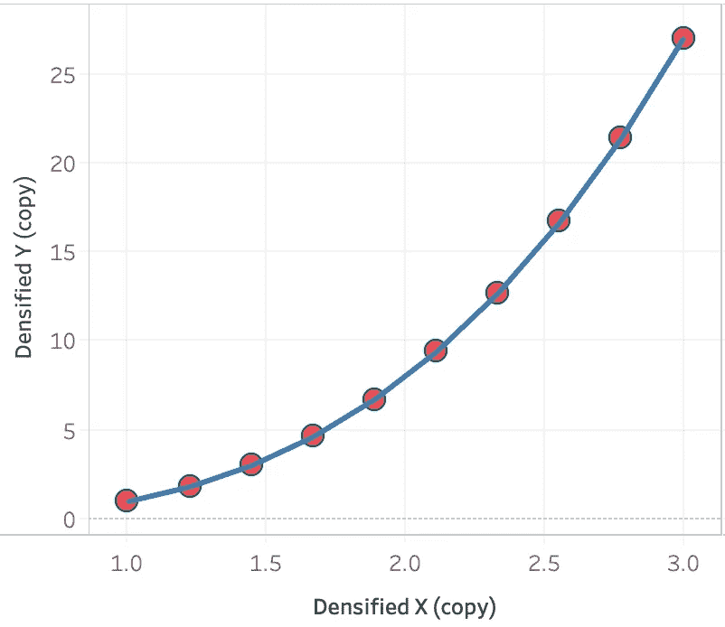

最终曲线图表(图片由作者提供)

当你想在 Tableau 中构建一个弯曲的图表时，它基本上是在连续的点之间画线。因此，点数越多，曲线看起来就越平滑。

尽管曲线看起来几乎很平滑，但您可以尝试添加更多额外的点来平滑曲线。

数据加密是一种重要的数据可视化技术。还有其他方法来增加数据集的密度，但我觉得本文中探讨的方法最简单，并且适用于小型数据集。应该谨慎使用它，尤其是当您有一个包含数百万行的庞大数据集时。

关于这个话题的更多信息，你可以参考这篇[博客文章](https://www.flerlagetwins.com/2019/05/intro-to-data-densification.html)，其中 KEN FLERLAGE 对此做了更详细的描述。

 [## 数据增密简介

### 数据加密是 Tableau 中常用的技术。许多人写了它，包括画面…

www.flerlagetwins.com](https://www.flerlagetwins.com/2019/05/intro-to-data-densification.html) 

感谢阅读！