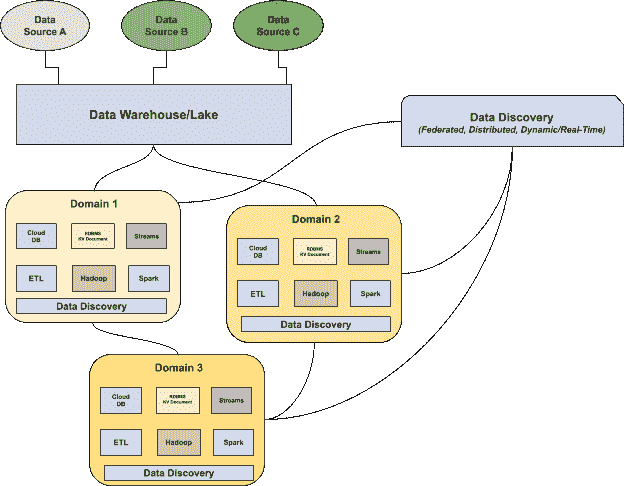

# 数据发现:数据湖数据目录的未来

> 原文：<https://towardsdatascience.com/data-discovery-the-future-of-data-catalogs-for-data-lakes-7b50e2e8cb28?source=collection_archive---------9----------------------->

## 为什么我们需要数据治理和元数据管理的分布式方法

[梁朝伟](https://unsplash.com/photos/D4YrzSwyIEc)上[的 Unsplash](http://www.unsplash.com) 。

*在过去的几年里，数据湖已经成为现代数据堆栈的必备工具。但是，虽然驱动我们访问和分析数据的技术已经成熟，但在分布式环境中理解和信任这些数据的机制却落后了。*

*以下是* [***数据发现***](https://www.montecarlodata.com/data-catalogs-are-dead-long-live-data-discovery/) *可以帮助确保您的数据湖不会变成数据沼泽。*

当 [**构建数据平台**](/how-to-build-your-data-platform-like-a-product-6677e8abe318) 时，数据团队必须做出的首要决策之一(仅次于“我们为什么要构建这个平台？”)是选择一个 [**数据仓库还是**](/how-to-build-your-data-platform-choosing-a-cloud-data-warehouse-3de66862f41c) 湖来为他们的分析进行电力存储和计算。

虽然数据仓库提供的结构使数据团队能够轻松高效地操作数据(即收集分析见解和支持机器学习功能)，但这种结构可能会使它们对于某些应用程序来说不灵活且昂贵。

另一方面，数据湖具有无限的灵活性和可定制性，可以支持各种各样的用例，但是伴随着这种更大的灵活性而来的是大量与数据组织和治理相关的其他问题。

因此，沿着湖边甚至[湖边小屋](https://databricks.com/blog/2020/01/30/what-is-a-data-lakehouse.html)路线行进的数据团队常常难以回答有关其数据的关键问题，例如:

*   我的数据存储在哪里？
*   谁能接触到它？
*   我该如何使用这些数据？
*   这个数据是最新的吗？
*   企业如何使用这些数据？

随着数据操作的成熟和数据管道变得越来越复杂，传统的[数据目录](https://www.montecarlodata.com/what-we-got-wrong-about-data-governance/)经常无法回答这些问题。

这就是为什么一些最好的数据工程团队正在重新思考他们构建数据目录的方法，以及数据湖需要什么。

# 数据目录可能会淹死在湖里

尽管异常灵活和可伸缩，但数据湖缺乏必要的组织来促进适当的元数据管理和数据治理。图片由 [Unsplash](http://www.unsplash.com) 上的 [Adrian](https://unsplash.com/photos/_9phetFNNgs) 提供。

[数据目录](https://www.montecarlodata.com/what-we-got-wrong-about-data-governance/)作为元数据的目录，提供关于数据健康、可访问性和位置的信息。他们帮助数据团队回答关于在哪里寻找数据、数据代表什么以及如何使用数据的问题。但是，如果我们不知道这些数据是如何组织的，那么我们所有最好的计划(或者管道)都是徒劳的。

在最近的一篇文章中，Intuit 数据平台主管 Seshu Adunuthula 恰当地问读者:“你的数据湖是像一个二手书店还是一个组织良好的图书馆？”

对于现代数据团队来说，这一点越来越重要。随着公司向湖泊倾斜，他们通常会损害在仓库中存储数据所隐含的组织和顺序。数据仓库迫使数据工程团队结构化或至少半结构化他们的数据，这使得基于业务用户的需求进行编目、搜索和检索变得容易。

> 历史上，许多公司使用数据目录来实施数据质量和数据治理标准，因为随着数据资产的发展，他们传统上依赖数据团队手动输入和更新目录信息。在数据湖中，数据是分布式的，随着数据在其生命周期中的演变，很难对其进行记录。

非结构化数据是有问题的，因为它与数据目录相关，因为它是无组织的，即使是有组织的，也通常不被声明为有组织的。这可能适用于数据仓库中管理的结构化或半结构化数据，但是在分布式数据湖的环境中，如果没有某种程度的自动化，随着数据的发展手动实施治理是无法扩展的。

## 现在:手动和集中式目录

了解不同数据资产之间的关系(随着时间的推移而演变)是至关重要的，但这通常是传统数据目录所缺乏的。虽然现代数据架构(包括数据湖)通常是分布式的，但数据目录通常不是，将数据视为一维实体。非结构化数据没有大多数数据目录赖以工作的预定义模型，必须经过多次转换才能使用。

> 尽管如此，公司需要知道他们的数据存储在哪里，谁可以访问这些数据，并能够衡量其整体健康状况——即使存储在湖中而不是仓库中。如果没有对数据沿袭的可见性，当数据问题在下游进一步出现时，团队将继续花费宝贵的时间进行灭火和故障排除。

# 数据工程师从数据目录中需要什么

*数据发现可以取代或补充现代数据目录，方法是提供关于数据堆栈不同部分数据的分布式实时洞察，同时遵守通用治理和可访问性标准。图片由巴尔·摩西提供。*

传统的数据目录通常可以满足仓库中结构化数据的需求，但是数据工程师如何在数据湖的复杂水域中航行呢？

虽然许多数据目录都有一个以用户界面为中心的工作流，但数据工程师需要以编程方式灵活地与其目录进行交互。他们使用目录来管理模式和元数据，并且需要一种 API 驱动的方法，以便能够完成各种各样的数据管理任务。

此外，数据可以通过多个入口进入湖泊，工程师需要一个目录来适应和考虑每一个入口。与数据在进入之前将被清理和处理的仓库不同，数据湖接受原始数据，而没有任何端到端健康的假设。

在一个湖中，存储数据既便宜又灵活，但这使得了解你拥有什么以及如何使用它成为一个真正的挑战。数据可以以多种方式存储，比如 JSON 或 Parquet，数据工程师根据要完成的工作以不同的方式与数据交互。他们可能将 Spark 用于聚合作业，或者将 Presto 用于报告或特别查询，这意味着损坏或不良数据有很多机会导致故障。如果没有沿袭，数据湖中的这些故障可能会很混乱，很难诊断。

在一个湖中，数据可以以多种方式进行交互，目录必须能够提供对什么正在被使用，什么没有被使用的理解。当传统目录不能满足需求时，我们可以将数据发现作为前进的方向。

# 未来:数据发现

[**数据发现**](https://www.montecarlodata.com/data-catalogs-are-dead-long-live-data-discovery/) 是扎马克·德格哈尼和 Thoughtworks 的 [**数据网格模型**](https://martinfowler.com/articles/data-monolith-to-mesh.html) 提出的一种基于分布式面向领域架构的新方法。在这个框架下，特定于域的数据所有者对其作为产品的数据负责，并促进跨域的分布式数据之间的通信。

现代数据发现通过四种主要方式填补了传统数据目录的空白:

## 自动化扩展到整个湖泊

使用机器学习，数据发现可以自动跟踪表和字段级沿袭，映射上游和下游依赖关系。随着数据的发展，数据发现也能确保您对数据及其使用方式的了解。

## 数据运行状况的实时可见性

与传统的数据目录不同，数据发现提供了对数据当前状态的实时可见性，而不是其“编目”或理想状态。由于发现包括消费者如何接收、存储、聚合和使用您的数据，因此您可以收集一些见解，例如哪些数据集已经过时，可以废弃，给定的数据集是否符合生产质量，或者给定的表上次更新的时间。

## 数据沿袭，用于了解数据的业务影响

这种灵活性和动态性使得数据发现非常适合将沿袭引入数据湖，允许您在正确的时间呈现正确的信息，并在许多可能的输入和输出之间建立联系。有了沿袭，当数据管道中断时，您可以更快地解决问题，因为像模式更改这样经常被忽略的问题将被检测到，相关的依赖关系将被映射。

## 跨域的自助式发现

数据发现还支持自助服务，允许团队轻松利用和了解他们的数据，而无需专门的支持团队。为了确保这些数据值得信赖和可靠，团队还应该投资于 [**数据可观察性**](/how-do-you-prevent-broken-data-pipelines-326f3c6d239e) ，它使用机器学习和自定义规则来提供实时警报和监控，当您的数据湖或下游管道出现问题时。

## 跨湖治理和优化

现代数据发现不仅使公司能够了解*哪些*数据在其生命周期中被使用、消费、存储和废弃，还能了解*如何使用*，这对于数据治理至关重要，并提供了可用于跨湖优化的见解。

> 从治理的角度来看，在湖中查询和处理数据经常使用各种工具和技术(Spark on Databricks for this，Presto on EMR for that，等等)。)，因此，通常没有一个单一的、可靠的读取和写入的真实来源(就像仓库提供的那样)。适当的数据发现工具可以作为事实的来源。

从优化的角度来看，数据发现工具还可以让涉众轻松识别最重要的数据资产(经常被查询的数据资产！)以及那些没有被使用的，这两者都可以为团队优化他们的管道提供洞察力。

# 数据湖的分布式发现

随着公司继续加大对数据的接收、存储和利用，有助于提高透明度和可发现性的技术将成为关键。

越来越多的一些最佳目录在分布式、特定于领域的发现中分层，为团队提供了在数据生命周期的所有阶段完全信任和利用数据所需的可见性。

> 就个人而言，我们对即将到来的事情感到无比兴奋。有了正确的方法，也许我们最终可以一起放弃"[数据沼泽](https://www.dataversity.net/data-lake-vs-data-swamp-leveraging-enterprise-data/#:~:text=A%20Data%20Swamp%2C%20in%20contrast,use%20or%20unusable%20and%20frustrating.)"双关语？

***有兴趣了解如何在您的数据湖中扩展数据发现吗？伸出手去*** [***巴尔摩西***](https://www.linkedin.com/in/barrmoses)*[***斯科特奥利里***](https://www.linkedin.com/in/scott-o-leary-78000a43) ***，还有*** [***蒙特卡洛团队***](http://www.montecarlodata.com) ***。****

****要了解构建分布式数据架构的所有最新消息和趋势，请务必加入*** [***数据网格学习松弛频道***](https://datameshlearning.github.io/intro-to-data-mesh/) ***。****

**本文由* [*斯科特·奥利里*](https://www.linkedin.com/in/scott-o-leary-78000a43/) *共同撰写。**

**