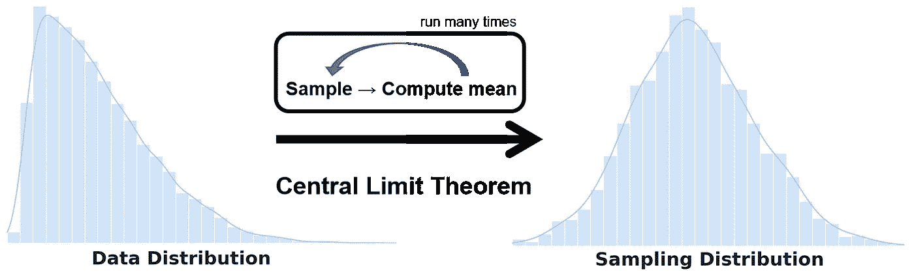
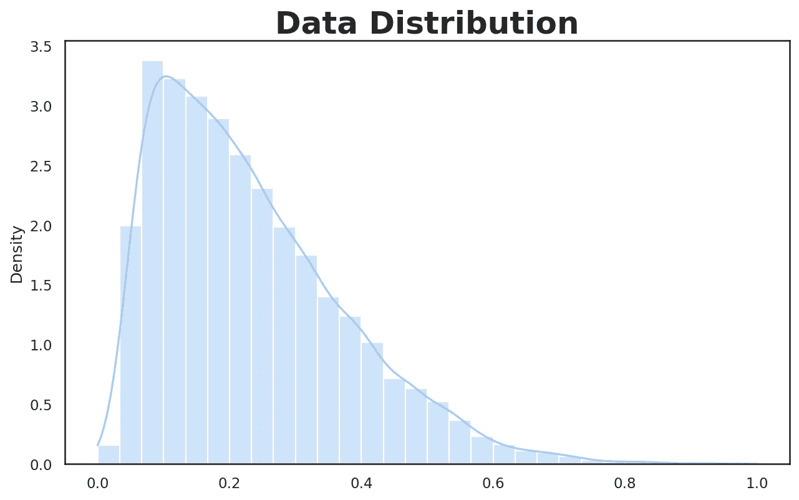
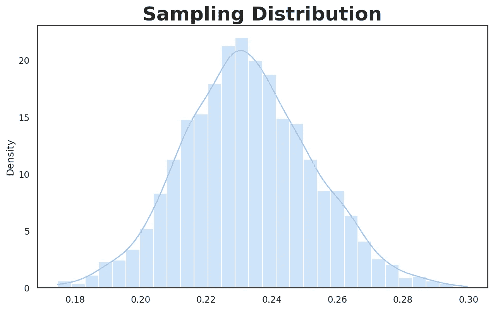
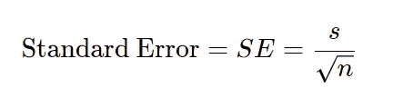

# 数据分布与抽样分布:你需要知道什么

> 原文：<https://towardsdatascience.com/data-distribution-vs-sampling-distribution-what-you-need-to-know-294819109796?source=collection_archive---------8----------------------->

## 统计数字

## 了解中心极限定理、标准误差和抽样分布环境中的自举



作者图片

区分数据分布(即总体分布)和抽样分布是很重要的。在使用中心极限定理或其他概念(如标准差和标准误差)时，这种区别非常重要。

在本帖中，我们将回顾上述概念以及自举的概念来估计抽样分布。特别是，我们将涵盖以下内容:

*   数据分布(又名人口分布)
*   抽样分布
*   中心极限定理(CLT)
*   标准误差及其与标准差的关系
*   拔靴带

# 数据分布

许多统计学处理的是从大量人口中抽取的样本进行推断。因此，我们需要区分对原始数据的分析和对样本的分析。首先，让我们回顾一下数据分布的定义:

> **数据分布:**原始数据集中各个数据点的频率分布。

让我们首先生成随机倾斜数据，这将导致非正态(非高斯)数据分布。生成非正态数据的原因是为了更好地说明数据分布和抽样分布之间的关系。

因此，让我们导入 Python 绘图包并生成右偏数据。



生成的右偏数据的直方图(图片由作者提供)

# 抽样分布

在抽样分布中，您从数据集中抽取样本，并计算类似于*平均值*的统计量。区分数据分布和采样分布非常重要，因为大多数混淆来自对*原始数据集*或*的(重新)样本*进行的操作。

> ***抽样分布:*** *从数据集*【1】*中抽取的多个样本的样本统计量(又名指标)的频率分布。或者简单地说，样本统计量的分布称为抽样分布。*

1.  从数据集中抽取一个样本。
2.  计算步骤 1 中抽取的样本的统计数据/指标并保存。
3.  多次重复步骤 1 和 2。
4.  绘制计算统计的分布图(直方图)。

```
>>> Mean: 0.23269
```



从总体中抽取的样本均值的直方图(图片由作者提供)

上面的采样分布基本上是每个采样的平均值的直方图(在上面，我们在 2000 次迭代中绘制了 50 个元素的采样)。上述抽样分布的平均值约为 0.23，从计算所有样本平均值中可以看出。

> ⚠️不把抽样分布与样本分布混为一谈。抽样分布考虑样本统计量的分布(如平均值)，而样本分布基本上是从总体中抽取样本的分布。

# 中心极限定理(CLT)

> *💡* ***中心极限定理:*** *随着样本量的变大，抽样分布趋于更像正态分布(钟形曲线形状)。*

*在 CLT，我们分析的是抽样分布，而不是数据分布，这是一个重要的区别。* CLT 在假设检验和置信区间分析中很受欢迎，了解这个概念很重要，尽管在数据科学中使用了 bootstrap，但在数据科学的实践中很少谈论或考虑这个定理[1]。关于自举的更多信息将在本文后面提供。

# 标准误差

[标准误差](https://en.wikipedia.org/wiki/Standard_error)是描述*抽样分布*中统计数据可变性的指标。我们可以计算标准误差如下:



其中 *s* 表示样本值的标准偏差， *n* 表示样本大小。从公式中可以看出*随着样本量的增加，SE 减小*。

我们可以使用以下方法估计标准误差[1]:

1.  从数据集中提取新样本。
2.  计算步骤 1 中抽取的样本的统计数据/指标(例如平均值)并保存。
3.  重复步骤 1 和 2 几次。
4.  通过计算前面步骤的统计数据的标准偏差，可以获得标准误差的估计值。

虽然上述方法可以用来估计标准误差，但我们可以使用自举，这是更可取的。我将在下一节讨论这个问题。

> ⚠️不把标准误差和标准偏差混为一谈。标准偏差捕捉单个数据点的可变性(数据的分布)，而标准误差捕捉样本统计的可变性。

# 拔靴带

Bootstrapping 是一种简单的估计抽样分布的方法，它从总体中随机抽取样本(*替换*)并计算每个重采样的统计量。自举不依赖于 CLT 或其他关于分布的假设，它是估计 SE 的标准方法[1]。

幸运的是，我们可以使用来自 [MLxtend 库](https://rasbt.github.io/mlxtend/)的`[bootstrap()](https://rasbt.github.io/mlxtend/user_guide/evaluate/bootstrap/)`功能(你可以在 MLxtend 库上阅读[我的帖子](https://www.ealizadeh.com/blog/mlxtend-library-for-data-science/)，其中涵盖了其他有趣的功能)。该函数还提供了传递自定义样本统计数据的灵活性。

```
>>> Mean: 0.23293 
>>> Standard Error: +/- 0.00144 
>>> CI95: [0.23023, 0.23601]
```

# 结论

主要的要点是区分对原始数据集或数据集样本所做的任何计算。绘制数据的直方图将导致数据分布，而绘制对数据样本计算的样本统计将导致样本分布。同样，标准差告诉我们数据是如何分布的，而标准差告诉我们样本统计数据是如何分布的。

另一个要点是，即使原始数据分布是非正态的，抽样分布也是正态的(中心极限定理)。

你可以在 GitHub 上找到这篇博文的 Jupyter 笔记本。

感谢阅读！

*最初发表于*[*https://www.ealizadeh.com*](https://www.ealizadeh.com/blog/statistics-data-vs-sampling-distribution/)*。*

我是一名高级数据科学家和工程师，我想写一些关于统计学、机器学习、时间序列分析、有趣的 Python 库和技巧的文章。

*   *如果你喜欢这个帖子，* [*在 Medium 上关注我*](https://medium.com/@ealizadeh)
*   *订阅* [*我的邮件列表*](https://www.ealizadeh.com/subscribe/)
*   *我们来连线上*[*LinkedIn*](https://www.linkedin.com/in/alizadehesmaeil/)*和* [*Twitter*](https://twitter.com/es_alizadeh)

# 参考

[1] P. Bruce 和 A. Bruce (2017)，*数据科学家实用统计*，第一版，O'Reilly

# 有用的链接

</a-guide-to-metrics-in-exploratory-data-analysis-250b33f72297>  </mlxtend-a-python-library-with-interesting-tools-for-data-science-tasks-d54c723f89cd> 