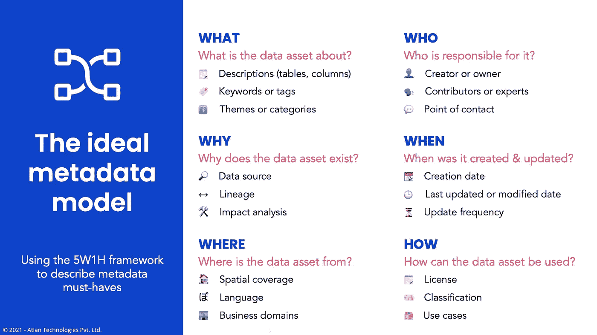
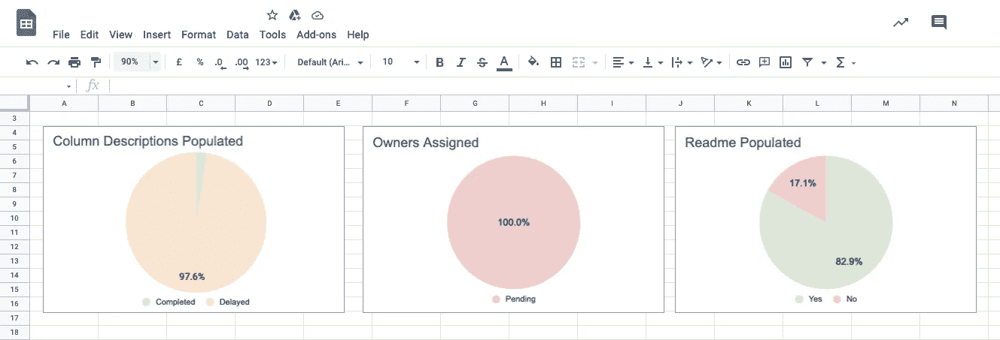

# 数据文档困境？这里有一个框架。

> 原文：<https://towardsdatascience.com/data-documentation-woes-heres-a-framework-6aba8f20626c?source=collection_archive---------11----------------------->

## 引入一个框架来帮助数据团队建立文档优先的文化

*照片由* [*卫斯理丝丝*](https://unsplash.com/@wesleyphotography) *上* [*下*](https://unsplash.com/)

*“这一栏是什么意思？”
“有两张表同名？我能用哪一个？”
“为什么我们的 MRR 数字在财务和销售报告中不同？”
“谁能解释一下我们的营销数据？”*

像这样的信息似乎很熟悉？欢迎来到世界上每个数据从业者的生活。

2016 年，我负责一个快速扩展的数据团队。我们有大量的新表格生成，新项目上线，还有几个新的团队成员加入。但是我们的团队不是按规模建立的。

> 在六个月内，尽管我们的团队成员增加了一倍，但我们的生产力实际上下降了。

只有老团队成员对我们使用的数据有足够的了解。因此，在我们疯狂的截止日期前，他们最终自己完成了所有额外的工作，并且过度劳累。新的团队成员感到沮丧，因为他们缺乏实际开展富有成效的工作所需的环境——即使他们做了工作，也没有用。我花了这么多心血建立的公司和文化已经开始在我周围恶化。

然后，更糟糕的是，我们最年长的数据团队成员，一个和我们一起工作了两年的人，告诉我他想辞职。我惊呆了。这位分析师对我们所有的数据和项目都了如指掌。我们发展得很快，我们的梦想客户和项目已经排好了队。我看着顾客的眼睛，承诺我们会兑现承诺。他们选择了信任我们。我们现在该怎么坚持下去呢？

在三个小时试图说服、哄骗并恳求这位分析师留下来之后，我意识到…我们要靠自己了。我记得那天晚上我在办公室的阳台上哭了整整三个小时。这是我人生中最低谷的时刻之一。

> 当我第二天早上醒来时，我记得我对自己许下承诺——我再也不会给任何一个人权力让我们处于如此脆弱的境地。

这一事件标志着**装配线项目**的开始:努力使我们的数据团队尽可能敏捷和有弹性。在两年多的时间里，我们创建了内部工具和框架来帮助我们的团队更好地运行，我们也学到了很多关于围绕自组织和透明原则构建更强大的数据文化的知识。

在这篇文章中，我将分享我们用来在 [Atlan](https://atlan.com/) 组织我们自己的数据团队、使我们的数据民主化以及使文档成为我们日常工作流程的一部分的原则和框架。

# 通向文档优先文化之路

> 文档文化就是…一种“文化”。它是一套共享的实践、信仰、价值观和做事方式。

作为一名文化和团队建设的终身学生，我最喜欢阅读的文化之一是《哈佛商业评论》的文章，题为“[不要让你的公司文化只是发生](https://hbr.org/2016/07/dont-let-your-company-culture-just-happen)”。

作者谈到了一个叫做 [**文化地图**](https://www.strategyzer.com/blog/posts/2015/10/13/the-culture-map-a-systematic-intentional-tool-for-designing-great-company-culture) 的框架，它帮助你进行设计你所设想的文化所需的对话。它帮助你定义文化的三个核心要素(引自 [HBR](https://hbr.org/2016/07/dont-let-your-company-culture-just-happen) ):

*   **结果:**这些是您希望(和不希望)您的文化实现的事情。
*   **行为:**这些是你的文化中可见的部分——人们每天采取的积极或消极的行动，这些行动会给你的公司带来期望或不期望的结果。
*   **促成者和阻碍者:**这些是正式或非正式的政策、仪式、行为和规则，它们促成或阻碍了你的文化——这些是真正有意实现理想文化的要素。

我们的团队松散地遵循这个框架来指导我们的实验，建立一个文档优先的方法。

# 第一步:设想结果，或者创造共同目标的理想状态

说到底，文化是由人构建的，人是由目的驱动的。重要的是要记住，文档文化只是达到目的的一种手段。

> 创建文档优先文化的第一步是让团队就理想状态达成一致。

我推荐便利贴、白板和优秀的辅导员。开始这种练习的一个很好的问题是，**“我们希望我们的团队在 12 个月后会是什么样子？”**在这里，培训师的角色对于将想法和想法整合到整体中至关重要。

如果你很好地运行这个会话，你可能会从我们的团队得到这样的结果:

*   成为一个完全**自组织的**团队:你所有的数据、知识、实验和项目都应该是可重用的、透明的、易于访问的。
*   创造一个**信任**您的数据和决策的环境。
*   建立一种**协作至上的**文化:每个人都应该感到被授权和被包容，尽管你的团队基本上是多元化的。

一旦你的团队心中有了一个最终状态，使用“ [**开始、停止、继续**](https://www.scienceofpeople.com/start-stop-continue/) ”练习来列出可以帮助你的团队实现目标的行为列表。希望有详细记录的数据会在其中一个便笺上！

# 第二步:通过可衡量的目标建立更好的行为

问问你自己，好的文档实际上意味着什么？

一旦你的团队确定了优秀的文档是你努力追求的行为之一，建立一个可衡量的目标来帮助你确定这实际上意味着什么是很重要的。为此我强烈推荐 5W1H 框架。

*图片来自* [*图集*](https://atlan.com/)

## 5W1H:一个伟大的数据文档框架

5W1H 框架代表什么、为什么、在哪里、谁、何时和如何。

> 使用 5W1H 框架将您的元数据属性缩小到一个简短的必备列表，您需要调用每个数据资产**良好记录的**。

**什么:数据资产是关于什么的？**

这可以由几个属性来定义，例如:

*   描述(针对表格或列)
*   关键词或标签
*   主题或类别

**为什么:数据资产为什么存在？**

*   数据源
*   沿袭(跟踪数据资产)
*   影响分析(该数据资产支持哪些仪表板或项目？)

哪里:数据资产来自哪里？

*   空间覆盖
*   语言
*   商业领域

世卫组织:谁负责数据资产？

*   创建者或所有者
*   贡献者或专家
*   切点

**何时:数据资产是何时创建和更新的？**

*   编成日期
*   上次更新或修改日期
*   更新频率
*   时间范围

**如何:如何使用数据资产？**

*   许可证
*   分类
*   用例

# 第 3 步:衡量哪些因素对找出促成因素和阻碍因素至关重要

一旦你有了记录数据的框架，从策略到执行有许多不同的方法。(在以后的博客文章中会有更多相关内容！)

从德鲁克[到戴明](https://www.drucker.institute/thedx/measurement-myopia/)的任何人都有一句俗语，据说是“**如果你不能衡量它，你就不能改进它。**

> 作为数据从业者，我们帮助其他人应用他们的数据见解，但我们经常忘记将它们应用到自己身上。

每天、每周、每月衡量文档目标的进展。有了像 [Atlan](https://atlan.com/) 这样的现代数据编目工具，您可以使用 API 在一个粒度级别上测量您的文档完成率。按团队成员或不同部门筛选，甚至创建排行榜！

作为一个团队，一起思考哪些是可行的，哪些是不可行的。不断迭代和改进你的文档框架和策略。这需要时间，但是突然地，有一天你会醒来并意识到你有一种文档优先的文化。

*我们元数据文档仪表板的一部分。(图片来自* [*阿特兰*](https://atlan.com/) *)。)*

**觉得这个内容有帮助？在我的时事通讯《元数据周刊》上，我每周都写关于活动元数据、数据操作、数据文化和我们的学习建设的文章。** [**在此订阅。**](https://metadataweekly.substack.com/)