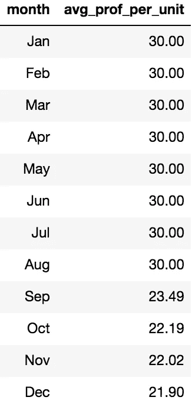
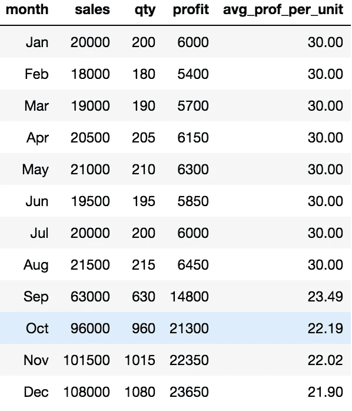

# 数据不决定！

> 原文：<https://towardsdatascience.com/data-doesnt-decide-b2b796057e16?source=collection_archive---------32----------------------->

## 为什么你必须明白是什么让灯一直亮着

Charles Deluvio 通过 Unsplash 拍摄的照片

“我们非常注重数据，”“数字告诉我们应该做什么？”是心态的好例子，这种心态有可能让一个组织陷入困境。业务不仅仅是数字和 KPI，数据分析师和数据科学家必须永远记住这一点。

# 最好的情况是:有人告诉你你错了

让我们来看一个你可能会遇到的场景。火警响起。有人刚刚注意到 FR-KPI(真实关键绩效指标)在年底表现不佳。事实上，看到这种剧烈的变化，有些人担心该公司可能会陷入螺旋式下降。让我们来看看:

作者照片

eeeekkk！这是我们的平均单位利润 KPI。它比我们现有的其他 374 个 KPI 稍微重要一些:前 5 名。为了得到这个 KPI，我们简单地将利润除以售出的单位数。

在筛选了各种 SQL 表、Excel 文件、Jupyter 笔记本和友好的同事提示之后，您开始了解正在发生的事情。你开始发现，你的产品现在是通过第三方网站提供的，这使得你的公司每卖出一件商品都要花费利润！

你意识到这个超级重要的 KPI 有可能变得更低！这个 KPI 能上去很重要。你冲向决策者，告诉他们你的公司不应该再通过第三方网站提供你的产品。你应该坚持你的公司控制的途径，每销售一个单位可以获得更多的利润。打开香槟酒瓶！

# 你做了别人让你做的事

有人来找你，担心某个 KPI 会下降。他们让你找出它下降的原因。你做到了。这里有什么问题？

这个场景缺乏背景。它缺少其他可以讲述不同故事的 KPI。这绝对需要更好地理解整个业务，以及它在销售环境中是如何运作的。范围太窄了。

从全局来看，我们注意到，自从开始与第三方供应商合作以来，每月售出的商品数量显著增加。这个供应商在网上有很大的影响力，实际上帮助我们降低了广告费用。是的，他们需要钱来交换他们为我们做的事情，但他们最终会让事情变得更好。

作者照片

事实上，自从这次新的冒险以来，底线真的开始疯狂增长。销售额和利润都增加了一个整数！这通常不是一夜之间发生的事情。这一举措可能是该组织发生的最好的事情！

不要在没有咨询其他数据朋友或业务熟人的情况下参加会议，以检查这种“停止印刷”类型的建议是否符合当前的业务情况。

# 最坏的情况:他们听从你的建议

企业是复杂的。有很多活动部件。很多人都在努力达到或超过给他们的 KPI。企业应该定义什么是真正重要的。在某种程度上，新的 KPI 甚至可能开始与另一个 KPI 相矛盾。顾客不是空白支票。找出是什么让灯亮着。

数据很重要，也很有用。永远记住“鼻子贴着地面”式的方法可能是遗漏一些主要内容的原因。数据表明两点之间的最短距离是一条直线。只有当这条线路的一部分由一座横跨峡谷、两边都是陡峭悬崖的桥组成时，这条线路才会起作用。

joo Cordeiro 通过 Unsplash 拍摄的照片