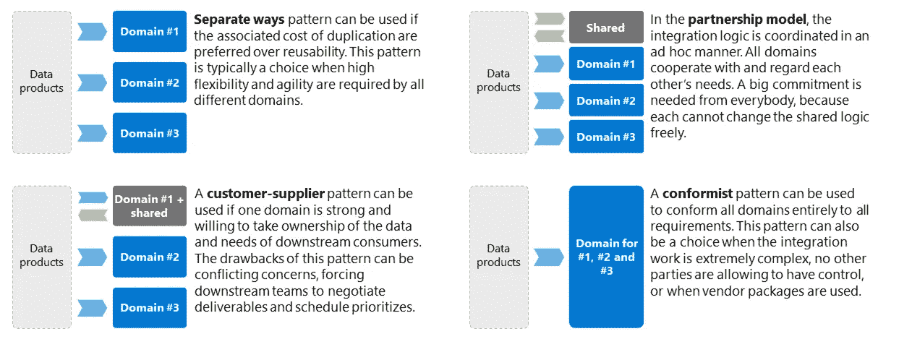
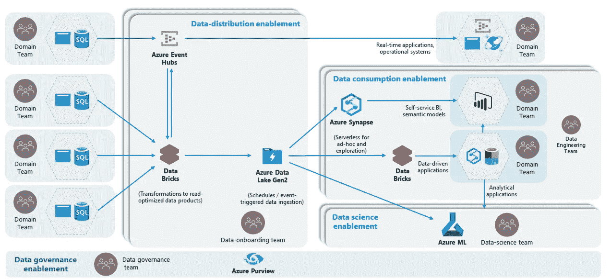

# 数据域和数据产品

> 原文：<https://towardsdatascience.com/data-domains-and-data-products-64cc9d28283e?source=collection_archive---------5----------------------->

## [行业笔记](https://towardsdatascience.com/tagged/notes-from-industry)

## 实践中的数据网格

我接触的所有客户要么对下一代现代数据平台感兴趣，要么正在规划。在这一转变中，数据网格体系结构获得了很大的吸引力。与此同时，对这一概念的解释也存在一些担忧:缺乏实际指导。

## **关于数据网**

Data mesh 提倡将数据视为一种产品，将所有权更深入地推向生产团队。这背后的理论是所有权与数据创建更好地结合，这为数据带来了更多的可见性和质量。这种[责任的左移](https://devopedia.org/shift-left)解决了数据爆炸的问题，数据爆炸使得[不堪重负的中央数据团队](https://piethein.medium.com/the-extinction-of-enterprise-data-warehousing-570b0034f47f)为了更大的利益负责清理、协调和集成数据。将特定数据集的职责委托给[数据域](/data-domains-where-do-i-start-a6d52fef95d1)意味着企业被拆分为小型企业，每个企业负责构建抽象、提供数据、维护相关元数据、提高数据质量、应用生命周期管理、执行代码控制等等。尤其是传统的大规模企业很难适应这种现代方法，因为数据通常在域之间共享，或者一个域的数据可能依赖于另一个域。这使得实施变得困难，所以让我提出我的观点并分享一些实用的指导。

## **指导**

标准化和清晰的原则是实现成功的关键。例如，数据产品不应该成为实验的对象。它们也不应该引发标准、文件类型、协议格式等等的激增。因此，我建议任何组织采纳以下十八项原则:

## **1。** **明确界定你的领域边界**

每个人都使用他们自己的域、子域或有界上下文的定义。这种模糊性是一个问题。没有明确的指导，领域变得过于相互关联，所有权成为解释的主题，复杂性将被其他领域推入其他领域。

我对域管理的建议是明确和严格的边界。每个域的边界必须清晰明确。属于一起的业务关注点、流程、解决方案领域和数据必须保持在一起，并在域内进行维护和管理。理想情况下，每个领域属于一个敏捷或 DevOps 团队，因为当有一个团队时，耦合点的数量是可管理的，并且容易被所有团队成员理解。在一个域内，紧耦合是允许的；然而，当跨越边界时，到其他域的所有接口必须使用互操作性标准来解耦。这就是数据产品发挥作用的地方。

话虽如此，对于数据管理，我鼓励您将您的领域具体化。这避免了长时间的(政治)讨论，也禁止团队根据他们自己的需要自由地解释边界。向面向领域结构的转变是一种过渡。当您将新的提供者和消费者加入到您的体系结构中时，您可以有组织地制定您的域列表，而不是预先规划好一切。

例如，对于数据域列表，您可以使用列出所有数据域的存储库，包括每个域的命名和适用性。您可以使用相同的存储库来描述团队组织、使用和共享，以及物理表现:应用程序和数据库的列表。

另一篇以边界和粒度为特色的博文可以在这里找到:[https://towardsdatascience . com/data-domains-where-do-I-start-a 6d 52 fef 95d 1](/data-domains-where-do-i-start-a6d52fef95d1)

## **2。** **具体阐述您的数据产品和互操作性标准**

下一个建议是定义什么是数据产品。数据产品是数据架构的一个单元或组件，它封装了使读取优化数据集可供其他域使用的功能。这需要你明确定义自己不同的发布类型(例如，面向批处理、面向 API、面向事件)、元数据标准等等。具体说明数据产品是什么样子的。例如，批量数据产品被定义为拼花文件，并且总是必须包含一个用于元数据的 YML 文件，该文件包含这些 X 属性。例如，我不相信报告和仪表板是数据产品，因为它们解决特定的客户需求，因此与底层用例紧密耦合。

## **3。** **没有原始数据！**

数据产品与原始数据相反，因为公开原始数据需要所有消费领域的返工。因此，在任何情况下，您都应该封装遗留或复杂的系统，隐藏技术应用程序数据。这也意味着域将拥有如何转换数据以提高可读性的转换逻辑。

没有原始数据的原则，你也可以申请外部数据提供者:在你的企业生态系统的逻辑边界之外运作的外部方。它们通常位于独立的、不受控制的网络位置。要求您的合作伙伴遵守您的标准或通过额外的域应用中介:消费团队通过抽象复杂性和保证稳定和安全的消费来充当提供者。

原始或未经修改的数据没有保证。如果你坚持让它可用，比如机器学习，确保它被标记。

## **4。** **为重叠域定义模式**

如我所说，对于跨域共享的数据，事情变得复杂了。对于数据域的粒度和逻辑分段，您可以利用来自[域数据存储](/smashing-silos-with-domain-data-stores-4c37d37fd838)的指导:

> 当域比较大，或者域需要通用的——可重复的——集成逻辑时，分解域尤其重要。在这种情况下，拥有一个通用域会有所帮助，它可以提供集成逻辑，允许其他子域标准化并从中受益。一个基本规则是保持子域间的共享模型较小，并始终与无处不在的语言保持一致。

由 Piethein Strengholt 创建的图像

对于重叠的数据需求，您可以使用不同于领域驱动设计的模式。以下是对这些模式的简短总结:

*   如果复制的相关成本优先于可重用性，那么作为一种设计模式，可以使用单独的方法。当为了更高的灵活性和敏捷性而牺牲可重用性时，这种模式通常是一种选择。
*   如果一个领域很强大，并且愿意拥有下游消费者的数据和需求，那么可以使用**客户-供应商模式**。这种模式的缺点是相互冲突的关注点，迫使下游团队协商可交付成果和安排优先级。
*   在**伙伴关系模型**中，集成逻辑在新创建的域中以特别的方式进行协调。所有团队都相互合作，尊重彼此的需求。每个人都需要一个大的承诺，因为每个人都不能自由地改变共享的逻辑。
*   一个**符合模式**可以被用来使所有的域符合所有的需求。这种模式可以是一种选择:1)当集成工作极其复杂时；2)不允许任何其他方拥有控制权；3)或者当使用供应商包时。

在任何情况下，您的域都必须遵守您的互操作性标准。因此，为其他域生成新数据的合作伙伴域必须像任何其他域一样公开它们的数据产品。

## 5.**数据产品包含可供广泛消费的数据。**

不同的领域团队和各种用例很可能会重复使用相同的数据。因此，您的团队不应该让他们的数据产品符合数据消费者的特定需求。主要的设计原则应该是最大化领域生产力和促进消费。另一方面，数据产品基于用户反馈而发展，并为其生成相关的工作，因此团队可能会很想合并消费性的特定需求。你在这里应该非常小心！如果消费者将特定于消费者的业务逻辑推进到所有数据产品中，就会迫使所有数据产品同时发生变化。这可能引发所有团队成员之间激烈的冲刺目标交叉协调和积压谈判。我的建议是引入一些争议管理:一个监管机构，监督数据产品不是针对消费者的。这个机构可以介入指导领域团队，组织预约和知识共享会议，提供实际的反馈并解决团队之间的问题。

## **6。** **创建关于缺失值、默认值和数据类型的具体指南**

我经历过关于必须如何解释缺失和默认数据的激烈辩论。例如，数据确实丢失并且无法导出，但是运营部门仍然期望由员工提供强制数据值。如果不提供指导，将会产生大量的描述和指导。有些可能始终提供不正确的值，有些可能提供随机值，而有些可能根本不提供指导。这同样适用于详细的局部参考值和数据类型。因此，您可能希望引入有关数据的指导，这些数据必须在整个数据集中具有一致的默认值和格式。这也意味着相同的十进制精度、符号和语法，解决了数据消费者不必应用(复杂的)应用程序逻辑来获得正确数据的问题。您可以将这些原则设置为面向系统或面向领域的，但是我也看到大型企业在所有数据产品中必须使用什么数据格式和类型方面提供通用指导。

## **7。** **数据产品在所有交付方法中都是语义一致的:批处理、事件驱动和基于 API 的**

对我来说，这听起来是显而易见的，但我仍然看到今天的公司为面向批处理、事件和 API 的数据制定单独的指南。由于所有分布模式的数据来源都是相同的，所以我鼓励您使所有的指南对所有的模式都一致。你可以要求你的所有领域使用一个单一的数据目录来描述所有的术语和定义。这一单一来源成为链接(映射)所有不同数据产品的基线。

## **8。** **数据产品继承了无处不在的语言**

了解数据创建的背景是非常重要的。这就是无处不在的语言的用途:一种构建的、形式化的语言，由利益相关者和设计师达成一致，服务于我们的设计需求。无处不在的语言应该与领域保持一致:业务功能和目标。我看到一些公司要求域使用该域语言中人类友好的列名。对我来说，这并不重要，只要提供了从物理数据模型到业务数据模型的映射。这使得您的领域能够将业务概念从无处不在的语言转换成数据。

## **9。** **数据产品属性是原子的**

数据产品属性是原子的，必须表示最低级别的粒度，并具有精确的含义或精确的语义。在理想状态下，这些数据属性与数据目录中的项目一一对应。这样做的好处是，数据消费者不会被迫拆分或连接数据。

## **10。** **数据产品从创建的那一刻起就保持兼容**

数据产品保持稳定，并与运营/交易应用程序分离。这意味着模式漂移检测，所以没有破坏性的变化。它还意味着版本控制，在某些情况下，独立管道并行运行，让您的数据消费者有时间从一个版本迁移到另一个版本。

## **11。** **将易变参考数据抽象为更小粒度的值范围**

您可能希望提供关于如何将复杂的参考值映射到更抽象的数据产品友好的参考值的指导。该指南还要求对敏捷性不匹配有一个细微的差别:1)如果使用方的变更速度很快，您的指导原则必须是在使用方维护复杂的映射表。2)如果变化的速度在提供方，指导原则是要求数据产品所有者将详细的本地参考值抽象或汇总为更通用的消费者不可知参考值。这也意味着消费者可能执行额外的工作，例如，将更通用的参考值映射到消费特定的参考值。

## **12。** **为可读性而优化(转换):抽象出复杂的应用模型。**

不断重新训练、不断读取大量数据的分析模型。这个读取方面会影响应用程序和数据库设计，因为我们需要优化数据可读性。同样，您可以引入优化和数据可读性的原则。例如，要求领域定义子产品:围绕主题领域有逻辑组织和混乱的数据。面向资源的架构(ROA)可能是一个很好的灵感。指南还将包括，过于标准化或过于技术化的物理模型必须转化为更可重用和逻辑有序的数据集。必须对复杂的应用程序逻辑进行抽象，并且必须以足够的粒度获取数据，以服务尽可能多的消费者。这也可能意味着交叉引用和外键关系必须是整数，并且在整个数据集中以及与来自同一数据产品提供商的所有其他数据集中保持一致。消费域不应该操纵键来连接不同的数据集！

## 13。 **数据产品是从源头直接捕获的**

不应该允许域封装来自不同数据所有者的其他域的数据，因为这将混淆数据所有权。因此，数据产品必须直接从原始领域(源)创建。

## **14。** **新创建的数据意味着新的数据产品**

由于业务转换(使用业务逻辑的语义变化)而创建和分发的任何数据都被认为是新的，并导致新的数据和数据所有权。因此，您希望实施相同的数据分布原则。这意味着新创建的共享数据必须遵循这篇博文中概述的相同原则。

另一个关注点是可追溯性:知道数据发生了什么。为了降低透明度的风险，要求数据消费者对他们的获取以及他们应用于数据的操作和转换序列进行编目。这种沿袭元数据应该集中发布。

## **15。** **为了安全封装元数据**

对于包括细粒度消费在内的数据安全性，您需要定义一种数据过滤方法:保留的列名、封装的元数据、产品元数据等。例如，我看到一些公司在他们的数据产品中使用保留的列名。如果这样的保留列名存在于任何这些数据集中，它可以用于细粒度过滤。因此，只能允许访问非敏感数据，或者可以过滤数据。例如，可以为消费者创建虚拟视图。分类或标签也是如此。

## **16。** **你可能想介绍一些企业一致性**

有些人会认为这一指导无助于真正的数据网格实现，但我看到一些公司重视企业一致性。我想强调的是，您不应该构建企业规范数据模型，就像在大多数企业数据仓库架构中看到的那样。在一个大规模的组织中，引入一些企业一致性可能会有所帮助，在这样的组织中，许多域依赖于相同的参考值。因此，您可以考虑引入包含企业参考值的指南。例如，货币代码、国家代码、产品代码、客户细分代码等等。如果适用，您可以要求您的数据产品所有者将其本地参考值映射到企业列表中的值。

您可能会对主标识号给出相同的指导，它将主数据和来自本地系统的数据链接在一起。这些数据元素对于跟踪哪些数据已经被掌握以及哪些数据属于一起是至关重要的，因此您可以要求您的本地域在其数据产品中包含这些主标识符。

最后，只有当企业数据非常稳定并且确实重要时，才考虑使用本指南。企业数据元素的列表有限。是一打，不是几百。

## **17。** **解决时变和非易失性问题**

我看到一些公司通过规定数据产品必须如何交付以及如何在下游消费来解决时变和非易失性问题。例如，产品到达后会被版本化、比较、分叉为读取优化的文件格式，并转换为缓慢变化的维度，从而保留以前数据产品的所有历史数据。在所有情况下，数据仍然是面向领域的，因此在任何消费发生之前，不允许应用跨领域集成。

## 18。 **使用数据产品蓝图**

创建数据产品的策略是什么？应该通过一个平台来促进它，还是必须由域名来满足它们自己的需求？我的观点是，创造是一个互动的过程，可以得到最好的促进。如果您分散工作并努力实现领域自治，那么您可以通过设计和提供蓝图来实现平衡，这些蓝图包含集成和向不同领域提供数据所需的最基本的服务，同时为数据产品优化提供自治。您的蓝图可以为每个域或共享一些内聚力的一组域实例化。下面的模型是允许创建可伸缩数据产品的参考模型。

Piethein Strengholt 的形象设计

如果做得正确，这些蓝图可以被设计成这样一种方式，血统被自动下推到目录中。对于组合服务的粒度级别，可以使用不同的[网状拓扑](/data-mesh-topologies-85f4cad14bf2)。一些公司重视高效的计算资源使用，或者认为大型数据消费者存在数据重力问题，因此更喜欢单一平台，同时仍然通过不同的容器隔离域。其他公司使用协调网状方法，并允许组织内的域运行自己的平台，同时遵守共同的政策和标准，就像上面的模型一样。有些采用能力复制来确保完全隔离。这很可能会增加成本，也是一个口味问题。

## **困难**

按领域构建数据产品是一个很有前途的概念，最近得到了很多关注。它试图解决一些可伸缩性问题，但是企业需要意识到其中的陷阱。构建适当的数据抽象不适合胆小的人。技术上很难，应该很好的促成。以下检查表确保更好的数据所有权、数据可用性和数据平台使用:

*   定义数据互操作性标准，例如协议、文件格式和数据类型。
*   定义所需的元数据:模式、分类、业务术语、属性关系等。
*   定义数据过滤方法:保留的列名、封装的元数据等。
*   确定域、应用程序、组件等的划分粒度级别。
*   新数据的设置条件:数据质量标准、数据结构、外部数据等。
*   为数据分组、参考数据、数据类型等定义数据产品指南。
*   定义需求契约或数据共享存储库。
*   定义治理角色，例如数据所有者、应用程序所有者、数据管家、数据用户、平台所有者等。
*   建立沿袭接收能力+定义沿袭交付程序+数据沿袭的唯一散列键。
*   为每个域定义应用程序级、表级和列级的沿袭粒度级别。
*   确定分类、标签、扫描规则
*   定义数据消费的条件，例如通过安全视图、安全层、ETL 等。
*   如何使用容器、文件夹、子文件夹等来组织数据湖。
*   定义数据分析和生命周期管理标准，例如 7 年后移动等。
*   为关键标识符、丰富过程等定义企业参考数据。
*   为交易数据、主数据和参考数据定义日志和历史数据处理方法
*   定义重新交付和协调的过程:数据版本化
*   在技术选择上与企业架构保持一致:哪些领域允许哪些服务；哪些服务只保留给平台团队。

最后，分布式体系结构还将管理和所有权分布在整个组织中。您的团队变得端到端负责。做出有意识的选择，并非常详细地了解将要发生的事情。精确地说明哪些活动仍然是核心，以及对团队的期望是什么。

如果这是你喜欢的内容，我让你看看《规模化数据管理[*》这本书。*](https://learning.oreilly.com/library/view/data-management-at/9781492054771/)