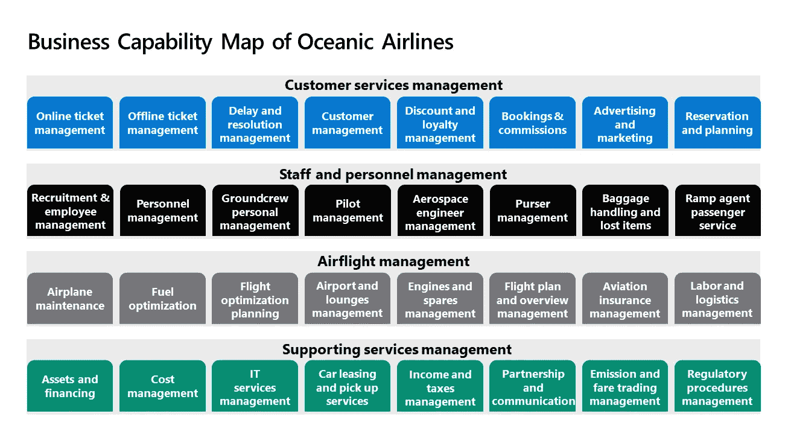
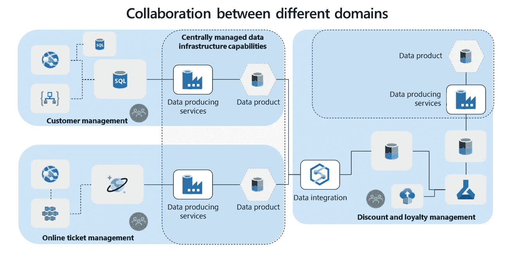
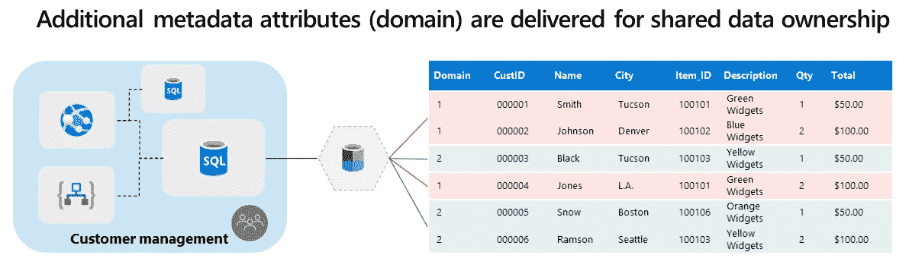
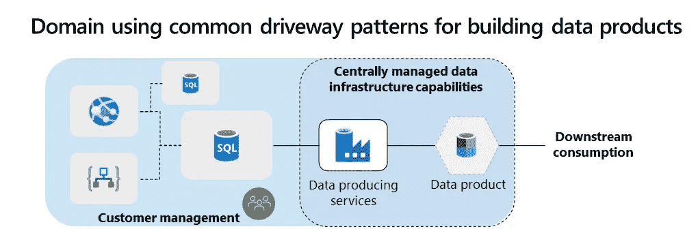
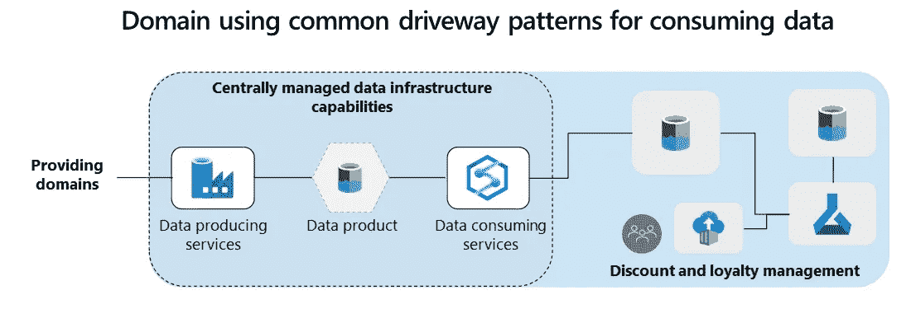
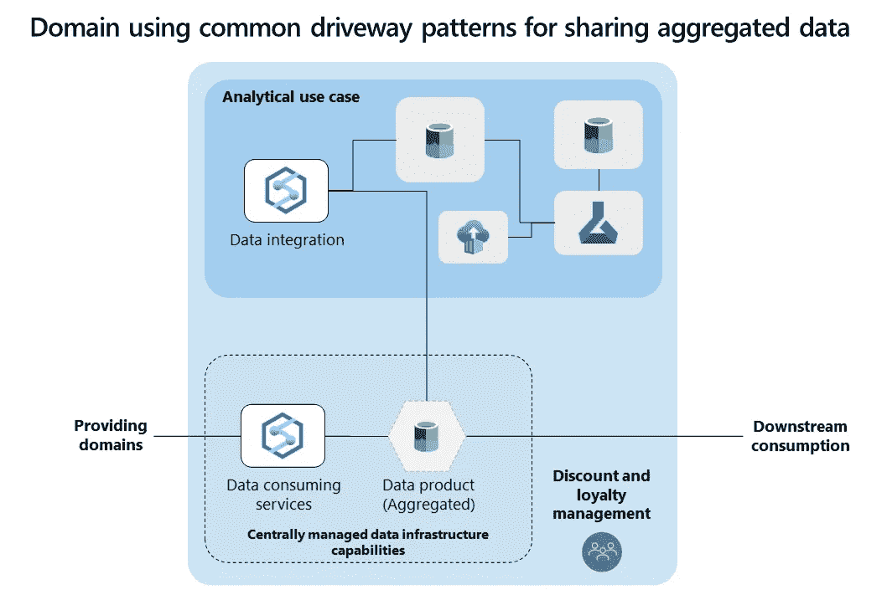
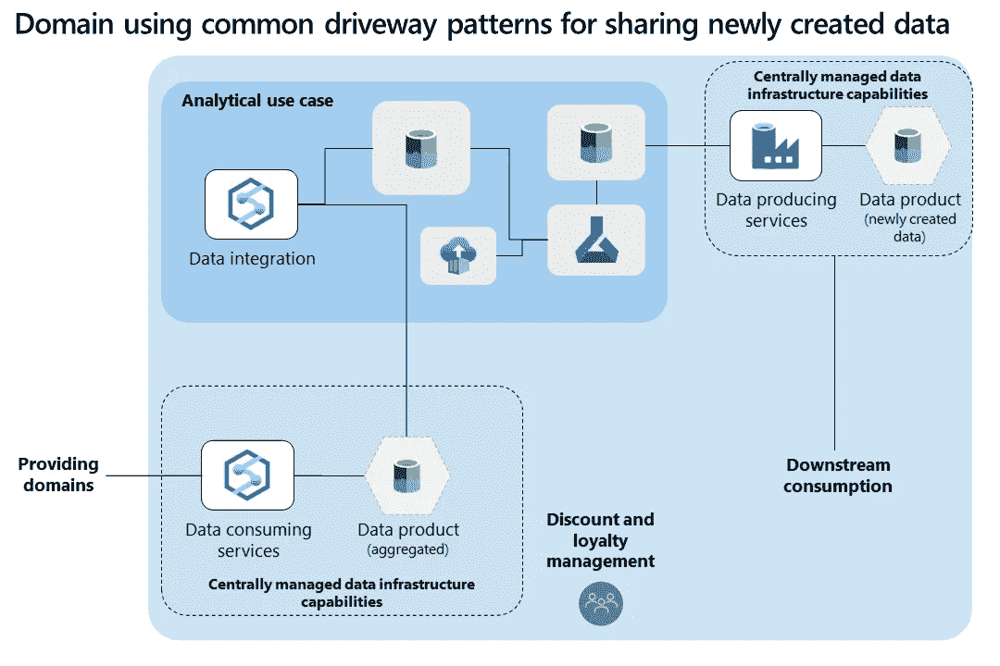
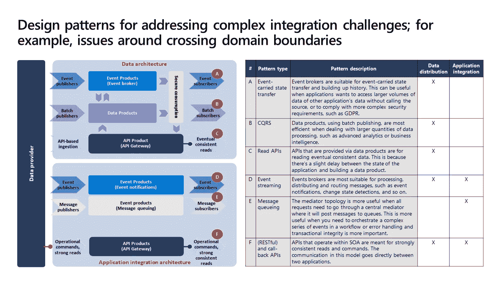
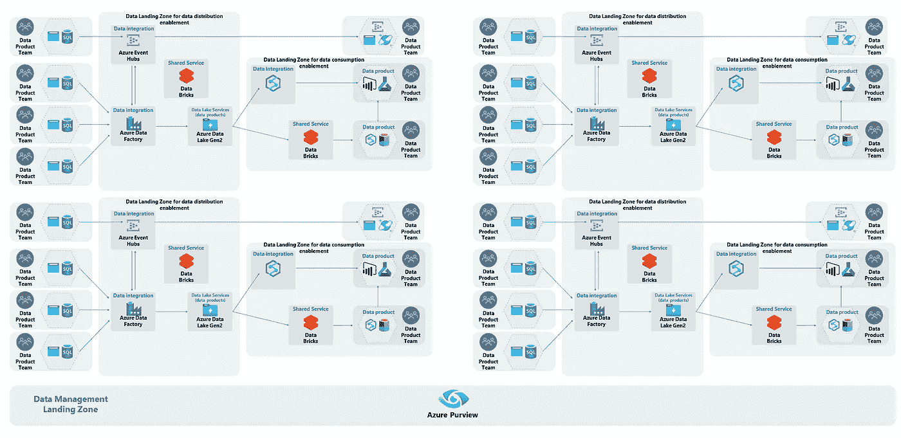

# 数据域—我从哪里开始？

> 原文：<https://towardsdatascience.com/data-domains-where-do-i-start-a6d52fef95d1?source=collection_archive---------0----------------------->

## [行业笔记](https://towardsdatascience.com/tagged/notes-from-industry)

## **设计企业级数据网络的战略途径**

在我与企业进行的所有[数据网格](/data-mesh-topologies-85f4cad14bf2)讨论中，数据域的主题最受关注。客户发现面向领域的数据所有权是数据网格中最难的部分。通常，对领域驱动设计缺乏基本的理解(DDD)。其他数据从业者发现 DDD 的概念太难理解，或者很难将来自软件架构或面向对象编程的例子投射到他们的数据领域。在这篇博文中，我将试着去掉复杂的词汇，为你提供实用的指导。

## **领域驱动设计**

让我们从理论部分开始:领域驱动设计(DDD)是一种支持软件开发的方法，有助于描述大型组织的复杂系统，最初是由 Eric Evans 描述的。DDD 很受欢迎，因为它的许多高级实践对现代软件和应用程序开发方法(如微服务)产生了影响。

DDD 区分了有界上下文、域和子域。领域是我们试图解决的问题空间。它们是知识、行为、法律和活动汇集的地方。它们是我们看到语义耦合的领域:组件或服务之间的行为依赖。为了更好地管理复杂性，域通常被分解成子域。一个常见的例子是分解一个域，使每个子域对应一个特定的业务问题。

并非所有的子域都是相同的。例如，您可以将域分类为核心、通用或支持。核心子域是最重要的。它们是秘方，是配料，让生意变得独一无二。通用子域名是非特定的，通常很容易用现成的产品解决。支持子域名并不能提供竞争优势，但却是保持组织运转所必需的。通常，它们没有那么复杂。

有界上下文是逻辑(上下文)边界。他们关注解决方案空间:系统和应用程序的设计。在这一领域，关注解决方案空间是有意义的。在 DDD，这可以是代码、数据库设计等等。在域和有界的上下文之间，可以有对齐，但是将它们绑定在一起并没有硬性规定。有界上下文本质上通常是技术性的，并且可以跨越多个域和子域。

DDD 在数据管理方面的困难在于，DDD 最初的用例是在软件开发的背景下对复杂系统建模。最初，它从未被创造出来用于建模企业数据，这使得数据管理从业者的方法非常抽象和技术性。所以让我打个比方。把一个领域想象成一个共同感兴趣的领域。以你的房子和街道为例。街道是一个域，每个房子代表一个子域。每栋房子都有自己的房子，都有栅栏，这也意味着一栋房子不会占据整个房子。栅栏代表有界的上下文(责任模型)。房主负责维护他们的房子，并可以在他们的范围内做任何他们想做的事情。然而，当跨越边界(栅栏)时，有一些规则需要遵守。例如，当离开或进入你的房子时，总是使用公共车道。

如果我们将[数据网格](/data-mesh-topologies-85f4cad14bf2)作为数据民主化的一个概念，并实现面向领域的数据所有权原则以获得更大的灵活性，这在实践中会如何工作？从企业数据建模到领域驱动设计建模的转变会是什么样的？我们可以从 DDD 的数据管理中学到什么？

## **对你的问题空间进行功能性业务分解**

在允许团队端到端地操作他们的数据之前，我的第一个建议是查看范围并理解您试图解决的问题空间。在进入技术实现的细节之前，先做这个练习很重要。正如 DDD 所主张的，在这些问题空间之间设定逻辑界限是有帮助的，因为责任更加清晰，也将得到更好的管理。

为了对你的问题空间进行分组，我鼓励你看看你的业务架构。在业务架构中，有业务能力:业务可能拥有或交换以实现特定目的或结果的能力。这种抽象将数据、过程、组织和技术打包在一个特定的上下文中，与组织的战略业务目标和目的相一致。业务能力图显示了哪些功能区域被认为是实现您的使命和愿景所必需的。

一家虚构的航空公司的业务能力图

上面，我对一家虚构的航空公司进行了分解: **Oceanic Airlines** ，为了取得成功，它需要掌握业务能力图中列出的所有功能领域。例如，大洋航空公司必须能够作为在线或离线机票管理系统的一部分销售机票，或者由于飞行员管理计划而有飞行员驾驶飞机。该公司可以外包一些活动，同时保持其他活动作为其业务的核心。

你将在实践中观察到，你的大多数人都是围绕这些能力组织起来的。从事相同业务能力的人共享相同的词汇。这同样适用于您的应用程序和流程；基于它们需要支持的活动的内聚性，它们通常被很好地对齐并紧密地连接在一起。因此，业务能力映射是一个很好的起点，但是故事并没有到此结束。

## **将业务能力映射到您的应用和数据**

为了更好地管理您的企业架构，业务能力、有限的上下文和应用程序都应该保持一致。这样做时，遵循一些基本规则是很重要的。至关重要的是，业务能力停留在业务层面上，并保持抽象。它们代表了一个组织所做的事情，并以问题空间为目标。当一个业务能力被实现时，一个特定上下文的实现——**能力实例**——被创建。在解决方案空间的这种界限内，多个应用程序和组件协同工作来交付特定的业务价值。

与特定业务功能相关的应用程序和组件与其他业务功能相关的应用程序保持分离。这允许更大的灵活性，也是领域和有界环境发挥作用的地方，就像边界围栏和我们的房子一样。您可以设置明确的原则:有界上下文是从业务功能中派生出来的，并且专门映射到业务功能。它们代表了业务功能实现的边界，表现得像一个域。如果业务能力改变，有界的上下文也会改变。优选地，您期望域和相应的有界上下文之间完全一致，但是现实——您将在接下来的部分中了解到——可能是不同的。

如果我们将能力映射投射到 Oceanic Airlines，您的有界上下文边界和域实现可能如下所示。

域之间的数据分布(作者:Piethein Strengholt)

在上面的“域间数据分布”示例中，客户管理建立在主题专业知识的基础上，因此有权决定向其他域提供什么数据。客户管理的内部架构是分离的，因此这些边界内的所有应用程序组件可以使用特定于应用程序的接口和数据模型直接通信。然而，使用[数据产品和清晰的互操作性标准](/data-domains-and-data-products-64cc9d28283e)将数据分发到其他域是正式的。这是进入或离开你家的普通车道！在这种方法中，所有的数据产品都与领域保持一致，并继承了无处不在的语言:一种构建的、形式化的语言，由来自同一领域的利益相关者和设计者达成一致，以服务于该领域的需求。

## **多能力**实现**产生额外的域**

当使用业务功能图时，理解一些业务功能可以被实例化多次是很重要的。例如，海洋航空公司，我们到目前为止一直使用的例子，可以有多个本地化的“行李处理和丢失项目”的实现。例如，某项业务仅在亚洲运营。在这种情况下，“行李处理和遗失物品”是亚洲相关飞机的一项功能。不同的业务线可能以欧洲市场为目标，因此在这种情况下使用另一种“行李处理和丢失物品”功能。这种多实例的场景可能会导致使用不同技术服务的多个本地化实现，以及操作这些服务的不相关团队。吸取的教训是，业务能力和能力实例(实现)的关系是一对多的，这也意味着您最终会有额外的(子)领域。

## **共享功能和共享数据**

更重要的是你应该如何处理共享的业务能力。这种功能通常集中实现——作为服务模型——并提供给不同的业务部门。例如，“客户管理”可能就是这样一种能力。就海洋航空公司而言，亚洲和欧洲的业务部门对其客户使用相同的管理。问题是:如何将领域数据所有权投射到共享功能上？很可能多个业务代表对坐在同一个共享管理中的客户负责。**总结一下，有一个应用域和一个数据域！**从[数据产品](/data-domains-and-data-products-64cc9d28283e)的角度来看，您的领域和有界上下文并不完全一致。相反，你可以认为从业务能力的角度来看，仍然有一个单一的数据问题。

> **数据产品:**数据产品是数据架构的一个单元或组件，它封装了使读优化数据集可供其他域使用的功能。

对于您共享的功能，比如复杂的供应商包、SaaS 解决方案和遗留系统，我建议在您的领域数据所有权方法上保持一致。一种技术是通过数据产品分离数据所有权，这也可能需要应用程序的改进。在“客户管理”的例子中，来自应用领域的不同管道可以生成多个数据产品:一个数据产品用于所有与亚洲相关的客户，另一个用于所有与欧洲相关的客户。这意味着多个数据域来自同一个应用程序域。

处理共享数据的另一种技术是要求您的应用程序域设计一个单独的数据产品，该产品封装了元数据，用于区分数据产品内部的数据所有权。例如，您可以为所有权使用保留的列名，将每一行映射到一个特定的数据域。下面你会看到一个使用域列的例子。

封装元数据如何促进共享所有权的示例(作者:Piethein Strengholt)

共享功能的复杂性在于数据域与应用程序域重叠。理想情况下，您拥有业务能力的团队与您的应用程序域一致，因此软件所有权和数据所有权也是一致的。如果无法拆分您的域，您需要区分应用程序所有权和数据所有权。因此，在“客户管理”的例子中，您将有一个负责底层技术服务、管道和应用程序组件的应用程序所有者。接下来，您将有多个数据所有者(业务代表)负责不同的数据集，包括元数据注册、隐私、安全性等等。

## **关注服务于多种业务能力的复杂应用**

另一个需要注意的地方是满足多种业务能力的应用程序，这在大型和传统企业中很常见。例如，大洋航空公司使用一个软件包来促进“成本管理”和“资产和融资”。这种共享应用程序通常很大而且很复杂:提供尽可能多的功能的供应商业务套件或遗留系统。这种情况下的应用领域预计会更大。这同样适用于共享所有权，这意味着多个数据域驻留在一个应用程序域中。

## **与来源一致、重新交付和与消费者一致的领域的设计模式**

在映射您的域时，您将了解到基于数据的创建、消费或重新交付有不同的模式。我建议设计架构蓝图来支持您的领域，基于它们所具有的特征。

**源对齐域**与数据来源的源系统对齐。这些通常是交易或操作系统。目标必须是直接从这些黄金来源系统中获取数据。源自提供域的数据产品应该针对密集数据消费进行读取优化，因此您希望使用标准化服务来促进域的数据转换和共享。这些服务，包括预配置的容器结构，使您的面向源代码的领域团队能够更容易地发布数据；这是阻力最小的路径，以最小的干扰和成本做正确的事情。例如，如果设计正确，您的架构看起来像下面的模型:

源对齐域数据共享(作者:Piethein Strengholt)

**消费者对齐的域**与来源对齐的域相反，因为它们与需要来自其他域的数据的特定最终用户用例对齐。他们消费和转换数据，以适应他们的业务用例。为了满足这些消费需求，您应该考虑为数据转换和消费提供共享数据服务，例如处理数据管道、存储基础设施、流服务、分析处理等的与域无关的数据基础设施功能。

使用数据的消费一致领域(作者:Piethein Strengholt)

**再交付领域:**另一个不同且更困难的场景是数据的可重用性。例如，多个下游消费者可能对来自不同领域的数据组合感兴趣。[数据产品的指导](/data-domains-and-data-products-64cc9d28283e)将有助于做出正确的决策。

对于您的架构，我鼓励您松散地耦合数据产品的创建和您的分析用例。在下面的模型中，域同时拥有聚合数据、可重用数据和分析用例。然而，这两个问题是不相关的。使用这种方法，数据消费者可以安全地消费新的数据产品，而不会与同一领域的分析用例紧密相连。这种情况下的聚合数据是分析用例的输入。

共享汇总数据(作者:Piethein Strengholt)

另一个选项可以是新生成的数据，这些数据将成为其他域的候选数据。在这种情况下，数据消费者变成了数据提供者，并将遵循相同的数据分发路径。这种情况下的架构如下所示:

分享新创建的分析数据(作者:Piethein Strengholt)

## **应对复杂集成挑战的标准化模式**

当将您的企业环境分解成更细粒度的领域结构时，您会遇到复杂的集成挑战。如果我们以海洋航空公司为例，不同的其他领域可能需要来自“客户管理”的数据。或者"飞行计划和概述
管理"必须在"飞行员管理"中知道一名飞行员是否还存在，才能计划一次飞行。你会如何解决这个问题？

最佳实践是在**通用车道模式**上实现跨域边界集成的标准化。例如，在执行大型数据处理时，您可以应用 CQRS 来构建面向域的读取数据存储。这允许域从其他域集中读取数据，而不需要不断复制数据。例如，对于高度一致的读取(和命令)，推荐使用 API 模式。以下关于设计模式的概述可以在您的过渡中为您提供支持:

领域间复杂集成的公共车道模式

如果您的公共车道模式设计正确，它们也可以与您的数据管理功能集成。这允许您捕获元数据，以获得安全性、可观察性、可发现性、沿袭和链接、质量监控、编排、通知等方面的透明度和洞察力。

## **解耦的粒度级别**

现在我们知道了如何识别和促进数据域，我们来看下一点:设计正确的域粒度级别和分离规则。当分解您的架构时，有两个重要的方面发挥作用:

首先，**功能域**和设置有界上下文的粒度:符合工作方式，确保数据对所有域可用，利用共享服务，遵守元数据标准，等等。我对数据分布的建议是设置边界，在可能的情况下，设置精细的边界，因为成为数据驱动就是让数据可用于密集(重复)使用数据。如果您将您的域边界定义得太粗，您将在许多应用程序之间强加不期望的耦合，并且数据可重用性会丧失。因此，每次数据跨越业务能力的边界时，都要努力实现解耦。这意味着在一个域中，紧耦合是允许的。然而，当跨越边界时，域必须保持解耦，并分发读取优化的数据产品，以便与其他域共享数据。因此，例如，如果大洋航空公司的“预订&佣金”和“客户管理”需要交换数据，它们必须使用通用的车道模式。

第二，对于**技术领域**和基础设施利用率，有粒度。想象一个现代分布式数据平台，它使用不同的分散[区域](https://docs.microsoft.com/en-us/azure/cloud-adoption-framework/scenarios/data-management/architectures/data-landing-zone)来实现服务数据集成和数据产品的敏捷性。这样一个区域，下面有共享的基础设施和服务，您将如何向您不同的领域团队提供这些呢？我的经验是，许多不同的方面触发了哪些功能域将被逻辑地分组在一起，并成为共享平台基础设施的候选。这里有几个例子:

*   工作和共享数据方式的内聚力和效率。这与数据重力密切相关:在域之间不断共享大型数据集的趋势。
*   区域界限可能会导致实现相同的业务功能和蓝图。
*   所有权、安全性或法律界限可能会迫使域被分离。例如，某些数据不允许被其他域看到。
*   灵活性和变化速度是重要的驱动因素。在几个领域内可以有创新的速度，而其他领域强烈重视稳定性。
*   功能边界可以将团队分开，例如面向源/面向消费者。也许你的领域团队中有一半人认为特定的服务比其他服务更重要。
*   一个原因可能是您希望出售或分离您的功能，因此与来自其他领域的共享服务紧密集成是不明智的。
*   团队规模、技能和成熟度可能是一个因素。高技能和成熟的团队希望运营他们自己的服务和基础设施。
*   不幸的是，政治界限也可能是一种驱动力。当业务能力与组织结构不一致时，我尤其会看到这一点。

业务能力建模的好处在于，它可以帮助您更好地识别和组织数据网格架构中的领域。它提供了数据和应用程序如何为您的企业带来价值的整体视图。与此同时，您可以优先考虑并关注您的数据策略和实际业务需求。除了只需要数据之外，您还可以使用这个模型。例如，如果可伸缩性是一个问题，您可以确定您最关键的核心能力，并为这些能力开发一个策略。

当将所有域和基础架构区域拼接在一起时，数据网格体系结构在概念上应该是这样的:

数据网格架构中域如何组织、利用基础设施和交互的示例架构(作者:Piethein Strengholt)

在上面的模型中，域被逻辑地组织并有效地共享基础设施，同时使用公共车道模式集成和分布数据。每个数据产品团队作为一个子域，负责他们生产和服务的数据。当跨越域边界时，团队利用基础设施区域蓝图提供的共享数据服务进行数据转换和消费。

有些人可能会担心，通过预先规划一切来构建这样一个目标状态架构是一项密集的工作。建议的替代方法是在将域加入到架构中的同时，有机地识别它们。因此，你不是自上而下地定义你的目标状态，而是自下而上地工作:探索、试验和将你的当前状态向目标状态过渡。这种方法可能会更快，但是当东西开始损坏时，会暴露出进入复杂的移动或改造操作的风险。一个更微妙的方法可能是在两个方向都起作用，然后在中间会合。

最后，设计大规模的分布式架构也需要你大规模地思考。业务能力建模和映射您的关键战略支柱将平滑您的领域分解。如果这是你喜欢的内容，我让你看看《规模化数据管理[*》这本书。*](https://learning.oreilly.com/library/view/data-management-at/9781492054771/)

感谢 [@mchesbro](https://medium.com/@mchesbro) 、 [@mihail.tatarnikov](http://medium.com/@mihail.tatarnikov) 、 [@bashyroger](http://medium.com/@bashyroger) 、 [Richard Rotella](https://www.linkedin.com/in/richardrotella1/?lipi=urn%3Ali%3Apage%3Amessaging_thread%3B1e48ccc4-8640-4da5-a260-e5c8314d7052&licu=urn%3Ali%3Acontrol%3Ad_flagship3_messaging-topcard) 、 [Klaudia Gowero](https://www.linkedin.com/in/klaudiagowero/) 和 [Jan Meskens](https://www.linkedin.com/in/janmeskens/) 提供反馈！此外， [@roger.stoffers](http://medium.com/@roger.stoffers) 分享了他的著作《数字化转型实地指南[》中的见解](https://www.informit.com/store/field-guide-to-digital-transformation-9780137571840)