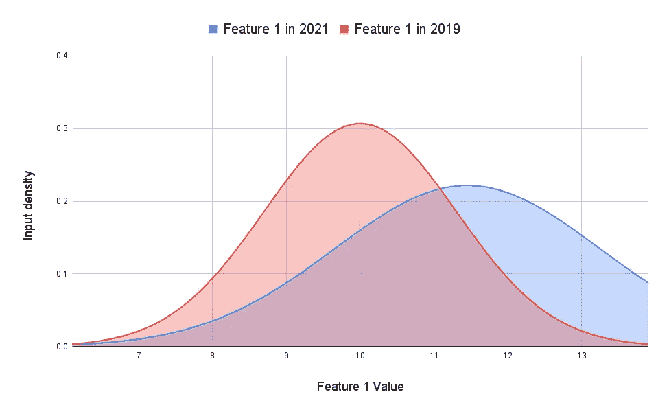
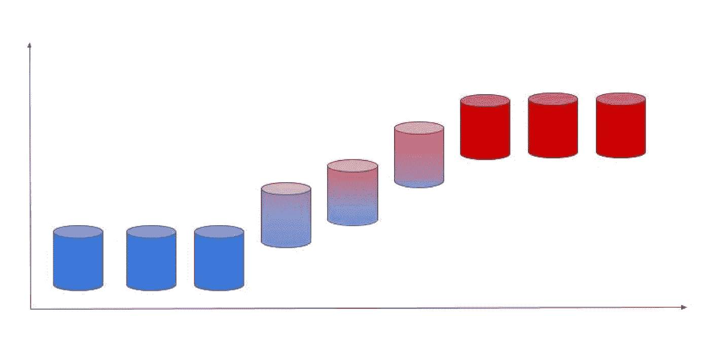
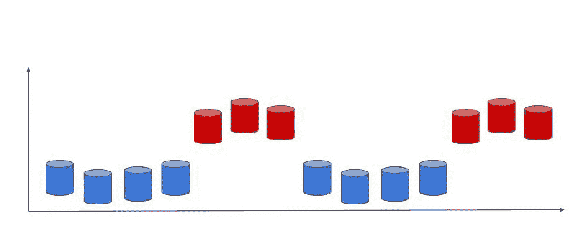

# 数据漂移第 1 部分:数据漂移的类型

> 原文：<https://towardsdatascience.com/data-drift-part-1-types-of-data-drift-16b3eb175006?source=collection_archive---------12----------------------->

## 导致模型性能下降的不同类型的数据漂移

作者图片

在这一系列文章中，我计划解释数据漂移的概念以及它如何导致模型性能下降，如何识别数据漂移，以及如何提出一个监控计划来帮助尽早识别数据漂移和性能下降。

让我们考虑这样一个场景，你开发了一个模型，预测客户贷款违约的概率，它有很好的性能。简单地说，性能指标是准确性，您的模型有 86%的准确性。但是部署后几个月，你的模型表现不佳。业绩下滑到 70%。或者，项目批准和模型部署中的延迟，导致训练好的模型仅仅停留在那里几个月，而没有部署到生产中。当它最终被部署时，性能并不好。这是否意味着你当时开发的模型实际上并不好？不一定，“shift happens”(明白吗？).在这一系列文章中，我将讨论数据漂移(或数据偏移)如何导致性能下降，不同类型的数据漂移，如何识别数据漂移，整体模型监控实践，以便这些变化不会让您措手不及，以及最后如何在识别数据漂移后克服并修复您的模型。

在这篇文章(第 1 部分)中，让我们看看不同类型的数据漂移，以及它们是如何发生的一些例子。这将有助于我们理解数据漂移如何导致模型性能下降。

> 数据转移、数据漂移、概念转移、变化的环境、数据断裂都是描述同一现象的类似术语:训练和测试/生产数据之间的不同数据分布

当这些变化发生时，我们正在打破机器学习模型的基本假设。假设过去的(训练)数据代表未来的(测试/生产)数据。

# 数据移位的类型

## 1)协变量移位(自变量的移位):

协变量移位是一个或多个独立变量(输入特征)的分布变化。这意味着由于一些环境变化，即使特征 X 和目标 Y 之间的关系保持不变，特征 X 的分布也已经改变。下图可能有助于更好地理解这一点。

作者图片

在我们上面的违约概率示例中，这可能意味着由于疫情，许多企业关闭或收入减少，他们不得不裁员，但他们决定继续支付贷款，因为他们担心银行可能会没收他们的资产(X 变量的分布不同，但 Y 的分布相同)。

另一个例子是，随着用户群的增长，你投入生产的模型开始看到一个新时代的人口统计。你可能会对年轻用户进行培训，但是随着时间的推移，你也可能会有很多老用户。因此，你会看到均值和方差增加，因此数据漂移。

当这种变化发生在模型的一个或多个主要变量中时，性能下降会更加明显。您还应该在模型开发过程中验证输入特性是稳定的(例如，检查训练集和测试集内部和之间的这种变化)，然后在部署后通过模型监控继续这样做。要学习如何识别协变班次，**请看以下帖子:** [**第二部分**](https://medium.com/@numal.jayawardena/data-drift-part-2-how-to-detect-data-drift-1f8bfa1a893e) **&** [**我的博文**](https://practicalml.net/Data-Drift-Code-Examples/) **。**

在更正式的定义术语中，协变量移位是指 *Ptrain(Y|X)=Ptest(Y|X)但 Ptrain(X) ≠Ptest(X)* 的情况

其中 *Ptest* 可能是模型部署后的测试集或数据。

## 2)先验概率转移(目标变量的转移):

通过先验概率转移，输入变量的分布保持不变，但目标变量的分布发生变化。例如，可能是这样的:

作者图片

在我们上面的违约概率示例中，可能有一些公司没有真正受到锁定的影响，也没有遭受任何收入损失，但他们故意选择不偿还贷款分期付款，以利用政府补贴，并可能节省这笔钱，以防未来情况恶化(相同的 X 分布，但不同的 Y)。

在更正式的定义术语中，协变量移位是指 *Ptrain(X|Y)=Ptest(X|Y)但 Ptrain(Y) ≠Ptest(Y)* 的情况

其中 *Ptest* 可能是模型部署后的测试集或数据。

## 3)观念转变

随着概念漂移，输入和输出变量之间的关系发生变化。这意味着输入变量的分布(例如用户人口统计、单词频率等。)甚至可能保持不变，我们必须转而关注 X 和 y 之间关系的变化。

在更正式的定义术语中，概念转换是指 *Ptrain(Y|X) ≠ Ptest(Y|X)* 的情况

其中 *Ptest* 可能是模型部署后的测试集或数据。

概念漂移更可能出现在依赖于时间的领域，如时间序列预测和季节性数据。在一个月内学习一个模型不会推广到另一个月。概念漂移有几种不同的表现方式。

**逐渐的概念漂移**

渐进式或渐进式漂移是我们可以观察到的随时间推移而发生的概念漂移，因此可以预期。随着世界的不同变化，我们的模式逐渐变得过时，导致其性能逐渐下降。

作者图片

概念逐渐漂移的一些例子有 </machine-learning-in-production-why-you-should-care-about-data-and-concept-drift-d96d0bc907fb> :

*   **推出替代产品** —在培训期间无法获得的产品(例如，如果该产品是市场上同类产品中的唯一产品)可能会对该型号产生不可预见的影响，因为它以前从未见过类似的趋势
*   **经济变化**——利率的变化及其对更多贷款人拖欠贷款的影响可能会引起变化。

随着时间的推移，这些情况的影响会累积起来，导致更剧烈的漂移效应。

**突发的概念漂移**

作者图片

顾名思义，这些观念的转变来得很突然。一些最明显的例子出现在新冠肺炎首次在全球范围内出击的时候。需求预测模型受到严重影响，供应链跟不上，突然出现了像 2020 年卫生纸大短缺(不是官方术语，只是我的叫法😆)

作者图片

但是这种变化也可能发生在公司的正常运作过程中，而不会发生疫情 </machine-learning-in-production-why-you-should-care-about-data-and-concept-drift-d96d0bc907fb> 。

**道路网络的重大变化:**新道路的突然开放和其他道路的关闭或新公共铁路系统的增加可能会给交通预测模型带来麻烦，直到它收集了一些数据来处理，因为它以前从未见过类似的配置。

**生产线增加新设备:**新设备提出新问题，减少老问题。所以这个模型不确定如何做出好的预测。

一般来说，环境中的任何重大变化都会使模型陷入不熟悉的领域，从而导致性能下降。

**重复出现的概念漂移**

作者图片

反复出现的概念漂移相当于“季节性”。但季节性在时间序列数据的机器学习中是常见的，我们也意识到了这一点。因此，如果我们预期这种漂移，例如在周末或一年中的某些假期出现不同的模式，我们只需要确保我们用代表这种季节性的数据来训练模型。只有当模型不熟悉的新模式出现时，这种数据漂移通常会成为生产中的一个问题。

实际上，确定数据漂移的确切类型并不重要。通常，这种漂移可能是这些东西的组合，而且很微妙。重要的是识别对模型性能的影响并及时捕捉偏差，以便尽早采取措施，如重新训练模型。

既然您怀疑存在数据漂移，那么如何识别模型性能下降背后的数据漂移发生在哪里呢？要了解如何识别数据集中的数据漂移，请阅读本系列的第二部分[**。**](https://medium.com/@numal.jayawardena/data-drift-part-2-how-to-detect-data-drift-1f8bfa1a893e)

【https://practicalml.net】点击 [*查看我的博客*](https://practicalml.net) *获取更多即将发布的帖子*

# 参考

[1] Sarantitis，G. (2021 年 6 月 24 日)。*机器学习中的数据移位:是什么，如何检测*。圣乔治·萨兰蒂斯。[https://gsarantitis . WordPress . com/2020/04/16/data-shift-in-machine-learning-what-it-and-how-to-detect-it/。](https://gsarantitis.wordpress.com/2020/04/16/data-shift-in-machine-learning-what-is-it-and-how-to-detect-it/.)

[2]萨穆伊洛娃，E. (2021 年 6 月 22 日)。*生产中的机器学习:为什么要关心数据和概念漂移*。中等。[https://towards data science . com/machine-learning-in-production-why-you-should-care-data-and-concept-drift-d 96d 0 BC 907 FB](/machine-learning-in-production-why-you-should-care-about-data-and-concept-drift-d96d0bc907fb)

<https://gsarantitis.wordpress.com/2020/04/16/data-shift-in-machine-learning-what-is-it-and-how-to-detect-it/>  </machine-learning-in-production-why-you-should-care-about-data-and-concept-drift-d96d0bc907fb> 