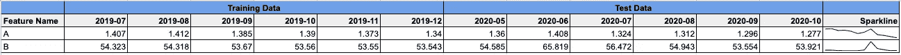
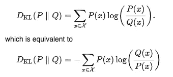

# 数据漂移—第 2 部分:如何检测数据漂移

> 原文：<https://towardsdatascience.com/data-drift-part-2-how-to-detect-data-drift-1f8bfa1a893e?source=collection_archive---------18----------------------->

## 识别模型中数据漂移的指南

图片由卢克·切瑟 | [Unsplash](https://unsplash.com/photos/JKUTrJ4vK00) 拍摄

**在本帖中，我们将介绍一些用于识别任何可能发生的数据漂移的技术。**

假设您已经将一个模型部署到生产中，并且您注意到性能正在下降。性能下降背后有几个可能的原因:

1.  模型输入数据本身存在错误:

*   由于数据源的问题，输入数据可能是错误的。前端问题意味着写入数据库的数据不正确
*   特征工程计算中可能存在错误。来源处的数据是正确的，但在管线中或特征工程期间存在错误，这意味着输入到特定特征的模型中的数据是不正确的

这些问题通常需要进一步的人工调查，并且可以通过代码审查、调试等来解决。

2.当外部因素导致数据发生真实变化时。这就是数据漂移，在本系列的第 1 部分中，我们了解了不同类型的数据漂移(协变量漂移、先验概率漂移&概念漂移)和一些例子。

假设经过一些检查后，您怀疑模型性能下降确实是由于数据漂移。那么，我们如何验证这一点，并确定数据漂移发生在数据的哪个位置呢？

测量漂移有三种主要技术:

1.  统计:这种方法使用数据集上的各种统计指标来得出关于训练数据的分布是否不同于生产数据分布的结论。我们已经有了数据，所以它通常涉及到每次运行相同的计算，并可能绘制结果以便于分析。
2.  基于模型:这种方法包括训练分类模型，以确定某些数据点是否与另一组数据点相似。如果模型很难区分数据，那么就没有任何显著的数据漂移。如果模型能够正确地分离数据组，那么可能存在一些数据漂移。
3.  自适应窗口(ADWIN):这种方法用于流数据，在这种情况下，有大量的无限数据流入，不可能全部存储。与此同时，数据可能会变化得非常快。

# 1.统计法

这些方法中有许多是比较分布的。比较需要一个参考分布，它是我们用来比较生产数据分布的固定数据分布。例如，这可能是训练数据的第一个月，或者是整个训练数据集。这取决于你试图检测漂移的背景和时间范围。但是显然，参考分布应该包含足够的样本来表示训练数据集。让我们考虑一个使用 2019 年的数据训练的分类模型，其性能在 2020 年一直在缓慢下降。在这种情况下，我们可以开始尝试使用以下方法来检测顶级功能中的数据漂移。

**注意:**因为我们想观察数据随时间的漂移，我们想按时间聚合或划分数据，可以是每月、每周等，这取决于您的数据和监控频率。在本例中，我们将按月汇总数据。

下面我将解释一些用于检测漂移的不同统计方法。要查看使用真实数据集的完整代码示例，请参考我的博文[这里](https://practicalml.net/Data-Drift-Code-Examples/)。

## 平均

我们可以考虑的第一个也是最简单的一个衡量标准是我们特征的方法。如果平均值在几个月内逐渐向某一特定方向移动，那么可能发生了数据漂移。

作者图片

我们可以从迷你图中看到，功能 A 处于下降趋势。迷你图不是识别趋势的最佳工具，因为它们会使细微的变化看起来有些夸张。平均值不是检查漂移的最可靠的方法，但却是一个很好的起点。

# 统计距离度量

有许多不同的统计距离度量可以帮助量化分布之间的变化。不同的距离检查在不同的情况下是有用的。

## 人口稳定指数

PSI 常用于金融行业，是一种衡量变量在两个样本之间或一段时间内的分布变化程度的指标。顾名思义，它有助于测量两个人口样本之间的人口稳定性。

`Equation: PSI = (Pa — Pb)ln(Pa/Pb)`

ln(Pa/Pb)项意味着，与具有大百分比分布的仓中的大变化相比，代表小百分比分布的仓中的大变化对 PSI 的影响更大。

应该注意的是，群体稳定性指数仅仅表示特征的变化。但是，这不一定会导致性能下降。因此，如果您确实注意到性能下降，您可以使用 PSI 来确认总体分布确实发生了变化。PSI 检查也可以添加到您的**监控计划**中。

## 库尔巴克-莱布勒散度

KL 散度衡量两个概率分布之间的差异，也称为相对熵。如果一个分布与另一个分布有很高的方差，KL 散度是有用的。

KL 公式来自[维基百科](https://en.wikipedia.org/w/index.php?title=Kullback%E2%80%93Leibler_divergence&oldid=1029607529)

KL 散度也是不对称的。这意味着，与 PSI 不同，如果参考和生产(比较)分布对被交换，结果会有所不同。所以 KL(P || Q)！= KL(Q || P)。这对于涉及 Baye 定理的应用或当您有大量训练(参考)样本，但在比较分布中只有一小组样本(导致更多方差)时非常有用。

KL 分数的范围从 0 到无穷大，其中 0 分意味着两个分布是相同的。如果 KL 公式采用以 2 为底的对数，结果将以位为单位，如果使用自然对数(底 e)，结果将以“nats”为单位。

## 詹森-香农(JS)散度

JS 散度是量化两个概率分布之间差异的另一种方式。它使用我们上面看到的 KL 散度来计算对称的标准化得分。这使得 JS 散度分数更有用，也更容易解释，因为当使用对数基数 2 时，它提供了 0(相同分布)和 1(最大不同分布)之间的分数。

使用 JS，不存在被零除的问题。当一个分布在某些区域有值而另一个没有值时，就会出现被零除的问题。

## 瓦瑟斯坦距离度量

Wasserstein 距离，也称为推土机距离，是给定区域内两个概率分布之间距离的度量。Wasserstein 距离对于非重叠数值分布移动和高维空间(例如图像)的统计是有用的。

## Kolmogorov-Smirnov 检验(K-S 检验或 KS 检验)

KS 检验是连续/不连续一维概率分布相等的一种[非参数检验](https://en.wikipedia.org/wiki/Nonparametric_statistics)，可用于比较样本与参考概率分布(单样本 K–S 检验)，或比较两个样本(双样本 K–S 检验)。

# 2.基于模型

上述统计方法的替代方法是建立一个分类器模型，尝试区分参考分布和比较分布。我们可以通过以下步骤做到这一点:

1.  将用于构建当前生产模型的批中的数据标记为 0。
2.  将我们从那时起收到的那批数据标记为 1。
3.  开发一个模型来区分这两个标签。
4.  评估结果，必要时调整模型。

如果开发的模型可以很容易地区分两组数据，那么协变量发生了变化，模型需要重新校准。另一方面，如果模型难以区分两组数据(其精确度约为 0.5，与随机猜测一样好)，则没有发生显著的数据偏移，我们可以继续使用该模型。

# 3.ADWIN 自适应滑动窗口

如前所述，当我们有一个输入数据流时，上述技术不是很合适。在某些情况下，数据可能漂移得如此之快，以至于当我们收集数据并训练模型时，趋势可能已经发生了变化，我们的模型已经过时了。但是计算出训练的最佳时间框架也不是那么简单。这就是自适应滑动窗口技术有用的地方。它能适应不断变化的数据。例如，如果发生变化，窗口大小将自动缩小，否则，如果数据是静止的，窗口大小将增大以提高准确性。

这些技术可以根据其适用性来检测数据漂移。但是我们希望避免等到发现模型中的性能显著下降时才开始调查数据漂移。这就是拥有一个模型监控计划变得非常有用的地方。查看本系列文章的第 3 部分(即将发布),了解如何创建有效的模型监控计划。

*原载于 2021 年 6 月 10 日*[*【https://practicalml.net】*](https://practicalml.net/Detecting-data-drift/)*。*

*在*[*https://practicalml.net*](https://practicalml.net)*查看我的博客，将来会有更多帖子*

# 参考

[1] Dhinakaran，A. (2020 年 10 月 19 日)。*使用机器学习可观察性的统计距离度量*。中等。[https://towards data science . com/using-statistical-distance-metrics-for-machine-learning-observability-4c 874 cded 78。](/using-statistical-distance-metrics-for-machine-learning-observability-4c874cded78.)

[2]维基媒体基金会。(2021 年 6 月 21 日)。*库尔贝克-莱布勒散度*。维基百科。[https://en.wikipedia.org/w/index.php?title = kull back % E2 % 80% 93 lei bler _ divergence&oldid = 1029607529。](https://en.wikipedia.org/w/index.php?title=Kullback%E2%80%93Leibler_divergence&oldid=1029607529.)

# 进一步阅读

**PSI:**[https://towards data science . com/using-statistical-distance-metrics-for-machine-learning-observability-4c 874 cded 78。](/using-statistical-distance-metrics-for-machine-learning-observability-4c874cded78.)

**kull back-lei bler(KL)divergence:**[https://towardsdatascience . com/light-on-math-machine-learning-intuitive-guide-to-understanding-KL-divergence-2b 382 ca 2 B2 a 8](/light-on-math-machine-learning-intuitive-guide-to-understanding-kl-divergence-2b382ca2b2a8)

**詹森-香农(JS)散度:**[https://medium . com/datalab-log/measuring-the-statistical-similarity-between-two-samples-using-Jensen-Shannon-and-kull back-lei bler-8d 05 af 514 b 15](https://medium.com/datalab-log/measuring-the-statistical-similarity-between-two-samples-using-jensen-shannon-and-kullback-leibler-8d05af514b15)

**瓦瑟斯坦距离度量:**([https://towardsdatascience . com/earth-movers-distance-68 fff 0363 ef2](/earth-movers-distance-68fff0363ef2))

[https://en.wikipedia.org/wiki/Wasserstein_metric](https://en.wikipedia.org/wiki/Wasserstein_metric)

**Kolmogorov–Smirnov 测试:**[https://en . Wikipedia . org/wiki/Kolmogorov % E2 % 80% 93 Smirnov _ test # Discrete _ and _ mixed _ null _ distribution](https://en.wikipedia.org/wiki/Kolmogorov%E2%80%93Smirnov_test#Discrete_and_mixed_null_distribution)

**基于模型:**[https://www . arango db . com/2020/11/arango ml-part-4-detecting-co variate-shift-in-datasets/](https://www.arangodb.com/2020/11/arangoml-part-4-detecting-covariate-shift-in-datasets/)