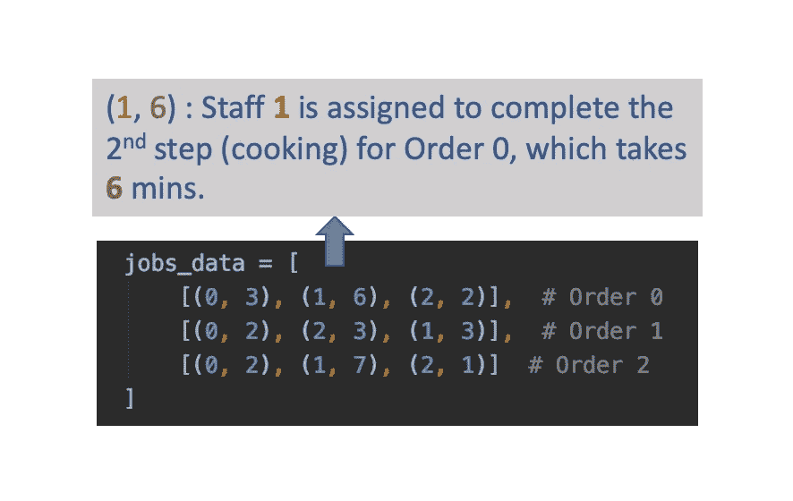
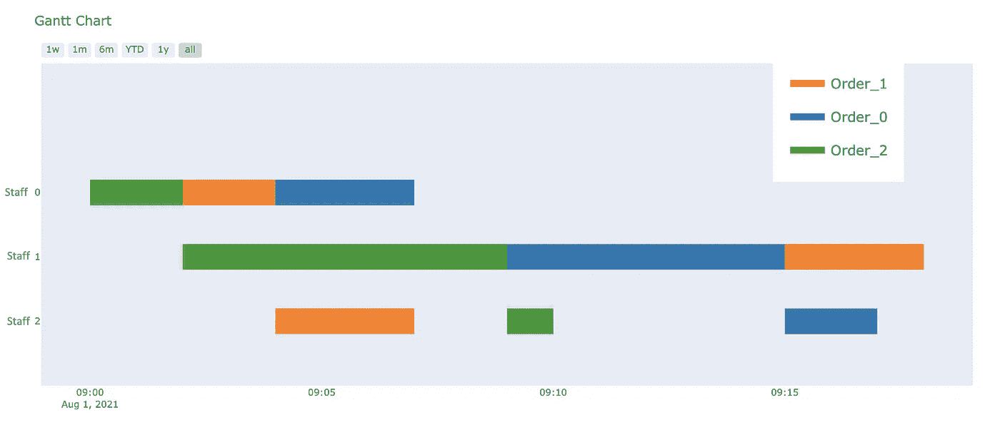
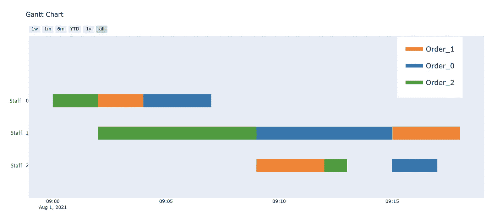

# 数据驱动调度优化方法

> 原文：<https://towardsdatascience.com/data-driven-approach-for-schedule-optimizations-60fdcba1376e?source=collection_archive---------21----------------------->

## 如何使用 Google 或-Tools 来调度问题，并用 Plotly 可视化输出


Pablo Merchán Montes 在 [Unsplash](https://unsplash.com/s/photos/restaurant?utm_source=unsplash&utm_medium=referral&utm_content=creditCopyText) 上拍摄的照片

# 从餐馆开始…

想象你是一家餐馆的经理。今天正好是忙碌的一天，你现在缺少人手来完成客户的订单。菜要洗，鸡要切，同时，菜要做……菜做好了，还要有人上菜，收钱。看到待办事项列表越来越长，现在你有点焦虑:你应该分配谁去做什么任务，这样你才能在最短的时间内完成所有的订单？我刚才描述的场景本质上实际上是一个调度问题。或者在更高层次上，是 Or(运筹学)课题的子集。运筹学是一门运用先进的分析方法来帮助做出更好决策的学科。有大量的开源库可供用户用来解决调度问题。其中，Google OR-Tools 是最受欢迎的开源库之一，用于解决包括车辆路径、调度、整数规划、线性规划和约束编程问题在内的问题。更多详情，你可以参考他们的官方网站超过[这里](https://developers.google.com/optimization)。

尽管链接中给出了大量例子来演示如何利用这个库来解决优化问题，但是如果您对它完全陌生，最初的学习曲线可能会有点深。今天，我将向你展示一个为餐厅员工制定时间表的例子，希望它能让你更容易理解其中的概念。让我们开始吧！

# 问题设置

现在，让我们为餐厅调度问题添加更多的细节，以更好地模拟实际的餐厅环境。为了便于跟踪，让我们假设餐厅里总共有三名员工帮助完成任务。为了完成来自客户的订单，通常有三种类型的任务要处理:

1.  **准备配料**。这一步可能包括洗菜、切鸡肉等。
2.  **做饭。**根据不同种类的食物，烹饪时间可能会更长或更短。
3.  **服务客户**。这一步可能包括诸如上菜、收款等任务。

同样，在现实中，整个过程可以进一步细分，这里为了简单起见，我们只采取这 3 个步骤。这里需要注意的另一点是，工作人员实际上需要按顺序完成这 3 个步骤，即只有在准备工作完成后才能做饭。除非饭菜做好了，否则不可能给顾客上菜。在调度问题的上下文中，这些被称为“优先约束”。我们将在后面的编码部分再次讨论这个概念。设定 3 个主要处理步骤后，下一步是确定哪个员工负责哪个处理步骤，以及他/她完成该步骤需要多少时间。实际上，这里的任务安排可能相当灵活，因为一些员工可能既能处理配料准备又能烹饪，而其他人可能只专注于服务客户。在我们的例子中，为了简单起见，我们将预先安排分配给每个员工的任务。在编码部分有更多的细节。

# 使用 Google 或工具进行日程安排

有了这些设置，我们就可以开始实际的编码了。如前所述，我会使用 Google 或-Tools 作为支持库来优化我们餐厅的时间表。要安装 Google 或-Tools for python，只需在命令行中键入以下内容:

```
python -m pip install --upgrade --user ortools
```

值得一提的是，如果你使用的是 C++，C#，或 Java，Google 或-Tools 也有可用的包装器。Google OR-Tools 中有几个针对不同用例的解算器。对于调度，我们将使用 CP-SAT 求解器:

```
from ortools.sat.python import cp_model
```

在程序开始时，我们需要首先定义**订单信息**，由分配的**员工**和完成该步骤所需的**时间**组成。这里，订单数据被定义为一个元组列表，其中每个元组对表示分配的人员和所需的处理时间。下图中可以找到一个示例。



作者图片

“ **horizon** ”变量定义了在最终计划中分配的可能值的上限。通过计算每项任务所需时间的总和，如果每件事情都按顺序一个接一个地完成，它会返回最坏情况下所需的总时间。在接下来的部分中，您将看到这个“horizon”参数是如何出现的。

```
horizon = sum(task[1] for job in jobs_data for task in job)
```

在下一部分代码中，我们使用嵌套的 for 循环遍历所有 3 个订单的每个处理步骤，然后相应地创建开始、结束和间隔变量。注意这里 **start_var** 被定义为**模型。NewIntVar(0，horizon，' start'+suffix)** —这里 horizon 定义了 start_var 可以达到的上限。通过创建所有这些变量，稍后将更容易定义问题的相关约束。

```
for job_id, job in enumerate(jobs_data):
    for task_id, task in enumerate(job):
        staff = task[0]
        duration = task[1]
        suffix = '_%i_%i' % (job_id, task_id)
        start_var = model.NewIntVar(0, horizon, 'start' + suffix)
        end_var = model.NewIntVar(0, horizon, 'end' + suffix)
        interval_var = model.NewIntervalVar(start_var, duration, end_var, 'interval' + suffix)
        all_tasks[job_id, task_id] = task_type(start=start_var,
                                               end=end_var,
                                               interval=interval_var)
        staff_to_intervals[staff].append(interval_var)
```

在定义了所有相关变量之后，下一步是定义问题的约束。在我们的示例中，我们有以下 3 个主要约束:

1.  一名员工在给定时间内只能处理一项任务，不允许同时处理多项任务(我肯定你不希望你的员工在忙着做饭的时候给客户上菜)。在调度的上下文中，这被称为**析取约束**。
2.  正如我们之前已经提到的，需要按照步骤顺序来完成订单->准备，烹饪，然后上菜。这在调度问题中称为**优先约束**。
3.  最后，总体目标当然是在**最少的时间**内完成所有订单。

```
# Create and add disjunctive constraints.
for staff in all_staffs:
    model.AddNoOverlap(staff_to_intervals[staff])

# Precedences inside a job.
for job_id, job in enumerate(jobs_data):
    for task_id in range(len(job) - 1):
        model.Add(all_tasks[job_id, task_id + 1].start >= all_tasks[job_id, task_id].end)#Minimize the total time spent
obj_var = model.NewIntVar(0, horizon, 'total_time')
model.AddMaxEquality(obj_var, [all_tasks[job_id, len(job) - 1].end for job_id, job in enumerate(jobs_data)])
model.Minimize(obj_var)
```

配置好这些东西后，我们只需要让 Google 或-Tools 在后端做优化工作，看看返回的输出是什么。如果稍后找到最佳解决方案，状态变量将返回“最佳”

```
solver = cp_model.CpSolver()
status = solver.Solve(model)
```

# 可视化输出时间表

因此，现在模型在运行求解程序后返回“最优”状态。太棒了。现在我们应该如何可视化时间表？基本上，我们将需要检索我们之前定义的相关开始和结束时间变量的最终值，然后用一些条形图将其可视化。Plotly 为我们提供了一个方便的功能，只要输入的数据按照所需的格式进行格式化，我们就可以自动创建甘特图。关于 Plotly 库的用法，我不会讲太多细节，你可以随时参考在线教程或我的完整代码。

```
def visualize_schedule(assigned_jobs,all_staffs,plan_date):
    final = []
    for staff in all_staffs:
        #print("This is for staff: ", staff)
        assigned_jobs[staff].sort()
        for assigned_task in assigned_jobs[staff]:
            name = 'Order_%i' % assigned_task.job
            temp = dict(Task=staff,Start=plan_date + pd.DateOffset(minutes = assigned_task.start),
                        Finish= plan_date + pd.DateOffset(minutes = (assigned_task.start + assigned_task.duration)),
                        Resource=name)
            final.append(temp)
    final.sort(key = lambda x: x['Task'])
    return final
```

使用 Plotly 可视化的最终输出如下图所示。我们可以看到，完成所有三个订单总共花费了 18 分钟。通过这种可视化，您可以非常直观地了解相关的约束条件是否得到满足。



用 Plotly 可视化的餐厅工作时间表(图片由作者提供)

# 添加附加约束

我们刚刚定义的问题实际上是调度的一个非常基本的例子。在现实世界中，我们可能需要考虑许多其他类型的约束。这里我们可以添加另一个约束来说明:为了确保更好的客户满意度，餐馆要求所有的菜都应该在烹饪完成后的 3 分钟内提供给客户。换句话说，现在步骤 2 和步骤 3 之间的时间差应该在 3 分钟以内。正如我们在前面的计划输出中所观察到的，现在订单 1 没有满足这个约束，步骤 2 和步骤 3 之间有很大的差距。我们如何将这个约束添加到模型中呢？实际上，通过添加下面的**粗体**中突出显示的条件，可以很容易地做到这一点，我希望这是不言自明的:

```
for job_id, job in enumerate(jobs_data):
    for task_id in range(len(job) - 1):
        model.Add(all_tasks[job_id, task_id + 1].start >= all_tasks[job_id, task_id].end)
        # Make sure the time gap of task 2 and task 3 are less then 3 mins
        **if task_id == 1:
            model.Add(all_tasks[job_id, task_id + 1].start <= all_tasks[job_id, task_id].end + 3)
        else:
            continue**
```

添加此约束并重新运行模型后，更新后的明细表显示在下图中。虽然总的完成时间保持不变，但现在所有 3 个订单都满足了我们设置的新约束(从烹饪完成到上菜不超过 3 分钟)。虽然在这个例子中这个解决方案看起来很简单，但是当员工人数和订单数量增加时，使用这个工具的好处将会更加明显。



带有附加约束的更新时间表(图片由作者提供)

# 最后的想法和未来的工作

对于这个用例，我们有很多可以改进的地方。例如，我们可以用不同的人处理相同任务的方式来配置它，而不是为不同的人预先定义单独的任务。根据他们对不同任务的熟练程度，可能会有不同的相关处理时间。这样，调度程序可以给出更动态的输出。

为了进一步增强它，我们可以将这个日程安排程序作为一个 web 应用程序，用户可以通过前端 UI 简单地输入人员和订单信息，然后最终的日程安排将作为输出显示出来。如果您对此感兴趣，请随意尝试！

# 参考

这篇文章中的例子很大程度上遵循了与他们的官方网站相同的结构。关于用 Google 或-Tools 实现其他约束的更多例子，你可以参考他们的 [Github 页面](https://github.com/google/or-tools/issues)和[讨论组](https://groups.google.com/forum/#!forum/or-tools-discuss)。

最后，你可以在我的 Github 页面[这里](https://github.com/YooTimmy/restaurant_scheduler)找到我在这篇文章中使用的全部代码。感谢阅读！

**附言**

如果您有兴趣加入中等会员计划，您可以使用以下链接注册！提前感谢大家的帮助:)

[https://medium.com/@tianjie1112/membership](https://medium.com/@tianjie1112/membership)