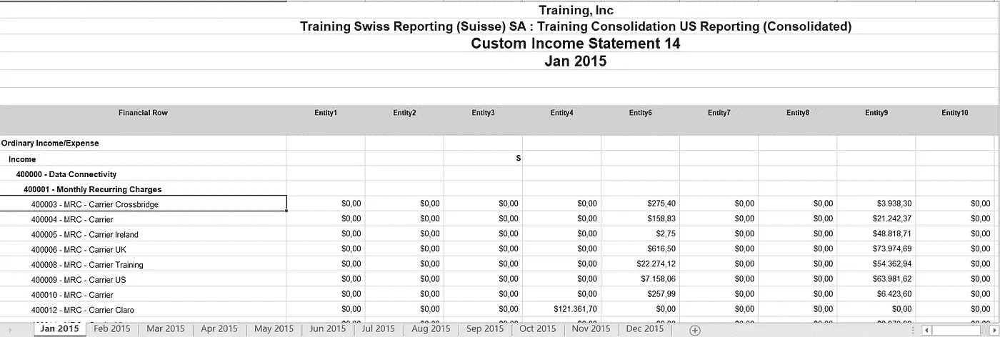
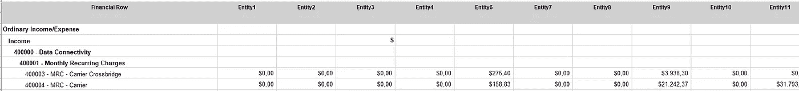
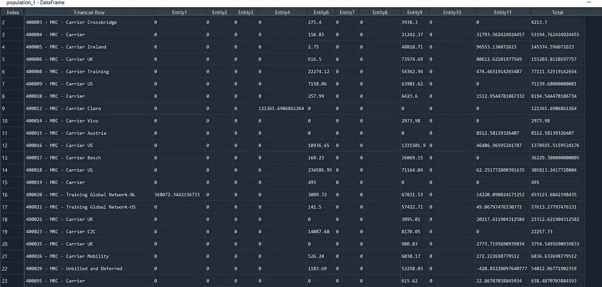
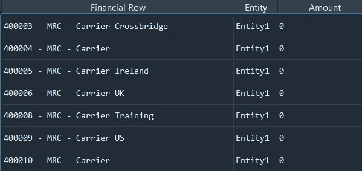
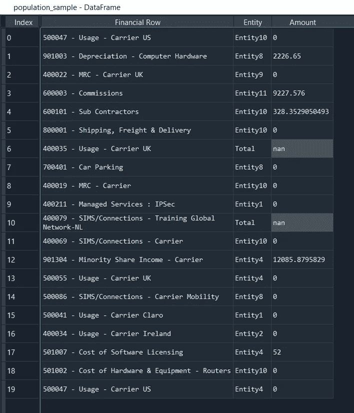

# 数据驱动审计| #1 使用 Python 自动采样

> 原文：<https://towardsdatascience.com/data-driven-audit-1-automated-sampling-using-python-52e83347add5?source=collection_archive---------23----------------------->

## 使用 Python 自动化审计流程


克里斯里德在 [Unsplash](https://unsplash.com?utm_source=medium&utm_medium=referral) 上的照片

# 你将从这篇文章中学到什么

*   将取样时间从一小时减少到一分钟
*   如何将文件转换为最佳格式的示例代码
*   步骤背后的基本原理

你可以在下面找到脚本。

# 设置

您从需要制作样本的客户处接收群体文件。

在创建示例之前，您需要执行以下步骤:

1.  在 Python 中加载群体
2.  移除不在范围内的实体
3.  创建一个随机样本
4.  导出到 excel

## 第一步

加载您从客户端收到的填充。你可以在这里下载数据集。

如您所见，客户为每个月(2015 年 1 月、2015 年 2 月……)创建了一个单独的表。对于我们的抽样过程，我们需要一个包含所有这些月份的合并表。



population.xlsx 数据集的屏幕截图

用以下参数读入所有纸张:

*   sheet_name = 0 |将所有工作表作为字典读入
*   dtype = str |读入所有数据类型为“string”的列

```
population = pd.read_excel("population.xlsx", sheet_name = None, dtype = str)
```

将不同的工作表连接成一个合并的工作表。

```
population = pd.concat( population , ignore_index = True)
```

现在您有了一个合并的工作表，但是您会注意到它还不是一个干净的格式。您需要执行以下清洁步骤:

1.  删除空白的行和列
2.  分配列名
3.  删除不包含帐户值的行
4.  转换为压缩格式

1.  删除空白行

使用以下参数:

*   axis = 0 |删除具有 NA 值的行
*   how = 'all' |仅当所有值都是 NA 时才删除一行
*   subset = 'all' |只考虑从 1 开始的列(因此不包括第一列)

```
population = population.dropna( axis = 0 , how = 'all' , subset = population.columns[1:] )
```

现在，通过指定 axis = 1 删除没有任何值的列，并重置索引。

```
population = population.dropna (axis = 1 , how = 'all').reset_index( drop = True)
```

2.分配列名

您可以从文件的第一行获取列名。使用 iloc 函数将第一行的值存储在变量“columns”中。

```
columns = population.iloc[0]population.columns = columns
```

3.删除不包含帐户值的行

仍有不包含相关信息的行，例如实体行。您需要排除所有不以数字开头的行。



标题需要删除，因为我们已经分配了它们

```
population = population.loc[ population['Financial Row'].str[:1].str.isnumeric()]
```



输出示例

干得好！开始有点像了。

4.转换为压缩格式

最佳实践是将数据帧转换为压缩格式。请记住，行很便宜，但列很贵。这使得以后的过滤更加容易。

```
population = population.melt( id_vars = 'Financial Row', var_name='Entity', value_name='Amount')
```



示例输出

## 第 2 步:排除帐户

以下客户不在范围内:

*   400XXX
*   500XX
*   800XXX

我们使用。loc 函数过滤数据帧，排除以这些帐户开头的行。通过指定“~”符号，您可以让 python 知道您想要排除满足条件的记录。

```
account_list = ["400", "500" , "800"]population_1 = population.loc[ ~ population['Financial Row'].str[:3].isin(account_list)]
```

## 第三步:制作样品

你现在想做一个样品。审计中常见的样本量是 20 条必须随机选择的记录。

在示例函数中使用以下参数:

*   n = 20 |样本量为 20
*   random_state = 1 |这允许您复制您的结果。

```
population_1 = population_1.reset_index( drop = True)population_sample = population_1.sample( n = 20, random_state = 1).reset_index()
```



抽样输出

## 步骤 4:将其全部导出到合并工作簿

您可以使用 excelwriter 函数将所有内容导出到合并工作簿中

```
with pd.ExcelWriter("sample.xlsx") as writer:
   population.to_excel(writer, sheet_name = "population_source")   
   population_1.to_excel(writer, sheet_name = "population_scoped")
   population_sample.to_excel(writer, sheet_name = "sample")
```

干得好！您已经成功实现了采样过程的自动化。

明年，只要再次运行这个脚本，去享受阳光吧！；)

在这里下载脚本[。](https://colab.research.google.com/drive/1FBiImj67u7q2GgnwIBN0YV6zamfESgRz?usp=sharing)

*注:这是一系列博客中的第一篇。敬请关注更多内容。*


照片由[扎克·杜兰特](https://unsplash.com/@zacdurant?utm_source=medium&utm_medium=referral)在 [Unsplash](https://unsplash.com?utm_source=medium&utm_medium=referral) 上拍摄