# 数据驱动的客户细分

> 原文：<https://towardsdatascience.com/data-driven-customer-segmentation-c16062741a7c?source=collection_archive---------7----------------------->

## *使用 k 均值聚类创建和分析客户群*

> "为了看清事物，站在一个人的外面可能是必要的."
> 
> ――彼得·霍格，《夜的故事》


由[布鲁克·拉克](https://unsplash.com/@brookelark?utm_source=unsplash&utm_medium=referral&utm_content=creditCopyText)在 [Unsplash](https://unsplash.com/s/photos/fruits?utm_source=unsplash&utm_medium=referral&utm_content=creditCopyText) 拍摄的照片

# 介绍

我相信学习营销数据科学的最好方法是通过例子来工作。在这篇博文中，我想谈谈

*   客户细分以及了解这一点的重要性
*   建立 k-means 聚类模型，用肘法和剪影系数选择最佳聚类数
*   营销语境下的 k-均值聚类解读

## 客户细分

*客户细分*是根据共同特征将客户分成不同群体的过程，这使得公司能够有效且恰当地对每个群体进行营销[1]。

## **我们为什么需要客户细分？**


[腾雅特](https://unsplash.com/@tengyart?utm_source=unsplash&utm_medium=referral&utm_content=creditCopyText)在 [Unsplash](https://unsplash.com/s/photos/funny-animal-food?utm_source=unsplash&utm_medium=referral&utm_content=creditCopyText) 上拍照

鉴于目前市场竞争激烈，了解客户行为、类型和兴趣至关重要。尤其是在目标营销中，对客户进行分类和了解是形成有效营销策略的关键一步。通过创建客户细分，营销人员可以一次专注于一个细分市场，并定制他们的营销策略。例如，你有一个酒店业务，你可能会针对即将举行周年纪念的夫妇，为他们提供一个特别的浪漫套餐。

总的来说，客户细分是成功的目标市场营销的关键，通过客户细分，您可以针对特定的客户群体进行不同的促销、价格选择和产品放置，以最具成本效益的方式抓住目标受众的兴趣[2]。

## 数据

我使用的是 UCI 机器学习库中的公共数据集，该数据集记录了一家总部位于英国的注册无店铺在线零售商在 2010 年 1 月 12 日至 2011 年 9 月 12 日之间发生的交易。数据集可以在[这里](http://archive.ics.uci.edu/ml/datasets/Online+Retail)找到。该公司主要销售独特的适合各种场合的礼品。这家公司的许多客户都是批发商。

**功能:**

*   *发票号*:发票号。名义上，分配给每笔交易的 6 位整数。如果该代码以字母“c”开头，则表示取消
*   *库存代码*:产品(物品)代码。名义上，一个 5 位数的整数，唯一分配给每个不同的产品。
*   *描述*:产品(物品)名称。名义上的
*   *数量*:每笔交易每种产品(物品)的数量。数字的
*   InvoiceDate:发票日期和时间。数字，每笔交易生成的日期和时间
*   *单价*:单价。数字，单位为英镑的产品价格
*   *CustomerID* :客户编号。名义上，一个唯一分配给每个客户的 5 位整数
*   *国家*:国家名称。名义上，每个客户居住的国家的名称。

# 数据争论

```
import pandas as pd
import numpy as np
import matplotlib.pyplot as plt
import seaborn as sns
%matplotlib inline

df = pd.read_excel('online_retail_dataset.xlsx', sheet_name='Online Retail')
```

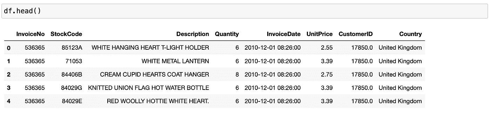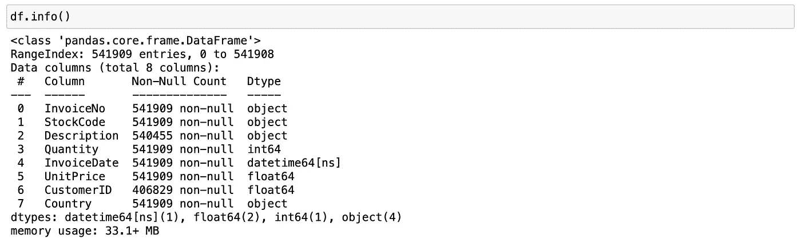

# 数据清理

至于数据清理，我做了以下操作:

*   *CustomerID* 有*空记录。*让我们删除包含空值的行
*   *数量*栏有*负值*，可能是采购后退货造成的。让我们删除数量为负的行
*   *单价*栏也有*负记录*。我也决定放弃负价格的唱片
*   购买记录的时间段为 2010 年 1 月 12 日至 2011 年 9 月 12 日。上个月*的*数据*不完整*。让我们忽略不完整月份的记录。

```
# Let's drop rows containing NULL values
df.dropna(subset=['CustomerID'], inplace=True)

# Remove negative quantity
df = df.loc[df['Quantity'] > 0]

# Remove rows with negative price
df = df.loc[df['UnitPrice'] > 0]

# Handle incomplete data
df = df.loc[df['InvoiceDate'] < '2011-12-01']
```

# **数据转换**

```
# Calculate total sales
df['Sales'] = df['Quantity'] * df['UnitPrice']

# Create per-customer data
df_customers = df.groupby('CustomerID').agg({'Sales': sum,
                                             'InvoiceNo': lambda x: x.nunique()})
df_customers.columns = ['TotalSales', 'OrderCount']
df_customers['AvgOrderValue'] = df_customers['TotalSales'] / df_customers['OrderCount']

# Rank the data
df_rank = df_customers.rank(method='first')

# Let us normalize the data to center around the mean 
# and have a mean of 0 and a standard deviation of 1
df_normalized = (df_rank - df_rank.mean()) / df_rank.std()
```

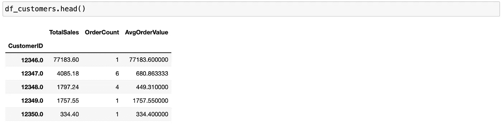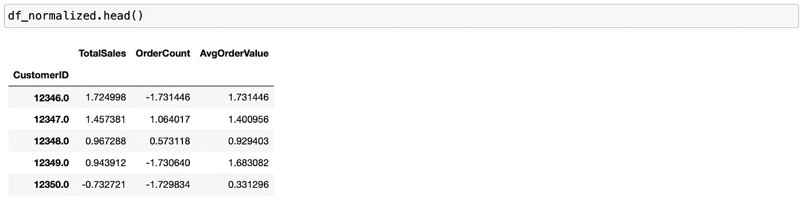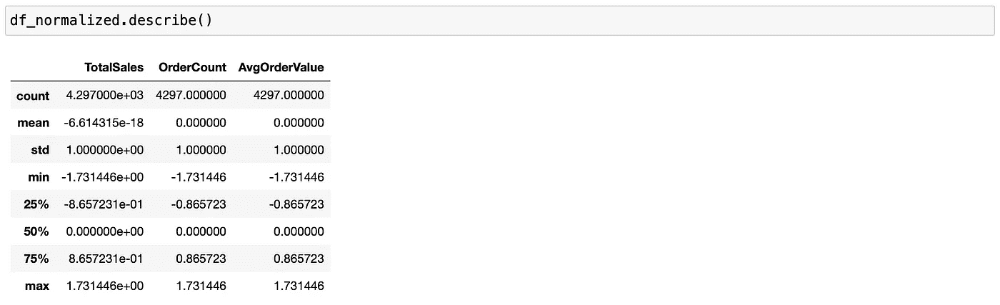

现在，您可以看到这些值以 0 为中心，标准偏差为 1。让我们使用这些数据进行聚类分析。

# k 均值聚类

*k-means 聚类*是最简单也是最常用的算法之一。它试图找到代表特定数据区域的聚类中心。该算法包含两个步骤:

1.  将每个数据点分配到最近的聚类中心
2.  将每个聚类中心设置为分配给它的数据点的平均值。

一旦实例到聚类的分配不再改变，k-means 聚类就结束计算。

*当*我们*应用 k-means* 聚类时，我们必须*记住*

*   每个簇由其中心定义，这意味着一个簇具有凸起的形状。因此，k 均值捕捉具有相同“直径”的相对简单的形状
*   k-means 假设所有方向对于每个聚类都是同等重要的
*   该算法在聚类中心之间的中间绘制聚类之间的边界[3]。

# **定义最佳聚类数**

使用 k-means 聚类进行客户细分的一个缺点是，您必须事先知道聚类的数量。让我们探索两种定义数据集中聚类数量的方法:

*   轮廓系数
*   肘法

## **轮廓系数**

*剪影系数*是一种用于估计聚类技术好坏的度量。

*剪影系数*的公式:

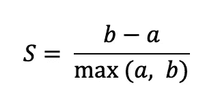

其中 *b* 是一个点与其最近的聚类之间的平均距离，而 *a* 是同一聚类内的数据点之间的平均距离。轮廓系数的范围从-1 到 1，其中值越接近 1 越好。

基本上，轮廓系数测量*与其他聚类【2】相比，数据点与其聚类*有多接近。

## **肘法**

*肘方法*用于验证 k-means 聚类中的聚类数。肘方法的思想是对数据集运行 k-means 聚类，得到一系列值 *k* (比如说 *k* 从 1 到 10)，并对每个值 *k* 计算:

*   *失真*，这是距各个聚类的聚类中心的平方距离的平均值(使用欧几里德距离度量)
*   *惯性*，它是样本到它们最近的聚类中心的平方距离之和[4，5]。

# **利用 k 均值聚类进行客户细分**

```
from sklearn.cluster import KMeans
from sklearn.metrics import silhouette_score
from sklearn import metrics 
from scipy.spatial.distance import cdist

# Calculate Silhouette coefficient
for n_cluster in [2, 3, 4, 5, 6, 7, 8]:
    kmeans = KMeans(n_clusters=n_cluster,
                    max_iter=400,
                    n_init=20).fit(df_normalized[['TotalSales',
                                                  'OrderCount',
                                                  'AvgOrderValue']])
    silhouette_avg = silhouette_score(df_normalized[['TotalSales',
                                                     'OrderCount',
                                                     'AvgOrderValue']],
                                      kmeans.labels_) 
    print('Silhouette coefficient for %i clusters: %0.3f' % (n_cluster,
                                                             silhouette_avg))
```

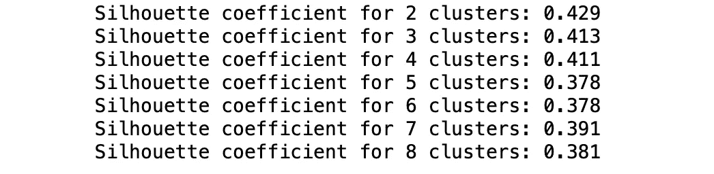

不同簇数的轮廓系数值

```
# Calculate inertias and distortions for customers dataset
# Link to original code: https://www.geeksforgeeks.org/elbow-method-for-optimal-value-of-k-in-kmeans/
distortions = [] 
inertias = []
K=range(1, 11)

for k in K: 
    kmeanModel = KMeans(n_clusters=k, max_iter=400, n_init=20).fit(df_normalized[['TotalSales',
                                                                                  'OrderCount',
                                                                                  'AvgOrderValue']]) 
    kmeanModel.fit(df_normalized[['TotalSales', 'OrderCount', 'AvgOrderValue']])
    distortions.append(sum(np.min(cdist(df_normalized[['TotalSales',
                                                       'OrderCount',
                                                       'AvgOrderValue']],
                                        kmeanModel.cluster_centers_,
                                        'euclidean'),axis=1)) / df_normalized[['TotalSales',
                                                                               'OrderCount',
                                                                               'AvgOrderValue']].shape[0]) 
    inertias.append(kmeanModel.inertia_)

# Plot distortions
plt.plot(K, distortions, 'bx-',  linewidth=2.5, color='dodgerblue') 
plt.xlabel('Values of K', fontsize=14) 
plt.ylabel('Distortion', fontsize=14) 
plt.title('The Elbow Method using Distortion', fontsize=16) 
plt.xticks(np.arange(1, 11))
plt.show()

# Plot inertias
plt.plot(K, inertias, 'bx-', linewidth=2.5, color='dodgerblue') 
plt.xlabel('Values of K', fontsize=14) 
plt.ylabel('Inertia', fontsize=14) 
plt.title('The Elbow Method using Inertia', fontsize=16) 
plt.xticks(np.arange(1, 11))
plt.show()
```

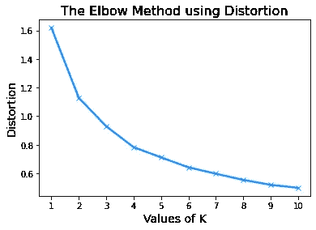

查看肘部曲线和轮廓系数，我选择聚类数=4，因为轮廓系数相对较高，惯性和扭曲不会随着聚类数的增加而发生显著变化。

现在我们知道了聚类的数量，让我们建立一个 k-means 聚类模型。

```
# Build k-means clustering model
kmeans = KMeans(n_clusters=4,
                max_iter=400,
                n_init=20).fit(df_normalized[['TotalSales',
                                              'OrderCount',
                                              'AvgOrderValue']])

cluster_centres = kmeans.cluster_centers_
df_cluster_centres = pd.DataFrame(cluster_centres,
                                  columns=['TotalSales', 
                                           'OrderCount',
                                           'AvgOrderValue'])
df_cluster_centres['Cluster'] = df_cluster_centres.index

df_four_clusters = df_normalized[['TotalSales',
                                  'OrderCount',
                                  'AvgOrderValue']].copy(deep=True)
df_four_clusters['Cluster'] = kmeans.labels_
```

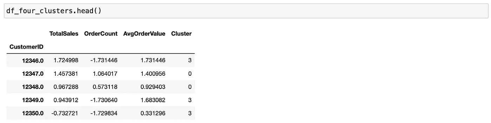

每个客户都标有其聚类/细分

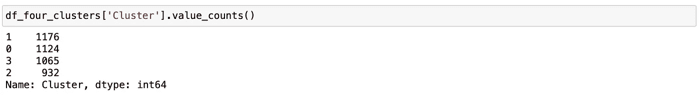

每个细分市场的客户数量

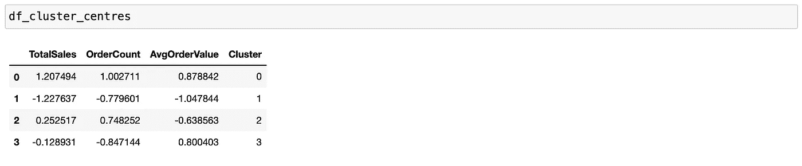

每个聚类中心的值

让我们仔细看看各组的中心。*聚类#1* 在所有三个属性中的数值最低。这意味着分类#1 包含销售额最小、订单数量最少和每订单平均价值最低的客户。这组客户是*低价值客户*之一。另一方面，*簇#0* 在所有属性中具有最高数量。因此，集群#0 中的客户购买昂贵的产品，给企业带来最高的收入。您通常希望将营销工作集中在这部分*高价值客户*上，因为这将带来最高的回报。

*集群#2* 中的客户相当有趣。他们购买相对频繁，因为订单数量相对较高，但他们的平均每单价值较低。这些是经常购买低值物品的顾客。所以，给这个细分市场推荐便宜的产品就太好了。*集群#3* 中的客户也很有趣，因为他们对收入和订单数量的贡献处于中低水平。然而，他们的平均每单价值相对较高，这意味着他们偶尔会购买昂贵的商品。因此，向该细分市场销售昂贵的产品是合适的。

让我们将这些片段形象化

```
plt.scatter(df_four_clusters.loc[df_four_clusters['Cluster'] == 0]['OrderCount'], 
            df_four_clusters.loc[df_four_clusters['Cluster'] == 0]['TotalSales'],
            c='mediumvioletred')

plt.scatter(df_four_clusters.loc[df_four_clusters['Cluster'] == 1]['OrderCount'], 
            df_four_clusters.loc[df_four_clusters['Cluster'] == 1]['TotalSales'],
            c='dodgerblue')

plt.scatter(df_four_clusters.loc[df_four_clusters['Cluster'] == 2]['OrderCount'], 
            df_four_clusters.loc[df_four_clusters['Cluster'] == 2]['TotalSales'],
            c='gold')

plt.scatter(df_four_clusters.loc[df_four_clusters['Cluster'] == 3]['OrderCount'], 
            df_four_clusters.loc[df_four_clusters['Cluster'] == 3]['TotalSales'],
            c='lightseagreen')

plt.title('TotalSales vs. OrderCount Clusters', fontsize=16)
plt.xlabel('Order Count', fontsize=14)
plt.ylabel('Total Sales', fontsize=14);
```

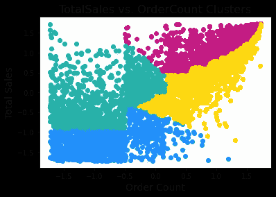

```
plt.scatter(df_four_clusters.loc[df_four_clusters['Cluster'] == 0]['OrderCount'], 
            df_four_clusters.loc[df_four_clusters['Cluster'] == 0]['AvgOrderValue'],
            c='mediumvioletred')

plt.scatter(df_four_clusters.loc[df_four_clusters['Cluster'] == 1]['OrderCount'], 
            df_four_clusters.loc[df_four_clusters['Cluster'] == 1]['AvgOrderValue'],
            c='dodgerblue')

plt.scatter(df_four_clusters.loc[df_four_clusters['Cluster'] == 2]['OrderCount'], 
            df_four_clusters.loc[df_four_clusters['Cluster'] == 2]['AvgOrderValue'],
            c='gold')

plt.scatter(df_four_clusters.loc[df_four_clusters['Cluster'] == 3]['OrderCount'], 
            df_four_clusters.loc[df_four_clusters['Cluster'] == 3]['AvgOrderValue'],
            c='lightseagreen')

plt.title('AvgOrderValue vs. OrderCount Clusters', fontsize=16)
plt.xlabel('Order Count', fontsize=14)
plt.ylabel('Avg Order Value', fontsize=14);
```

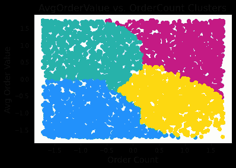

```
plt.scatter(df_four_clusters.loc[df_four_clusters['Cluster'] == 0]['TotalSales'], 
            df_four_clusters.loc[df_four_clusters['Cluster'] == 0]['AvgOrderValue'],
            c='mediumvioletred')

plt.scatter(df_four_clusters.loc[df_four_clusters['Cluster'] == 1]['TotalSales'], 
            df_four_clusters.loc[df_four_clusters['Cluster'] == 1]['AvgOrderValue'],
            c='dodgerblue')

plt.scatter(df_four_clusters.loc[df_four_clusters['Cluster'] == 2]['TotalSales'], 
            df_four_clusters.loc[df_four_clusters['Cluster'] == 2]['AvgOrderValue'],
            c='gold')

plt.scatter(df_four_clusters.loc[df_four_clusters['Cluster'] == 3]['TotalSales'], 
            df_four_clusters.loc[df_four_clusters['Cluster'] == 3]['AvgOrderValue'],
            c='lightseagreen')

plt.title('AvgOrderValue vs. TotalSales Clusters', fontsize=16)
plt.xlabel('Total Sales', fontsize=14)
plt.ylabel('Avg Order Value', fontsize=14);
```

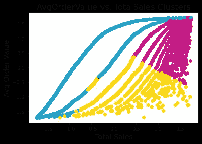

从图中可以看出，*的高价值客户*(紫色)在各个维度的价值最高，而*的低价值客户*(蓝色)则相反。

让我们来看看高价值人群最受欢迎的购买行为

```
pd.DataFrame(
    df.loc[df['CustomerID'].isin(high_value_cluster.index)
          ].groupby('Description').count()['StockCode'].sort_values(ascending=False).head(10))
```

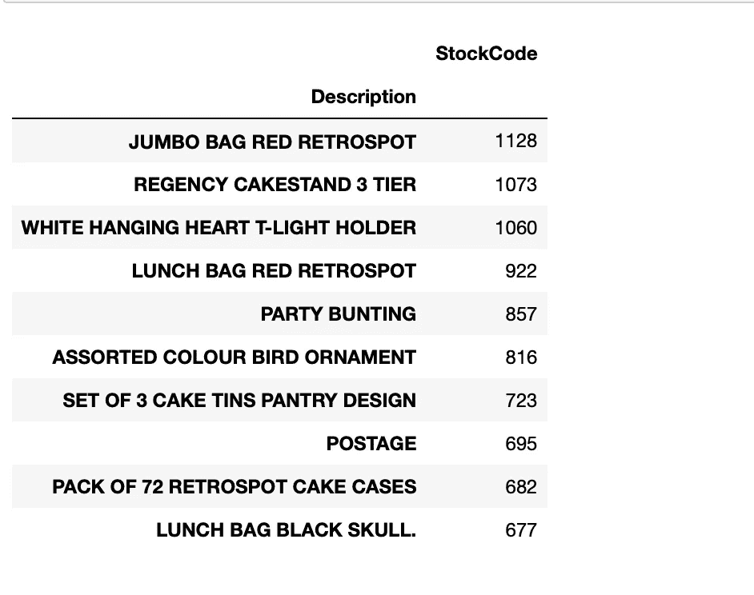

高价值人群购买的最受欢迎的商品

当你瞄准高价值细分市场时，我们可以在营销策略中利用这些关于高价值细分市场购买的最受欢迎商品的信息。你可以推荐与这些畅销商品相似的商品，因为顾客对这些类型的产品最感兴趣。

# 摘要

*   我们应用 k-means 聚类来理解在线零售店的细分市场
*   使用肘方法和轮廓系数，我们找到了最佳的分段数，即 4
*   我们从总销售额、订单数量和平均订单价值方面考察了每个细分市场之间的差异，并为每个细分市场制定了潜在的营销策略
*   我们查看了高价值客户群购买的最受欢迎的商品，这可能有助于向这一高价值群体销售类似的商品，并提高转化率。

*感谢您的阅读，请在下面评论您对使用机器学习进行客户细分的看法。*要查看我的更多帖子，请在 Medium 和 [LinkedIn](https://www.linkedin.com/in/aigerimshopenova/) 订阅。

[Jupyter 笔记本](https://github.com/aig3rim/Customer_segmentation/blob/main/Customer_segmentation_k-means_clustering.ipynb)可以在我的 [GitHub](https://github.com/aig3rim) 上找到。

# **参考文献**

[1]客户细分定义—什么是客户细分。(未注明)。检索于 2021 年 2 月 10 日，来自[https://www.shopify.com/encyclopedia/customer-segmentation](https://www.shopify.com/encyclopedia/customer-segmentation)

[2]黄耀辉(2019)。市场营销数据科学实践:使用 Python 和 R. Birmingham 通过机器学习改进您的市场营销策略。

[3]米勒，A. C .，圭多，S. (2018)。Python 机器学习导论:数据科学家指南。塞瓦斯托波尔，加利福尼亚州:奥赖利媒体。

[4]利用肘方法确定 k-means 聚类的最佳聚类数。(未注明)。检索于 2021 年 2 月 11 日，来自[https://bl.ocks.org/rpgove/0060ff3b656618e9136b](https://bl.ocks.org/rpgove/0060ff3b656618e9136b)

[5]肘法求 k 的最佳值。(2021 年 02 月 09 日)。2021 年 2 月 11 日检索，来自[https://www . geeksforgeeks . org/elbow-method-for-optimal-value-of-k-in-k means/](https://www.geeksforgeeks.org/elbow-method-for-optimal-value-of-k-in-kmeans/)