# 数据驱动的骑行和锻炼预测

> 原文：<https://towardsdatascience.com/data-driven-cycling-and-workout-prediction-72c393e2542c?source=collection_archive---------14----------------------->

## 将旧的骑行锻炼数据转化为基于 ML 的数字私人教练，用于锻炼预测

在这篇博文中，我将分享我如何利用微软机器人框架和微软团队，将自行车练习中的数据转化为基于机器学习的智能机器人，这帮助我在训练中取得更多成绩，并始终保持动力。

# 概观

我在 2020 年 1 月底开始骑可折叠自行车，我爱上了骑自行车。我也喜欢处理数据，所以我用智能手表记录了我去[斯特拉瓦](/www.strava.com)的所有旅程。🚴🏻🚴🏻

五月底，我将我的城市自行车升级为沙砾自行车。直到秋天，我和我的新自行车在户外活动中度过了美好的时光。

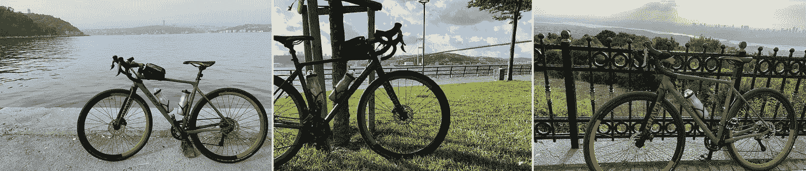

伊斯坦布尔的户外骑行，图片由作者提供

在天气好的时候在外面练习之后，对于寒冷的天气，我在家里设置了一个疼痛洞穴，使用 [Elite 阿里翁 AL13 roller](https://www.elite-it.com/en/products/home-trainers/rollers/arion) 和 [Misuro B+传感器](https://www.elite-it.com/en/products/home-trainers/sensors/misuro-b)在 [Zwift](/www.zwift.com) 上进行虚拟骑行。Zwift 是一个虚拟环境，在这里你可以与你的 3D 虚拟角色连接，与其他运动员一起实时骑行。

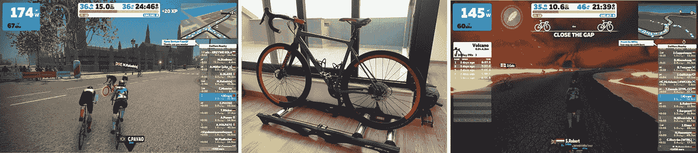

室内游乐设施，作者图片

我的 Zwift 帐户与 Strava 连接，收集我所有的骑行数据，目前我已经完成了**“3700km”**的户外和室内活动🎉🎉

我决定分析我的数据，在分析之后，我决定用我的工程能力将它提升到一个新的水平。

这份报告展示了如何分析您的 Strava 数据，并使用 Jupyter 笔记本将其可视化。此外，该项目旨在预测潜在的锻炼日期和距离，以使用您自己的数据找到最佳的锻炼计划。这款数字私人教练可以作为健身伴侣使用。

这个项目最初是从 Jupyter Notebook 上现有批量数据的数据发现开始的。在数据探索阶段，我看到了一些模式，并认为，这些模式可以帮助我恢复健康。不久之后，我决定建立一个预测模型来预测我的锻炼、`ride type`和`distance`值。为了在 bot 框架中使用预测模型，该模型被导出为 pickle 文件，一个基于 FastAPI 的应用程序在 Python 中为该模型提供服务，微软团队中的一个聊天机器人调用该 API 帮助我提供一些输入，然后检索预测。

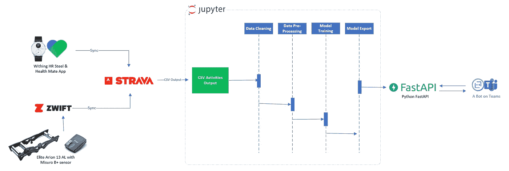

建筑，作者的图像

# 数据发现—亮点

让我们来看看我到目前为止取得的一些亮点，这里是一些关于我的数据的亮点。

*   在 1 年的时间里，我已经完成了大约 **3700 公里**，包括户外和室内锻炼活动。大约 1/3 是 Zwift 上的虚拟乘坐。

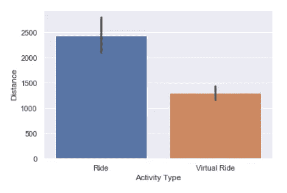

户外和室内骑行的总距离 km，图片由作者提供

*   2019 年，我增加了一些脂肪，但由于我的身体活动和一些健康的食物，我在这段时间里减掉了约 13 公斤(约 28 磅)。

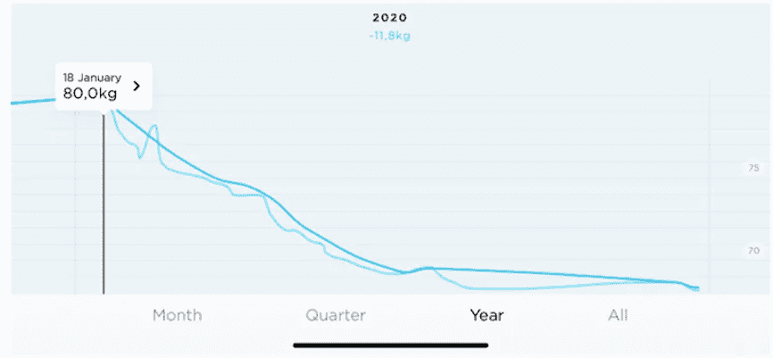

一年内的总重量，图片由作者提供

*   我喜欢下面展示一年中发生的所有重要生活事件的每周图表。

> Jan-Mar:对锻炼充满热情
> 
> 4 月至 6 月:疫情和土耳其的封锁
> 
> 6 月至 12 月:享受户外和室内骑行
> 
> 12 月:新年假期挑战#Rapha500
> 
> 简:幸运地有了一个新的家庭成员:)
> 
> 1 月至 3 月:试图重新找到我的老习惯，最后但并非最不重要的是，决定建立一个数字私人教练。

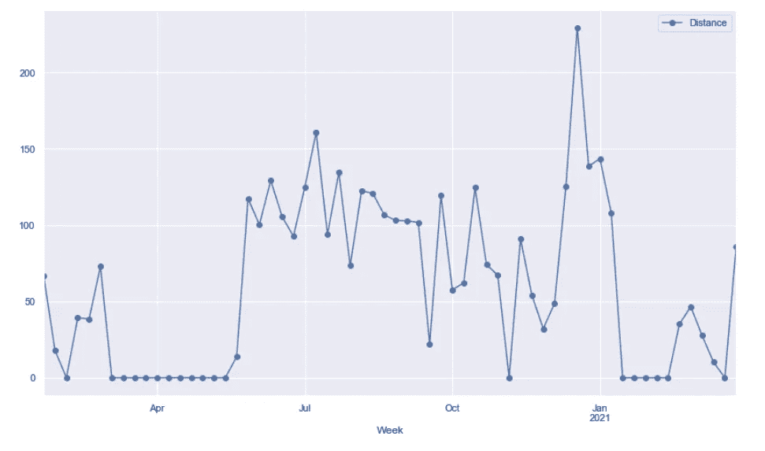

每周总距离，按作者分类的图像

*   到目前为止，我一次骑行的最长距离是 62 公里，我喜欢这个显示我一段时间内表现的图表；

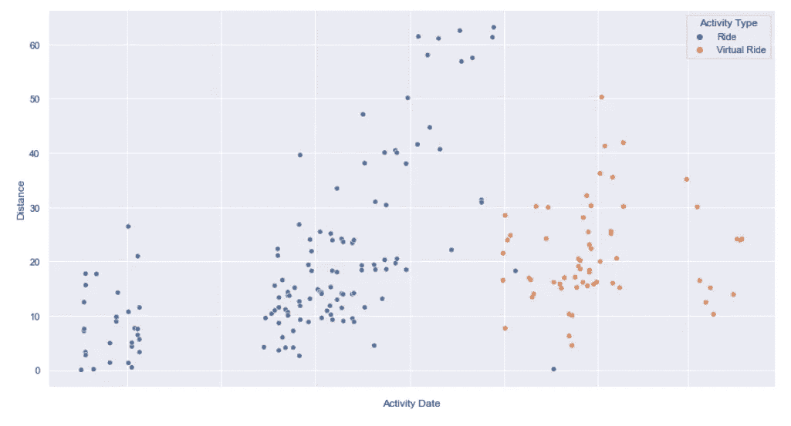

户外骑行与室内骑行的每次骑行距离，图片由作者提供

# 相互关系

当我检查乘坐类型时，我意识到在某一点后我只切换到室内虚拟乘坐，我想看看选择室内乘坐和天气之间是否有相关性，特别是与`Wind`和`Temperature`的相关性。为此，我在训练中使用天气 API 来检索天气状况，结果很清楚；我不喜欢在寒冷的雨天骑自行车，所以过了一会儿，我又回到了室内虚拟骑行。下图显示，在一定温度下，我选择了室内骑行。这是其中的一个特征——我已经加入到我的预测模型中。

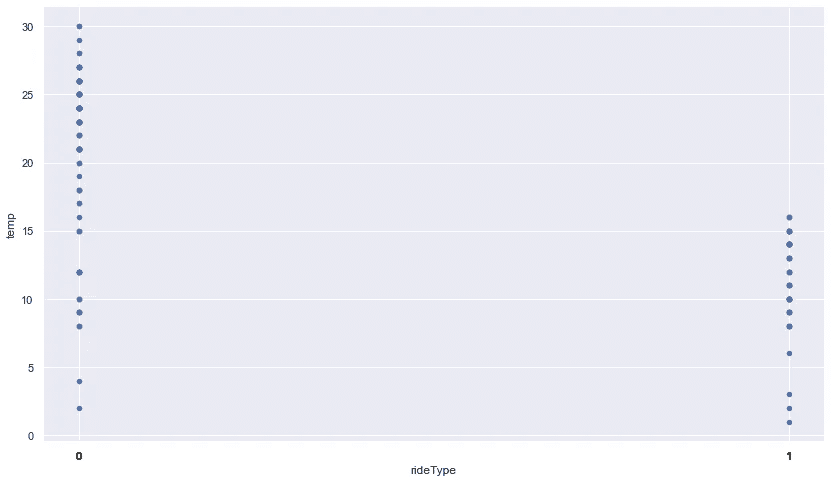

游乐设备类型与温度，图片由作者提供

# 特征工程

我花了一些时间用 Jupyter 笔记本可视化我的乘坐数据，我发现了一些模式。这些模式要么是我有意识的决定，要么是条件使然。

我决定做一个关于[特征工程](https://en.wikipedia.org/wiki/Feature_engineering)的练习

# 1.游乐设备类型

游乐设备类型是影响训练持续时间和天数的一个因素，所以我添加了一个标志来表示游乐设备是室外还是室内

*   rideType —布尔标志

# 2.气候条件

正如在[相关性](#correlation)中提到的，天气是影响我锻炼计划的因素之一:

*   `Temperature` -摄氏温度值为整数
*   `Wind` - km/h 值为整数
*   `Weather Description` -描述天气是否多云、晴朗、下雨等。

# 3.星期几和周末

当我将距离与周末或工作日进行对比时，我发现我最长的骑行时间是在周末。公共假期是另一个因素，但是现在，我决定不把它们整合在一起。

*   `DayOfWeek` -整数

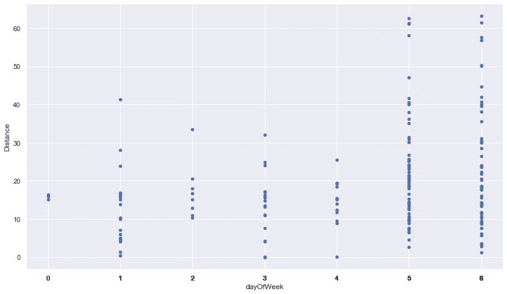

一周中某一天的总距离，按作者分类的图像

但我主要选择了周二和周四作为工作日短途骑行日，并决定添加一天中的一周作为一个功能，并根据下图使用周末作为标志

*   `isWeekend` -布尔标志

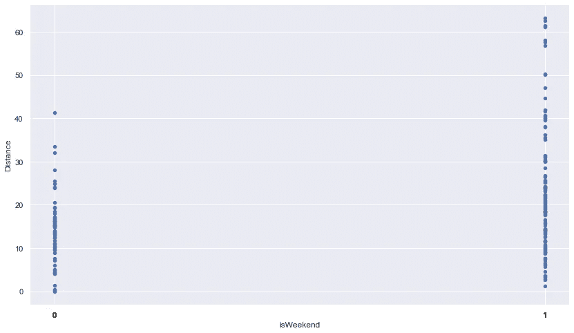

工作日和周末的总距离，按作者分类的图像

# 4.一天中的某个时刻

在炎热的夏天，我更喜欢在温度比中午凉爽的时候进行户外骑行。基于下面的情节，一天中的某个时刻影响着我的乘坐和乘坐类型，所以我决定为一天中的某个时刻添加一个功能

*   `hour` -整数

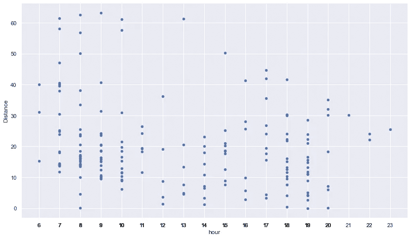

距离与一天中的时间，作者提供的图片

# 预测模型

出于我个人的需要，在数据分析之后，我希望有一个输出`distance`和`ride type`的预测，T3 是指我预计要骑行多少公里，而是指计划的骑行是室内还是室外。

因此，我使用之前的数据分析和工程特征来创建`Distance`和`Ride Type`的预测模型。

# 1.乘坐类型预测

就心理准备而言，室内和室外骑行是有区别的，所以一般来说，我会根据我的骑行类型在锻炼前一天准备好我自己和我的骑行设备。我确实喜欢出去，但是我不喜欢下雨和寒冷的天气。此外，我想找到最适合我锻炼的骑行方式。

这个选择也影响了我的锻炼距离和时间。由于这是一个分类问题，我决定选择`Logistic Regression`来预测乘坐类型。

设置训练数据:

# 2.距离预测

每周，我都会设定我想要完成的每周距离目标。这个决定也受到外部因素的影响，比如“一天中的什么时候？”，“天气怎么样？”，“外面热还是外面冷？”，“风大吗？”、“是周末还是工作日？”

考虑到这些因素，我想预测一下我的预期骑行距离。这是一个`Regression`问题，我决定选择`Linear Regression`进行距离预测。

对于这两种模型(预测**距离**和**乘坐类型**，以下是我决定在我的模型中使用的工程特性:

> `*['hour','dayOfWeek','isWeekend','temp','wind','weather']*`

虽然我已经决定选择`Logistic Regression`作为乘坐类型，选择`Linear Regression`作为距离，但可能会有更精确的模型。开发这些模型的过程是迭代的，通常需要更多的游乐设备数据，所以这只是第一步。

有个好看的[机器学习算法小抄](https://docs.microsoft.com/en-us/azure/machine-learning/algorithm-cheat-sheet)。您可以了解更多关于 ML 算法及其应用的信息。

# 模特培训

对于锻炼预测，机器学习模型训练被添加到 [7 — b 预测锻炼模型训练。ipynb](https://github.com/ikivanc/GPX-Data-Analysis-from-Strava/blob/main/notebooks/7%20-%20b%20Predict%20Workout%20Model%20Training.ipynb) Jupyter 笔记本。以下是训练模型的一些步骤:

首先，我用选定的特征(X)设置训练数据:

```
# select features as list of array
X = data[['hour','dayOfWeek','isWeekend','temp','wind','weather']]
X = X.to_numpy()
```

然后我创建训练数据的标签(Y):

```
# set Distance values
Y_distance = data['Distance']
Y_distance = Y_distance.to_numpy()
​
# set Ride Type Values
Y_rideType = data['rideType']
Y_rideType = Y_rideType.to_numpy()
```

1.  **用于 RideType 预测的 Logistic 回归**

对于逻辑回归，我提供所有数据用于训练，并拟合我的最终模型。该模型使用了以下特征`['hour','dayOfWeek','isWeekend','temp','wind','weather']`。

训练数据特征:

*   `hour` -值在 0 - 23 之间
*   `dayOfWeek` -值在 0 - 6 之间
*   `isWeekend` -工作日 0，周末 1
*   `temp` -以摄氏度为单位的整数温度值
*   `wind`——以千米/小时为单位的整数风速值
*   `weather` -天气 API 提供的天气描述

训练预测值:

*   `rideType` -室外骑行 0，室内骑行 1

```
# import Logistic Regression from sci-kit learn
from sklearn.linear_model import LogisticRegression
​
# select training data and fit final model
model_lr = LogisticRegression(random_state=0).fit(X, Y_rideType)
​
# test prediction with a clear sunny Sunday weather data
result_ridetype = model_lr.predict([[8,6,1,20,3,0]])
print("Result type prediction=%s" % result_ridetype)
​
# test prediction with a cold Sunday weather data
result_ridetype = model_lr.predict([[8,6,1,10,12,1]])
print("Result type prediction=%s" % result_ridetype)
```

**2。距离预测的线性回归**

对于预测模型，我总共有 168 个锻炼数据，我想将它们全部用作训练数据。

训练数据特征:

*   `hour`-0-23 之间的值
*   `dayOfWeek`-0-6 之间的值
*   `isWeekend` -工作日 0，周末 1
*   `temp` -以摄氏度为单位的整数温度值
*   `wind`——以千米/小时为单位的整数风速值
*   `weather` -天气 API 提供的天气描述

训练预测值:

*   `distance` -以公里为单位的距离值。

```
# import Linear Regression from sci-kit learn
from sklearn.linear_model import LinearRegression
from sklearn.utils import shuffle# select training data and fit final model
model = LinearRegression()
model.fit(X, Y_distance)# test prediction with a cold Monday weather data
result_distance = model.predict([[8,0,0,10,15,0]])
print("Result distance prediction=%s" % result_distance)# test prediction with a sunny Sunday weather data
result_distance = model.predict([[6,6,1,26,3,1]])
print("Result distance prediction=%s" % result_distance)
```

**3。将模型导出为 pickle 文件**

在这个阶段，经过训练的模型被导出为 pickle 文件，以便通过 web API 使用。web API 使用来自天气 API 的数据，收集必要的数据特征进行预测，并将预测结果输出给用户。

```
# import pickle library
import pickle
​
# save distance model file in the model folder for prediction
distance_model_file = "../web/model/distance_model.pkl"
with open(distance_model_file, 'wb') as file:
 pickle.dump(model, file)
​
# save ride type model file in the model folder for prediction
ridetype_model_file = "../web/model/ridetype_model.pkl"
with open(ridetype_model_file, 'wb') as file:
 pickle.dump(clf, file)
```

# 解决办法

这是一个端到端的解决方案，使用 Strava 锻炼数据导出作为输入。Strava 包含室内和室外健身骑行数据。为了分析数据，Jupyter 笔记本用于`Data Cleaning`、`Data Pre-Processing`、`Model Training`和`模型导出。对于机器学习模型训练和预测，使用 scikit-learn Python 包。预测模型由 scikit-learn 导出，用于预测我的骑行类型和锻炼距离。

该模型作为 pickle 文件通过 FastAPI 应用程序托管，该应用程序提供了一个 API 来传递参数，并使用第三方天气 API 预测天气信息。模型使用这些值进行预测。

作为一个用户界面，我使用微软 Bot 框架创建了一个对话式 AI 项目，与 Fast API 进行通信。我选择微软团队作为画布，因为这是我经常用来交流的平台。

有了这个解决方案，我现在可以选择我的城市、锻炼日期和时间，我得到了一个提供`distance`和`ride type`值的预测。

# 体系结构


建筑，作者的图像

文件夹结构:

*   `bot` - Bot 应用程序检索预测模型
*   `data` -数据文件夹包含 Strava 输出
*   `notebooks`-分析所有数据的所有笔记本
*   `web` -预测模型的 FastAPI
*   `model` -包含预测模型
*   `app.py` -用于预测模型的 FastAPI web 应用
*   `myconfig.py` -环境变量
*   `utils.py` -常用实用功能

# 运行项目

在这个示例中，使用 Python 3.8.7 版本来运行项目。

1.  创建虚拟环境

```
python -m venv .venv
```

2.激活您的 Mac 虚拟环境:

```
source ./venv/bin/activate
```

3.安装依赖项

```
pip install -r notebooks/requirements.txt
```

4.从您的个人资料中导出您的 Strava 数据

*   访问[设置>我的帐户>下载或删除您的帐户](https://www.strava.com/account)
*   点击`Download Request (optional)`
*   下载 zip 文件并导出到`Data`文件夹。

5.创建一个`Data`文件夹，并将您的 Strava 数据导出到该文件夹中。

6.在本地运行`Jupyter Notebook`

```
jupyter notebook
```

# 天气 API

无法获得天气数据来将[和](#correlation)与我的锻炼相关联，所以我使用天气 API 来提取我现有锻炼日的天气信息。我已经使用了 [WorldWeatherOnline API](https://www.worldweatheronline.com/developer/) 来获取我所在地点的最新天气预报。这个 API 还提供了提前 14 天的天气预报，每小时的天气预报和天气警告，所以这对我的预测 API 也很有帮助。

# python FastAPI API 的 Web 应用程序

运行 Python FastAPI 以便在本地机器上运行

```
cd webpython app.py
```

# 测试终点

*   预测乘坐类型和距离
*   [http://127 . 0 . 0 . 1:8000/predict？城市=伊斯坦堡&日期=2021-04-10 &时间=14:00:00](http://127.0.0.1:8000/predict?city=Istanbul&date=2021-04-10&time=14:00:00)

# 发布 Web 应用程序

将 Python FastAPI 发布到 Azure Web App 服务

```
cd web
az webapp up --sku B1 --name data-driven-cycling
```

在 Azure 门户上更新启动命令，设置>配置>常规设置>启动命令

```
gunicorn -w 4 -k uvicorn.workers.UvicornWorker main:app
```

要重新部署和更新现有应用程序:

```
az webapp up
```

# 在本地测试 Bot 应用程序

先决条件:

*   [。NET Core SDK](https://dotnet.microsoft.com/download) 版本 3.1

```
cd bot
dotnet run
```

或者来自 Visual Studio

*   启动 Visual Studio
*   文件->打开->项目/解决方案
*   导航到`bot`文件夹
*   选择`CyclingPrediction.csproj`文件
*   在`Bots/Cycling.cs`更新你的 api url
*   如果您想使用本地 Web API 进行测试，请更改您的本地端点，例如:

```
string RequestURI = String.Format("[http://127.0.0.1:8000/predict?city={0}&date={1}&time={2](http://127.0.0.1:8000/predict?city={0}&date={1}&time={2)}",wCity,wDate,wTime);
```

*   如果您将使用 Azure Web API 进行测试，请更改您的 Azure 端点，例如:

```
string RequestURI = String.Format("[https://yourwebsite.azurewebsites.net/predict?city={0}&date={1}&time={2](https://yourwebsite.azurewebsites.net/predict?city={0}&date={1}&time={2)}",wCity,wDate,wTime);
```

*   按`F5`运行项目
*   您的 bot 服务将在 [https://localhost:3979](https://localhost:3979) 可用。运行您的 Bot 框架模拟器并连接到 [https://localhost:3979](https://localhost:3979) 端点

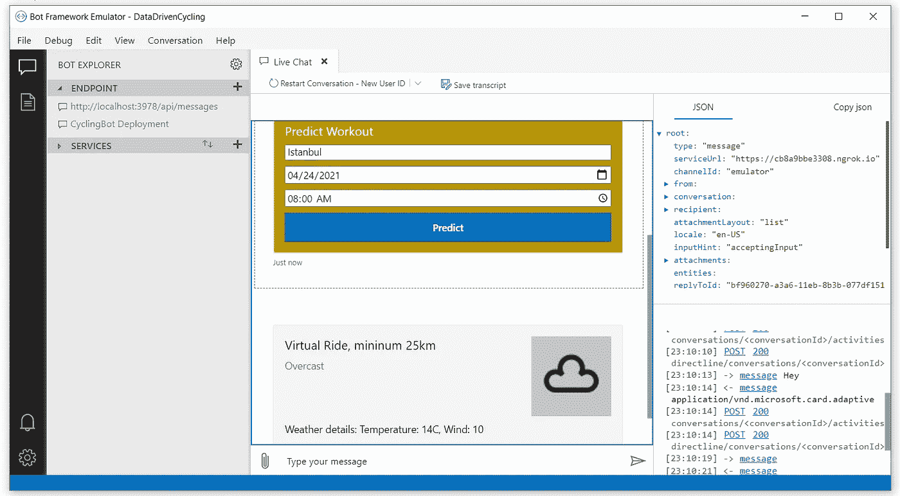

用于测试的模拟器上的机器人，图片由作者提供

之后，你的机器人就可以进行交互了。

# 微软团队中的机器人

发布 bot 后，您可以连接不同的对话用户界面。我已经连接了微软团队，并命名为`Data Driven Cycling Bot`。

一旦您发送第一条信息，它就发送一张卡来选择`City`、`Date`和`Time`信息，以预测健身骑行类型和最小距离。

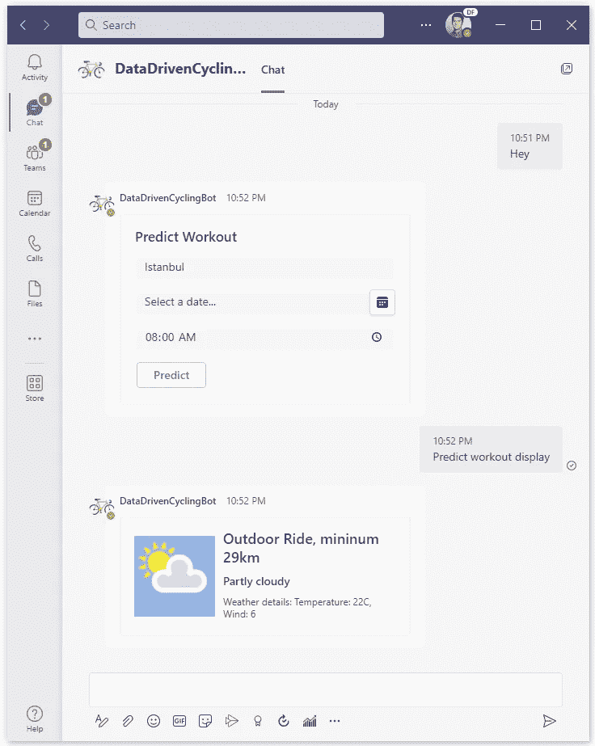

微软团队中的机器人，图片由作者提供

# 结论

这是一次从我现有的数据中发现见解的个人旅程，然后变成了一个数字私人教练。

对于接下来我想重点介绍步骤，

*   设定每周目标，并根据我的目标预测本周的锻炼计划。
*   比较游乐设备指标，查看随时间推移的改进情况。
*   支持美国指标(现在仅支持 km)

代码可在
[https://github . com/ikivanc/Data-Driven-Cycling-and-Workout-Prediction](https://github.com/ikivanc/Data-Driven-Cycling-and-Workout-Prediction)获得

期待听到新的想法和开放的贡献。

谢了。