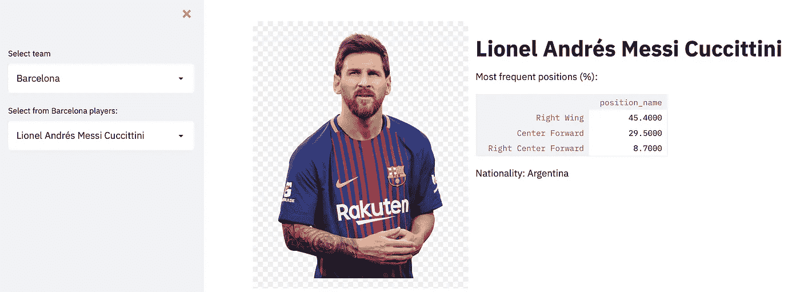
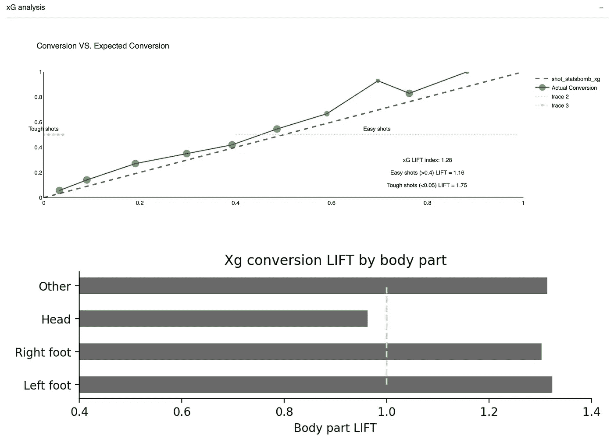

# 数据驱动的足球运动员技能评估

> 原文：<https://towardsdatascience.com/data-driven-evaluation-of-football-players-skills-c1df36d61a4e?source=collection_archive---------11----------------------->

## [实践教程](https://towardsdatascience.com/tagged/hands-on-tutorials)

## 这提供了一个通用的方法来衡量任何足球运动员的控球技术水平，并对射门技术进行了样本分析。

Wix.com 大学的数据科学家 Ofir Magdaci


*作者图片。*

# 先验知识

为了真正掌握要介绍的所有概念，强烈建议您熟悉 [StatsBomb xG 指标](https://statsbomb.com/2020/07/statsbomb-release-expected-goals-with-shot-impact-height/)。这篇伟大的 fbref.com 文章可以提供你需要的所有信息。

# 激励和总结

在最后两篇文章中，我既[介绍了](/embedding-the-language-of-football-using-nlp-e52dc153afa6)又[解释了](/a-deep-dive-into-the-language-of-football-2a2984b6bd21)两个主要模型，这两个模型让我们能够用数学方法来表示足球的语言: *Action2Vec* 和 *Player2Vec* 。我们研究了它们的含义、语义和动力学。我们的结论是，这些模型描述的是玩家做什么，而不是他们做得有多好。显然，**玩家的技能水平**在我们的建模中是一个**缺失的元素**，这就是这篇文章所要讲的。

足球涉及多种技巧。一些是有球技能，如传球和运球，而另一些是无球技能，如移动到死区或盯人。第二类通常更具挑战性，通常需要更丰富的数据。到目前为止，**持球**技能是最普遍和最被考虑的。

足球分析行业的兴起导致了无数种测量、比较和可视化球员技能的方法。然而，由于球队的战术或比赛风格，许多方法是有偏见的，通常忽略了动作的变化。这些提高了对**客观的、数据驱动的测量**的需求，这将为玩家评估设定标准。

在这项工作中，我提出了一种技能评估方法，它与数据科学和机器学习中的现有方法不相上下。这种方法适用于任何技能，无论是有球还是无球，只要有合适的数据。这里我就为 ***拍摄*分析演示一下这个机制。**

# 数据集

与之前的作品一样，本作品的数据基于 [Statsbomb 开放数据集](https://github.com/statsbomb/open-data)。文档可以在[数据集的 Github 库](https://github.com/statsbomb/open-data)站点上获得。

# 缩小技能水平差距

## **什么是技能**？

技能的构成可能比你想象的更难定义。字典暗示“… *执行某个动作的能力”*。然而，举例来说，射击是一项复杂的任务，有许多变化和困难。此外，可以用不同的技术、角度、范围等进行拍摄。但最终，它仍然是推测性的——即使是一个顶级得分手也可能在任何一天错过一个好机会。

想想像跳高这样的运动项目。挑战明显不那么复杂——障碍越高，越难克服——然而，对于一个固定的障碍高度，结果总是一个概率事件。

因此，一项技能更好的定义可能是 ***在特定难度下完成特定任务的可能性*** 。我们可以用一个概率分布来描述一个玩家完成动作的技能“ ***”一个*** ”，其中 l 是难度级别。鉴于任务的难度，成功的可能性是未知的，Sₐ(L=l)。

## 如何衡量技能分布？

要凭经验估计一个玩家的投篮技术的分布，需要两件事:对于各种条件的**(等于 1 —难度)*和 ***结果*** 。对于拍摄，对应的是拍摄的 **xG 值**及其结果。*

*估计每一枪的概率不是一件小事。幸运的是，Statsbomb 好心地将 [](https://statsbomb.com/2020/07/statsbomb-release-expected-goals-with-shot-impact-height/) 他们的 [xG 度量](https://statsbomb.com/2020/07/statsbomb-release-expected-goals-with-shot-impact-height/)添加到数据集中，这给了我们从枪击事件中得分的概率。因此，得分的概率越高，击球难度等级就越低。*

*注意:我必须澄清，xG 模型，或者我将讨论的任何其他概率模型，旨在预测击球的**预期** **结果**。因此，这种模型忽略了个人数据(例如，球员的弱脚质量)。它是关于估计每一次击球的“净值”,而不是它的确切结果。*

**

*图 1:数据集中所有镜头的 xG 分布。除了惩罚的 xG 值(在 0.75-0.8 之间)之外，分布是高度偏斜的。*

*一旦我们估计了技能分布，Sₐ(L)，我们就可以计算一些指标。*

## *升力的概念*

**提升*的概念在数据科学界被广泛使用。它通过将两者相除来比较指标和基线。该比率表明计算值比基线高出多少。*

## *xG 提升 AUC:从分配到 KPI*

*要生成一个数字作为 KPI(关键绩效指标)，我们可以计算技能分布 **AUC** (曲线下的面积)。尽管如此，我发现使用比率，即 AUC 和预期得分 AUC(等于 0.5)之间的 **lift、**，**来指示球员比预期好多少，更能提供信息和交流。***

**图 2:xG 分布图对比。xG 转换被描述为一种分布，其中虚线表示作为基线的预期性能。“提升”指数衡量的是每个球员比他们的预期表现好多少。xG AUC 将分布缩小为单个标量，作为 KPI 使用。**

*图 2 显示了几个玩家的 xG 分布，与根据 StatsBomb 的 xG 指标的预期性能进行了对比。*

*当描述为分布时，我们可以更清楚地看到更大的画面。我们可以观察并注意到水平上的表现**差异，检测心理信号，如错过重大机会(如路易斯·苏亚雷斯)，并更好地理解球员之间的权衡。不出所料，梅西在任何给定的难度下都超过了基准，总体上实现了 1.15 的 xG Lift AUC。***

## *不同拍摄类型的 xG 提升*

*这个 KPI 集合显示了**与由 StatsBomb 的 xG 度量估计的预期性能**相比，玩家在**执行特定击球类型** **时有多好**。它的计算非常简单:*

**

*公式 1:xG 提升指数，表示对于任何给定的射门(例如，任意球、远射等)，球员的表现超出预期的程度。)*

## *电梯的利与弊*

*使用这种方法有两个主要挑战。首先，估计行动的难度通常需要非常丰富的数据，如 [Statsbomb 360](https://statsbomb.com/2021/02/statsbomb-360-and-evolve/) 或 [StatsPerform 跟踪数据](https://www.statsperform.com/team-performance/football-performance/optical-tracking/)。其次，计算概率是不容易的，有时也是不清楚的。例如，如何估计运球的难度？对一个对手有效的方法对另一个拥有高超拦截技术的对手可能完全无效。*

*为了弥补这些障碍，该指标提供了大量优势:*

*它简单且易于实施。*

*它与数据科学中的现有衡量标准——Lifts 和 AUC 相当。*

*直观的底线:球员比预期好多少。*

*它很健壮，可以应用于任何运动和技能。*

*但也许最大的附加值是能够**只分别评估不同类型的镜头**。比如我们可以只在远射、**任意球、**或者**一对一**上计算 xG 升力**。正如你可能已经知道的，我很少在没有亲自执行的情况下提出想法…***

# *可视化技能水平*

*图 3 显示了根据 [StatsBomb 公开数据集](https://github.com/statsbomb/open-data)估算的*小内马尔*的**技能雷达图**。这些值是*提升*的*百分位数*，考虑到数据集中所有*合格的*玩家——那些至少有 30 次击球的玩家。*

*这给了我们一个清晰、一致、标准化和规范化的尺度。或者，当所有类别都用升程衡量时，也可以使用**原始**升程值。*

*相似的类别尽可能放在一起，以避免排序偏差。玩家射击技能被分成不同的子类别和上下文。这些上下文可以应用于性能评估、玩家搜索或开发。通常情况下，球员们在与其他人斗争的同时，在某些射门类型上表现出色，当然，除非你的名字是利奥·梅西(图 4)。*

**图 3——不同基线下的内马尔互动技能雷达图。此分析的合格玩家至少有 30 个镜头，每个镜头类型有 10 个实例。如果玩家对一种类型的投篮次数少于 10 次，但总的投篮次数多于 30 次，那么他得到的 Lift=1，这表明他的表现符合预期，不会影响结果。**

*仔细看，xG 升力图类似于雷达图。事实上，它是雷达图的缩小，其中轴折叠成单个射击指数。高 xG 值当然包含子技能，比如一对一的收尾，点球，还有部分头球。然而，低 xG 值主要包括远射和任意球。然而，在这两种情况下，总音量越高，记录的技能水平越高。这是如何正确排序类别的另一个提示。*

*当然，这种技术既有好消息也有坏消息……好消息是我们可以**将这种方法应用到任何我们可以测量**的技能上，比如运球和传球！然而，这也包括坏消息，因为我们**无法使用事件数据来衡量其他一些技能**(例如死区覆盖或标记)。*

**图 4——里奥·梅西的技能雷达图，大部分技能都很出色。他的头球升力相对较低，因为它低于 1，而许多球员得到了默认值 1。其次，梅西是目前数据集中射门次数最多的球员，而大多数球员的射门次数都很少，这造成了明显的统计偏差(见下一部分)。**

## *寻址数据偏差*

*Statsbomb 开放数据集本质上是二十年来数千个匹配样本的拼贴。这些比赛起源于许多比赛，各大洲，男女都有。更重要的是，它是**而不是** *随机*收集的(参见:[文档](https://github.com/statsbomb/open-data/tree/master/doc))。因此，数据非常稀疏，有偏见，并且往往集中在顶级球队和联赛，而不是足球运动员和比赛的真实分布。*

*因此，每个球员的投篮分布是如此的倾斜，以至于我不能很好的画出来。我宁愿用数字展示给你看:*

```
*Mean shots per player: 5.2, STD: 46.4.
  ╔════════════╦══════════════╗
  ║ Percentile ║    #Shots    ║
  ╠════════════╬══════════════╣
  ║    25%     ║        0     ║
  ║    50%     ║        1     ║
  ║    75%     ║        1     ║
  ║    90%     ║        8     ║
  ║    95%     ║       14     ║
  ║    99%     ║       56     ║
  ║    Max     ║    2,190     ║ Messi
  ╚════════════╩══════════════╝*
```

*由于数据集是**而不是**随机的，大多数玩家很少被评估击球。为了解决这个问题，我过滤掉了所有出手次数少于 30 次的玩家——然而有些*托举还是太激进了(图 5)。对于拥有数百次投篮机会的球员，我们确实得到了准确、真实的数字。**

**

*图 5:数据集中合格玩家的投篮命中率分布。符合条件的玩家至少有 30 发。*

# *如何正确使用雷达图的 5 个技巧！ ✍*

*雷达图可能是足球分析社区中最受欢迎的图表，因为他们可以在同一张画布上以非常直观的方式展示许多技能。不幸的是，它也有许多可能的故障点——这可能使它成为所有图表中被误用最多的图表。*

*以下是帮助您创建完美雷达图的方法:*

***1。观察你的变量的顺序**:雷达图逻辑很简单——多边形的体积越大，玩家在所列技能中表现越好。通过连接相邻的点来创建体积。因此，交换图表中两种技能的位置可能会产生戏剧性的效果:*

**

**图 6:两张相同球员数据的雷达图，但类别排序不同。在右边，相邻的技能是相关的，因此排序正确。在左边，语义排序缺失，使我们无法理解每一个玩家是什么类型的。**

***2。避免使用依赖战术的类别**——这可能是最大也是最常见的错误。在一场比赛中，计算成功运球/铲球的次数是没有意义的。这些措施在很大程度上取决于球队的质量、比赛风格或者教练的指示。相反，使用诸如“成功的一对一防守行动的百分比”这样的指标。*

***3。使用相对数字** —所有值都应该与有意义的基准相关。例如，我们可以用百分位数来代替显示一场比赛中一名球员运球获胜的百分比。*

***4。保持你的** **刻度固定**——比如当使用*提升*或百分位数时。当每个维度尺度不同时，我们可能会通过制作有偏见的图表来误导读者。*

***5。添加基线** —例如，相同位置球员的平均表现——这对于数据集中其他球员的全球可比性至关重要。在尺度不一致的情况下更是至关重要。*

# *可能的附加分析*

*这些分析需要更大、更平衡的数据集。然而， [Football2Vec](https://github.com/ofirmg/football2vec) 库也包含了他们的代码供你探索:*

*   ***比较不同维度的 xG 提升曲线—** 这种分析可能揭示一些关于不同比赛位置、年龄和比赛的技能水平变化的见解。*
*   ***比较训练托举和比赛托举** —这可能是影响球员表现的心理或战术效果的指标。*

# *用令人惊叹的用户界面将这一切包装起来*

*是时候让所有的东西都聚集在一个漂亮的流线型用户界面上了。这个超级易于使用的 Python 包已经成为我最喜欢的与我的工作进行交互的包，并使它对其他人很友好。为此，我构建了一个简单的玩家控制面板，具有以下特性:*

## *1.情报室*

**

*信息区包含:(a)团队和球员选择的滑动条；(b)玩家图像，以及(c)元数据。图片作者。*

## *2.玩家技能分析部分*

**

*“分析”参数控制面板。图片作者。*

**

*技能部分包含两个子部分:(1)带基线的技能雷达图。(2)徽章-对于提升值大于阈值[=1.1]的玩家，每种击球类型都有一个唯一的图标。图片作者。*

## *3.玩家进化区(可折叠)*

*分析球员的技术和赛季表现。包含两个[剧情](https://plotly.com/)动画图表:*

**

*各赛季玩家技能雷达图动画(**见**[**plot . py****>【玩家 _ 进化】**)，集成控件。图片作者。](https://github.com/ofirmg/football2vec/blob/master/lib/plot.py)*

**

*各季动画动作热图(见[**plot . py**](https://github.com/ofirmg/football2vec/blob/master/lib/plot.py)**>)带集成控件。它描述了一年中动作的频率和位置。图片作者。***

## *4.xG 评估(可折叠)*

**

*xG 评估部分提供了两个图表:(1)击球转换率分布图(顶部)——绘制了如图 2 所示的单人游戏的 xG 转换率分布图**；**(2)xG Lift by body part——分析选手的头部和腿部表现。图片作者。*

## *5.播放器 2Vec 嵌入部分*

**

*播放器 2Vec 部分呈现(1)播放器 2Vec ( [UMAP](https://umap-learn.readthedocs.io/en/latest/) )嵌入图，以及通过余弦相似性以及欧几里德距离与所选播放器最相似的播放器。*

*所有代码都可以通过 [Football2Vec Python 开源库](https://github.com/ofirmg/football2vec)获得。*

# *摘要*

*在这篇文章中，我们揭开了技能评估的世界。从零开始，我们首先定义了什么是技能，我们如何从数学上形式化它，以及我们如何从经验上衡量它；我们了解了用于评估不同类型拍摄的*升力*(公式 1) *、*、 *xG 升力*和 *xG 升力 AUC —* 的概念。*

*然后，我们将重点转移到如何正确地可视化技能，并强调重要的最佳实践；借助 Streamlit 的强大功能，我们能够将复杂的模型和统计数据转化为易于理解的交互式漂亮用户界面。*

*在这三篇文章中，我们经历了一个端到端的数据科学之旅，以创建足球语言的整体表示。我们的目标尚未实现，但在实现目标的持续探索中，我们刚刚成功抵达大本营。*

# *下一步是什么？*

*现在我们的方法涵盖了玩家做了什么，以及他做得有多好(至少他射得有多好)。剩下的工作就是找到一个有足够数据量的下游任务来学习。当然，额外的技能可以根据需要进行建模。*

*我希望你觉得这三部曲读起来有趣。感谢所有的反馈，这真的很有趣！*

*游戏，设置和匹配。*