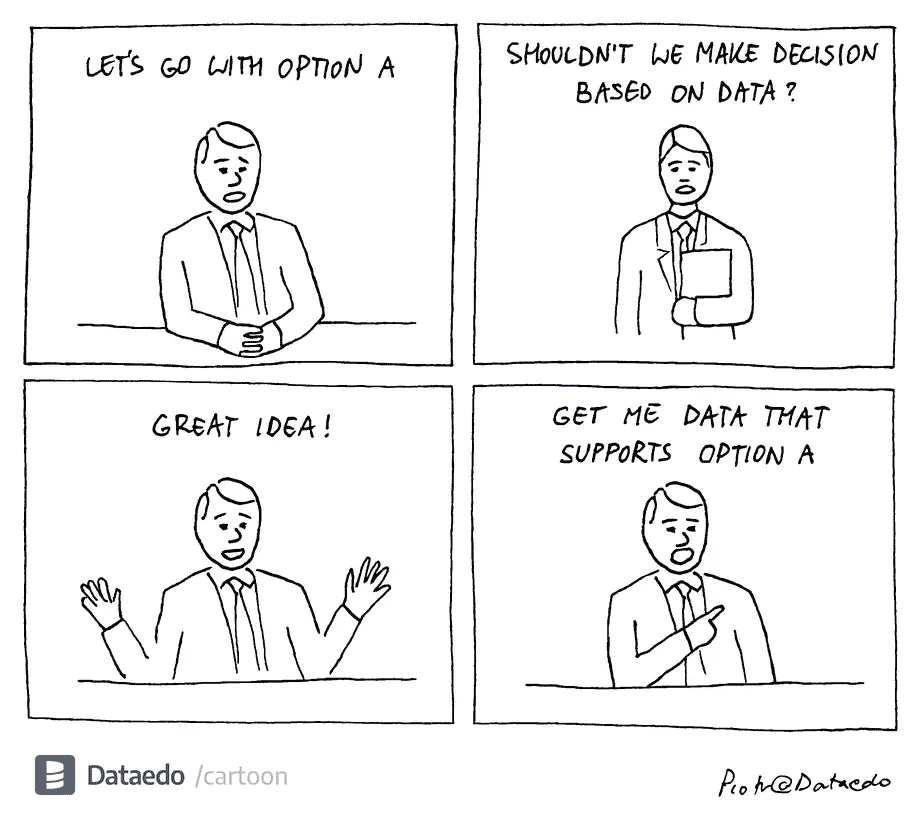
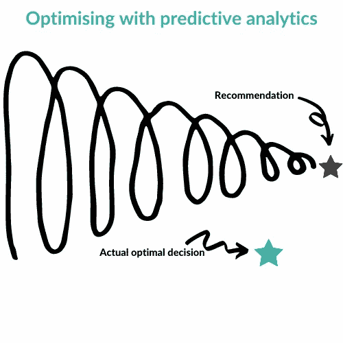
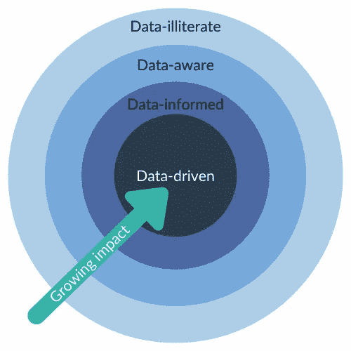

# 数据驱动并没有消亡

> 原文：<https://towardsdatascience.com/data-driven-isnt-dead-3230378e4c7a?source=collection_archive---------23----------------------->

## [行业笔记](https://towardsdatascience.com/tagged/notes-from-industry)，[商业科学](https://medium.com/tag/business-science)

## 问题不在于术语；而是我们不是真心的



资料来源:皮奥特·科诺乌，[数据](https://dataedo.com/cartoon/data_driven-decisions)

每隔几年，数据科学和技术术语就会出现在商业词典中，只是变得流行、被过度宣传，然后就不再流行了。机器学习、人工智能和许多其他技术都遵循这些模式。不幸的是，即使是最基本的想法也会成为这个循环的牺牲品。

> 最新的受害者:数据驱动。

# 数据驱动意味着什么？


由[马库斯·斯皮斯克](https://unsplash.com/@markusspiske?utm_source=medium&utm_medium=referral)在 [Unsplash](https://unsplash.com?utm_source=medium&utm_medium=referral) 上拍摄

难怪人们开始[厌倦大数据和术语“数据驱动”](https://sloanreview.mit.edu/article/big-data-fatigue/)。如今，几乎每个公司都声称拥有数据驱动的衣钵。

不是无缘无故的。数据已经成为任何市场成功的关键。甚至你的[本地街角熟食店](https://datadrivenlabs.io/our-work/hickory-tree-deli/)也可能在利用数据做出一些商业决策。这一现实导致了意料之中的反弹。当然，并非所有所谓的数据驱动型企业都以同样的方式使用数据。

那么，数据驱动意味着什么呢？其核心是，数据驱动型公司利用他们的数据做出更好的决策，创造更佳的结果。他们从公司每天收集的大量数据中发现模式和见解，以便更有效地实现业务目标并提高 KPI。

> 简而言之，数据驱动型公司利用他们的数据来推动最佳结果。

一家熟食店看着某一特定专业的大量订单，决定把它作为一个常规的菜单项目，可能无法完成复杂的分析。尽管如此，如果这个决定增加了收入或者让更多的人进来，他们可能会满足“数据驱动”的最低门槛。

当然，将一次性决定等同于文化转变仍然有些牵强。真正的数据驱动型公司不会只是偶尔利用他们的数据。他们围绕决策改变了整个公司文化，通过有效利用数据来改善决策。许多公司将两者混为一谈，这无疑损害了“数据驱动”的声誉。

# 数据驱动危险吗？


[万花筒](https://unsplash.com/@kaleidico?utm_source=medium&utm_medium=referral)在 [Unsplash](https://unsplash.com?utm_source=medium&utm_medium=referral) 上拍摄的照片

但是这个术语的过度应用并不足以成为抛弃数据驱动的理由。数据驱动的决策仍然是一个关键的竞争优势。

不幸的是，许多人不同意——一些最响亮的声音呼吁我们从我们的词汇中消除数据驱动:数据科学家。

我从数据科学社区的人那里听到了关于为什么数据驱动不再是正确目标的各种争论。有人说，最好是简单的“[了解数据的](https://blog.scuba.io/blog/data-driven-vs-data-informed)”、“了解数据的”或“[了解数据的](https://medium.com/ft-product-technology/why-we-should-be-data-conscious-not-data-driven-548673dc0e04)”:我们的勇气，被做出非常糟糕的决定的数据所检验，应该推动结果。我甚至看到有人提出，数据驱动的决策是[危险的](https://medium.com/manomano-tech/is-being-too-data-driven-dangerous-5a62517a1878)，好像人类可能会失去对数据的控制。虽然大数据有其局限性，但分析中的大多数危险和偏见最终来自我们，而不是数据。

# “数据驱动”公司的真正问题是


克里斯·利维拉尼在 [Unsplash](https://unsplash.com?utm_source=medium&utm_medium=referral) 上拍摄的照片

然而，一些反对“数据驱动”的数据科学家确实有一个令人信服的观点。数据驱动往往是不准确的。当你考虑大多数公司如何使用数据时，很难说它真的被用来推动最佳决策。

太多时候，先做一个预测，然后根据这些假设做出决定，以应对现实。例如，一位商店经理查看需求预测，预测他的商店下周将销售 10 件蓝色男士衬衫，他将订购 10 件蓝色男士衬衫来满足该需求。很少考虑销售这 10 件蓝色球衣是否是实现收入或利润目标的最佳方式。数据推动决策，但在整体业务目标的背景下，也许是错误的决策。

预测分析中的这一缺陷通常被标记为数据驱动的决策中的固有缺陷。因为预测只能告诉你可能会发生什么(假设没有危机发生)，而不能告诉你在任何情况下如何实现给定的目标，所以数据驱动的思维模式通常被认为是小于。

> 这没有认识到真正的问题:一个预测性的，而不是指令性的方法。

# 我们如何用数据驱动结果？

真正的数据驱动型决策利用数据来*推动*成果:它使用数据向您展示实现业务目标的最佳途径。当我听到一位数据科学家说，基于数据的决策比数据驱动的决策更好时，我只能假设他们使用预测分析来解释这些数据。如果是这样，他们是对的。

在其核心，预测分析是最有用的决策支持工具。他们的存在是为了给你提供信息，给你决策的背景。当你使用它们时，它*必须*是一种基于数据的方法，因为否则你会冒着朝着错误的目标优化的风险。这是一个随着时间推移而加剧的[错误](/data-science-lessons-were-not-learning-fast-enough-83ead4827735)，因为一个优秀的数据科学家会随着时间的推移改进算法，越来越高效地实现次优结果！



图片来源: [Evo 定价](https://evopricing.com/) (CC 带归属)

为了实现数据驱动，您必须进行优化以获得最佳结果。这必然需要一种规定性的方法。在这种情况下，您可以定义最适合您公司的目标，然后利用这些数据帮助您实现目标，不管在此过程中会出现什么样的危机和挑战。这是用数据推动结果并最终实现数据驱动思维的唯一途径。

# 让数据驱动再次变得有意义

一旦你揭示了数据驱动的辩论背后隐藏的问题，很明显，人们并不喜欢这个词；他们对数据处理方法的局限性深感沮丧。幸运的是，这有一个简单的解决方案。

> 正确的分析——规范的分析——使得利用数据做出有意义的决策成为可能。

通过这种方式，很明显默认回到基于数据的(或者更糟，仅仅是基于数据的)决策是有局限性的。随着您更有效地利用您的数据，影响会越来越大。组织必须采取更难但最终更好的分析方法:指令性。



图片来源: [Evo 定价](https://evopricing.com/) (CC 带归属)

数据驱动、规范的业务和[项目是为成功而设立的](/how-not-to-fail-at-your-data-science-project-7e8c84305aa8)。因此，不要因为简单地回到数据信息似乎就足够的时代，就低估了数据的价值。通过正确的分析，您可以有意义地转型为数据驱动型公司。希望，如果我们这样做了，人们会像我现在一样再次喜欢上“数据驱动”这个术语。

PS 更多[商业科学](https://medium.com/tag/business-science)来自我的写作:

</data-science-cant-innovate-without-transparency-9e31f49fb95>  </how-not-to-fail-at-your-data-science-project-7e8c84305aa8> [## 如何(不)在数据科学项目中失败

towardsdatascience.com](/how-not-to-fail-at-your-data-science-project-7e8c84305aa8) 

```
Monthly Business Science in your inbox, new software, and University-level learning:[**Free access**](https://evouser.com/register)Questions? Please reach out on [Linkedin](https://www.linkedin.com/in/fabrizio-fantini/)
```