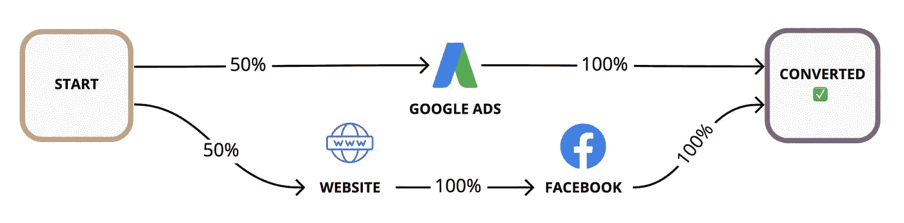

# 数据驱动的多点触控属性揭秘

> 原文：<https://towardsdatascience.com/data-driven-multi-touch-attribution-demystified-3eb3486476c6?source=collection_archive---------21----------------------->

## 度量和测量

## 马尔可夫归因模型入门

有效运营企业的最宝贵信息之一是了解某项业务活动直接产生的收入。

知道哪些努力得到了回报可以让你加倍努力并扩大规模，而了解时间和金钱被浪费在哪里可以让你通过少做*多做*。

这就是**归属**的问题。

营销人员正面处理这个问题，因为他们必须在多个影响渠道上花费有限的资源。潜在客户在他们的客户之旅中与企业有许多接触点。他们必须不断地问这个问题:

哪个活动/渠道真正赚钱？

这不仅仅是营销问题。你的企业和顾客之间的每一次互动都有助于购买体验，因此，拥有一部分归因难题。

归因不是纯粹的理论练习。它直接关系到你如何有效地利用资源来实现业务增长。使用复杂归因模型将支出与收入对应起来的组织，其收入增长 20%或以上的可能性是 T10 的两倍。

这篇文章将探讨传统上如何处理多触点归因，以及如何通过一点数据魔法来改进你的归因模型。

在整篇文章中，我将使用“接触点”这个词，因为这是一个非常通用的模型，但是请随意将它直接翻译到您自己的领域中。它同样适用于特定的活动、营销渠道、销售行为，甚至是在数字产品中与客户的互动。

# 传统多点触摸属性

你会如何运用常识为特定客户购买的每个接触点分配信用？

根据您的观点，您可能会对客户旅程中的每次体验的影响应用不同的启发法:

**第一次接触**
100%的荣誉归于第一次接触点，因为他们将客户带入了我们的世界。

**最后一次接触**
100%的信用分配给最后一次接触点，因为它让客户迈出了最后一步。

**时间衰减**
最近的接触点会获得更多的信任，因为最近的接触点可能会对领先优势起到更多的“预热”作用。

**线性**
为什么我们不能都成为朋友？只要你参与了转化之路，所有人都有同等的荣誉！

第一次接触和最后一次接触思维之间显然存在一种平衡。让我们给第一次和最后一次触摸各 40%的信任，其余的平均分配。

**自定义**
每个频道都是独一无二的，所以我要根据我认为的重要程度给每个频道加上权重。


***使用传统多触点归因试探法分配的点数|*** 作者图片

所有这些试探法有什么共同点？

嗯… **我们编造了它们**，这至少会让你感到一点点*不舒服。事实上，这种观点得到了近 78%的营销人员的认同，他们不确定自己是否使用了正确的归因模式。*

你还必须注意，这些也可能被扭曲，以服务于一个人的激励。例如，如果我有一个潜在客户生成业务，我只是在一个客户的网站上投放广告，那么通过第一接触模式获得 100%的信用并获得相应的报酬对我来说是最有利的💰。

我说“传统方法”，但这是一个误称，因为不幸的是，这是行业的现状。超过 90%的组织没有利用数据为他们的归因模型提供信息，其中大约 1/3 的组织甚至没有尝试跟踪支出到收入。

除了猜测这个核心业务问题，我们还能做得更好吗？

# 数据驱动的归因方法

我们可以让数据说话，而不是自己制定规则。

有各种类型的模型可供我们使用来解决这类问题。围绕这一主题的大量文献往往集中在 3 种主要方法上。

1.  幸存
2.  沙普利
3.  马尔可夫

**生存模型**将生物统计学中的“某些治疗对死亡时间的影响”问题转化为“某些接触点对转化时间的影响”生存模型的设置需要几个定义，并且[超出了本文](http://www0.cs.ucl.ac.uk/staff/w.zhang/rtb-papers/attr-survival.pdf)的范围。

Shapley 模型来自博弈论的世界，它提供了一种公平的方式，根据参与者的贡献程度在他们之间分配收益。每个接触点都可以被视为游戏中的参与者，回报可以建模为所有客户的总购买价值。

使用匀称的价值观进行归因是一种聪明而直观的方法，具有许多有用的特性。尽管如此，计算所需的计算能力随着接触点类型的数量呈指数增长，这使得它对许多拥有复杂客户旅程的公司来说没有吸引力。值得注意的是，有效地用[逼近沙普利值](https://www.sciencedirect.com/science/article/pii/S0004370208000696)的算法确实存在。

最后一个模型是**马尔可夫模型**，它直观，抗噪声，伸缩性很好，所以这是我们今天要关注的。

无论您想使用哪种模式，您都需要首先对您的业务进行调整，以捕捉潜在客户接触点事件。这可以是作为 Salesforce 中的任务跟踪销售活动，通过自动化软件的营销活动，或定制的数据收集策略(实习生？🤨 ).

# 简单马尔可夫归因

一旦你的数据准备就绪，你就可以按照客户与你的业务互动的顺序，开始建立对客户旅程的理解。仅仅通过计算从一次互动到另一次互动的顾客数量，你就可以得到每个接触点的**转移概率**。


***所有可能转换路径的转换图*******|***图片作者*

*现在我们知道了转移概率，我们可以通过所有可能的转化途径遵循概率链*来估计给定数量的潜在客户的转化数量(就像一个漏斗)。**

*例如，如果我有 **100 个潜在客户**，我可以计算转换数量为:*

```
***# Conversions =** 100 ⨉ 30% Website ⨉ 30% Converted +
  100 ⨉ 30% Website ⨉ 40% Facebook ⨉ 35% Converted +
  100 ⨉ 70% Google Ads ⨉ 8% Website ⨉ 30% Converted +
  100 ⨉ 70% Google Ads ⨉ 8% Website ⨉ 40% Facebook ⨉ 35% Converted = 15.664 Conversions*
```

*如你所见，我们只是简单地添加了多个漏斗的效果。唯一转换路径的转换次数是相加的，因此每个路径贡献的转换率也是相加的。*

**

**每个转换路径对整体转换的部分贡献**

*我们有每个*路径*对我们整体转换率的贡献，但是我们仍然需要计算每个接触点*的贡献。要做到这一点，我们可以问，“如果我只移除一个接触点，我的总体转换率会怎么样？”**

*例如，我们可以通过有效地将所有离开该节点的流量发送到一个黑洞来删除谷歌广告，并使用我们剩余的转化路径来计算我们的转化率。*

**

****假设从我们的客户旅程中删除谷歌广告|*** 作者图片*

*这种假设的去除产生的总转化率为 **0.132***

```
*Overall Conversion Rate **without** Google Ads =
  Conversion Rate of (**Start** > Website >**Converted**) +
  Conversion Rate of (**Start** > Website > Facebook >**Converted)**= 0.09 + 0.042
**= 0.132***
```

*如果我们没有谷歌广告的转化率是 **13.2%** ，这意味着谷歌广告一定只为我们之前的整体转化率 **15.6%** 贡献了 **2.4%** 。*

*这只占总转化率的 0.024 / 0.156 = **15.38%** 。*

*这个 **15.38%** 的值被称为谷歌广告接触点的**移除效应**，是计算每个节点整体属性权重的关键数字。*

*计算去除效果的公式可总结如下:*

*   *Rx =接触点 x 的移除效果*
*   *Cw =总转换率**与**接触点 *x**
*   *Cr =移除接触点 *x* 后的图形转换率*

# ***R*x*=(Cw Cr)/Cw = 1(Cr/Cw)***

*能不能用这个去除效果作为每个触点的权重就完事了？*

*不完全是。但是我们很亲密。*

*为了理解为什么我们可以看到如果我们删除网站会发生什么，并计算其删除效果。*

**

****假设将网站从我们的客户旅程中移除|*** 图片作者*

*每条路径都经过网站，所以删除效果当然会是 **100%** 。如果我们给网站一个 **100%** 的属性权重，其他接触点还有什么属性？*

*这就是为什么不直接使用移除效果，我们可以通过确定特定触摸点在所有移除效果的总和中所占的比例( **RSum** )来使用归一化移除效果。*

**

**每个触摸点的去除效果的属性权重**

*现在我们有重量了！我们可以通过简单地将每个接触点的归属权重乘以总转换美元金额 **V** 来计算我们的归属值 **A** 。这通常是购买金额的总和，但是如果您想了解全部情况，我强烈建议您使用客户终身价值。*

# ***A = V ⨉ ( Rx / Rsum )***

*例如，假设我们的客户总共花费了 100，000 美元，谷歌广告的归属价值将是 100，000 美元⨉0.1066 = 10，660 美元。如果你在谷歌广告上的营销支出少于这个数字，你就获得了正的投资回报。*

# *马尔可夫归因假设*

*马尔可夫模型很方便，但是它做了一些你应该知道的假设。*

***第一个假设**是移除一个特定的接触点不会导致客户使用转向其他渠道。这个假设在大多数时候都成立，但是你必须考虑你的业务会受到什么影响。*

*例如，如果你的客户通过谷歌搜索出现在你的脸书页面上，删除脸书可能会将流量转移到你的网站频道，因为它会出现在结果页面的上方。*

***的第二个假设**是，从一个频道到下一个频道存在一些潜在的*常数概率*。实际上，不同的客户有不同的*隐藏*转移概率。分析你对所有顾客的归因效果，确实会给你“普通顾客”的归因权重*

*对不同的客户群重复这一练习并找出相似之处和不同之处可能是一个有用的实验。*

*有趣的是，您可以将这里使用的标准马尔可夫模型扩展为一个[隐马尔可夫](https://en.wikipedia.org/wiki/Hidden_Markov_model)模型，以推断每个客户的隐藏状态(例如他们是处于“研究模式”还是“购买模式”)。*

***第三个假设**是每个触摸点*处的转移概率仅*取决于先前的状态。我们知道这根本不是真的。客户的转化倾向肯定会受到客户旅程中接触点顺序的影响。*

*这就是为什么在实践中，你不仅要考虑先前的状态，还要考虑两个或更多先前的状态。这些叫做**高阶**马尔可夫模型。*

# *高阶马尔可夫模型*

*对于二阶马尔可夫模型的情况，我们从观察单个接触点到成对地考虑它们。*

**

****2* nd *阶马尔可夫模型(仅显示转换路径)|*** 图片作者*

*一阶路径 **A → B → C → D** 变成了 **AB → BC → CD** 的二阶路径，每条高阶路径的转移概率都是沿着它所构建的低阶路径的转移概率的乘积。例如*

*即使我们考虑成对的接触点，我们仍然可以通过移除转移图中包含该接触点的所有*节点来计算单个接触点的移除效果。**

*例如，删除谷歌广告将导致下图:*

**

****用二阶马尔可夫模型去除效果|*** 图片作者*

*我们可以继续其他接触点。移除网站接触点会使所有节点失效，移除脸书会使底部节点失效。计算我们属性权重的数学方法和以前一样。*

**

**来自第二*和第二*阶马尔可夫模型*的去除效应和归因权重*

*值得注意的是，你通常不会在野外看到一阶马尔可夫模型用于多点触摸属性，因为我们**确实关心**对我们的触摸点有更长的“记忆”。*

*相反，你可能永远也不会遇到 4 阶或更高阶的马尔可夫模型，因为当你提高模型的阶次时，在某个点上你会得到递减的精度回报。*

# *单触式转换路径*

*考虑下面的**改装客户之旅。***

**

****包含单点触摸转换路径的转换图|*** 作者的图像*

*让我们计算这 3 个接触点的归因权重，但这一次，我们还将计算转化的数量。我们可以假设有 20 个客户进行了转换，并查看理想的多点触摸归因分裂与马尔可夫归因分裂相比如何。*

**

****单点触摸路径对马尔可夫归因的影响|*** 作者图片*

*注意到什么奇怪的事了吗？*

*对于脸书和网站来说，分享他们转化的部分功劳是有道理的，但是当与该渠道完全没有互动时，他们为什么要从谷歌广告转化中获得部分功劳呢？*

*这是使用规范化移除效果的注意事项。要在实际部署中解决这个问题，您可以从分析中移除单点接触路径，并对剩余的路径使用高阶马尔可夫模型。然后，您可以简单地添加单点触摸旅程的转换，因为它们的贡献是显而易见的，不需要建模。*

# *现状核实*

*在这篇文章中，我们一直假设数据驱动的模型会比传统模型更好。虽然在大多数情况下这可能是真的，但我们能衡量他们到底有多好吗？就此而言，我们如何将一个多点触摸归因模型与另一个进行比较？*

*评估任何归因模型有效性的困难在于，归因权重的“基础事实”对我们来说是隐藏的，因此我们无法判断我们离现实有多远。*

*解决这个问题的一个有趣的方法是[通过整合来自你的业务的数据和来自你的专家的领域知识来创建一个你的客户互动的模拟](https://medium.com/@SkyscannerEng/lets-make-roi-a-fair-game-e2eb734a9560)。*

*通过仔细观察您的客户接触点，拟合数据的统计分布，并对变量之间的交互进行建模，您可以创建与生产数据非常相似的模拟数据。拼图的最后一块是模拟的归因权重，它可以来自您的专家，并将被用作您的归因模型的“目标”。*

*领域专家可能无法准确指出每个接触点的确切属性权重，但他们应该能够提供有效的 90%置信区间。假设每个场景中所有接触点的属性权重总和为 100%,您可以使用领域专家估计的属性权重分布作为蒙特卡洛模拟的输入，来计算每个属性模型的误差分布。*

*在这一点上，你可以把归因模型放在一起，看看哪一个更接近目标。你也可以测试许多“假设”案例，并在多个场景中对每个归因模型进行压力测试，以衡量它们如何适应你的业务特有的不同假设条件。这些模拟场景也为你调整归因模型提供了更快的反馈机制。*

# *从这里去哪里*

*开始使用这个模型的最大障碍不是计算的复杂性；它为您的业务提供收集数据的工具，然后将所有数据集中在一个地方进行分析。只要有一点毅力，这个*就能*完成。*

*如果你从事市场营销，你很幸运，因为有像 [Bizible](https://www.bizible.com/) 、 [Attribution](https://www.attributionapp.com/) 和 [Rockerbox](http://rockerbox.com/) 这样的软件供应商可以帮助你连接到你的数据，并为你建立归因模型。*

*在某些情况下，现成的软件不够灵活，无法处理您的数据收集或建模需求。在这些情况下，你需要开始考虑推出自己的解决方案。*

*这里也不需要从头开始。像[channel attribute](https://www.channelattribution.net/)这样的 Python 和 R 包只需几行代码就能适合你的模型。*

*归因建模是一个丰富而迷人的话题。在这篇文章中，我放大了马尔可夫模型，但是我恳求你看看 Shapley 方法，因为，尽管有计算上的挑战，它有许多令人满意的特性。*

*使用转换路径的自底向上建模也不是数据驱动属性的唯一方式。在某些情况下，衡量接触点可能非常困难，比如广告牌和广播广告。cookies 和数字拼接的不断变化的前景带来了一系列挑战。*

*像[营销组合建模](https://avada.io/resources/marketing-mix-modeling.html#how-does-marketing-mix-modeling-work)这样的自上而下的方法提供了一种在处理汇总信息时计算属性的替代方法。这一系列模型是可解释的、可扩展的和优化友好的，但是可能需要一种实际操作的建模方法。*

*提到的大多数模型都提供了一种捕捉特定接触点和转换之间的*相关性*的方法，但是为了说明特定接触点*导致了*转换，您可以运行受控实验(A/B 测试)并计算该接触点的[转换提升](https://www.searchenginejournal.com/conversion-lift-attribution/298073/)。*

*由于在动态商业环境中运行多个实验的高成本和复杂性，这在实践中可能并不总是可行的。然而，除了受控实验之外，还有其他方法[来确定因果关系，这些方法使用](https://www.researchgate.net/publication/254463600_Causally_motivated_attribution_for_online_advertising)[因果网络](https://www.google.com/search?q=the+book+of+why)作为它们的基础。*

*正如您所看到的，这是一个热门话题，我们只是触及了表面，但开始学习使用这些数据驱动的多点归因方法中的任何一种，都有可能让您比使用传统方法的绝大多数竞争者拥有更大的竞争优势。*

*👏如果你喜欢这个话题，留下一些掌声来帮助其他人发现它。👏*

*想进一步讨论这个吗？在 Linkedin 上留言或[联系我。](https://www.linkedin.com/in/balmasi/)*

## *📕这篇文章最初发表在 [Show Me The Data](https://showmethedata.blog/data-driven-multi-touch-attribution-demystified?utm_source=medium&utm_campaign=post&utm_content=attribution) 博客上，在那里我讨论了更多关于数据驱动业务的话题。*