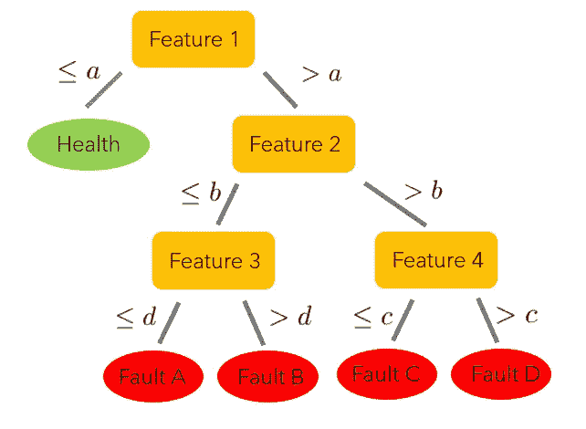
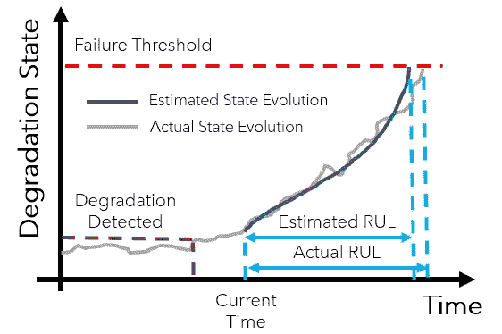
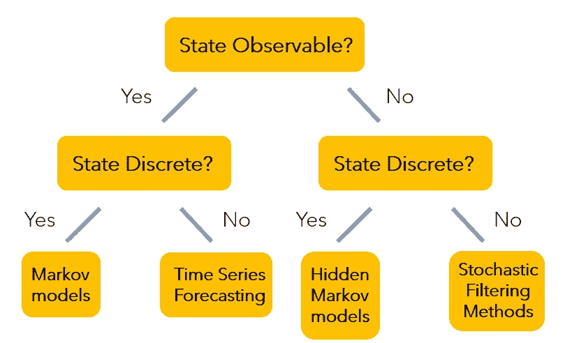
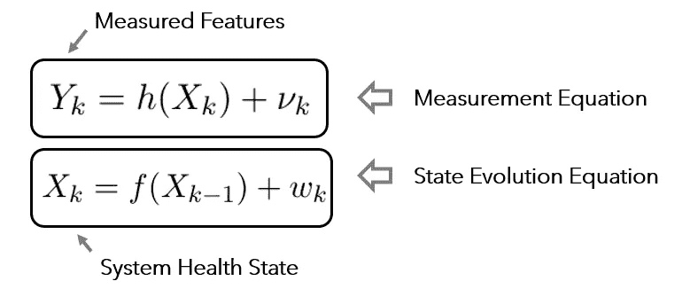
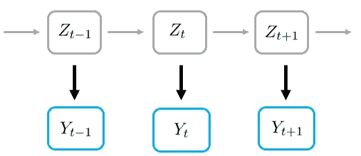
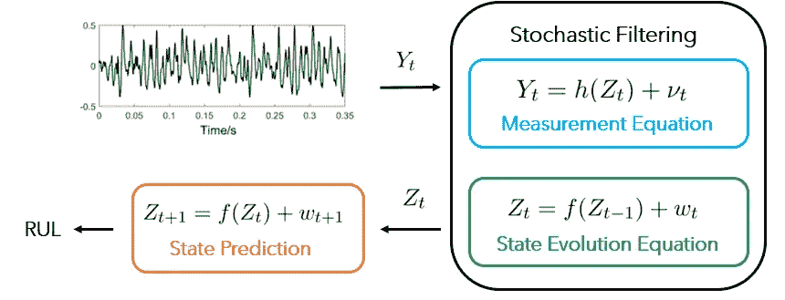

# 简而言之，数据驱动的预测性维护

> 原文：<https://towardsdatascience.com/data-driven-predictive-maintenance-in-a-nutshell-ccc65a13b998?source=collection_archive---------18----------------------->

## 基本概念和流行算法概述

布雷特·乔丹在 [Unsplash](https://unsplash.com?utm_source=medium&utm_medium=referral) 上的照片

对于像飞机、铁路、发电厂这样的复杂系统，维护是一个大问题，因为它确保系统在其生命周期内的可靠性和安全性。

通过利用先进的传感器功能、物联网技术和数据分析算法的力量，工业 4.0 时代的维护经历了从“被动”到“主动”的快速转变:不是只在故障已经发生时才执行维护，最先进的策略是主动预测系统降级并“及时”安排维护。这种新型维护被称为**预测性维护** (PdM)。

实际上，PdM 通常是通过首先使用传感器持续监控系统的健康状态来实现的。随后，数据分析算法被用来根据最新的测量结果预测系统的剩余使用寿命。最后，相应地设计一个维护时间表来维护系统的原始预期功能。

PdM 的核心是预测技术，它能够在给定实时测量数据的情况下预测在役系统的退化趋势。这就是数据科学大放异彩的地方:机器学习模型通常用于识别系统当前健康状态的特征，并预测系统故障发生前的剩余时间。

在本帖中，让我们仔细看看执行预测任务时常用的数据驱动模型。这篇文章的结构如下:

*   首先，为了做好准备，我们将简要回顾一下预测性维护的主要步骤。
*   第二，我们将根据系统的特征将系统分为不同的类别，并且我们将针对每个系统类别讨论流行的机器学习模型。
*   最后，我们将讨论交付可靠的预后分析所面临的挑战。

我们开始吧！

# 1.预测性维护的主要步骤

图 1 预测性维护的主要步骤。(图片由作者提供)

PdM 的主要步骤包括数据采集、诊断、预测和健康管理，如上图所示。

## 1.1 数据采集

数据采集步骤处理从传感器收集测量数据，并处理原始信号以提取可指示系统健康状态的有用特征。后一项任务通常被称为数据科学中的特征工程。

为了提取特征，**信号处理**技术通常用于将原始数据转换成不同域中的特征(例如，时间、频率、时间-频率)。由于 PdM 主要遇到非平稳信号，*时频分析工具*可以方便地提取用于诊断和预测目的的特征。在这一类别下，短时傅立叶变换、小波包分解、经验模式分解和希尔伯特-黄变换是最流行的方法。

特征提取之后的附加步骤是特征缩减。这是因为所提取的特征通常太多而无法在实践中利用。流行的降维方法，如主成分分析、核主成分分析、Isomap 等。通常用于消除冗余特征。

## 1.2 诊断

诊断步骤基于提取的特征值处理故障检测和故障模式识别。

故障诊断通常被公式化为一个分类问题。因此，流行的分类方法，如 k-最近邻、支持向量机、决策树、随机森林，被广泛用于预测给定特征值的系统健康状态标签。下面给出了应用决策树模型对系统故障模式进行分类的简单说明。

图 2 使用决策树进行故障诊断。(图片由作者提供)

## 1.3 预测

PdM 的下一步是预测。这里，目标是预测被监控系统的未来状态，并估计系统的剩余使用寿命(RUL)，即，直到系统故障发生需要多长时间。

图 3 是预后分析的示意图。(图片由作者提供)

预测是推动智能 PdM 的关键技术。由于它预测系统不再执行其预期功能的时间，因此它为用户提供了在延长系统使用寿命的同时降低故障风险的机会。

自然，数据驱动的方法被大量研究以估计 RUL。因此，一系列机器学习策略被提出用于各种应用场合。在第三节中，我们将回顾一些常用的 RUL 预测方法。

## 1.4 健康管理

在检测到系统故障并估计出系统的剩余使用寿命之后，是时候根据所获得的结果采取一些行动了。

健康管理步骤的主要目标是以最佳方式管理维护和后勤支持，即实现增加的可用性、可靠性和安全性，以及降低的维护和后勤成本。健康管理通常被公式化为一个约束优化问题，其中采用全局优化算法来获得最佳的维护计划。

# 2.系统特征的分类

根据所考虑的系统类型，预测方法通常有所不同。因此，在讨论各个类别下的具体方法之前，先根据各种系统的特点对它们进行分类是一个好主意。

## 2.1 系统特征

一般来说，我们可以根据系统的状态是直接可观测的还是间接可观测的，以及其状态是被建模为离散过程还是连续过程来对系统进行分类。下面的决策树说明了这种分类方案。

图 4 预后方法的分类。(图片由作者提供)

## 2.2 直接或间接可观察？

第一个标准是系统状态的可观测性。

在某些情况下，监测数据可以直接描述系统的底层状态，如磨损和裂纹大小。对于这些情况，RUL 的估计可以有效地公式化为时间序列预测问题。

然而，在许多其他情况下，监测数据只能间接表明系统的基本状态，如旋转机械的振动和基于油的监测。在这些情况下，我们可以将预测问题设计为求解两个耦合方程:

图 5 我们可以把预测问题框架为求解两个耦合方程。这里，索引 k 表示时间标准。(图片由作者提供)

测量方程弥补了测量特征值和内部系统状态之间的差距。这里， *h* (。)表示测量模型， *ν* 表示测量噪声。

同时，我们用一个状态演化方程来描述系统的退化过程。在这里， *f* (。)表示退化模型， *w* 表示模型不确定性。引入这个不确定项是因为退化模型只能部分反映真实的物理过程。

## 2.3 离散或连续状态演化？

第二个标准是基于我们如何对系统的状态演化建模。

对于某些情况，我们假设系统在有限状态空间*φ*= { 0，1，…， *N* }上演化，其中 0 对应于完美健康状态， *N* 代表故障状态。这些离散状态可以基于实践中有意义的操作条件来导出，例如“良好”、“仅轻微缺陷”、“需要维护”，或者它们可以通过将无监督聚类技术应用于训练数据来导出。

对于其他情况，将系统演化建模为一个连续的过程可能更有意义。例如，通常作为锂离子电池健康指标的电池内阻在经历一系列充放电循环后会不断降低。

# 3.预测算法

在本节中，我们将讨论一些常用的用于预测目的的机器学习方法，即预测系统的剩余使用寿命(RUL)。我们根据上一节介绍的类别来组织我们的讨论。

## 3.1 马尔可夫模型

马尔可夫模型对于状态可以直接观察到并且以离散方式演化的系统是有用的。

一般来说，马尔可夫方法将系统退化建模为一个随机过程，该过程在一组有限的状态*φ*= { 0，1，…， *N* }之间跳跃。这里，0 对应于完美的健康状态， *N* 代表故障状态。状态序列构成了一个**马尔可夫链**。

马尔可夫模型的主要假设是未来的系统状态只取决于当前的系统状态。这个性质也被称为*马尔可夫性质*。

在马尔可夫链建模框架下，RUL 可以被定义为退化过程从当前状态第一次过渡到故障状态 *N* 所需的时间量。这也称为**首次通过时间** (FPT)。

当然，为了使用马尔可夫方法计算 RUL，我们需要知道状态的数量和状态之间的转移概率矩阵*，其中 *Aᵢⱼ* 表示从一个状态 *i* 到 *j* 的转移概率。实际上，它们是从训练数据中估计出来的。为了确定状态的数量，通常采用一种 *K* 均值聚类算法。*

## *3.2 时间序列预测*

*时间序列预测方法对于状态可以直接观察到并以连续方式演化的系统是有用的。在这些设置中，RUL 估计实质上是对测量的时间序列数据的估计，以达到预定的阈值。*

*有多种方法可以建立时间序列预测模型。例如，我们有指数平滑法，其基本形式是预测新的观测值，作为过去观测值的加权平均值，权重随时间呈指数递减。*

*此外，我们有 ARIMA 模型。这里，ARIMA 代表自回归综合移动平均线。ARIMA 结合了自回归模型和移动平均模型，自回归模型根据过去的观测值回归新的观测值，移动平均模型将误差项建模为同时发生和在过去不同时间发生的误差项的线性组合。最后，ARIMA 采用差分步骤(对应于模型的“综合”部分)来消除趋势的非平稳性。*

*除了经典的时间序列预测方法之外，我们还可以使用神经网络。近年来，递归神经网络，特别是长短期记忆(LSTM)模型，在预测方面越来越受欢迎。*

## *3.3 隐马尔可夫模型*

*隐马尔可夫模型(HMM)对于那些状态只能被间接观察并且以离散方式演化的系统是有用的。*

*从概念上讲，HMM 由两个随机过程组成，一个是可观测过程 ***Y*** ₙ，其说明了从传感器测量中获得的观测值，另一个是系统退化过程 ***Z*** ₙ，其状态是不可观测的，并且根据有限状态空间上的马尔可夫链进行演化。*

**

*图 6 是隐马尔可夫模型的示意图。(图片由作者提供)*

*通常，条件概率 p(*y*ₙ|*z*ₙ=*I*)被用来描述这两个过程之间的关系。*

*基本的 HMM 只能处理离散的观测值，即可观测的过程 ***Y*** ₙ在有限的状态空间上演化。然而，在实践中，观测值 ***Y*** ₙ往往是连续的。在这些情况下，**混合高斯隐马尔可夫模型** (MoG-HMM)通常被用来处理连续观测值。在那里，高斯分布的混合被用来近似 p 的概率密度(*y*ₙ|*z*ₙ=*I*)。*

## *3.4 随机过滤方法*

*对于状态只能被间接观测且以连续方式演化的系统，随机滤波方法是预测 RUL 的好选择。*

*随机过滤方法来自一个更大的研究领域，称为**数据同化**。在那里，目标是通过吸收来自观察和模型预测的信息来估计系统状态的概率分布。*

*随着新的测量变得可用，随机滤波方法使用贝叶斯学习来迭代地更新系统状态和控制状态演变的参数。一旦状态和参数被估计，我们可以使用演化方程预测未来的系统状态。总体工作流程如下图所示。*

**

*图 7 使用随机滤波方法预测 RUL 的工作流程。(图片由作者提供)*

*对于测量方程，测量模型 *h* (。)通常是从训练数据导出的数据驱动模型。对于状态演化方程， *f* (。)可以从物理原理或监督学习方法中导出，这取决于物理退化知识和相关训练数据的可用性。*

*关于用于状态估计的随机滤波技术，最常用的方法是基于卡尔曼滤波器，其具有封闭形式的解并且评估非常快。但是，它只能处理线性的 *f* (。)带有高斯噪声项。为了克服这个限制，提出了更高级的变体，包括无迹卡尔曼滤波器、集合卡尔曼滤波器等。*

*最常用的滤波技术是粒子滤波，也称为顺序蒙特卡罗(SMC)方法。这种类型的过滤方法使用一组加权粒子(也称为样本)来表示系统状态和演化参数的概率分布。一旦有了新的观测数据，这些粒子的权重就会根据贝叶斯规则进行更新。由于其模拟性质，粒子滤波可以处理现实世界应用中的非线性和非高斯性。*

# *4.预测面临的挑战*

*尽管预测算法发展迅速，但在现实中进行可靠的预测分析并不总是容易的。有许多挑战可能会阻碍我们实现这一目标:*

*   ***传感器可靠性和故障**，因为传感器可能在恶劣的环境中工作；*
*   ***特征提取**，因为分离与复杂系统退化过程相关的特征是一项重要的任务；*
*   ***数据可用性**，采用机器学习技术进行预测通常需要大量的训练数据(尤其是运行至故障数据)，由于时间和成本的原因，这些数据不容易从在役系统中获得。*

*除了上述问题，预测中遇到的**不确定性**构成了获得可靠的 RUL 估计的另一个主要挑战。*

*预测不确定性可能源于:*

*   ***输入数据**:传感器数据可能包含大量噪音。此外，环境和操作负载条件也在不断变化。*
*   ***模型**:由于训练数据有限，构建的数据驱动模型可能无法准确捕捉真实的系统退化过程，从而产生建模误差和不确定性。*

*由于这些不确定性会导致预测结果与实际情况的重大偏差，因此开发一个系统的不确定性管理框架对于交付有意义的 RUL 预测至关重要。要了解更多关于如何管理与基于模型的预测相关的不确定性，请查看我以前的文章:*

* [## 不确定性量化解释

### 进行基于模型的可靠预测的实践

towardsdatascience.com](/managing-uncertainty-in-computational-science-and-engineering-5e532085512b)* 

# *5.外卖食品*

*在本文中，我们讨论了预测性维护的基本概念，并介绍了一些最流行的估算系统剩余使用寿命的算法。此外，我们还讨论了在获得可靠的预后结果方面的一些挑战。*

*本文的主要收获包括:*

*   *预测性维护(PdM)包括数据采集、诊断、预测和健康管理。*
*   *预测是实现智能 PdM 的关键技术；*
*   *预测的主要任务是预测系统的剩余使用寿命(RUL)；*
*   *根据被研究系统的特点(直接/间接可观测、离散/连续状态演化)，通常采用马尔可夫模型、时间序列预测方法、隐马尔可夫方法和随机滤波方法来估计 RUL；*
*   *由于传感器可靠性和故障、特征提取、数据可用性和预测不确定性方面存在挑战，因此不容易进行可靠的预测分析。*

# *参考*

*[1] N. H. Kim，2017，[工程系统的预测与健康管理](https://www.springer.com/de/book/9783319447407)。
[2] L .廖，F. Kottig，2014，[工程系统剩余使用寿命预测的混合预测方法综述，以及在电池寿命预测中的应用](https://ieeexplore.ieee.org/document/6712934)， *IEEE 可靠性交易会*。
[3] X. Si，W. Wang，C. Hu，D. Zhou，2011，[剩余使用寿命估计—统计数据驱动方法综述](https://www.sciencedirect.com/science/article/abs/pii/S0377221710007903)，*欧洲运筹学杂志*。
[4] S. Sankararaman，K. Goebel，2015，[预测与系统健康管理的不确定性](https://www.phmsociety.org/sites/phmsociety.org/files/phm_submission/2015/ijphm_15_010.pdf)，*国际预测与健康管理杂志*。*

# *关于作者*

> **我是一名从事航天应用不确定度量化和可靠性分析的博士研究生。统计和数据科学是我日常工作的核心。我喜欢分享我在迷人的统计学世界中学到的东西。查看我之前的帖子了解更多信息，并在 Linkedin*[*中*](https://shuaiguo.medium.com/)***上与我联系。****