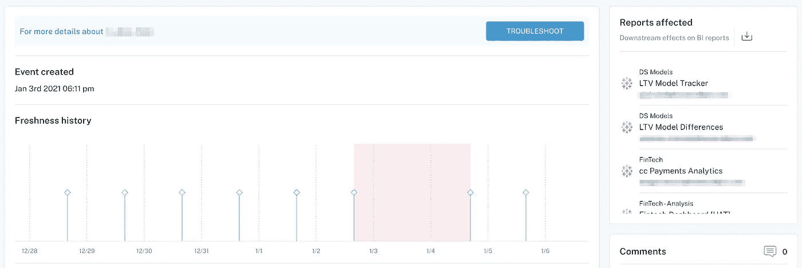
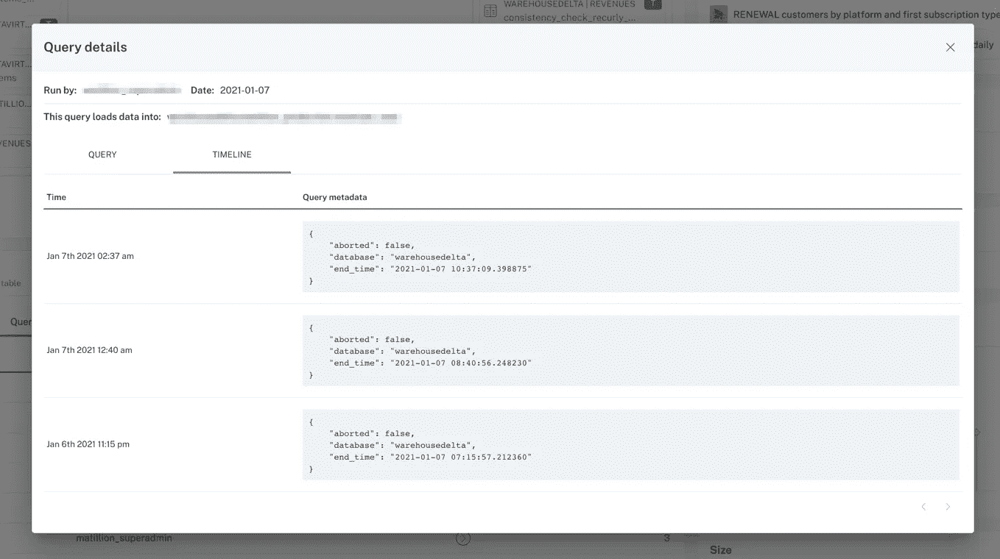

# 如何防止完好管道中的坏数据

> 原文：<https://towardsdatascience.com/data-engineering-101-how-to-prevent-data-downtime-c09a022aa6ff?source=collection_archive---------34----------------------->

## 你应该考虑的 3 个策略

图片由 [Shutterstock](http://www.shutterstock.com) 上的 RT Images 提供。

*对于数据团队来说，破损的数据管道、陈旧的仪表板和凌晨 5 点的消防演习是家常便饭，尤其是当数据工作流从不同来源接收越来越多的数据时。从软件开发中汲取灵感，我们把这种现象叫做* [***数据宕机***](https://www.montecarlodata.com/the-rise-of-data-downtime/)**——但是我们如何才能主动预防坏数据在第一时间来袭呢？**

*最近，我的一个客户提出了这个问题:*

> *“您如何防止数据停机？”*

*作为一家拥有 3000 名员工的媒体公司的数据主管，他的团队负责每天向数百名利益相关方提供数 TB 的数据。考虑到数据移动的规模和速度，[数据宕机](/the-rise-of-data-downtime-841650cedfd5)，换句话说，数据全部或部分丢失、出错或不准确的时间段，是一个非常常见的现象。*

*一次又一次，营销部门(或运营或销售或任何其他使用数据的业务职能部门)的某个人注意到他们的 Tableau 仪表板中的指标看起来不对，伸出手来提醒他，然后他的团队停止了他们正在做的任何事情来解决问题。在这个过程中，他的利益相关者**失去了对数据的信任**，宝贵的**时间和资源被**从实际建设中转移出来，以扑灭这一事件。*

*也许你能理解？*

# *数据停机时间的增加*

*从制造业中的预防性维护到软件工程中的错误监控(排队可怕的 404 页……)，防止停机的想法是许多行业的标准做法，这些行业依靠正常运行的系统来运行业务。*

*然而，许多吹嘘其数据驱动资质的公司并没有投资于防止管道破裂或在数据流向下游之前识别低质量的数据。他们不是主动应对数据停机，而是被动应对，用坏数据玩打地鼠游戏，而不是专注于在第一时间防止数据停机。*

*幸运的是，还有希望。一些最具前瞻性的数据团队已经开发出了最佳实践，可在您的首席执行官有机会提出一个可怕的问题之前，防止数据宕机，并阻止管道破裂和仪表盘不准确。!"*

***下面，我分享 3 个关键步骤，你可以采取这些步骤来防止坏数据破坏你的** [**好管道**](/good-pipelines-bad-data-e55d9ba17920) :*

# *1.测试你的数据。并进一步测试你的数据。*

**

*对于大多数数据团队来说，测试是抵御坏数据的第一道防线。*承蒙* [*阿诺弗朗西斯卡*](https://unsplash.com/photos/f77Bh3inUpE) *上*[*Unsplash*](https://unsplash.com/)*。**

*2021 年，数据测试就是表赌注。*

*就像软件工程师对他们的代码进行单元测试一样，数据团队应该通过端到端的测试来验证他们的数据。测试的核心是帮助您衡量您的数据和代码是否如您所想的那样运行。*

*模式测试和自定义固定数据测试都是常见的方法，可以帮助确认您的数据管道在预期的场景中正常工作。这些测试寻找警告信号，如空值和参照完整性，并允许您设置手动阈值和识别可能指示问题的异常值。当以编程方式应用于管道的每个阶段时，数据测试可以帮助您在问题变成数据灾难之前检测和识别问题。*

# *2.了解数据沿袭和下游影响*

**

**字段和表级沿袭可以帮助数据工程师和分析师了解哪些团队正在使用受上游数据事件影响的数据资产。图片由巴尔·摩西提供。**

*通常，数据宕机是无意更改的意外后果，远离依赖数据资产的最终消费者，而数据团队的成员甚至都不知道。这是糟糕的数据谱系的直接结果——我称之为 [**“你在用那个表？!"**](https://www.montecarlodata.com/how-to-solve-the-youre-using-that-table-problem/) 问题。*

*简而言之，数据血统是数据上游和下游依赖性的端到端映射，从摄取到分析。数据沿袭使数据团队能够理解每个依赖项，包括哪些报告和仪表板依赖于哪些数据源，以及在每个阶段发生了哪些特定的转换和建模。*

*当数据沿袭被整合到您的平台中时，尤其是在字段和表级别，任何更改的所有潜在影响都可以被预测，并在数据生命周期的每个阶段传达给用户，以抵消任何意外的影响。*

*虽然下游血统及其相关的业务用例很重要，但也不要忽视了解哪些数据科学家或工程师正在访问仓库和湖泊级别的数据。在他们不知情的情况下推动变更可能会中断耗时的建模项目或基础设施开发。*

# *3.优先考虑元数据，并像对待元数据一样对待它*

**

**当应用于特定用例时，元数据可以成为解决数据事件的强大工具。图片由巴尔·摩西提供。**

*在防止数据停机方面，沿袭和元数据是相辅相成的。作为沿袭实践的一部分，标记数据允许您指定数据的使用方式和使用人，从而减少误用或损坏数据的可能性。*

*然而，直到不久前，元数据还被视为那些你发誓有一天会用到的空亚马逊盒子——被囤积起来，很快就被遗忘了。*

*随着公司投资于更专业的数据工具，越来越多的组织意识到元数据在日益复杂的技术堆栈中充当无缝连接点，确保您的数据在每个解决方案和管道阶段都是可靠和最新的。元数据尤其重要，它不仅有助于了解哪些消费者受到数据停机时间的影响，而且有助于了解数据资产是如何连接的，以便数据工程师能够更好地协作并快速解决可能发生的事件。*

*当[元数据根据业务应用](https://www.montecarlodata.com/data-teams-your-metadata-is-useless/)进行应用时，您将深入了解您的数据如何推动公司其他部门的洞察和决策。*

# *数据停机的未来*

**

*强大的端到端沿袭使数据团队能够跟踪其数据流，从接收、转换和测试，一直到生产、合并转换、建模和流程中的其他步骤。图片由巴尔·摩西提供。*

*那么，在实现我们的无数据停机世界的梦想时，这给我们留下了什么？*

*嗯，就像死亡和税收一样，数据错误是不可避免的。但是，当元数据被划分优先级，沿袭被理解，并且两者都被映射到测试和可观察性时，对您的业务的负面影响— [数据停机的真实成本](/how-to-calculate-the-cost-of-data-downtime-c0a48733b6f0) —在很大程度上是可以预防的。*

*我预测数据停机的未来是黑暗的。这是件好事。我们越是能够防止数据停机带来的麻烦和消防演习，我们的数据团队就越是能够专注于项目，以可信、可靠和强大的数据推动业绩和业务向前发展。*

****有一些数据宕机的故事分享吗？我洗耳恭听。联系*** [***巴尔摩西***](https://www.linkedin.com/in/barrmoses) ***或*** [***蒙特卡洛团队***](http://www.montecarlodata.com) ***，并参加我们的*** [***下一次数据可观测性网络研讨会***](https://my.demio.com/manage/event/328722) ***。****