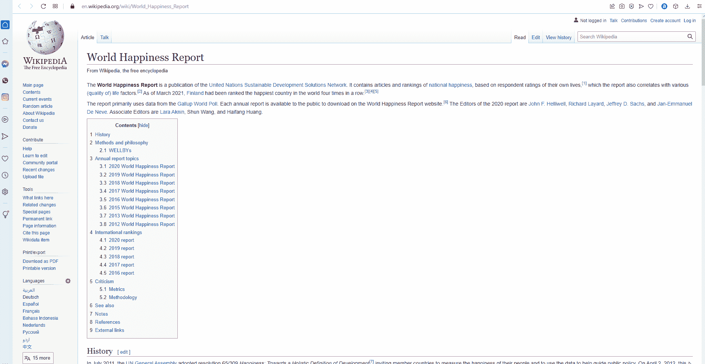
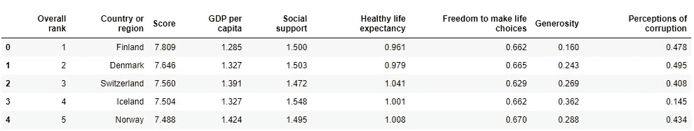
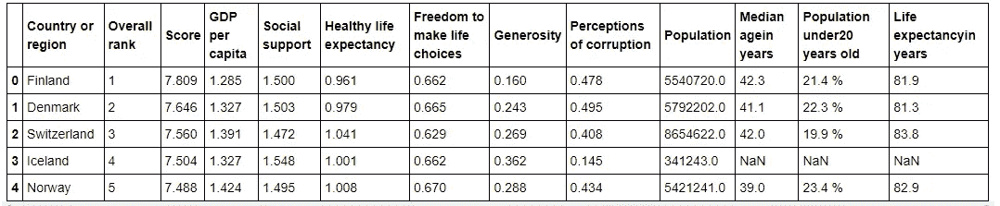
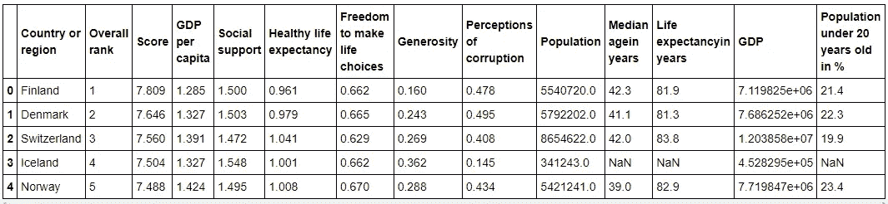

# 数据工程:创建自己的数据集

> 原文：<https://towardsdatascience.com/data-engineering-create-your-own-dataset-9c4d267eb838?source=collection_archive---------10----------------------->

## 如何使用 Python 和提取转换加载管道创建自己的数据集

伊恩·巴塔格利亚在 [Unsplash](https://unsplash.com?utm_source=medium&utm_medium=referral) 上拍摄的照片

# 介绍

你是一名机器学习工程师还是一名数据科学家，你想在数据集上应用机器学习(ML)，而数据集目前并不存在？或者你是一名数据工程师，你的工作是创建一个数据集，以便机器学习工程师和数据科学家可以将这个数据集转化为你公司的商业价值？在这两种情况下，您应该熟悉提取-转换-加载(ETL)管道。

ETL 是一个允许您从各种来源提取数据，根据您的要求转换数据，并最终将其加载到您选择的数据库或数据格式中的过程。

在本文中，我将向您展示一个 ETL 管道的例子。我想创建一个小型数据集，其中包含所有国家的幸福数据、关于人口数量和国内生产总值的数据，以及每个国家的平均年龄。

作为编程语言，我使用 Python。我从维基百科搜集幸福值，从 Rapid API 搜集每个国家的人口数据，从另一个网站搜集平均年龄。然后，我将这些数据集组合在一起，并对数据集中存储的数据类型和数值应用一些转换。最后，我将数据集加载到一个 CSV 文件中，这样它就可以被机器学习工程师加载。

你可以在我的 Github 库[这里](https://github.com/patrickbrus/Medium_Notebooks/tree/master/Build_ETL_Pipeline)找到完整的 Jupyter 笔记本。我使用 Python 中的 BeautifulSoup 包和 request 包从不同的网站和 API 中抓取数据。

# 提取

现在让我们从管道的第一部分开始，从不同的来源提取数据。作为第一步，我从维基百科收集快乐数据。代码 1 显示了从 Wikipedia 链接中提取完整的 html 数据，然后使用 BeautifulSoup 从提取的 html 数据中获取幸福表的代码。

代码 1: Python 代码，用于从维基百科抓取快乐数据，并将其存储在熊猫数据框中。

在第 8 行，请求包用于从提供的 Wikipedia 链接中获取 html 数据。在第 14 行，创建了 BeautifulSoup 对象，并将原始 html 数据作为输入传递。在第 17 行中,“find_all”函数用于获取所有带有 html 类“wikitable”的表。Gif 1 展示了如何检查一个网站的元素，以获得您感兴趣的表的类别。

Gif 1:这个例子展示了如何检查一个 html 对象来获取 html 类。可以通过右键单击对象，然后选择“检查元素”选项来检查 Html 对象。

Code1 的剩余部分将 html 表转换成 Pandas 数据框。

图 1 显示了这个数据框的头部，它包含了 153 个国家的幸福数据。

图 1:世界幸福数据框头部。

下一步，使用 Rapid API 中的 [this](https://rapidapi.com/aldair.sr99/api/world-population/) API 获取每个国家的人口数据。Rapid API 还提供了一些关于如何从该 API 获取数据的示例 Python 代码。代码 2 显示了从这个 API 获取数据并将其附加到幸福数据帧的代码。

代码 2:通过从 Rapid API 提取数据来获取幸福数据集中每个国家的人口数据的代码。tqdm 包用于在执行 for 循环时获取进度条。

不幸的是，五个国家的人口数字不见了。这些现在可以从互联网上的其他来源加载，但这不是在这个小项目的上下文中完成的。

下一步，通过抓取世界数据网站来加载每个国家的平均年龄，可以在这里找到。再次检查感兴趣的表，以便获得正确的 html 类。代码 3 显示了获取数据并将其存储在数据帧中的完整代码。

代码 3:用于从 worlddata 网站提取每个国家的平均年龄数据并将其存储在 Pandas 数据框中的代码。

这个数据集只包含 116 个不同国家的数据，而幸福数据集包含 153 个国家的数据。同样，人们也可以从不同的来源提取缺失国家的数据，但在这个小项目中没有这样做。

现在，作为提取过程的最后一步，幸福数据框和包含每个国家平均年龄的数据框被合并成一个大数据框(代码 4，图 2)。

代码 4:连接数据框以创建一个大的数据框。

图 2:提取管道步骤结束时的数据帧头。

# 改变

现在让我们从 ETL 管道的第二部分开始，转换步骤。在转换步骤中，您通常会调整数据格式以满足您的需求，或者将列组合到新功能中。数据集准备得越好，机器学习工程师之后要做的工作就越少。在这个项目中，我决定添加一个包含每个国家 GDP 的列。这可以通过将“人均国内生产总值”和“人口”两栏相乘来计算。作为第二个转换步骤，我通过删除百分号并将字符串转换为浮点数，将列“20 岁以下人口”转换为浮点数。代码 5 显示了这些转换的代码，而图 3 显示了最终转换后的数据帧的头部。

代码 5:转换管道步骤的代码。计算 GDP 并将其添加到数据框中，20 岁以下人口列被转换为 float 类型。

图 3:应用转换后数据帧的最终状态。

# 负荷

加载步骤是 ETL 管道的最后一步。在加载步骤中，最终数据集被加载为预期的存储格式。这可以是数据库、CSV 文件或许多其他存储类型之一。我决定将这个数据集存储在一个 CSV 文件中。这可以很容易地加载到机器学习中。代码 6 显示了最后一个管道步骤的代码。

代码 6:将最终数据集加载到 CSV 文件中。

# 结论

在本文中，我通过使用几个不同的数据源创建了一个小型数据集，并将数据组合成一个数据集。我演示了 ETL 管道的样子，并为每个管道步骤添加了代码。数据集现在可用于进一步分析。

谢谢你把我的文章看完！我希望你喜欢这篇文章和我参与的项目。如果你想在未来阅读更多类似的文章，请关注我，保持更新。