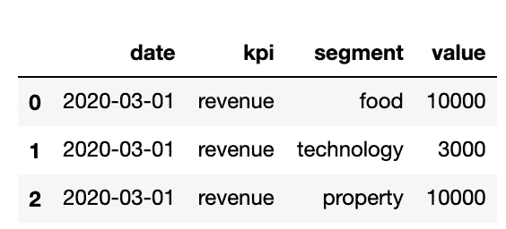
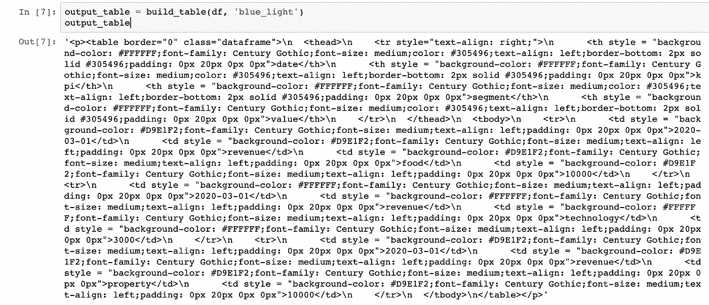
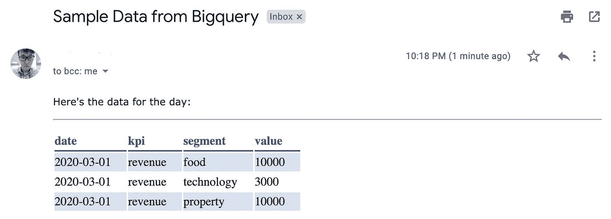
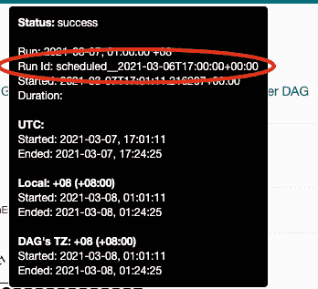

# 数据工程——使用 Apache Airflow 的 Google Bigquery 到漂亮的电子邮件模板

> 原文：<https://towardsdatascience.com/data-engineering-google-bigquery-to-pretty-email-templates-using-apache-airflow-4798b4caa3f5?source=collection_archive---------26----------------------->

## 从你的数据仓库到电子邮件


Solen Feyissa 在 [Unsplash](https://unsplash.com?utm_source=medium&utm_medium=referral) 上拍摄的照片

大家好。
作为数据从业者，我们经常需要将数据交付给需要它的人。
随着时间的推移，在数百个特别请求和 SQL 查询之后，您很快就会意识到这些请求中有许多是相似的，并且可以**自动化**。

与此同时，以 excel 文件形式附加数据的传统方式已经过时了。现在是 2021 年，是时候想出创新的方法来显示你的数据了。

你有没有想过从你的**数据仓库**中提取一些数据，并通过**电子邮件**发送出去，同时让整个过程自动化？

我正好有适合你的东西。

今天，我们将使用 **Apache Airflow** 来自动化整个过程，同时保持数据的美观。

# 先决条件

我们将使用**熊猫**来转换数据。
我在这里 写了关于熊猫 [**的基础知识，涵盖了你需要了解的关于处理数据的主要概念。**](/python-for-data-science-basics-of-pandas-5f8d9680617e)

</python-for-data-science-basics-of-pandas-5f8d9680617e>  

然后我们将使用**阿帕奇气流**使整个过程自动化。Airflow 是数据工程师用来有效管理和监控其自动化任务的工作流管理系统。我碰巧在这里 写了一篇关于在 Apache Airflow [**上构建第一个管道的综合指南。**](/data-engineering-basics-of-apache-airflow-build-your-first-pipeline-eefecb7f1bb9)

</data-engineering-basics-of-apache-airflow-build-your-first-pipeline-eefecb7f1bb9>  

对于这个例子，我们将使用 **Google Bigquery** 作为我们的数据仓库，因为这是我目前正在使用的。但是，要理解数据可以从任何数据仓库中提取出来，并以类似的方式进行操作。

让我们写一些代码。


克里斯托弗·高尔在 [Unsplash](https://unsplash.com?utm_source=medium&utm_medium=referral) 上拍摄的照片

# 安装和导入

```
#installing libraries
pip install google-cloud
pip install pretty-html-table
pip install pandas-gbq
pip install pandas#importing libraries
import google.cloud.bigquery as bq
import pandas as pd
import pandas_gbq
from pretty_html_table import build_table
from airflow.utils.email import send_email
```

## 熊猫-gbq

Pandas-gbq 是一个包，提供了从 Pandas 到 Google BigQuery API 的接口。它允许我们从 Bigquery 中提取数据，并通过一行代码将其导入到我们的 Pandas DataFrame 中。如果你没有使用 Google BQ，如果你的数据仓库有 pandas 连接器，可以做一个快速搜索。

## 漂亮的 html 表格

Pretty-HTML-table 允许我们在一个漂亮的 HTML 表格中显示我们的熊猫数据帧。这个表格整洁美观，非常适合显示任何类型的汇总数据。

# 获取数据

使用 Google Bigquery 作为我们的数据仓库。

```
query = """SELECT * from sample_table"""
project_id = <your google cloud project id>
df = pandas_gbq.read_gbq(query, project_id=project_id)#process your data here
```

下面是我们的示例数据，用于演示目的。



作者图片

请注意，在继续之前，您可以在这里进行任何类型的数据处理。

# 美化桌子

在这里，我们将数据转换成一个漂亮的 HTML 表格。

```
output_table = build_table(df, 'blue_light')
```

如果你打印‘output _ table’，它会显示一堆 HTML 代码——



作者图片

它在邮件中实际上看起来是什么样的——



作者图片

这个库把你的熊猫数据帧和**转换成一个 HTML 编码的表格**，这在电子邮件中看起来更顺眼。因此，当您遇到一堵无法阅读的代码墙时，不要感到惊讶。

wolfentertainment.com[gif](http://wolfentertainment.com/)

我在这里使用“蓝光”主题。可用主题的完整列表可以在库的 [**PYPI 文档**](https://pypi.org/project/pretty-html-table/) 中找到。

# 准备电子邮件内容

既然我们已经准备好了数据。
是时候**创建并发送我们真正的电子邮件了。**

```
#creating email content
html = '<!DOCTYPE html><html><p style="font-family:verdana">'
html += """Here's the data for the day: """
html += '<hr>'
html += output_table
html += '</p></html>'#defining receivers and subject
email_subject = 'Sample Data from Bigquery'
email_to = <receivers>
email_content = html
send_email(email_to, email_subject, email_content)
```

现在可以发送电子邮件了。就这么简单。

# 设计气流操作器

现在我们已经完成了代码，下一步是将它们组合成一个**气流操作符**，这样我们就可以自动完成这项工作。我们可以确定哪些变量要作为**实例变量传入。**

出于演示的目的，我选择了 query、receivers 和 Pretty-HTML-Table 主题作为实例变量，只是为了好玩。

创建操作符时要注意的主要变量是 **execution_date** 。这个变量表示 airflow UI 中的执行日期，不会被运行日期弄错。



作者图片

我们可以用**执行日期**替换查询中的日期，这样我们的作业在每次运行中只提取当天的数据。让我们在 **DAG** 里做吧。

# 设计气流 Dag

最后一步是写入**气流 Dag** 。这就是我们定义的—

*   什么时候运行作业？
*   我们多久运行一次作业？
*   我们什么时候正式开始工作？

通过使用上面的示例，我们已经将管道设置为从 2021 年 3 月 7 日**开始，每天在
上午**10 点**运行。**我们还将查询设置为只提取当天的数据。

和..差不多就是这样！
现在坐下来，监控你工作中的错误。

# 结论


安东尼·福明在 [Unsplash](https://unsplash.com?utm_source=medium&utm_medium=referral) 上的照片

## 恭喜

如果你已经走了这么远，给自己一点鼓励。
在这篇文章中，我们谈到了—

*   从 Google Bigquery 中提取数据
*   将它转换成一个漂亮的 HTML 表格
*   创建电子邮件的内容
*   将一切组合成一个气流算子
*   设计 DAG 以自动化作业

现在走吧。建立你的管道并与我分享。
我在等。

> 数据是一种珍贵的东西，它将比系统本身持续更久——万维网的发明者蒂姆·伯纳斯·李。

# 订阅我的时事通讯，保持联系。

也可以通过 [**我的链接**](https://nickefy.medium.com/membership) 注册一个中等会员来支持我。你将能够从我和其他不可思议的作家那里读到无限量的故事！

我正在撰写更多关于数据行业的故事、文章和指南。你绝对可以期待更多这样的帖子。与此同时，你可以随时查看我的其他 [**文章**](https://medium.com/@nickmydata) 来暂时填补你对数据的渴望。

***感谢*** *的阅读！如果你想和我联系，请随时通过 nickmydata@gmail.com 联系我或者我的* [*LinkedIn 个人资料*](https://www.linkedin.com/in/nickefy/) *。也可以在我的*[*Github*](https://github.com/nickefy)*中查看之前写的代码。*