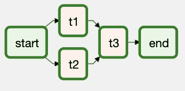
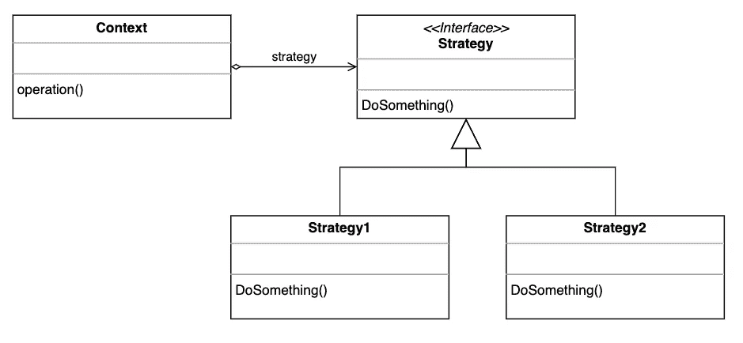
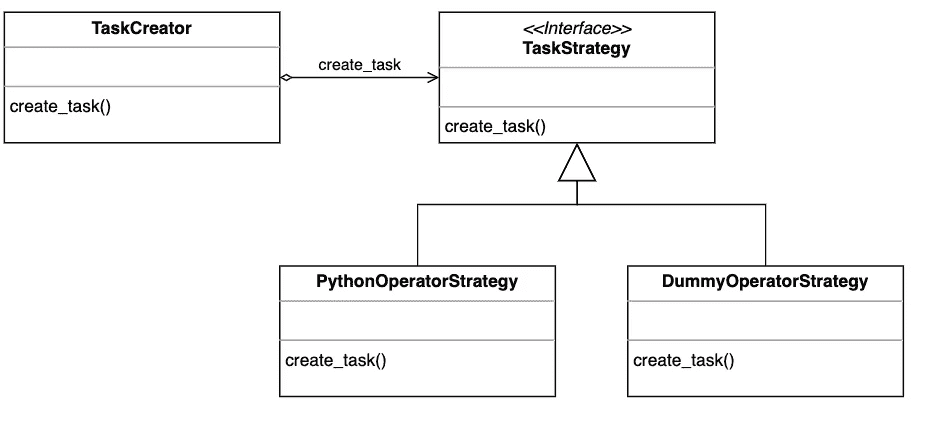

# 数据工程师不应该写气流图——第二部分

> 原文：<https://towardsdatascience.com/data-engineers-shouldnt-write-airflow-dags-part-2-8dee642493fb?source=collection_archive---------8----------------------->

## 阿帕奇气流的框架建议

理查德·霍瓦特在 [Unsplash](https://unsplash.com?utm_source=medium&utm_medium=referral) 上的照片

这是关于为什么**数据工程师不应该写气流 Dag**的第二篇文章。在这篇新文章中，我们将介绍一个针对 Apache 气流的框架 **提案****。**

本文旨在阐明构建框架如何帮助您解决一些与 DAG 编写相关的问题。

在这篇新文章中，我将对第一部分做一个简短的回顾。所以，没必要看。尽管如此，如果你想对我在这一篇中要阐述的东西有更详细的解释，你应该考虑读一读。

 [## 数据工程师不应该写气流图——第 1 部分

towardsdatascience.com](/data-engineers-shouldnt-write-airflow-dags-b885d57737ce) 

# 为什么数据工程师不应该写 Dag

正如我在第一篇文章中提到的，数据工程师的工作不是编写 ETL。数据工程师的工作是**编写可靠的、可伸缩的、可维护的代码**。

数据工程师不应该为了写 Dag 而写 Dag。如果数据工程师专注于概括和抽象事物，而不是编写简单的 Dag，他们的技能可以得到更好的利用。

DAG 写入有两个主要问题:

*   这是一个重复的过程。违反了[干](https://en.wikipedia.org/wiki/Don%27t_repeat_yourself) ( *不重复自己*)的原则。如果处理不当，最终会产生大量重复且不可维护的代码。
*   对于那些没有专业知识的人来说，这可能很难做到。当这种情况发生时，数据工程师就成了为其他人写 Dag 的人。这不一定是坏事，但我们可以做得更好。

我相信你可以遵循几个原则来缓解这两个主要问题:

*   尽可能使用[动态 Dag](https://www.astronomer.io/guides/dynamically-generating-dags)来生成你的 Dag。坚持干原则是个好办法。
*   通过使用面向对象编程(OOP)和设计模式来改进您生成动态 Dag 的方式。如果处理得当，它可以提高代码的可维护性。
*   构建允许人们与他们的 Dag 交互的界面。作为一名数据工程师，你的工作不是为别人写 Dag。你的工作是授权给人们，让他们可以写自己的 Dag 并与他们互动。

这些原则帮助我们解决了上述问题。我们用它们建立了一个处于早期阶段的框架。但是，它被证明是有用的。

在下一节中，我们将介绍我们的框架提案，称为 ***Castor*** *—* ，在西班牙语中代表 *beaver* 。我们希望这个框架能够为我们如何更好地使用 Apache Airflow 提供一些启示。

该框架允许使用**一种更为** [**的声明性**](https://www.thoughtworks.com/radar/techniques/declarative-data-pipeline-definition) **方法**来定义数据管道。而不是由 DAG 编写强制执行的命令式方法。我们相信**声明式数据管道是数据管道的未来。**

# castor:Apache 气流的框架提案

想象一下，编写 DAG 就像编写一个简单的配置文件一样简单。该配置文件将为您做一切。你只需要指定你想做的事情，剩下的事情会由其他的事情来处理。

这就是我们在编写框架时试图实现的目标， *Castor* 。我们希望简化 DAG 的编写，这样就像编写配置文件一样简单。但是，我们也想解决这两篇文章中已经提到的问题。

为此，我们结合了动态 Dag、OOP 和软件设计模式，并构建了 *Castor* 。我们通过构建和使用该框架获得的一些好处是:

*   它帮助我们标准化了使用 Dag 的方式。因此，团队中的每个人都在同一页上。因为每个人都知道框架，所以移交很容易完成。当你不得不把一个进程交给别人的时候，你传递配置文件，就是这样。配置文件比 DAG 代码更容易阅读和理解。
*   几乎所有的 Dag 都是由相同的代码行生成的。因此，如果我们想引入一个变化，我们在一个文件中做，这适用于项目的其余部分。我们不必在 10 或 20 个文件中做同样的更改。
*   我们使用设计模式来获得某种程度的代码解耦，这让我们感到安全。引入新功能现在更容易了。就像贬低他们一样。
*   因为编写 DAG 就像编写配置文件一样简单，所以几乎任何人都可以做到。通过这种方式，我们使数据分析师和数据科学家能够编写他们自己的 Dag，而不必沾染 Airflow 编程风格。

我们的框架包括 5 个组件:*配置文件、DAG 工厂、任务创建器、任务策略和操作符工厂*。

## 配置文件

配置文件是生成 Dag 的方式。你基本上指定你想在你的 DAG 中是什么，就是这样。

以一个有 5 个任务的简单 DAG 为例。这两个任务中的两个是[虚拟操作员](https://airflow.apache.org/docs/apache-airflow/stable/_api/airflow/operators/dummy/index.html)用*开始*任务和*结束*任务使 DAG 看起来漂亮。其他 3 个任务就是 [PythonOperators](https://airflow.apache.org/docs/apache-airflow/stable/_modules/airflow/operators/python.html#PythonOperator) 做你想做的任何事情——数据提取、数据转换等等。这是它在 Airflow UI 上的样子。

来自 Airflow UI 的 DAG 示例—作者制作的插图。

如果您想采用传统的方法，您可以为 DAG 编写代码，仅此而已。但是，如果您使用更具声明性的方法，这就是使用 YAML 配置文件的样子:

接口获取配置文件，并将其传递给框架的其他*组件*。此类组件根据您的请求获取文件并构建 DAG。

## 达格工厂

DAG 工厂只是[工厂方法模式](https://en.wikipedia.org/wiki/Factory_method_pattern)的一个实现。

DAG 工厂的责任不仅仅是创建 DAG。但是，要确保 Dag 的*任务*是根据配置文件中声明的依赖关系正确创建的。为此，它使用了 ***任务创建器*** 。

代码看起来是这样的

## 任务创建者和任务策略

这是魔法开始的地方。任务创建者和任务策略是[策略模式](https://en.wikipedia.org/wiki/Strategy_pattern)的实现。

如果你对*策略模式*一无所知，这里有它的 UML 图。

战略模式 UML 图—作者基于[ [1](https://refactoring.guru/design-patterns/strategy) ]所做的图解

基本上，你有一个接口(*策略*)来声明子类应该实现什么。然后，一个*上下文*类通过接口与这些子类进行交互。

这是一个有趣的模式，因为您用组合代替了继承。此外，它遵循[开闭原理](https://en.wikipedia.org/wiki/Open%E2%80%93closed_principle)。因此，你可以添加新的策略，而不必改变*的背景。*如果你想了解更多关于这个图案的信息，请查看[这个](https://refactoring.guru/design-patterns/strategy)以获取更多信息。

在 *Castor* 的上下文中，我们使用策略模式来创建任务。创建气流任务的方法之一是使用气流操作符。所以，按照这种模式，你基本上有尽可能多的策略*和你想使用的操作符*。

首先，我们只实现了两个策略:python operator strategy*和 dummy operator strategy*。这就是 UML 图的样子。**

****

**策略模式的 Castor 实现——作者举例说明**

**这里的要点是**你应该** **编码你想使用的策略，然后忘记它们。**你不必在生活中手动创建另一个气流任务。**

## **操作员工厂**

**最后，我们有操作符工厂。这是工厂方法模式的另一个实现。我个人喜欢 Operator Factory，因为在从 Airflow 1.10 迁移到 2.0 的过程中，我没有一个这样的工厂。**

**很简单。如果你在你的项目中到处使用气流操作符，如果操作符改变了，你注定要对项目做很多改变。**

**让我告诉你它看起来怎么样，因为我们已经做到了。我们的项目中有很多使用 KubertenesPodOperators 的文件。假设有 10 到 20 个文件。**

**在我们迁移到 2.0 之后，我们意识到 KubernetesPodOperator 发生了变化。以下是一些改变了的东西:**

*   ****端口已经从列表[Port]迁移到列表[V1ContainerPort]****
*   ****env_vars 已从字典迁移到列表[V1EnvVar]****
*   ****资源已经从 Dict 迁移到 V1ResourceRequirements****
*   ****资源已经从 Dict 迁移到 V1ResourceRequirements****
*   **…点击此处查看变更的完整列表**

**迁移之后，一切都失败了。几个小时后，我们意识到这个问题与引入到 KubernetesPodOperator 中的变化有关。所以，我们修好了。但是，我们必须对使用 KubernetesPodOperator 的 20 个文件进行同样的修改。**

**这时我们意识到我们应该实现一个操作符工厂。我们将所有与气流操作员的互动都集中在那里。因此，如果想要与气流操作符交互，我们可以通过操作符工厂来实现。此外，如果我们必须引入变化，我们只在工厂里做，仅此而已。**

**实现非常简单。这是代码。**

# **最后的想法**

**在本文中，我们介绍了一个框架**提案**被称为**Castor。** 之所以这是一个提议，是因为**这个框架还没有做好生产准备**。它没有测试，是一种实验性的代码。**

**如果你想看的话，这里有 Github 回购。**

** [## castor-team/气流-castor

### 通过 YAML 文件构建气流 Dag 的框架。Castor 由四个模块组成:配置文件 DAG 工厂任务…

github.com](https://github.com/castor-team/airflow-castor) 

**本文的目的不是宣传我们的框架**。我们的目标是揭示如何更好地使用 Apache Airflow。在这种情况下，我们提倡使用更多的声明性数据管道，因为我们相信**它们是数据管道的未来。**

再一次，我想知道更多关于你的想法。

感谢阅读！

特别感谢[胡安·费利佩·戈麦斯](https://medium.jfgomez.me/)让这一切成为可能。** 

***如果你想随时更新我的作品，* ***请加入我的*** [***通迅***](https://metadatacommunity.substack.com/) ***！偶尔，我会和我的读者分享一些东西。如果你加入我会很感激的:)*****