# 数据探索+谷歌地球引擎作为我的本科论文

> 原文：<https://towardsdatascience.com/data-exploration-google-earth-engine-as-my-undergrad-thesis-531ac794dc9b?source=collection_archive---------23----------------------->

## 工程物理毕业前的最后一个项目总结

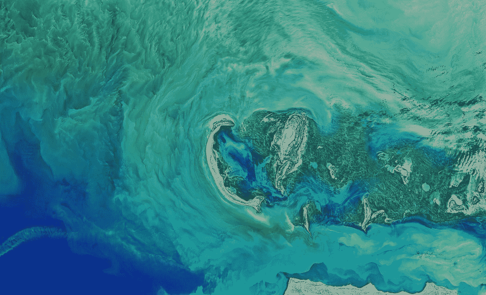

美国宇航局在 [Unsplash](https://unsplash.com?utm_source=medium&utm_medium=referral) 拍摄的照片

# 放弃

谷歌地球引擎没有赞助这个。我所想要的是给出我为我的本科论文项目所做的总体想法，并展示一些数据可视化。

# 介绍

我喜欢好奇，在不同的现象中寻找模式，并使用视觉来分享(并获得)知识或强调相关信息。(对我来说)数据科学领域涵盖了这些事情，不仅对重点问题产生了影响，而且有助于找到新的问题来解决。

我的本科论文题目是“*Herramientas estadísticas y computacionales en imágenes satelitales de Earth Engine para la explora ción de incindios forestes***”**，从西班牙语翻译成英语是“用于野火探测的地球引擎卫星图像中的统计和计算工具”。

## 为什么是野火？

野火是复杂的自然现象，超越了“世界变得越来越热”，它们包括了解环境的行为；文化、社会、环境、气候和其他类型的变量。我关注的是墨西哥的尤卡坦州。

Joanne Francis 在 [Unsplash](https://unsplash.com?utm_source=medium&utm_medium=referral) 上拍摄的照片

# 什么是谷歌地球引擎？

**谷歌地球引擎(GEE)** 或**地球引擎(EE)** 是一个基于云的平台，拥有庞大的数据目录。它使大规模卫星图像处理能够对与森林砍伐、地表温度变化、干旱等相关的地球表面进行不同的高影响分析。GEE 还旨在帮助研究人员轻松地与其他研究人员、非营利组织和公众分享他们的工作[1]。

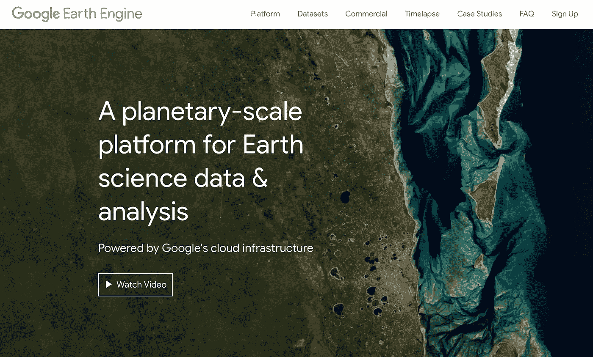

Google Earth Engine via[https://earthengine.google.com](https://earthengine.google.com)官方网页截图

为了提取数据并使用 GEE 的所有功能，用户必须使用一个或两个客户端库来访问 API: **JavaScript** 或 **Python** 。在我的特例中，我使用了 GEE Python API 原因如下:

*   我对这种编程语言的掌握比其他任何语言都好。
*   使用 GEE Python API 的一个优势是，借助于该领域中使用的库，如 NumPy、Pandas、Matplotlib、Scikit-Learn、GeoPandas 等，可以轻松集成到数据科学/分析工作流中；以及 Jupyter 笔记本中的开发和文档过程。
*   一些库方便了一些 GEE 对象的操作。我用过的有: [**eemont**](https://eemont.readthedocs.io/en/latest/) 和 [**geemap**](https://geemap.org/) 。两者都允许我执行各种操作，从操纵 GEE 对象到将 GEE 对象转换成熊猫。数据帧或 GeoPandas。地理数据框架对象。他们很容易得到一些变量的时间序列。

# 工作流程

像当今许多与数据相关的项目一样，这些阶段是:

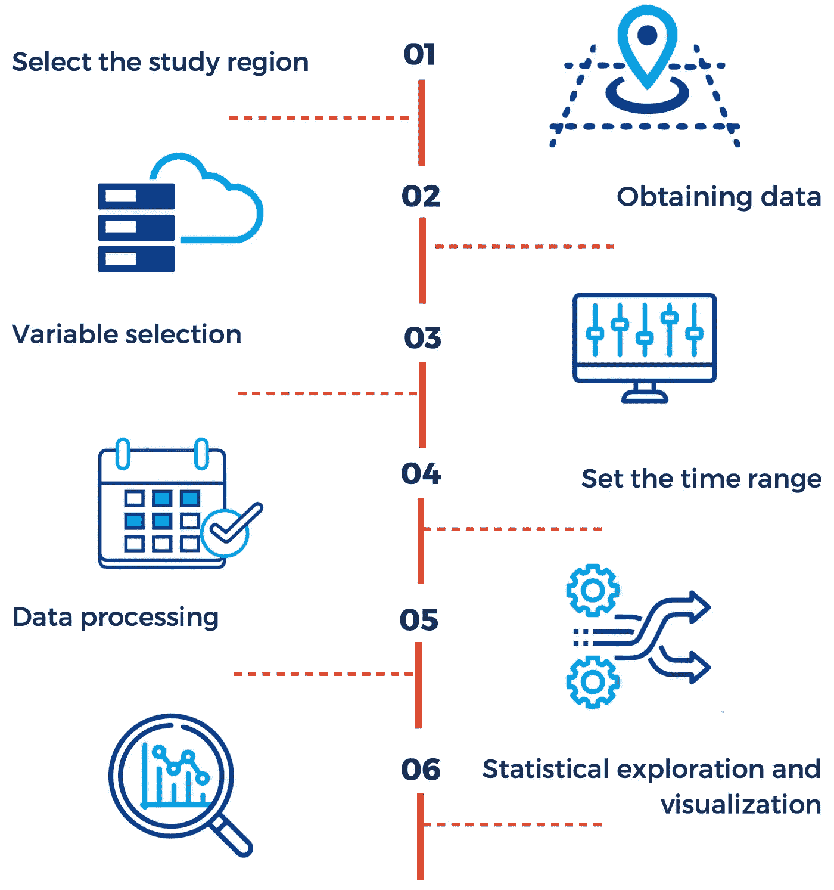

项目的工作流程。作者制作的图表。

# (主要)工具

我在整个项目中使用 Python，这里是我使用的库(在一个图像中)。

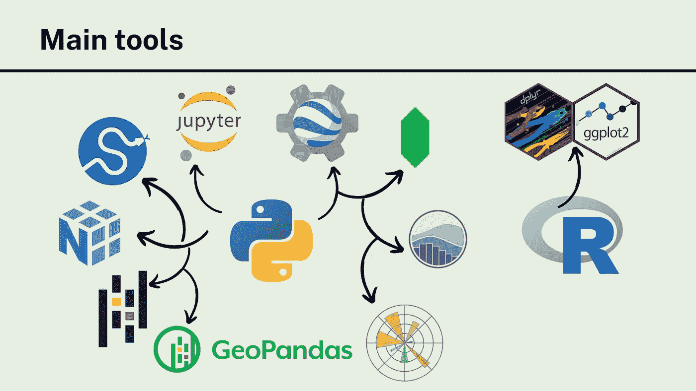

主要工具( **Python** 和 **R** )。图由作者制作。

# 数据

我使用了来自三个不同来源的数据集:

*   **2017 年森林火灾记录**:国家林业委员会提供
*   **热点记录(2001–2020)**:由公司提供(资源管理系统的火灾信息)。
*   **卫星图片收集**:GEE 提供(见上图)

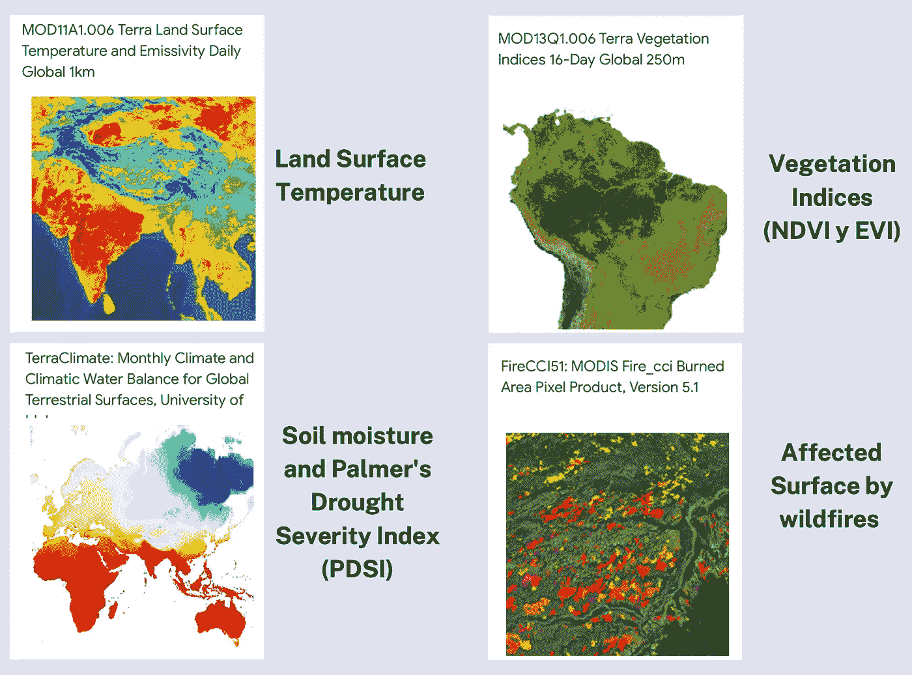

来自谷歌地球引擎的图片集。图由作者制作。

# 探索性数据分析

一幅图像胜过千言万语，所以我在下面的数据可视化中总结了第 6 章(名为*探索性数据分析*)。

## 热点聚集

在 2001 年到 2020 年间，置信水平高于 84%的高热点集中在该州的中部和东部。*(公司提供的数据)*

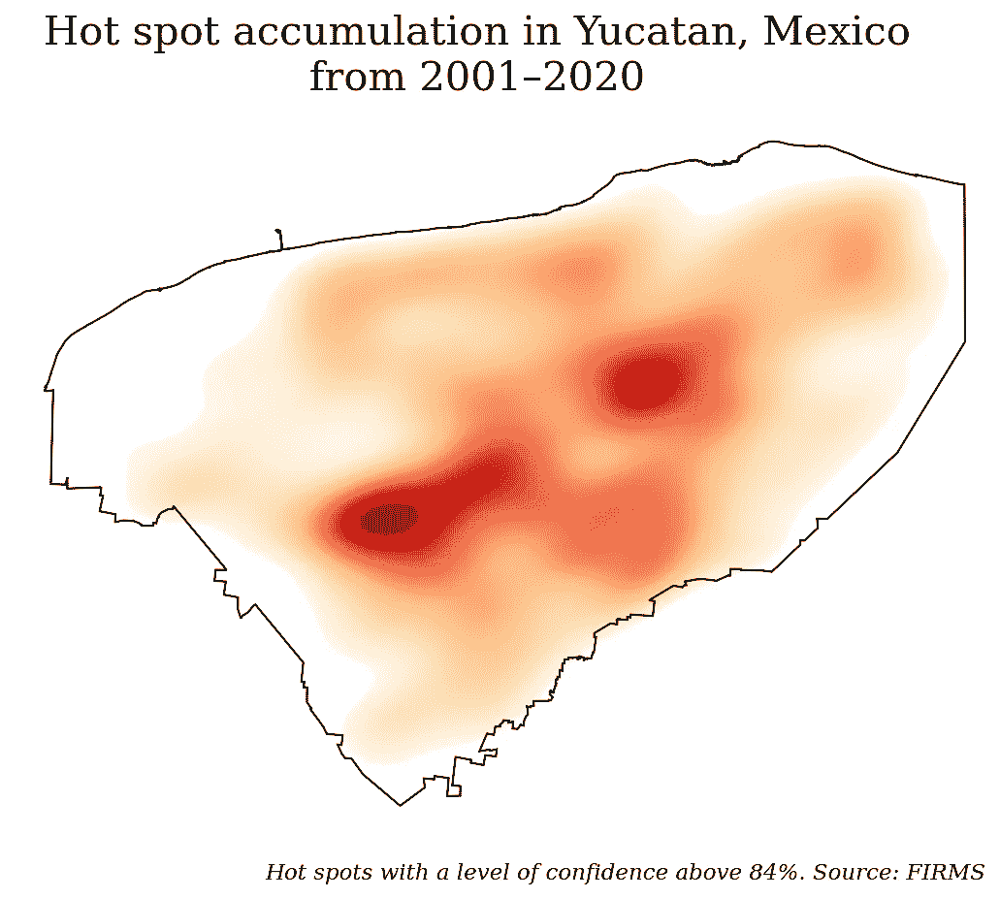

置信水平意味着观测实际上是火的置信水平。**作者制作的图**。

## 受影响的市(县)

虽然 Tekax 在 2017 年有最高的记录，但它没有最显著的受影响表面积；该市是 Tizimín 市*(国家林业发展委员会提供的数据)*

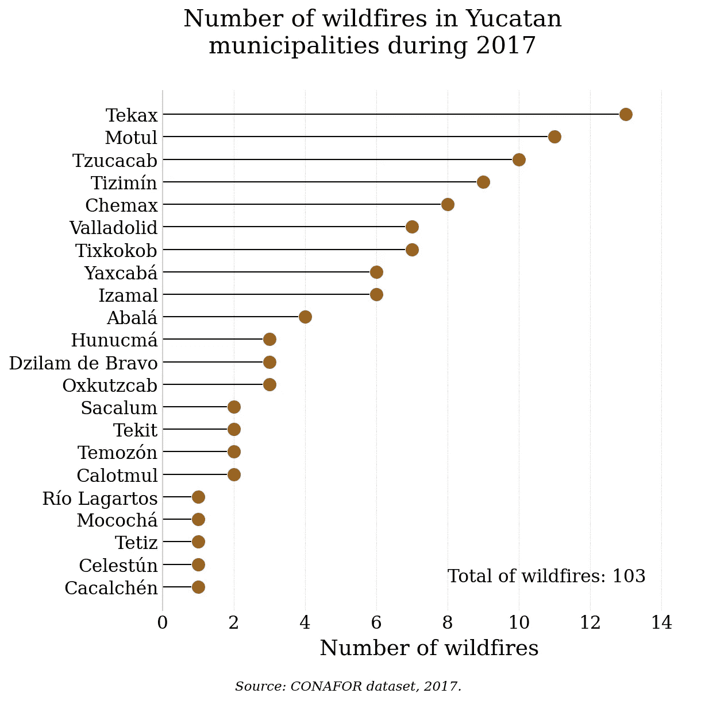

**作者制作的棒棒糖剧情**。

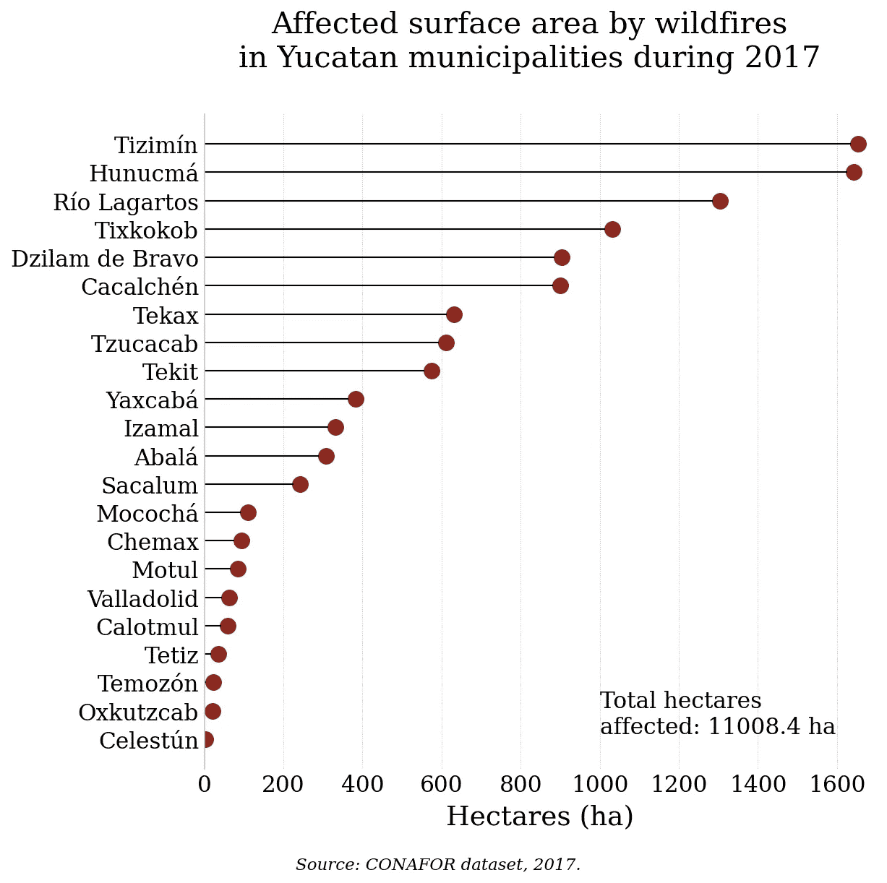

**作者制作的棒棒糖剧情**。

## 有问题的孕期

在国家森林委员会和公司数据集的帮助下，找到了野火发生率最高的月份。

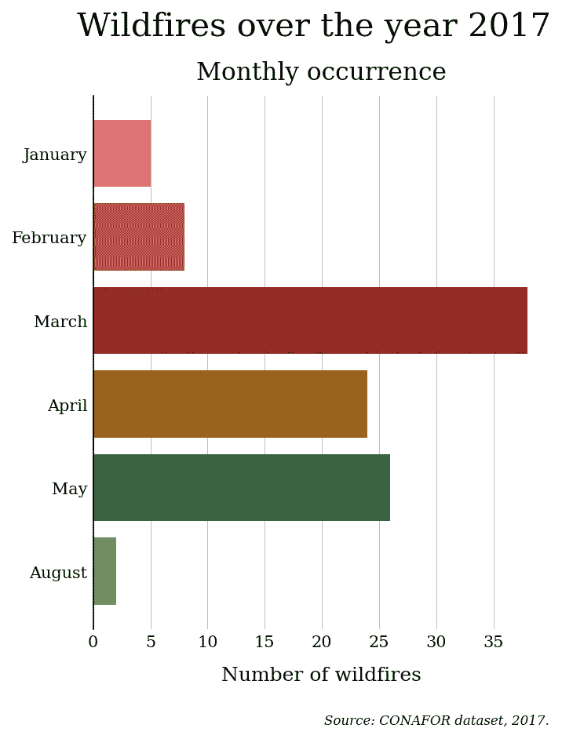

**作者做的条形图**。

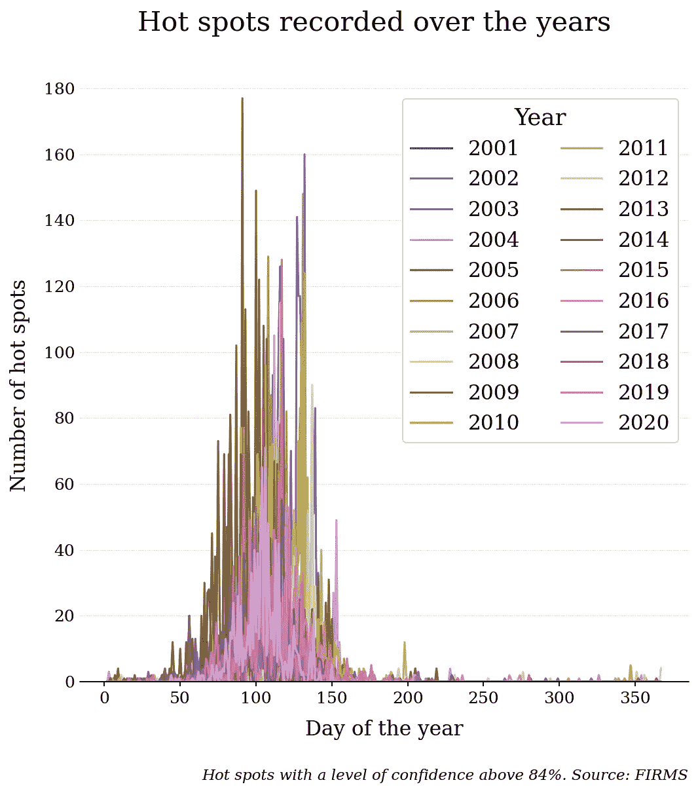

**作者做的时间序列**。

## 环境变量的时间序列

仅仅知道变量的数据分布是不够的。了解变量行为的历史以找到模式或相关时期是很重要的。

该图显示，三月、四月和五月是最热的月份；此外，2017 年是最干旱的一年(低土壤湿度和 PDSI)

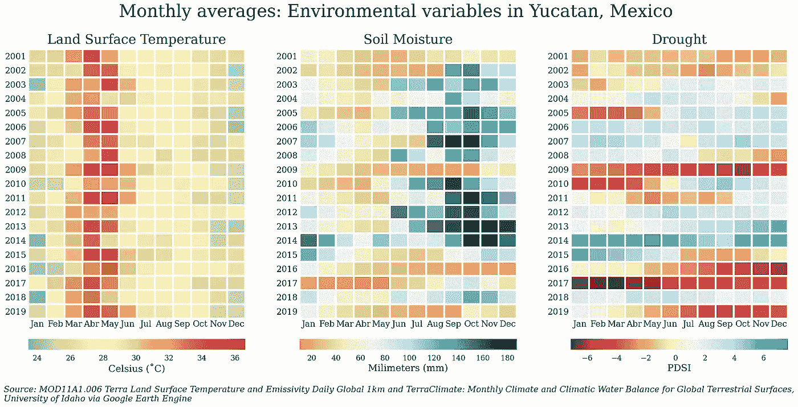

**作者制作的热图**。

## 交互式地图

多亏了**叶子**和**地图**，我可以在一个互动地图中可视化数据。下图显示了 2001 年至 2019 年期间受野火影响的表面以及时间范围内的地表温度。

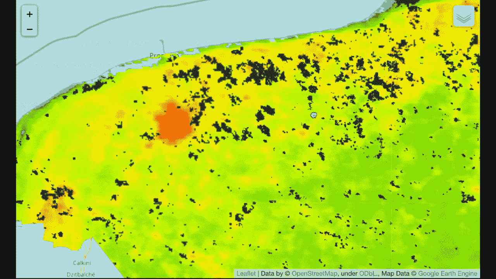

2001 年至 2019 年的地表温度和受野火影响的地表。由作者创建，用**叶子**和**谷歌地球引擎**数据制作的地图。

# 结论

Google Earth Engine 平台是一个信息丰富的工具，其开发环境(Google Earth Engine 代码编辑器)对没有高水平编程技能的用户以及通过其 Python API 在数据科学和分析领域有经验的用户来说是友好的。这一平台提供的机会不仅限于森林火灾，因为它可以涵盖不同的环境问题，如干旱、水供应、温室气体监测，甚至是社会问题，如人类住区及其如何影响生态系统。

# 更多信息

方法论的所有过程和对数据的探索都记录在 Jupyter 的笔记本上。这些笔记本位于 GitHub 存储库中。不幸的是，这个库是西班牙语的，但是如果你有任何问题，你可以联系我。

<https://github.com/isaacarroyov/thesis_undergrad>  

我在做这篇论文的时候，有机会参加了火生态学协会举办的**第九届国际火生态学与管理大会，并展示了一张海报。**因此，我创建了一个 GitHub 知识库，用英语提供类似的信息。

<https://github.com/isaacarroyov/2021_AFE_FireCongress09>  

# 关于我

我叫艾萨克·阿罗约，最近刚从工程物理专业毕业。我对数据科学、机器学习(尤其是无监督学习算法)及其在高影响力项目中的应用感兴趣。

你可以通过电子邮件((isaacarroyov@outlook.com)或社交媒体联系我，比如 LinkedIn (Isaac Arroyo)、insta gram(@ unisaakarroyov)或 Twitter(也可以是@ unisaakarroyov)。[点击这里联系我](https://linktr.ee/unisaacarroyov)。

# 参考

[1] Gorelick，n .，Hancher，m .，Dixon，m .，Ilyushchenko，s .，Thau，d .，和 Moore，R. (2017 年)。谷歌地球引擎:面向所有人的全球地理空间分析。环境遥感，202，18–27。