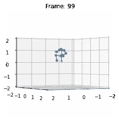

# 数据析取

> 原文：<https://towardsdatascience.com/data-extraction-b9ac0cb645b6?source=collection_archive---------29----------------------->

## 如何做

## 运动数据域(Mixamo FBX)


主页(按作者)

机器学习和深度学习模型的应用每天都在涌现，对于初学者来说，一个最重要的问题是:“从哪里开始？”作为数据科学领域的新人，mind 在诸如 NLP、计算机视觉或任何其他事物之间周旋。然而，任何 ML/DL 算法的应用都遵循相同的流程:数据提取、清理、模型训练、评估、模型选择、部署。这篇文章和其他文章没什么不同，但它是针对动画或医疗保健信息学领域的数据而策划的。

运动数据本质上是复杂的，因为它是一个分层链接的结构，就像一个图形，其中每个数据点或节点是一个关节，而到其他关节的链接或边是骨骼。骨骼和数据点的方向和位置描述了可能随着帧数的增加和捕获或模拟的对象改变其位置而变化的姿态。

为了不再浪费时间，我将从脚本本身开始。它分为几个步骤，但如果你愿意，你可以直接跳到下面 GitHub 链接中给出的脚本代码。

<https://github.com/RahhulDd/FbxToNpyConverter/blob/main/fbx2npy.py>  

# 数据采集

在进入下一步之前，我建议您下载一个示例 Mixamo。fbx)文件从下面提供的链接。将此文件放入“常规”文件夹。

  

我还在文件夹中提供了一个样本文件来测试给定的脚本。

# 数据处理

首先，我们导入以下库。记住，“bpy”是一个只能由 Blender 工作台访问的 Blender 库。因此，只在 Blender 中编写脚本。

```
#Library Imports
import bpy
import os
import time
import sys
import json
from mathutils import Vector
import numpy as np
```

接下来，我们为 I/O 目录路径设置以下设置变量。

```
#Settings#This is the main file which loads with clear 'Scene' setting HOME_FILE_PATH = os.path.abspath('homefile.blend')
MIN_NR_FRAMES = 64
RESOLUTION = (512, 512) #Crucial joints sufficient for visualisation #FIX ME - Add more #joints if desirable for MixamRig
BASE_JOINT_NAMES = ['Head', 'Neck','RightArm', 'RightForeArm', 'RightHand', 'LeftArm', 'LeftForeArm', 'LeftHand',                    'Hips', 'RightUpLeg', 'RightLeg', 'RightFoot', 'LeftUpLeg', 'LeftLeg', 'LeftFoot', ]

#Source directory where .fbx exist
SRC_DATA_DIR ='regular' #Ouput directory where .fbx to JSON dict will be stored
OUT_DATA_DIR ='fbx2json' #Final directory where NPY files will ve stored
FINAL_DIR_PATH ='json2npy'
```

在上面的代码片段中，我们已经设置了分辨率以及将用于数据提取的关节数量。您也可以限制帧数，使每个动画文件的帧数一致。最终处理后的数据将存储在“\\json2npy”文件中。

一旦选择了基础关节名称，我们将创建一个字典来访问装备的每个元素，默认情况下命名为“MixamoRig”。

```
#Number of joints to be used from MixamoRig
joint_names = ['mixamorig:' + x for x in BASE_JOINT_NAMES]
```

首先。fbx 文件转化为 JSON 对象字典，每个字典包含每帧关节位置信息。这是通过使用下面给出的函数来完成的。

```
def fbx2jointDict():

    #Remove 'Cube' object if exists in the scene
    if bpy.data.objects.get('Cube') is not None:
        cube = bpy.data.objects['Cube']
        bpy.data.objects.remove(cube)

    #Intensify Light Point in the scene
    if bpy.data.objects.get('Light') is not None:
        bpy.data.objects['Light'].data.energy = 2
        bpy.data.objects['Light'].data.type = 'POINT'

    #Set resolution and it's rendering percentage
    bpy.data.scenes['Scene'].render.resolution_x = RESOLUTION[0]
    bpy.data.scenes['Scene'].render.resolution_y = RESOLUTION[1]
    bpy.data.scenes['Scene'].render.resolution_percentage = 100

    #Base file for blender
    bpy.ops.wm.save_as_mainfile(filepath=HOME_FILE_PATH)

    #Get animation(.fbx) file paths
    anims_path = os.listdir(SRC_DATA_DIR)

    #Make OUT_DATA_DIR
    if not os.path.exists(OUT_DATA_DIR):
        os.makedirs(OUT_DATA_DIR)    

    for anim_name in anims_path:

        anim_file_path = os.path.join(SRC_DATA_DIR,anim_name)
        save_dir = os.path.join(OUT_DATA_DIR,anim_name.split('.')[0],'JointDict')

        #Make save_dir
        if not os.path.exists(save_dir):
            os.makedirs(save_dir)

        #Load HOME_FILE and .fbx file
        bpy.ops.wm.read_homefile(filepath=HOME_FILE_PATH)
        bpy.ops.import_scene.fbx(filepath=anim_file_path)

        #End Frame Index for .fbx file
        frame_end = bpy.data.actions[0].frame_range[1]

        for i in range(int(frame_end)+1):

            bpy.context.scene.frame_set(i)

            bone_struct = bpy.data.objects['Armature'].pose.bones
            armature = bpy.data.objects['Armature']out_dict = {'pose_keypoints_3d': []}

            for name in joint_names:
                global_location = armature.matrix_world @ bone_struct[name].matrix @ Vector((0, 0, 0))
                l = [global_location[0], global_location[1], global_location[2]]
                out_dict['pose_keypoints_3d'].extend(l)

            save_path = os.path.join(save_dir,'%04d_keypoints.json'%i)
            with open(save_path,'w') as f:
                json.dump(out_dict, f)--EXPLANATION--
In the function above, first we remove pre-rendered objects like “Cube”, which is set as default when Blender is opened. Then we set the “Light” object settings to increase radiance of energy as well as type as “Point”. These objects can be access using “bpy.data.objects[name of object]” to manipulate the data related to it. Also, we have set the resolution settings by using “object.data.scenes[name of scene]” to manipulate scene rendering setting.Once it is done, we save the file as “main_file()” blend file. All the files in the directory ending with “.fbx” is listed and loaded in loop where each loop extracts the global location of Armature and it’s bones. Armature object can be used to get matrix of location in the video file and it’s pose structure for each frame and save it as a dictionary of bones and it’s location in JSON object file.
```

最后，使用 jointDict2npy()方法收集每个动画的每个 JSON 对象文件，将所有动画连接起来，以帧和位置的矩阵形式表示，就像图像一样。

```
def jointDict2npy():

    json_dir = OUT_DATA_DIR
    npy_dir = FINAL_DIR_PATH
    if not os.path.exists(npy_dir):
        os.makedirs(npy_dir)

    anim_names = os.listdir(json_dir)

    for anim_name in anim_names:
        files_path = os.path.join(json_dir,anim_name,'jointDict')
        frame_files = os.listdir(files_path)

        motion = []

        for frame_file in frame_files:
            file_path = os.path.join(files_path,frame_file)

            with open(file_path) as f:
                info = json.load(f)
                joint = np.array(info['pose_keypoints_3d']).reshape((-1, 3))
            motion.append(joint[:15,:])

        motion = np.stack(motion,axis=2)
        save_path = os.path.join(npy_dir,anim_name)
        if not os.path.exists(save_path):
            os.makedirs(save_path)

        print(save_path)

        np.save(save_path+'\\'+'{i}.npy'.format(i=anim_name),motion)--EXPLANATION--
Above function saves each of the animation in the form of .npy file which consist of 3D-Data array like Tensor formatted as (NumberOfJoints, NumberOfAxes, NumberOfFrames). “.npy” is an efficient structure which saves the data encoded in binary representation. Another alternative is to save it as a compressed file using “savez_compressed()” to “.npz” files.
```

使用以管理员身份运行的命令提示符执行脚本。键入以下命令来执行脚本:

```
CMD COMMAND : blender --background -P fbx2npy.py'if __name__ == '__main__':

    #Convert .fbx files to JSON dict
    fbx2jointDict()

    #Convert JSON dict to NPY 
    jointDict2npy()
```

处理的最终结果将看起来像下面给定的图像。这是从视频运动文件中选择的大约 5 帧。您可以使用“visualise_frame.py”文件来显示以下示例数据的结果。



已处理的视频帧(按作者)

# 结论

在这篇文章中，我们学习了如何处理动画数据。fbx 格式来获取关于每帧每个关节位置的数据。在野外有许多应用需要运动数据来学习任务，如姿态估计、运动重定目标等。在下一篇文章中，我将分享如何将这种类型的数据标准化，以便深度学习模型可以使用它。在那之前，再见，朋友们！！！