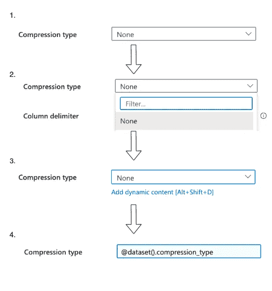
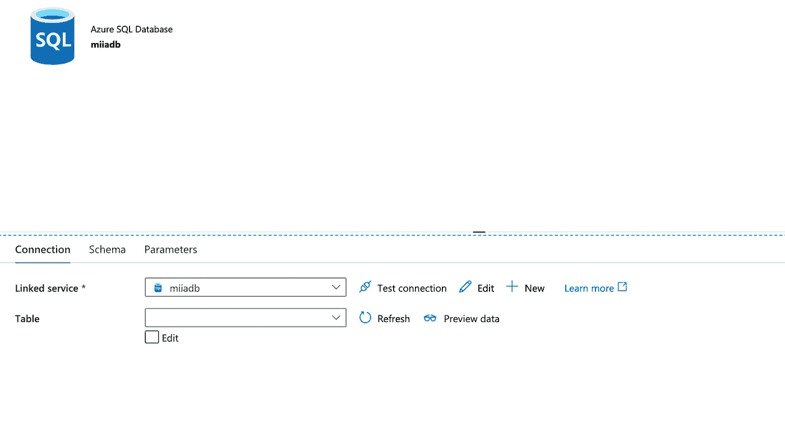
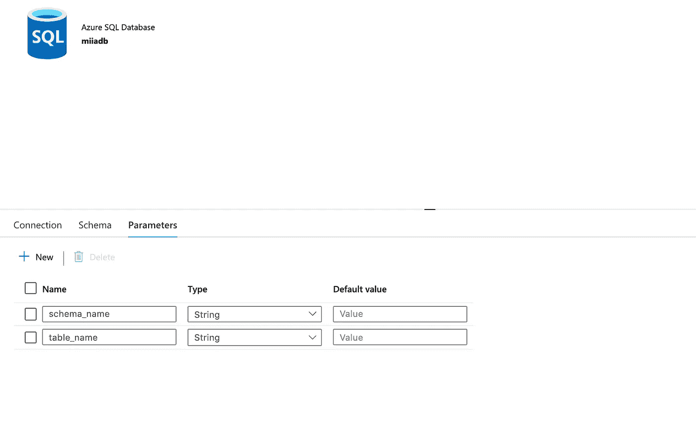

# 使用通用数据集保持数据工厂整洁

> 原文：<https://towardsdatascience.com/data-factory-generic-datasets-a998b832f060?source=collection_archive---------18----------------------->

## 如何在 Azure 数据工厂中为 Blob 存储和 SQL DB 创建通用的、可重用的数据集

[克丽玛乔](https://unsplash.com/@cremajoe?utm_source=unsplash&utm_medium=referral&utm_content=creditCopyText)在 [Unsplash](https://unsplash.com/s/photos/reusable?utm_source=unsplash&utm_medium=referral&utm_content=creditCopyText) 上的照片

你有没有遇到过 Azure 数据工厂设置有一英里长的数据集列表，因为每个数据集都是为一个管道而创建的？我确实有。在本文中，我将向您展示如何创建通用的、可重用的数据集来保持工厂整洁。

本文组织如下:

1.  如何为 Blob 存储创建通用数据集
2.  如何为 SQL 数据库创建通用数据集
3.  用法示例

请参见我的**注释**中的常见问题: **1)** 您可能需要为某个字段设置 *None* 值，当其他字段没有值时，该字段是不可见的， **2)** 找到字段的动态内容编辑器可能很棘手，以及 **3)** 如何在管道属性中包含特殊字符，如\t 或\n(制表符或换行符)。

## 1.如何为 Blob 存储创建通用数据集

为了创建一个通用的、可重用的 Blob 存储数据集，我们将像往常一样创建一个数据集，并给它一个描述性的名称。这里我将我的数据集命名为 miiastorage_delimitedtext，其中 miiastorage 是我的存储帐户，delimitedtext 是指我为数据集选择的格式类型。

创建后初始数据集属性的屏幕截图。

接下来，我们将为我们希望在使用该数据集时能够动态设置的每个设置创建一个参数。在这里，我决定参数化一切，但你可能总是有相同的编码等。除了容器和路径之外，我已经给了所有设置默认值，因为无论如何在使用它们的时候它们都不能为空。

显示数据集参数的屏幕截图。除了容器和路径之外，其他都有一个默认值，因为几乎每次引用该数据集时，这些值都会发生变化。行分隔符参数默认值似乎没有设置，但它是在 json 代码中设置的，我将在本文后面介绍。

然后，我们设置带有动态内容的数据集属性来引用这些参数。

显示属性设置的屏幕截图，其中每个属性都用数据集参数的动态内容引用来定义。

**注 1** :当压缩类型为*无*时，压缩级别必须设置为*无*。使用基本属性时，压缩级别默认为*无*，压缩级别不可见(= *无*)。

**注 2** :寻找动态内容链接有时很棘手。这里有两个流程可以帮你找到方向。

当编辑框可见时，如何为数据工厂中的下拉菜单设置动态内容的示例流程。步骤 1 是下拉菜单的初始视图。当编辑复选框被选中时，下拉列表变为文本框(步骤 2)，当文本框被激活时，动态内容链接出现(步骤 3)。第 4 步展示了动态内容设置后的样子。

当编辑框不可见时，如何为数据工厂中的下拉菜单设置动态内容的示例流程。步骤 1 是下拉菜单的初始视图。单击下拉菜单两次以打开和关闭它(步骤 2)。菜单关闭时会出现动态内容链接(步骤 3)。第 4 步展示了动态内容设置后的样子。

**注 3** :数据工厂编辑器对特殊字符如\t (tab)和\n(换行符)进行转义。这意味着，当您在编辑器中的文本字段中键入\n 时，它实际上会\\n 并中断您的管道。要添加这些字符，你可以尝试遵循 Azure 的提示，从文本编辑器中复制粘贴，或者你可以通过 json 代码编辑器添加你的特殊字符。

显示列和行分隔符字段如何具有特殊字符(如制表符或换行符)将被编辑器转义的额外信息的屏幕截图。Azure 建议您从文本编辑器中复制并粘贴所需的字符。

数据工厂截图，json 代码编辑器可以从右上角进入。

数据工厂 json 代码编辑器截图。在第 28 行，我已经将换行符的默认值定义为\n。

## 2.如何为 SQL 数据库创建通用数据集

然后是 SQL 数据库数据集。让我们像往常一样从创建数据集开始。同样，我们希望尽可能通用地命名它，不需要一开始就为它定义任何表。

在没有定义表的情况下创建 Azure SQL 数据库数据集属性后的屏幕截图。

接下来，我们检查“Edit”框，它将“Table”输入字段扩展为两个字段，一个用于模式，一个用于表。这允许我们添加动态内容，通过它我们可以引用数据集参数。

Azure SQL 数据库数据集属性的屏幕截图。选中“编辑”复选框，将“表名”字段展开为单独的“模式”和“表名”字段，以允许添加动态内容。

然后，我们为这个数据集定义参数。我们需要的唯一参数是“模式名”和“表名”。我没有定义任何缺省值，因为这些参数经常在用例之间变化。

架构和表名的 Azure SQL 数据库数据集参数的屏幕截图。通常，不需要缺省值，因为这些参数在用例之间经常变化。

最后，我们在动态内容中添加对这些参数的引用，这样就完成了。

Azure SQL 数据库数据集属性的屏幕截图，其中架构和表名称是动态设置的。

## 3.用法示例

让我们创建一个简单的管道来演示用法。管道包含复制活动，该活动将 CSV 文件的内容从 blob 存储复制到 SQL 数据库。

对于源代码，我们只需要定义容器和路径参数，因为我的默认参数对这个文件很好。

带有源数据集示例设置的屏幕截图。

对于接收器，我们只需要填充模式和表名字段。

包含接收器数据集示例设置的屏幕截图。

现在我们可以调试我们的管道了。该表将被创建到我的数据库中，其结构与我的存储帐户中的 CSV 文件相同，因为我选择了“自动创建表”。

调试运行成功后数据工厂视图的屏幕截图。

该屏幕截图显示了我的数据库中的简单 SELECT *查询，以展示现在已经创建了表并传输了数据。

感谢您的阅读！如果你学到了新的东西或者喜欢这篇文章，[在 Medium](https://medium.com/@miiaramo/follow) 上关注我。我发表关于数据工程和数据科学的文章。你可以从 be [网页](http://miiaramo.github.io)了解更多关于我的信息。

用我没有提到的连接器来实现这一点，你会有困难吗？请在评论中告诉我，我会尽力帮助你😊